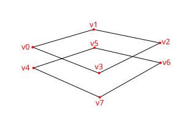
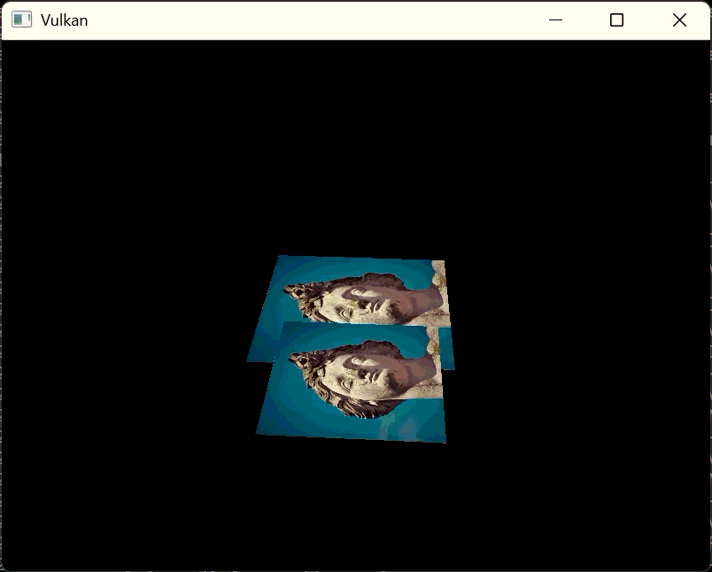

= 깊이 버퍼링 (Depth buffering)
include::./common/header.adoc[]
:imagesdir!:

== 개요 (Introduction)

우리가 지금까지 다룬 기하학적 도형(Geometry)들은 3D 공간으로 투영되기는 했지만, 여전히 완전히 평평한 상태입니다. 이번 장에서는 3D 메쉬를 다룰 수 있도록 정점 위치에 Z 좌표를 추가해 보겠습니다. 이 세 번째 좌표를 사용해 현재 사각형 위에 다른 사각형을 겹쳐 보면서, 도형들이 깊이(정점의 앞뒤 관계)에 따라 정렬되지 않았을 때 어떤 문제가 발생하는지 확인해 보겠습니다.

== 3D 기하학 (3D geometry)

정점 구조체(``Vertex``)의 위치 데이터가 3D 벡터를 사용하도록 변경하고, 이에 맞추어 {VkVertexInputAttributeDescription}[``VkVertexInputAttributeDescription``]의 포맷을 업데이트합니다.

[source,cpp]
----
struct Vertex {
    glm::vec3 post;
    glm::vec3 color;
    glm::vec2 texCoord;
    ...
    static std::array<VkVertexInputAttributeDescription, 3> getAttributeDescriptions() {
        std::array<VkVertexInputAttributeDescription, 3> attributeDescriptions{};

        attributeDescriptions[0].binding = 0;
        attributeDescriptions[0].location = 0;
        attributeDescriptions[0].format = VK_FORMAT_R32G32B32_SFLOAT;
        attributeDescriptions[0].offset = offsetof(Vertex, post);
        ...
    }
}
----

그다음, 3D 좌표를 입력받아 변환할 수 있도록 정점 셰이더(Vertex Shader)를 수정합니다. 수정한 뒤에는 셰이더를 다시 컴파일하는 것을 잊지 마세요!

[source,glsl]
----
layout(location = 0) in vec3 inPosition;
...
void main() {
    gl_Position = ubo.proj * ubo.view * ubo.model * vec4(inPosition, 1.0);
    fragColor = inColor;
    fragTexCoord = inTexCoord;
}
----

마지막으로, 정점 컨테이너(``vertices``)에 Z 좌표를 포함하도록 데이터를 업데이트합니다.

[source,cpp]
----
const std::vector<Vertex> vertices = {
    {{-0.5f, -0.5f, 0.0f}, {1.0f, 0.0f, 0.0f}, {1.0f, 0.0f}},
    {{0.5f, -0.5f, 0.0f}, {0.0f, 1.0f, 0.0f}, {0.0f, 0.0f}},
    {{0.5f, 0.5f, 0.0f}, {0.0f, 0.0f, 1.0f}, {0.0f, 1.0f}},
    {{-0.5f, 0.5f, 0.0f}, {1.0f, 1.0f, 1.0f}, {1.0f, 1.0f}},
};
----

이제 애플리케이션을 실행해 보면 이전과 완전히 동일한 결과가 나타날 것입니다. 이제 장면을 더 흥미롭게 만들고, 이번 장에서 해결하려는 문제를 확인하기 위해 도형을 몇 개 더 추가해 보겠습니다. 정점 데이터를 복제하여, 다음과 같이 현재 사각형 바로 아래에 위치할 또 다른 사각형을 정의합니다.

Z 좌표 값으로 ``-0.5f``를 사용하고, 추가된 사각형에 맞는 인덱스(Indices)를 함께 넣어줍니다.

[source,cpp,options="nowrap"]
----
const std::vector<Vertex> vertices = {
    {{-0.5f, -0.5f, 0.0f}, {1.0f, 0.0f, 0.0f}, {1.0f, 0.0f}},  {{0.5f, -0.5f, 0.0f}, {0.0f, 1.0f, 0.0f}, {0.0f, 0.0f}},
    {{0.5f, 0.5f, 0.0f}, {0.0f, 0.0f, 1.0f}, {0.0f, 1.0f}},    {{-0.5f, 0.5f, 0.0f}, {1.0f, 1.0f, 1.0f}, {1.0f, 1.0f}},

    {{-0.5f, -0.5f, -0.5f}, {1.0f, 0.0f, 0.0f}, {1.0f, 0.0f}}, {{0.5f, -0.5f, -0.5f}, {0.0f, 1.0f, 0.0f}, {0.0f, 0.0f}},
    {{0.5f, 0.5f, -0.5f}, {0.0f, 0.0f, 1.0f}, {0.0f, 1.0f}},   {{-0.5f, 0.5f, -0.5f}, {1.0f, 1.0f, 1.0f}, {1.0f, 1.0f}},
};
const std::vector<uint16_t> indices = {
    0, 1, 2, 2, 3, 0, 4, 5, 6, 6, 7, 4,
};
----

프로그램을 실행하면 마치 에셔(Escher)의 착시 그림 같은 기괴한 모습이 나타날 것입니다.

문제는 인덱스 배열에서 뒤에 있다는 이유만으로, 아래쪽 사각형의 프래그먼트들이 위쪽 사각형의 프래그먼트들을 덮어쓰며 그려진다는 점입니다. 이 문제를 해결하는 데는 두 가지 방법이 있습니다.

* 모든 드로우 콜(Draw Call)을 깊이에 따라 뒤에서부터 앞으로 정렬하여 그리기
* 깊이 버퍼(Depth Buffer)를 이용한 깊이 테스트(Depth Testing) 활용하기

첫 번째 방식은 투명한 오브젝트를 그릴 때 주로 쓰입니다. 순서 독립형 투명도(OIT, order independent transparency)를 구현하는 것은 매우 까다롭기 때문입니다. 하지만 일반적인 깊이 정렬 문제는 대개 깊이 버퍼를 사용해 해결합니다. 깊이 버퍼는 컬러 어태치먼트가 각 위치의 색상을 저장하듯, 모든 위치의 깊이 값을 저장하는 추가적인 어태치먼트입니다. 래스터라이저가 프래그먼트를 생성할 때마다 깊이 테스트를 거쳐, 새 프래그먼트가 기존 프래그먼트보다 카메라에 더 가까운지 확인합니다. 만약 더 멀리 있다면 새 프래그먼트는 버려집니다. 깊이 테스트를 통과한 프래그먼트는 자신의 깊이 값을 깊이 버퍼에 기록합니다. 컬러 출력을 바꾸는 것처럼 프래그먼트 셰이더에서 이 깊이 값을 직접 제어하는 것도 가능합니다.

[source,cpp]
----
#define GL_FORCE_RADIANS
#define GLM_FORCE_DEPTH_ZERO_TO_ONE
#include <glm/glm.hpp>
#include <glm/gtc/matrix_transform.hpp>
----

GLM이 생성하는 원근 투영 행렬(Perspective Projection Matrix)은 기본적으로 OpenGL의 깊이 범위인 ``-1.0``에서 ``1.0``을 사용합니다. Vulkan의 범위인 ``0.0``에서 ``1.0``을 사용하도록 ``GLM_FORCE_DEPTH_ZERO_TO_ONE`` 매크로를 정의하여 설정을 변경해야 합니다.

== 깊이 이미지와 뷰 (Depth image and view)

깊이 어태치먼트(Depth attachment)는 컬러 어태치먼트와 마찬가지로 이미지를 기반으로 작동합니다. 한 가지 차이점이 있다면, 스왑 체인(Swap chain)이 깊이 이미지를 자동으로 만들어주지 않는다는 점입니다. 어차피 한 번에 하나의 그리기 작업만 수행되므로, 깊이 이미지는 하나만 있으면 됩니다. 깊이 이미지 역시 이미지, 메모리, 이미지 뷰라는 '리소스를 구성하는 세 가지 요소'가 모두 필요합니다.

[source,cpp]
----
VkImage _depthImage;
VkDeviceMemory _depthImageMemory;
VkImageView _depthImageView;
----

이 리소스들을 설정하기 위해 ``createDepthResources``라는 새로운 함수를 만듭니다.

[source,cpp]
----
void initVulkan() {
    ...
    createCommandPool();
    createDepthResources();
    createTextureImage();
    ...
}
...
void createDepthResources() {

}
----

깊이 이미지를 생성하는 과정은 꽤 직관적입니다. 스왑 체인의 익스텐트(Extent)로 결정되는 컬러 어태치먼트와 동일한 해상도를 가져야 하며, 깊이 어태치먼트에 적합한 이미지 사용 처(Usage), 옵티멀 타일링(Optimal tiling), 그리고 디바이스 로컬 메모리(Device local memory)를 지정해야 합니다. 여기서 유일한 고민거리는 '깊이 이미지에 딱 맞는 포맷이 무엇인가'입니다. 이 포맷은 반드시 깊이 컴포넌트를 포함해야 하며, 이는 ``VK_FORMAT_`` 뒤에 ``_D??_`` 형태로 표시됩니다.

텍스처 이미지와 달리 프로그램에서 텍셀(Texel)에 직접 접근할 일이 없으므로, 꼭 특정 포맷을 고집할 필요는 없습니다. 그저 적당한 정밀도만 갖추면 되는데, 실제 애플리케이션에서는 최소 24비트 이상을 주로 사용합니다. 이 조건에 맞는 포맷은 다음과 같이 몇 가지가 있습니다.

* ``VK_FORMAT_D32_SFLOAT``: 깊이 전용 32비트 부동소수점
* ``VK_FORMAT_D32_SFLOAT_S8_UINT``: 깊이용 32비트 부호 있는 부동소수점 + 스텐실용 8비트 부호 없는 정수
* ``VK_FORMAT_D24_UNORM_S8_UINT``: 깊이용 24비트 부동소수점 + 스텐실용 8비트 부호 없는 정수

여기서 스텐실 컴포넌트는 link:https://en.wikipedia.org/wiki/Stencil_buffer[스텐실 테스트]에 사용되며, 이는 깊이 테스트와 결합하여 사용할 수 있는 추가적인 테스트 단계입니다. 이에 대해서는 나중 장에서 자세히 살펴보겠습니다.

``VK_FORMAT_D32_SFLOAT`` 포맷은 지원하는 하드웨어가 매우 흔하기 때문에(하드웨어 데이터베이스 참고) 그냥 이 포맷을 바로 선택해도 무방합니다. 하지만 가능한 한 애플리케이션에 유연성을 더해주는 것이 좋습니다. 가장 선호하는 포맷부터 차례대로 담은 후보 목록을 받아서, 하드웨어가 지원하는 첫 번째 포맷이 무엇인지 찾아내는 ``findSupportedFormat`` 함수를 작성해 보겠습니다.

[source,cpp]
----
VkFormat findSupportedFormat(const std::vector<VkFormat>& candidates, VkImageTiling tiling,
                             VkFormatFeatureFlags features) {

}
----

특정 포맷을 지원하는지 여부는 타일링 모드와 사용 처(Usage)에 따라 달라지므로, 이 두 가지도 함께 매개변수로 넘겨주어야 합니다. 포맷의 지원 여부는 {vkGetPhysicalDeviceFormatProperties}[``vkGetPhysicalDeviceFormatProperties``] 함수를 사용해 조회할 수 있습니다.

[source,cpp]
----
for (VkFormat format : candidates) {
    VkFormatProperties props;

    vkGetPhysicalDeviceFormatProperties(_physicalDevice, format, &props);
}
----

{VkFormatProperties}[``VkFormatProperties``] 구조체는 다음 세 가지 필드로 구성되어 있습니다.

* ``linearTilingFeatures``: 리니어 타일링(Linear tiling)에서 지원하는 유스케이스
* ``optimalTilingFeatures``: 옵티멀 타일링(Optimal tiling)에서 지원하는 유스케이스
* ``bufferFeatures``: 버퍼에서 지원하는 유스케이스

여기서 우리에게 필요한 것은 앞의 두 가지뿐이며, 함수로 전달된 타일링(``tiling``) 매개변수의 값에 따라 어떤 필드를 확인할지 결정됩니다.

[source,cpp]
----
if (tiling == VK_IMAGE_TILING_LINEAR && (props.linearTilingFeatures & features) == features) {
    return format;
} else if (tiling == VK_IMAGE_TILING_OPTIMAL && (props.optimalTilingFeatures & features) == features) {
    return format;
}
----

만약 후보군 중 어떤 포맷도 원하는 기능(Usage)을 지원하지 않는다면, 특수한 값을 반환하거나 간단히 예외(Exception)를 던지도록 처리하면 됩니다.

[source,cpp]
----
VkFormat findSupportedFormat(const std::vector<VkFormat>& candidates, VkImageTiling tiling,
                             VkFormatFeatureFlags features) {
    for (VkFormat format : candidates) {
        VkFormatProperties props;

        vkGetPhysicalDeviceFormatProperties(_physicalDevice, format, &props);

        if (tiling == VK_IMAGE_TILING_LINEAR && (props.linearTilingFeatures & features) == features) {
            return format;
        } else if (tiling == VK_IMAGE_TILING_OPTIMAL && (props.optimalTilingFeatures & features) == features) {
            return format;
        }
    }

    throw std::runtime_error("failed to find supported format!");
}
----

이제 이 함수를 활용하여, 깊이 어태치먼트 기능을 지원하면서 깊이 컴포넌트를 가진 포맷을 선택해 주는 헬퍼 함수 ``findDepthFormat``을 만듭니다.

[source,cpp]
----
VkFormat findDepthFormat() {
    return findSupportedFormat({VK_FORMAT_D32_SFLOAT, VK_FORMAT_D32_SFLOAT_S8_UINT, VK_FORMAT_D24_UNORM_S8_UINT},
                                VK_IMAGE_TILING_OPTIMAL, VK_FORMAT_FEATURE_DEPTH_STENCIL_ATTACHMENT_BIT);
}
----

이 단계에서는 ``VK_IMAGE_USAGE_`` 플래그 대신 ``VK_FORMAT_FEATURE_`` 플래그를 사용해야 한다는 점에 주의하세요. 나열된 후보 포맷들은 모두 깊이 컴포넌트를 포함하고 있지만, 뒤쪽의 두 포맷은 스텐실 컴포넌트까지 함께 가지고 있습니다. 지금 당장 스텐실을 쓰지는 않겠지만, 이 포맷을 사용하는 이미지의 레이아웃을 전환(Layout Transition)할 때는 이 점을 반드시 고려해야 합니다. 선택된 깊이 포맷에 스텐실 컴포넌트가 포함되어 있는지 확인해 주는 간단한 헬퍼 함수를 추가합니다.

[source,cpp]
----
bool hasStencilComponent(VkFormat format) {
    return format == VK_FORMAT_D32_SFLOAT_S8_UINT || format == VK_FORMAT_D24_UNORM_S8_UINT;
}
----

이제 ``createDepthResources`` 함수 안에서 이 함수를 호출하여 적절한 깊이 포맷을 찾아냅니다.

[source,cpp]
----
void createDepthResources() {
    VkFormat depthFormat = findDepthFormat();
}
----

이제 기존에 만들어 둔 ``createImage``와 ``createImageView`` 헬퍼 함수를 호출하는 데 필요한 모든 정보가 준비되었습니다.

[source,cpp,options="nowrap"]
----
void createDepthResources() {
    VkFormat depthFormat = findDepthFormat();

    createImage(_swapChainExtent.width, _swapChainExtent.height, depthFormat, VK_IMAGE_TILING_OPTIMAL,
                VK_IMAGE_USAGE_DEPTH_STENCIL_ATTACHMENT_BIT, VK_MEMORY_PROPERTY_DEVICE_LOCAL_BIT, _depthImage,
                _depthImageMemory);
    _depthImageView = createImageView(_depthImage, depthFormat);
}
----

다만 현재 ``createImageView`` 함수는 서브리소스의 애스펙트(Aspect)가 항상 ``VK_IMAGE_ASPECT_COLOR_BIT``라고 가정하고 작성되어 있습니다. 따라서 이 필드를 매개변수로 받도록 수정해야 합니다.

[source,cpp]
----
VkImageView createImageView(VkImage image, VkFormat format, VkImageAspectFlags aspectFlags) {
    VkImageSubresourceRange range{
        .aspectMask = aspectFlags,
        ...
    };
    ...
}
----

수정이 끝나면 이 함수를 호출하는 모든 곳을 찾아가 올바른 애스펙트 플래그를 넘겨주도록 업데이트합니다.

[source,cpp, options="nowrap"]
----
// void createImageViews() {
_swapChainImageViews[i] = createImageView(_swapChainImages[i], _swapChainImageFormat, VK_IMAGE_ASPECT_COLOR_BIT);

// void createDepthResources()
_depthImageView = createImageView(_depthImage, depthFormat, VK_IMAGE_ASPECT_DEPTH_BIT);

// void createTextureImageView()
_textureImageView = createImageView(_textureImage, VK_FORMAT_R8G8B8A8_SRGB, VK_IMAGE_ASPECT_COLOR_BIT);
----

이것으로 깊이 이미지 생성을 위한 작업이 모두 끝났습니다. 컬러 어태치먼트와 마찬가지로 렌더 패스(Render Pass)를 시작할 때 깊이 이미지를 깨끗이 비울(Clear) 예정이므로, 여기에 메모리를 매핑하거나 다른 이미지를 복사해 넣을 필요는 없습니다.

=== 깊이 이미지의 명시적 레이아웃 전환 (Explicitly transitioning the depth image)

렌더 패스(Render pass) 안에서 자동으로 처리해 줄 예정이기 때문에, 여기에서 깊이 이미지의 레이아웃을 깊이 어태치먼트 용도로 명시적으로 전환할 필요는 없습니다. 하지만 내용의 완전성을 위해 이 섹션에서 그 과정을 설명해 두겠습니다. 원치 않으신다면 넘어가셔도 좋습니다.

다음과 같이 ``createDepthResources`` 함수의 맨 마지막 부분에서 ``transitionImageLayout`` 함수를 호출해 줍니다.

[source,cpp]
----
// void createDepthResources()
transitionImageLayout(_depthImage, depthFormat, VK_IMAGE_LAYOUT_UNDEFINED,
                        VK_IMAGE_LAYOUT_DEPTH_STENCIL_ATTACHMENT_OPTIMAL);
----

기존 깊이 이미지에 보존해야 할 중요한 내용물이 없으므로, ##초기 레이아웃으로는 VK_IMAGE_LAYOUT_UNDEFINED를 사용하면 됩니다##. 이제 올바른 서브리소스 애스펙트(Aspect)를 사용할 수 있도록 ``transitionImageLayout`` 함수 내부의 로직을 일부 수정해야 합니다.

[source,cpp,options="nowrap"]
----
// void transitionImageLayout(VkImage image, VkFormat format, VkImageLayout oldLayout, VkImageLayout newLayout)
VkImageSubresourceRange range{
    .baseMipLevel = 0,
    .levelCount = 1,
    .baseArrayLayer = 0,
    .layerCount = 1,
};

if (newLayout == VK_IMAGE_LAYOUT_DEPTH_STENCIL_ATTACHMENT_OPTIMAL) {
    range.aspectMask = VK_IMAGE_ASPECT_DEPTH_BIT;

    if (hasStencilComponent(format)) {
        range.aspectMask |= VK_IMAGE_ASPECT_STENCIL_BIT;
    }
} else {
    range.aspectMask = VK_IMAGE_ASPECT_COLOR_BIT;
}
----

지금 당장 스텐실 컴포넌트를 사용하지는 않더라도, 깊이 이미지의 레이아웃을 전환할 때는 스텐실 정보도 함께 포함해 주어야 합니다.

마지막으로, 상황에 맞는 올바른 접근 마스크(Access mask)와 파이프라인 단계(Pipeline stage)를 추가합니다.

[source,cpp,options="nowrap"]
----
if (oldLayout == VK_IMAGE_LAYOUT_UNDEFINED && newLayout == VK_IMAGE_LAYOUT_TRANSFER_DST_OPTIMAL) {
    barrier.srcAccessMask = 0;
    barrier.dstAccessMask = VK_ACCESS_TRANSFER_WRITE_BIT;
    sourceStage = VK_PIPELINE_STAGE_TOP_OF_PIPE_BIT;
    destinationStage = VK_PIPELINE_STAGE_TRANSFER_BIT;
} else if (oldLayout == VK_IMAGE_LAYOUT_TRANSFER_DST_OPTIMAL
            && newLayout == VK_IMAGE_LAYOUT_SHADER_READ_ONLY_OPTIMAL) {
    barrier.srcAccessMask = VK_ACCESS_TRANSFER_WRITE_BIT;
    barrier.dstAccessMask = VK_ACCESS_SHADER_READ_BIT;
    sourceStage = VK_PIPELINE_STAGE_TRANSFER_BIT;
    destinationStage = VK_PIPELINE_STAGE_FRAGMENT_SHADER_BIT;
} else if (oldLayout == VK_IMAGE_LAYOUT_UNDEFINED && newLayout == VK_IMAGE_LAYOUT_DEPTH_STENCIL_ATTACHMENT_OPTIMAL) {
    barrier.srcAccessMask = 0;
    barrier.dstAccessMask
        = VK_ACCESS_DEPTH_STENCIL_ATTACHMENT_READ_BIT | VK_ACCESS_DEPTH_STENCIL_ATTACHMENT_WRITE_BIT;
    sourceStage = VK_PIPELINE_STAGE_TOP_OF_PIPE_BIT;
    destinationStage = VK_PIPELINE_STAGE_EARLY_FRAGMENT_TESTS_BIT;
} else {
    throw std::invalid_argument("unsupported layout transition!");
}
----

깊이 버퍼는 프래그먼트가 눈에 보이는지 확인하기 위해 깊이 테스트를 할 때 **'읽기'** 작업을 수행하고, 새로운 프래그먼트가 그려질 때 **'쓰기'** 작업을 수행합니다. 읽기는 ``VK_PIPELINE_STAGE_EARLY_FRAGMENT_TESTS_BIT`` 단계에서 일어나고, 쓰기는 ``VK_PIPELINE_STAGE_LATE_FRAGMENT_TESTS_BIT`` 단계에서 일어납니다. 따라서 리소스가 필요한 시점에 깊이 어태치먼트로 바로 사용될 수 있도록, 지정된 작업과 일치하는 가장 앞선 파이프라인 단계를 선택해야 합니다.

== 렌더 패스 (Render pass)

이제 깊이 어태치먼트를 포함하도록 ``createRenderPass`` 함수를 수정해 보겠습니다. 먼저 {VkAttachmentDescription}[``VkAttachmentDescription``]을 정의합니다.

[source,cpp]
----
// void createRenderPass()
// VkAttachmentReference colorAttachmentRef{} ...
VkAttachmentDescription depthAttachment{
    .format = findDepthFormat(),
    .samples = VK_SAMPLE_COUNT_1_BIT,
    .loadOp = VK_ATTACHMENT_LOAD_OP_CLEAR,
    .storeOp = VK_ATTACHMENT_STORE_OP_DONT_CARE,
    .stencilLoadOp = VK_ATTACHMENT_LOAD_OP_DONT_CARE,
    .stencilStoreOp = VK_ATTACHMENT_STORE_OP_DONT_CARE,
    .initialLayout = VK_IMAGE_LAYOUT_UNDEFINED,
    .finalLayout = VK_IMAGE_LAYOUT_DEPTH_STENCIL_ATTACHMENT_OPTIMAL,
};
----

포맷(``format``)은 깊이 이미지 자체와 동일한 포맷을 사용해야 합니다. 이번에는 그리기 작업이 끝난 후 깊이 데이터를 유지할 필요가 없으므로 ``storeOp``(저장 방식)은 크게 신경 쓰지 않아도 됩니다. 이렇게 설정하면 하드웨어가 추가적인 최적화를 수행할 수 있습니다. 컬러 버퍼와 마찬가지로 이전 깊이 데이터 내용도 유지할 필요가 없으므로, ``initialLayout``은 ``VK_IMAGE_LAYOUT_UNDEFINED``로 설정하면 됩니다.

[source,cpp]
----
// void createRenderPass()
// VkAttachmentDescription depthAttachment{} ...
VkAttachmentReference depthAttachmentRef{
    .attachment = 1,
    .layout = VK_IMAGE_LAYOUT_DEPTH_STENCIL_ATTACHMENT_OPTIMAL,
};
----

첫 번째(이자 유일한) 서브패스(Subpass)가 이 어태치먼트를 참조할 수 있도록 참조 구조체를 추가합니다.

[source,cpp]
----
// void createRenderPass()
VkSubpassDescription subpass{
    .pipelineBindPoint = VK_PIPELINE_BIND_POINT_GRAPHICS,
    .colorAttachmentCount = 1,
    .pColorAttachments = &colorAttachmentRef,
    .pDepthStencilAttachment = &depthAttachmentRef,  // 추가
};
----

여러 개를 지정할 수 있는 컬러 어태치먼트와 달리, 서브패스는 오직 하나의 깊이(+스텐실) 어태치먼트만 사용할 수 있습니다. 여러 개의 버퍼를 두고 깊이 테스트를 하는 것은 의미가 없기 때문입니다.

[source,cpp]
----
// void createRenderPass()
std::array<VkAttachmentDescription, 2> attachments = {
    colorAttachment,
    depthAttachment,
};

VkRenderPassCreateInfo renderPassInfo{
    .sType = VK_STRUCTURE_TYPE_RENDER_PASS_CREATE_INFO,
    .attachmentCount = static_cast<uint32_t>(attachments.size()),
    .pAttachments = attachments.data(),
    .subpassCount = 1,
    .pSubpasses = &subpass,
    .dependencyCount = 1,
    .pDependencies = &dependency,
};
----

그다음, 두 어태치먼트를 모두 참조할 수 있도록 {VkSubpassDependency}[``VkSubpassDependency``] 구조체를 업데이트합니다.

[source,cpp,options="nowrap"]
----
// void createRenderPass()
VkSubpassDependency dependency{
    .srcSubpass = VK_SUBPASS_EXTERNAL,
    .dstSubpass = 0,
    .srcStageMask = VK_PIPELINE_STAGE_COLOR_ATTACHMENT_OUTPUT_BIT | VK_PIPELINE_STAGE_LATE_FRAGMENT_TESTS_BIT,
    .dstStageMask = VK_PIPELINE_STAGE_COLOR_ATTACHMENT_OUTPUT_BIT | VK_PIPELINE_STAGE_EARLY_FRAGMENT_TESTS_BIT,
    .srcAccessMask = VK_ACCESS_DEPTH_STENCIL_ATTACHMENT_WRITE_BIT,
    .dstAccessMask = VK_ACCESS_COLOR_ATTACHMENT_WRITE_BIT | VK_ACCESS_DEPTH_STENCIL_ATTACHMENT_WRITE_BIT,
};
----

마지막으로, 깊이 이미지의 레이아웃 전환 작업과 로드 오퍼레이션(Load Operation)의 클리어(Clear) 작업 사이에 충돌이 발생하지 않도록 서브패스 의존성(Subpass Dependency)을 확장해야 합니다. 깊이 이미지에 대한 접근은 초기 프래그먼트 테스트(Early fragment test) 파이프라인 단계에서 처음 시작되는데, 우리는 이미지를 깨끗이 비우는 클리어 로드 오퍼레이션을 사용하므로 쓰기(Writes) 접근 마스크를 지정해 주어야 합니다.

== 프레임버퍼 (Framebuffer)

다음 단계는 깊이 이미지를 깊이 어태치먼트에 바인딩하도록 프레임버퍼 생성 로직을 수정하는 것입니다. createFramebuffers 함수로 이동하여 깊이 이미지 뷰를 두 번째 어태치먼트로 지정합니다.

[source,cpp]
----
//void createFramebuffers()
std::array<VkImageView, 2> attachments = {
    _swapChainImageViews[i],
    _depthImageView,
};
VkFramebufferCreateInfo framebufferInfo{
    .sType = VK_STRUCTURE_TYPE_FRAMEBUFFER_CREATE_INFO,
    .renderPass = _renderPass,
    .attachmentCount = static_cast<uint32_t>(attachments.size()),
    .pAttachments = attachments.data(),
    .width = _swapChainExtent.width,
    .height = _swapChainExtent.height,
    .layers = 1,
};
----

컬러 어태치먼트는 스왑 체인 이미지마다 제각각 다르지만, 깊이 이미지는 모든 스왑 체인이 동일한 것을 공유하여 사용할 수 있습니다. 세마포어(Semaphore) 덕분에 같은 시간에 실행되는 서브패스는 오직 하나뿐이기 때문입니다.

또한 깊이 이미지 뷰가 실제로 완전히 생성된 이후에 프레임버퍼가 만들어지도록, ``createFramebuffers`` 함수의 호출 위치를 뒤로 옮겨주어야 합니다.

[source,cpp]
----
void initVulkan() {
    ...
    createDepthResources();
    createFramebuffers();
    ...
}
----

== 클리어 값 (Clear values)

이제 ``VK_ATTACHMENT_LOAD_OP_CLEAR``를 사용하는 어태치먼트가 여러 개가 되었으므로, 클리어 값도 각각 지정해 주어야 합니다. ``recordCommandBuffer`` 함수로 이동하여 {VkClearValue}[``VkClearValue``] 구조체 배열을 생성합니다.

[source,cpp]
----
// void recordCommandBuffer(VkCommandBuffer commandBuffer, uint32_t imageIndex)
std::array<VkClearValue, 2> clearValues{};

clearValues[0].color = {{0.0f, 0.0f, 0.0f, 1.0f}};
clearValues[1].depthStencil = {1.0f, 0};

VkRenderPassBeginInfo renderPassInfo{
    .sType = VK_STRUCTURE_TYPE_RENDER_PASS_BEGIN_INFO,
    .renderPass = _renderPass,
    .framebuffer = _swapChainFramebuffers[imageIndex],
    .renderArea = VkRect2D{.offset = {0, 0}, .extent = _swapChainExtent},
    .clearValueCount = static_cast<uint32_t>(clearValues.size()),
    .pClearValues = clearValues.data(),
};
----

{vk}에서 깊이 버퍼의 깊이 범위는 ``0.0``에서 ``1.0`` 사이이며, ``1.0``은 가장 먼 클리핑 평면(Far view plane)을, ``0.0``은 가장 가까운 클리핑 평면(Near view plane)을 의미합니다. 처음에 깊이 버퍼의 각 지점은 가장 먼 거리인 ``1.0``으로 초기화되어 있어야 합니다.

이때 ``clearValues`` 배열에 담기는 순서는 여러분이 설정한 어태치먼트의 순서와 완전히 일치해야 한다는 점에 주의하세요.

== 깊이 및 스텐실 상태 (Depth and stencil state)

이제 깊이 어태치먼트를 사용할 모든 준비가 끝났지만, 그래픽스 파이프라인에서 깊이 테스트(Depth testing) 기능을 켜주어야 합니다. 이 설정은 {VkPipelineDepthStencilStateCreateInfo}[``VkPipelineDepthStencilStateCreateInfo``] 구조체를 통해 처리합니다.

[source,cpp]
----
// void createGraphicsPipeline()
VkPipelineDepthStencilStateCreateInfo depthStencil{
    .sType = VK_STRUCTURE_TYPE_PIPELINE_DEPTH_STENCIL_STATE_CREATE_INFO,
    .depthTestEnable = VK_TRUE,
    .depthWriteEnable = VK_TRUE,

    
    
    
    
    
};
----

``depthTestEnable`` 필드는 새로 생성된 프래그먼트의 깊이 값을 깊이 버퍼와 비교하여 버릴지 말지 결정할 여부를 지정합니다. ``depthWriteEnable`` 필드는 깊이 테스트를 통과한 프래그먼트의 새로운 깊이 값을 깊이 버퍼에 실제로 기록할지 여부를 설정합니다.

[source,cpp]
----
// void createGraphicsPipeline()
depthStencil.depthCompareOp = VK_COMPARE_OP_LESS;
----

``depthCompareOp`` 필드는 프래그먼트를 유지할지 버릴지 판단하는 비교 연산 방식을 지정합니다. 우리는 '깊이 값이 작을수록 카메라와 가깝다'는 일반적인 규칙을 따를 것이므로, 새로 그려질 프래그먼트의 깊이 값이 더 작을 때 통과하도록 설정합니다.

[source,cpp]
----
// void createGraphicsPipeline()
depthStencil.depthBoundsTestEnable = VK_FALSE;
depthStencil.minDepthBounds = 0.0f;  // Optional
depthStencil.maxDepthBounds = 1.0f;  // Optional
----

``depthBoundsTestEnable``, ``minDepthBounds``, ``maxDepthBounds`` 필드는 선택 사항인 깊이 범위 테스트(Depth bound test)에 사용됩니다. 쉽게 말해, 지정한 특정 깊이 범위 안에 들어오는 프래그먼트만 남겨두는 기능입니다. 이번 장에서는 이 기능을 사용하지 않습니다.

[source,cpp]
----
// void createGraphicsPipeline()
depthStencil.stencilTestEnable = VK_FALSE;
depthStencil.front = {};  // Optional
depthStencil.back = {};   // Optional
----

마지막 세 필드는 스텐실 버퍼 연산을 설정하는 곳으로, 이 튜토리얼에서는 사용하지 않습니다. 만약 이 연산들을 활용하고 싶다면, 앞서 만든 깊이/스텐실 이미지의 포맷에 스텐실 컴포넌트가 반드시 포함되어 있는지 확인해야 합니다.

[source,cpp]
----
// void createGraphicsPipeline()
pipelineInfo.pDepthStencilState = &depthStencil;
----

방금 작성한 깊이 스텐실 상태 구조체를 참조하도록 {VkGraphicsPipelineCreateInfo}[``VkGraphicsPipelineCreateInfo``] 구조체를 업데이트합니다. 렌더 패스에 깊이 스텐실 어태치먼트가 포함되어 있다면, 파이프라인 정보에 깊이 스텐실 상태를 반드시 명시해 주어야 합니다.

이제 프로그램을 실행해 보면, 도형들의 프래그먼트가 앞뒤 관계에 맞춰 올바른 순서로 예쁘게 그려지는 것을 확인할 수 있습니다.

[cols="5a,5a",options=header]
|===
^|현재버전
^|이전버전

^|image::./assets/rectangle_windows_texture_z2_mov.gif[align=center,width=80%]
^|image::./assets/rectangle_windows_texture_z_mov.gif[align=center,width=80%]
|===

== 창 크기 조절 처리 (Handling window resize)

창 크기가 변경되면 새로운 컬러 어태치먼트 해상도에 맞추어 깊이 버퍼의 해상도도 함께 바뀌어야 합니다. 창 크기가 바뀔 때 깊이 리소스도 다시 생성할 수 있도록 ``recreateSwapChain`` 함수를 확장해 줍니다.

[source,cpp]
----
void recreateSwapChain() {
    int width = 0, height = 0;
    glfwGetFramebufferSize(_window, &width, &height);

    while (width == 0 || height == 0) {
        glfwGetFramebufferSize(_window, &width, &height);
        glfwWaitEvents();
    }

    vkDeviceWaitIdle(_device);

    cleanupSwapChain();
    createSwapChain();
    createDepthResources();
    createFramebuffers();
}
----

기존 리소스를 해제하는 클린업(Cleanup) 작업은 스왑 체인 해제 함수 안에서 이루어져야 합니다.

[source,cpp]
----
void cleanupSwapChain() {
    VkDestroyImageView(_device, _depthImageView, nullptr);
    VkDestroyImage(_device, _depthImage, nullptr);
    VkFreeMemory(_device, _depthImageMemory, nullptr);
    ...
}
----

축하합니다! 이제 여러분의 애플리케이션은 임의의 3D 도형을 올바른 앞뒤 관계로 완벽하게 렌더링할 수 있는 준비를 마쳤습니다. link:./LoadingModels.html[다음 장]에서는 텍스처가 입혀진 3D 모델을 직접 띄워보며 이 기능을 시험해 보겠습니다!