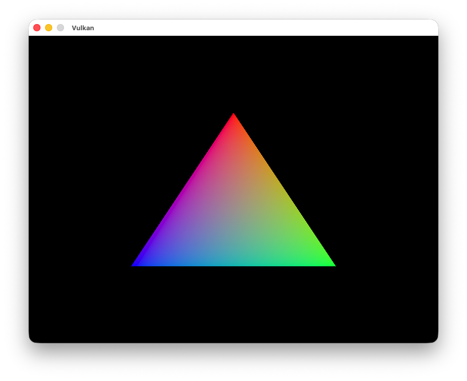
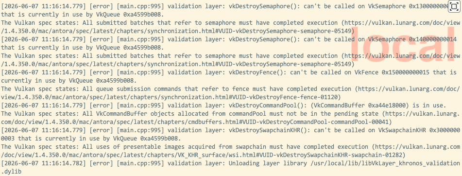

= 렌더링 및 프레젠테이션 (Rendering and presentation)
include::../common/header.adoc[]
:imagesdir!:

이번 장은 그동안 준비한 모든 요소들이 하나로 결합하는 순간입니다. 메인 루프에서 호출되어 화면에 삼각형을 그려낼 ``drawFrame`` 함수를 함께 작성해 보겠습니다. 먼저 함수를 선언하고 ``mainLoop`` 안에서 호출하는 것부터 시작해 봅시다.

[source,cpp]
----
void mainLoop() {
    while (!glfwWindowShouldClose(_window)) {
        glfwPollEvents();
        drawFrame();
    }
}
...
void drawFrame() {

}
----

== 프레임의 전체적인 흐름 (Outline of a frame)

{vk}에서 프레임을 렌더링하는 과정은 큰 틀에서 보면 다음과 같은 공통적인 단계로 이루어집니다.

* 이전 프레임의 작업이 완료될 때까지 대기하기
* 스왑 체인으로부터 이미지 가져오기
* 해당 이미지에 장면을 그려낼 커맨드 버퍼 기록하기
* 기록된 커맨드 버퍼 제출하기
* 스왑 체인 이미지를 화면에 표시하기

이후 장에서 렌더링 함수를 더 확장해 나가겠지만, 지금 단계에서는 이 과정이 렌더링 루프의 핵심 골격입니다.

== 동기화 (Synchronization)

{vk}의 핵심 설계 철학 중 하나는 GPU 내부의 작업 동기화를 개발자가 직접 명확하게 제어해야 한다는 점입니다. 드라이버에게 작업의 실행 순서를 알려주는 다양한 동기화 객체(Primitive)들을 사용해, 전체적인 연산 순서를 정의하는 것은 온전히 우리의 몫입니다. 이 때문에 GPU에서 작업을 시작하도록 만드는 많은 {vk} API 호출들은 비동기 방식으로 동작하며, 해당 연산이 완전히 끝나기 전에 함수가 먼저 종료(Return)됩니다.

이번 장에서는 GPU에서 처리되는 다음과 같은 여러 작업들의 실행 순서를 우리가 직접 명시해 주어야 합니다.

* 스왑 체인으로부터 이미지 가져오기
* 가져온 이미지에 장면을 그려내는 커맨드 실행하기
* 그려진 이미지를 화면에 출력하여 스왑 체인으로 되돌려주기

이 작업들은 각각 단 하나의 함수 호출로 시작되지만, 모두 비동기적으로 실행됩니다. 즉, 실제 작업이 다 끝나지도 않았는데 함수는 바로 넘어가 버리며, 심지어 실행되는 순서조차 보장되지 않습니다. 문제는 이 작업들이 모두 앞선 단계의 결과에 종속되어 있다는 점입니다. 따라서 우리가 원하는 올바른 순서대로 작업이 맞물려 돌아가도록 만들기 위해, 어떤 동기화 객체들을 활용할 수 있는지 자세히 살펴보겠습니다.

이번 파트는 {vk}의 핵심인 동기화를 다루고 있어 문맥을 매끄럽게 다듬었습니다. 다음 번역을 계속 진행하시려면 새로운 본문 내용을 입력해 주세요. 아니면 지금까지의 번역 스타일에서 수정하고 싶은 부분이 있다면 편하게 말씀해 주세요!

=== 세마포어 (Semaphores)

세마포어는 큐(Queue) 작업들 사이의 실행 순서를 조율할 때 사용합니다. 여기서 큐 작업이란 커맨드 버퍼에 담아 제출하거나, 이후에 살펴볼 것처럼 특정 함수 내부에서 큐로 보내는 모든 작업을 의미합니다. 대표적인 예로 그래픽스 큐와 프레젠테이션 큐를 들 수 있습니다. 세마포어는 동일한 큐 안에서 작업들의 순서를 맞출 때뿐만 아니라, 서로 다른 큐 사이의 작업을 동기화할 때도 핵심적인 역할을 합니다.

{vk}에는 바이너리(Binary)와 타임라인(Timeline)이라는 두 가지 종류의 세마포어가 존재합니다. 이 튜토리얼에서는 바이너리 세마포어만 사용할 예정이므로, 타임라인 세마포어는 다루지 않겠습니다. 따라서 앞으로 언급하는 모든 '세마포어'라는 용어는 전부 바이너리 세마포어를 의미합니다.

세마포어는 '신호 없음(Unsignaled)'과 '신호 받음(Signaled)' 중 하나의 상태를 가집니다. 처음 생성되었을 때는 신호 없음 상태로 시작합니다. 이를 활용해 큐 작업의 순서를 지정하려면, 하나의 큐 작업에는 해당 세마포어를 '시그널(Signal)' 세마포어로 등록하고, 이어질 다른 큐 작업에는 '웨이트(Wait)' 세마포어로 등록하면 됩니다. 예를 들어 세마포어 S가 있고, 작업 A와 작업 B를 순서대로 실행하고 싶다고 가정해 봅시다. {vk}에 작업 A가 끝날 때 세마포어 S를 '시그널' 상태로 만들라고 지시하고, 작업 B에는 세마포어 S가 '시그널' 상태가 될 때까지 '웨이트(대기)' 하라고 설정하는 방식입니다. 이렇게 하면 작업 A가 끝나는 순간 세마포어 S가 신호 받음 상태로 바뀌며, 작업 B는 S가 신호를 받기 전까지는 절대 시작되지 않습니다. 작업 B가 실행을 시작하면 세마포어 S는 자동으로 다시 신호 없음 상태로 초기화되어 재사용할 수 있게 됩니다.

방금 설명한 내용을 의사코드로 표현하면 다음과 같습니다.

[source,cpp]
----
VkCommandBuffer A, B = ... // record command buffers
VkSemaphore S = ... // create semaphore

// enqueue A, signal S when done - starts executing immediately
vkQueueSubmit(work: A, signal: S, wait: None)

// enqueue B, wait on s to start
vkQueueSubmit(work: B, signal: None, wait: S)
----

여기서 주의할 점은, 예시 코드에 나온 두 번의 ``vkQueueSubmit()`` 호출 모두 즉시 종료(Return)된다는 사실입니다. 실제 대기 현상은 CPU가 아니라 GPU 내부에서만 일어납니다. 따라서 CPU는 아무런 제약 없이 다음 코드를 계속 실행해 나갑니다. 만약 CPU를 직접 대기시켜야 한다면 또 다른 종류의 동기화 객체가 필요한데, 이에 대해 바로 알아보겠습니다.

=== 펜스 (Fences)

펜스 역시 작업을 동기화한다는 점에서는 목적이 비슷하지만, CPU(호스트라고도 부릅니다)의 실행 순서를 제어하기 위해 사용한다는 결정적인 차이가 있습니다. 쉽게 말해, GPU가 특정 작업을 언제 끝냈는지 CPU가 알아야 할 때 펜스를 사용합니다.

세마포어와 마찬가지로 펜스도 '신호 받음(Signaled)' 또는 '신호 없음(Unsignaled)' 상태를 가집니다. GPU에 작업을 제출할 때마다 펜스를 하나씩 연결해 둘 수 있는데, 해당 작업이 완료되면 펜스가 신호 받음 상태로 바뀝니다. 이때 CPU가 펜스의 신호를 기다리도록 설정하면, 작업을 확실히 끝마친 후 CPU가 다음 코드를 실행하도록 보장할 수 있습니다.

구체적인 예로 스크린샷을 찍는 상황을 지칭해 보겠습니다. GPU에서 필요한 연산을 모두 마쳤고, 이제 이 이미지를 GPU에서 CPU 쪽으로 전송한 뒤 파일로 저장해야 합니다. 이때 전송을 처리할 커맨드 버퍼 A와 펜스 F가 있다고 가정해 봅시다. 펜스 F를 걸고 커맨드 버퍼 A를 제출한 뒤, CPU에 즉시 펜스 F를 기다리라고 명령합니다. 그러면 CPU는 커맨드 버퍼 A의 실행이 완전히 끝날 때까지 다음 단계로 넘어가지 않고 멈춰 서게 됩니다. 덕분에 메모리 전송이 확실히 끝난 것을 확인하고, 안전하게 디스크에 스크린샷 파일을 저장할 수 있습니다.

방금 설명한 내용을 의사코드로 표현하면 다음과 같습니다.

[source,cpp]
----
VkCommandBuffer A = ... // record command buffer with the transfer
VkFence F = ... // create the fence

// enqueue A, start work immediately, signal F when done
vkQueueSubmit(work: A, fence: F)

// blocks execution until A has finished executing
vkWaitForFence(F)

// can't run until the transfer has finished
save_screenshot_to_disk()
----

세마포어 예시와 달리, 이번에는 CPU(호스트)의 실행이 실제로 차단(Block)됩니다. 즉, CPU는 GPU 작업이 끝날 때까지 아무것도 하지 않고 오직 대기만 합니다. 스크린샷을 디스크에 저장하려면 전송이 완벽히 끝나야만 하므로, 이번만큼은 반드시 CPU를 붙잡아 두어야 했던 것입니다.

일반적으로 꼭 필요한 경우가 아니라면 CPU의 흐름을 막지 않는 것이 좋습니다. 우리는 GPU와 CPU 모두에 쉬지 않고 유용한 일거리를 던져주어야 합니다. 펜스의 신호를 무작정 기다리는 것은 성능 면에서 낭비이기 때문입니다. 따라서 가급적이면 세마포어나 아직 다루지 않은 다른 동기화 객체들을 활용해 작업을 조율하는 것이 바람직합니다.

또한 펜스는 신호 없음 상태로 되돌릴 때 직접 수동으로 초기화(Reset)해 주어야 합니다. 펜스는 CPU의 실행 흐름을 제어하는 도구이므로, 이를 언제 재사용할지 결정하는 권한도 CPU에게 있기 때문입니다. CPU의 개입 없이 GPU 내부에서 알아서 작업 순서를 맞추고 자동으로 초기화되던 세마포어와는 대조적인 부분입니다.

요약하자면, 세마포어는 GPU 내부 작업들의 실행 순서를 조율하는 데 쓰이고, 펜스는 CPU와 GPU의 발걸음을 서로 맞추기 위해 사용됩니다.

=== 어떤 것을 선택해야 할까요? (What to choose?)

우리에게는 두 가지 동기화 객체가 있으며, 마침 동기화가 필요한 곳도 두 군데입니다. 바로 스왑 체인 작업과 이전 프레임의 종료를 기다리는 작업입니다. 먼저 스왑 체인 작업에는 세마포어를 사용해야 합니다. 이 작업들은 GPU 내부에서 처리되므로, 굳이 CPU(호스트)를 하염없이 기다리게 만들 이유가 없기 때문입니다. 반대로 이전 프레임이 끝날 때까지 대기하는 작업에는 펜스를 사용합니다. 이번에는 CPU를 직접 대기시켜야 하기 때문입니다. 이렇게 해야 한 번에 두 개 이상의 프레임이 동시에 그려지는 불상사를 막을 수 있습니다. 우리는 매 프레임마다 커맨드 버퍼를 새로 기록하므로, 현재 프레임의 실행이 완전히 끝나기 전에는 다음 프레임 작업을 커맨드 버퍼에 기록해서는 안 됩니다. GPU가 한창 사용 중인 커맨드 버퍼의 내용을 도중에 덮어써 버리면 안 되기 때문입니다.

== 동기화 객체 생성하기 (Creating the synchronization objects)

스왑 체인에서 이미지를 가져와 렌더링할 준비가 되었음을 알리는 세마포어 하나와, 렌더링이 모두 끝나 화면 출력(프레젠테이션)을 시작해도 좋음을 알리는 세마포어 하나가 필요합니다. 여기에 추가로 한 번에 하나의 프레임만 확실하게 렌더링되도록 조율해 줄 펜스까지 총 세 개의 객체가 필요합니다.

이 세마포어 객체들과 펜스 객체를 저장할 클래스 멤버 변수 세 개를 다음과 같이 선언합니다.

[source,cpp]
----
VkSemaphore _imageAvailableSemaphore;
VkSemaphore _renderFinishedSemaphore;
VkFence _inFlightFence;
----

세마포어를 생성하기 위해, 이번 튜토리얼 단원의 마지막 생성 함수인 ``createSyncObjects``를 추가해 보겠습니다.

[source,cpp]
----
void initVulkan() {
    createInstance();
    setupDebugMessenger();
    createSurface();
    pickPhysicalDevice();
    createLogicalDevice();
    createSwapChain();
    createImageViews();
    createRenderPass();
    createGraphicsPipeline();
    createFramebuffers();
    createCommandPool();
    createCommandBuffer();
    createSyncObjects();
}
...
void createSyncObjects() {

}
----

세마포어를 만들려면 link:https://www.khronos.org/registry/vulkan/specs/1.0/man/html/VkSemaphoreCreateInfo.html[``VkSemaphoreCreateInfo``] 구조체의 내용을 채워야 합니다. 하지만 현재 API 버전 기준으로 이 구조체에는 ``sType`` 외에 다른 필수 입력 필드가 존재하지 않습니다.

[source,cpp]
----
void createSyncObjects() {
    VkSemaphoreCreateInfo semaphoreInfo{
        .sType = VK_STRUCTURE_TYPE_SEMAPHORE_CREATE_INFO,
        .pNext = nullptr,
    };
}
----

다른 구조체들과 마찬가지로, 향후 {vk} API 버전이 올라가거나 확장 기능이 추가되면 ``flags``나 ``pNext`` 매개변수를 활용하는 기능들이 더 생겨날 수 있습니다.

펜스를 생성할 때는 {VkFenceCreateInfo}[``VkFenceCreateInfo``] 구조체의 내용을 채워주어야 합니다.

[source,cpp]
----
VkFenceCreateInfo fenceInfo{
    .sType = VK_STRUCTURE_TYPE_FENCE_CREATE_INFO,
    .pNext = nullptr,
};
----

세마포어와 펜스를 생성하는 과정 역시 기존에 다루었던 친숙한 형태인 link:https://www.khronos.org/registry/vulkan/specs/1.0/man/html/vkCreateSemaphore.html[``vkCreateSemaphore``]와 link:https://www.khronos.org/registry/vulkan/specs/1.0/man/html/vkCreateFence.html[``vkCreateFence``] 함수를 사용하는 방식을 따릅니다.

[source,cpp]
----
if (vkCreateSemaphore(_device, &semaphoreInfo, nullptr, &_imageAvailableSemaphore) != VK_SUCCESS
    || vkCreateSemaphore(_device, &semaphoreInfo, nullptr, &_renderFinishedSemaphore) != VK_SUCCESS
    || vkCreateFence(_device, &fenceInfo, nullptr, &_inFlightFence) != VK_SUCCESS) {
    throw std::runtime_error("failed to create semaphores!");
}
----

프로그램이 끝날 때 모든 커맨드 처리가 완료되고 더 이상 동기화가 필요 없어지면, 세마포어와 펜스도 함께 깨끗이 정리(Clean up)해 주어야 합니다.

[source,cpp]
----
void cleanup() {
    vkDestroySemaphore(_device, _imageAvailableSemaphore, nullptr);
    vkDestroySemaphore(_device, _renderFinishedSemaphore_, nullptr);
    vkDestroyFence(_device, _inFlightFence, nullptr);
    ...
}
----

이제 드디어 핵심 기능인 메인 렌더링 함수로 넘어가 보겠습니다!

== 이전 프레임 대기하기 (Waiting for the previous frame)

새로운 프레임을 시작할 때는 먼저 이전 프레임의 작업이 완전히 끝날 때까지 기다려야 합니다. 그래야 그 프레임이 사용하던 커맨드 버퍼와 세마포어들을 안전하게 다시 쓸 수 있기 때문입니다. 이를 위해 {vkWaitForFences}[``vkWaitForFences``] 함수를 다음과 같이 호출합니다.

[source,cpp]
----
void drawFrame() {
    vkWaitForFences(_device, 1, &_inFlightFence, VK_TRUE, UINT64_MAX);
}
----

{vkWaitForFences}[``vkWaitForFences``] 함수는 여러 개의 펜스를 배열 형태로 전달받으며, 지정된 펜스 중 '일부' 또는 '전체'가 신호 받음 상태가 될 때까지 CPU(호스트)의 실행을 붙잡아 둡니다. 여기에서 매개변수로 전달한 ``VK_TRUE``는 모든 펜스가 신호를 받을 때까지 기다리겠다는 의미이지만, 지금처럼 펜스를 단 하나만 사용할 때는 큰 상관이 없습니다. 또한 이 함수에는 대기 제한 시간을 설정하는 타임아웃 매개변수도 존재하는데, 우리는 64비트 부호 없는 정수의 최댓값인 ``UINT64_MAX``를 채워 넣어 타임아웃 기능을 사실상 끄도록 처리했습니다.

대기가 끝난 후에는 다음 단계로 나아가기 전에, link:https://www.khronos.org/registry/vulkan/specs/1.0/man/html/vkResetFences.html[``vkResetFences``] 함수를 호출하여 펜스를 다시 신호 없음 상태로 직접 초기화해 주어야 합니다.

[source,cpp]
----
vkResetFences(_device, 1, &_inFlightFence);
----

하지만 다음 단계로 넘어가기 전에, 현재 설계에 아주 작은 걸림돌이 하나 있습니다. 맨 처음 첫 번째 프레임에서 drawFrame()이 호출되면, 이 함수는 ``_inFlightFence``가 신호를 받을 때까지 곧바로 대기 모드에 들어갑니다. 문제는 이 펜스가 프레임 렌더링이 완전히 끝나야만 신호를 받도록 설계되어 있다는 점입니다. 지금은 첫 번째 프레임이라 신호를 보내줄 이전 프레임 자체가 아예 존재하지 않습니다! 결과적으로 ``vkWaitForFences()``는 절대 일어날 리 없는 신호를 하염없이 기다리며 영원히 멈춰 서게(Block) 됩니다.

이 딜레마를 해결하는 수많은 방법 중, {vk} API 자체에 내장된 아주 영리한 우회책이 하나 있습니다. 바로 펜스를 처음 만들 때부터 미리 '신호 받음(Signaled)' 상태로 생성하는 것입니다. 이렇게 하면 펜스가 이미 신호를 받은 상태이므로, 첫 번째 ``vkWaitForFences()`` 호출을 만나더라도 대기하지 않고 즉시 통과하게 됩니다.

이 방식을 적용하려면 다음과 같이 {VkFenceCreateInfo}[``VkFenceCreateInfo``] 구조체의 설정값에 ``VK_FENCE_CREATE_SIGNALED_BIT`` 플래그를 추가해 주기만 하면 됩니다.

[source,cpp]
----
void createSyncObjects() {
    ...
    VkFenceCreateInfo fenceInfo{
        .sType = VK_STRUCTURE_TYPE_FENCE_CREATE_INFO,
        .pNext = nullptr,
        .flags = VK_FENCE_CREATE_SIGNALED_BIT,
    };
}
----

== 스왑 체인으로부터 이미지 가져오기 (Acquiring an image from the swap chain)

``drawFrame`` 함수에서 다음으로 처리해야 할 작업은 스왑 체인으로부터 이미지를 가져오는 것입니다. 앞서 배웠듯이 스왑 체인은 확장 기능의 일부이므로, 함수 이름 역시 ``vk*KHR`` 형태의 명명 규칙을 따르는 API를 사용해야 합니다.

[source,cpp]
----
void drawFrame() {
    ...
    uint32_t imageIndex;
    vkAcquireNextImageKHR(_device, _swapchain, UINT64_MAX, _imageAvailableSemaphore, VK_NULL_HANDLE, &imageIndex);
}
----

``vkAcquireNextImageKHR`` 함수의 처음 두 매개변수는 논리 디바이스와 이미지를 꺼내오고자 하는 대상 스왑 체인입니다. 세 번째 매개변수는 이미지를 사용할 수 있을 때까지 대기할 제한 시간(나노초 단위)을 지정합니다. 여기에서는 64비트 부호 없는 정수의 최댓값을 채워 넣어 타임아웃 기능을 사실상 꺼두었습니다.

그다음 두 매개변수는 화면 출력 엔진(Presentation Engine)이 해당 이미지의 사용을 끝마쳤을 때 신호를 받을 동기화 객체들을 지정하는 곳입니다. 이 신호가 떨어지는 시점이 바로 우리가 이미지에 그림을 그리기 시작할 수 있는 타이밍입니다. 여기에는 세마포어나 펜스를 지정할 수 있고, 둘 다 사용하는 것도 가능합니다. 이번 장에서는 그 목적으로 앞서 만들어 둔 ``_imageAvailableSemaphore``를 지정해 주겠습니다.

마지막 매개변수는 사용 가능해진 스왑 체인 이미지의 인덱스 번호를 받아올 변수를 지정하는 곳입니다. 이 인덱스는 우리가 가지고 있는 swapChainImages 배열 안의 특정 {VkImage}[``VkImage``]를 가리키게 됩니다. 우리는 이 인덱스 번호를 활용해 그에 알맞은 link:https://www.khronos.org/registry/vulkan/specs/1.0/man/html/VkFrameBuffer.html[``VkFrameBuffer``]를 골라내어 작업을 진행하게 됩니다.

== 커맨드 버퍼 기록하기 (Recording the command buffer)

사용할 스왑 체인 이미지를 가리키는 imageIndex를 확보했으니, 이제 커맨드 버퍼를 기록할 차례입니다. 먼저 커맨드 버퍼에 새로운 명령을 확실하게 기록할 수 있도록 link:{vkResetCommandBuffer}[``vkResetCommandBuffer``] 함수를 호출하여 초기화해 줍니다.

[source,cpp]
----
vkResetCommandBuffer(_commandBuffer, 0);
----

{vkResetCommandBuffer}[``vkResetCommandBuffer``] 함수의 두 번째 매개변수는 link:https://www.khronos.org/registry/vulkan/specs/1.0/man/html/VkCommandBufferResetFlagBits.html[``VkCommandBufferResetFlagBits``] 플래그입니다. 지금은 특별한 설정을 적용할 필요가 없으므로 ``0``으로 비워둡니다.

이제 원하는 명령들을 기록하기 위해 앞서 정의해 둔 ``recordCommandBuffer`` 함수를 호출합니다.

[source,cpp]
----
recordCommandBuffer(_commandBuffer, imageIndex);
----

커맨드 버퍼 기록이 모두 끝났으니, 이제 이를 제출하는 단계로 넘어가 보겠습니다.

== 커맨드 버퍼 제출하기 (Submitting the command buffer)

큐에 작업을 제출하고 동기화를 설정하는 과정은 {VkSubmitInfo}[``VkSubmitInfo``] 구조체의 매개변수들을 통해 이루어집니다.

[source,cpp]
----
VkSemaphore waitSemaphores[] = {_imageAvailableSemaphore};
VkPipelineStageFlags waitStages[] = {VK_PIPELINE_STAGE_COLOR_ATTACHMENT_OUTPUT_BIT};
VkSubmitInfo submitInfo{
    .sType = VK_STRUCTURE_TYPE_SUBMIT_INFO,
    .pNext = nullptr,
    .waitSemaphoreCount = 1,
    .pWaitSemaphores = waitSemaphores,
    .pWaitDstStageMask = waitStages,
};
----

처음 세 매개변수는 작업을 시작하기 전에 어떤 세마포어의 신호를 기다릴지, 그리고 파이프라인의 어느 단계(Stage)에서 대기할지를 지정합니다. 우리는 이미지를 사용할 수 있게 될 때까지 색상을 칠하는 작업을 붙잡아 두어야 하므로, 컬러 첨부물(Color Attachment)을 작성하는 그래픽스 파이프라인 단계를 대기 지점으로 지정합니다. 즉, 이론적으로는 이미지가 아직 준비되지 않았더라도 버텍스 셰이더 같은 앞선 단계의 연산들은 미리 실행해 둘 수 있습니다. ``waitStages`` 배열의 각 항목은 ``pWaitSemaphores`` 배열에서 같은 인덱스에 위치한 세마포어와 일대일로 대응됩니다.

[source,cpp]
----
submitInfo.commandBufferCount = 1;
submitInfo.pCommandBuffers = &_commandBuffer;
----

그다음 두 매개변수는 실제로 실행하기 위해 제출할 커맨드 버퍼가 무엇인지 지정하는 곳입니다. 여기서는 우리가 가진 단 하나의 커맨드 버퍼만 제출하도록 간단히 설정합니다.

[source,cpp]
----
VkSemaphore signalSemaphores[] = {_renderFinishedSemaphore};
submitInfo.signalSemaphoreCount = 1;
submitInfo.pSignalSemaphores = signalSemaphores;
----

``signalSemaphoreCount``와 ``pSignalSemaphores`` 매개변수는 커맨드 버퍼의 실행이 모두 끝났을 때 어떤 세마포어에 신호를 보낼지 지정합니다. 이 튜토리얼에서는 그 목적으로 앞서 만들어 둔 ``_renderFinishedSemaphore``를 사용합니다.

[source,cpp]
----
if (vkQueueSubmit(_graphicsQueue, 1, &submitInfo, _inFlightFence) != VK_SUCCESS) {
    throw std::runtime_error("failed to submit draw command buffer!");
}
----

이제 link:https://www.khronos.org/registry/vulkan/specs/1.0/man/html/vkQueueSubmit.html[``vkQueueSubmit``] 함수를 사용해 그래픽스 큐에 커맨드 버퍼를 제출할 수 있습니다. 이 함수는 처리해야 할 작업량이 많을 때 효율성을 높일 수 있도록 {VkSubmitInfo}[``VkSubmitInfo``] 구조체의 배열을 인자로 받습니다. 마지막 매개변수는 커맨드 버퍼의 실행이 끝났을 때 신호를 받을 선택적(Optional) 펜스를 지정하는 곳입니다. 이를 활용하면 커맨드 버퍼를 언제 안전하게 재사용할 수 있는지 판단할 수 있으므로, 여기에 inFlightFence를 넘겨줍니다. 이렇게 하면 다음 프레임이 시작될 때, CPU는 이 커맨드 버퍼에 새로운 명령을 기록하기 전에 이전 실행이 완전히 끝날 때까지 펜스를 보며 기다리게 됩니다.

== 서브패스 의존성 (Subpass dependencies)

렌더 패스(Render pass) 안의 서브패스들은 이미지 레이아웃 전환(Image layout transition)을 자동으로 처리해 줍니다. 이러한 레이아웃 전환은 서브패스 간의 메모리 및 실행 의존성을 명시하는 '서브패스 의존성'에 의해 제어됩니다. 지금은 단 하나의 서브패스만 사용하고 있지만, 이 서브패스의 바로 직전과 바로 직후에 일어나는 작업들 역시 암시적인 "서브패스"로 취급됩니다.

렌더 패스가 시작할 때와 끝날 때의 레이아웃 전환을 담당하는 두 가지 내장 의존성이 존재하지만, 시작할 때의 전환이 적절한 타이밍에 일어나지 않는다는 문제가 있습니다. 이 내장 설정은 파이프라인의 맨 처음 단계에서 레이아웃 전환이 일어난다고 가정하는데, 그 시점은 우리가 아직 스왑 체인으로부터 이미지를 가져오기도 전입니다! 이 문제를 해결하는 데는 두 가지 방법이 있습니다. 첫 번째는 ``_imageAvailableSemaphore``의 대기 단계(``waitStages``)를 ``VK_PIPELINE_STAGE_TOP_OF_PIPE_BIT``으로 변경하여 이미지가 확실히 준비될 때까지 렌더 패스 자체를 시작하지 않도록 만드는 것입니다. 두 번째는 렌더 패스가 ``VK_PIPELINE_STAGE_COLOR_ATTACHMENT_OUTPUT_BIT`` 단계에서 대기하도록 설정하는 것입니다. 여기서는 두 번째 방법을 선택하겠는데, 서브패스 의존성이 실제로 어떻게 작동하는지 직접 살펴볼 좋은 기회이기 때문입니다.

서브패스 의존성은 link:https://www.khronos.org/registry/vulkan/specs/1.0/man/html/VkSubpassDependency.html[``VkSubpassDependency``] 구조체를 통해 정의합니다. ``createRenderPass`` 함수로 이동하여 다음 구조체를 추가해 보겠습니다.

[souce,cpp]
----
VkSubpassDependency dependency{
    .srcSubpass = VK_SUBPASS_EXTERNAL,
    .dstSubpass = 0,
};
----

처음 두 필드는 의존성의 기준이 되는 서브패스와 그에 종속되는 서브패스의 인덱스를 지정합니다. ``VK_SUBPASS_EXTERNAL``이라는 특수한 값은 ``srcSubpass``나 ``dstSubpass`` 중 어디에 지정되느냐에 따라, 렌더 패스 시작 직전 혹은 종료 직후의 암시적 서브패스를 가리킵니다. 인덱스 ``0``은 우리가 만든 첫 번째이자 유일한 서브패스를 의미합니다. 의존성 그래프에서 순환(Cycle) 오류가 발생하는 것을 막기 위해, ``dstSubpass는`` 무조건 ``srcSubpass``보다 큰 값이어야 합니다 (**둘 중 하나가 ``VK_SUBPASS_EXTERNAL``인 경우는 제외**).

[source,cpp]
----
dependency.srcStagemask = VK_PIPELINE_STAGE_COLOR_ATTACHMENT_OUTPUT_BIT;
dependency.srcAccessMask = 0;
----

그다음 두 필드는 어떤 작업이 끝날 때까지 기다릴지(Wait on), 그리고 그 작업들이 파이프라인의 어느 단계에서 일어나는지 지정합니다. 우리는 이미지에 접근하기 전에 스왑 체인이 이미지 읽기 작업을 완전히 마칠 때까지 기다려야 합니다. 이는 컬러 첨부물 출력(Color attachment output) 단계 자체를 대기 지점으로 설정하여 해결할 수 있습니다.

[source,cpp]
----
dependency.dstStageMask = VK_PIPELINE_STAGE_COLOR_ATTACHMENT_OUTPUT_BIT;
dependency.dstAccessMask = VK_ACCESS_COLOR_ATTACHMENT_WRITE_BIT;
----

이 대기 작업이 끝나기를 기다렸다가 실행되어야 하는 명령들은 컬러 첨부물 단계에 속해 있으며, 구체적으로는 컬러 첨부물에 색상을 기록하는 연산입니다. 이 설정을 적용하면 실제로 레이아웃 전환이 꼭 필요하고 허용되는 타이밍, 즉 우리가 이미지에 색상을 직접 받아 적기 시작하는 순간이 되기 전까지 전환이 일어나지 않도록 막아줍니다.

[source,cpp]
----
renderPassInfo.dependencyCount = 1;
renderPassInfo.pDependencies = &dependency;
----

link:https://www.khronos.org/registry/vulkan/specs/1.0/man/html/VkRenderPassCreateInfo.html[``VkRenderPassCreateInfo``] 구조체에는 이러한 의존성 배열을 지정할 수 있는 두 개의 필드가 마련되어 있습니다.

== 화면 출력 (Presentation)

프레임 렌더링의 마지막 단계는 결과물을 스왑 체인으로 다시 보내어 최종적으로 화면에 띄우는 것입니다. 화면 출력 설정은 ``drawFrame`` 함수의 맨 마지막 부분에서 ``VkPresentInfoKHR`` 구조체를 통해 이루어집니다.

[source,cpp]
----
VkPresentInfoKHR presentInfo{
    .sType = VK_STRUCTURE_TYPE_PRESENT_INFO_KHR,
    .pNext = nullptr,
    .waitSemaphoreCount = 1,
    .pWaitSemaphores = signalSemaphores,
};
----

처음 두 매개변수는 {VkSubmitInfo[``VkSubmitInfo``]와 마찬가지로 화면 출력을 진행하기 전에 어떤 세마포어의 신호를 기다릴지 지정합니다. 우리는 커맨드 버퍼의 실행이 끝나고 삼각형이 완전히 그려질 때까지 대기해야 하므로, 작업 완료 시 시그널을 받도록 설정했던 세마포어(``signalSemaphores``)를 가져와 대기 상태로 지정합니다. ##즉, 여기서는 renderFinishedSemaphore를 사용합니다.##

[source,cpp]
----
VkSwapchainKHR swapChains[] = {_swapChain};
presentInfo.swapchainCount = 1;
presentInfo.pSwapchains = swapChains;
presentInfo.pImageIndices = &imageIndex;
----

그다음 두 매개변수는 이미지를 출력할 대상 스왑 체인들과 각 스왑 체인별 이미지의 인덱스를 지정하는 곳입니다. 대개의 경우 단 하나의 스왑 체인만 사용하게 됩니다.

[source,cpp]
----
presentInfo.pResults = nullptr; // Optional
----

마지막으로 ``pResults``라는 선택적(Optional) 매개변수가 있습니다. 이 필드는 여러 개의 스왑 체인을 사용할 때, 각 스왑 체인별로 화면 출력이 성공했는지 확인할 수 있도록 {VkResult}[``VkResult``] 값의 배열을 전달하는 곳입니다. 지금처럼 단 하나의 스왑 체인만 사용하는 경우에는 출력 함수의 반환값을 바로 확인하면 되므로 굳이 사용할 필요가 없습니다.

[source,cpp]
----
vkQueuePresentKHR(_presentQueue, &presentInfo);
----

``vkQueuePresentKHR`` 함수는 스왑 체인에 이미지 출력을 요청하는 역할을 합니다. 다음 장에서는 ``vkAcquireNextImageKHR``와 ``vkQueuePresentKHR`` 함수 모두에 에러 핸들링 코드를 추가할 예정입니다. 지금까지 보았던 다른 함수들과 달리, 이 두 함수에서 발생하는 오류는 프로그램의 강제 종료로 직결되지 않는 경우가 많기 때문입니다.

여기까지 문제없이 올바르게 구현했다면, 프로그램을 실행했을 때 다음과 같은 형태의 결과물을 화면에서 확인할 수 있습니다.

[quote]
____
이 컬러 삼각형은 다른 그래픽스 튜토리얼에서 보던 모습과 조금 다르게 느껴질 수 있습니다. 본 튜토리얼에서는 셰이더가 선형 색 공간(Linear color space)에서 보간을 수행한 뒤, 최종적으로 sRGB 색 공간으로 변환하도록 처리했기 때문입니다. 이 차이점에 대한 자세한 내용은 링크된 link:https://medium.com/@heypete/hello-triangle-meet-swift-and-wide-color-6f9e246616d9[블로그 포스트]를 참고해 보시기 바랍니다.
____

축하합니다! 하지만 아쉽게도 검증 레이어(Validation layers)를 켠 상태에서 프로그램을 실행하면, 창을 닫는 순간 프로그램이 크래시(충돌)를 일으키며 종료되는 것을 볼 수 있습니다. 터미널에 출력된 ``debugCallback`` 메시지를 보면 그 이유를 알 수 있습니다.

앞서 ``drawFrame`` 내부의 모든 작업은 비동기적으로 실행된다고 말씀드린 점을 기억하실 겁니다. 즉, 우리가 ``mainLoop``의 루프를 빠져나오는 순간에도 GPU에서는 여전히 그림을 그리거나 화면에 출력하는 작업이 한창 진행 중일 수 있습니다. 이러한 상황에서 무턱대고 관련 리소스들을 정리(Clean up)해 버리는 것은 매우 위험한 행동입니다.

이 문제를 해결하려면 ``mainLoop``를 빠져나가 창(Window)을 파괴하기 전에, 논리 디바이스가 모든 작업을 확실히 끝마칠 때까지 기다리도록 다음과 같이 코드를 추가해야 합니다.

[source,cpp]
----
void mainLoop() {
    while (!glfwWindowShouldClose(_window)) {
        glfwPollEvents();
        drawFrame();
    }

    vkDeviceWaitIdle(_device);
}
----

특정 커맨드 큐의 작업만 끝내고 싶다면 link:https://www.khronos.org/registry/vulkan/specs/1.0/man/html/vkQueueWaitIdle.html[``vkQueueWaitIdle``] 함수를 사용할 수도 있습니다. 이 함수들은 아주 원시적이면서도 확실한 동기화 방식으로 활용될 수 있습니다. 이제 코드를 수정하고 창을 닫으면 프로그램이 아무런 에러 없이 깔끔하게 종료되는 것을 확인할 수 있습니다.

== 결론 (Conclusion)

900줄이 조금 넘는 코드를 작성한 끝에, 드디어 화면에 무언가 띄우는 단계에 도달했습니다! {vk} 프로그램을 맨바닥에서부터 구축하는 과정은 분명 엄청난 노력이 필요합니다. 하지만 그 대가로 {vk}은 모든 것을 명시적으로 제어할 수 있는 강력한 통제권을 개발자에게 부여한다는 점이 가장 중요한 핵심입니다. 이제 잠시 시간을 내어 작성한 코드를 처음부터 다시 읽어보시기를 권장합니다. 프로그램에 사용된 모든 {vk} 객체들의 목적이 무엇인지, 그리고 이들이 서로 어떻게 맞물려 돌아가는지 머릿속으로 전체적인 그림을 그려보는 것이 좋습니다. 앞으로는 지금까지 쌓은 지식을 디딤돌 삼아 프로그램의 기능을 더욱 확장해 나갈 것입니다.

link:./FrameInFlight.html[다음 장]에서는 한 번에 여러 프레임을 동시에 처리할 수 있도록 렌더링 루프를 확장하는 방법을 알아보겠습니다.