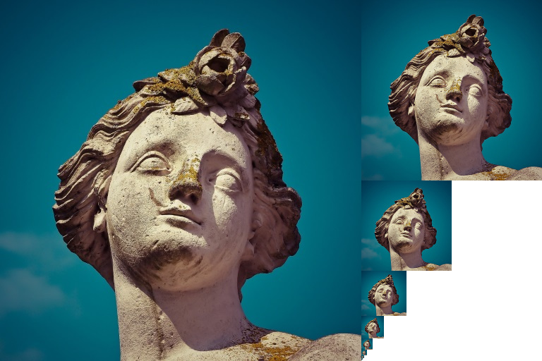
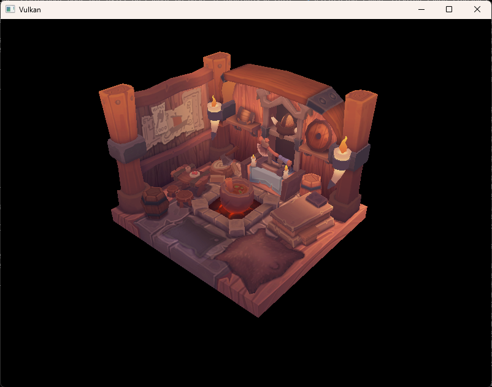
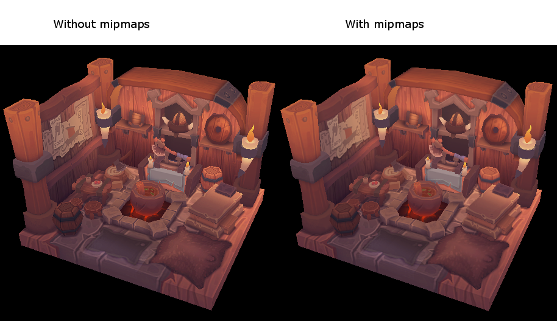

= 밉맵 생성하기 (Generating Mipmaps)
include::./common/header.adoc[]
:imagesdir!:

== 개요 (Introduction)

이제 우리 프로그램은 3D 모델을 불러와 화면에 그릴 수 있습니다. 이번 장에서는 '밉맵 생성'이라는 기능을 하나 더 추가해 보겠습니다. 밉맵은 게임과 렌더링 소프트웨어에서 널리 쓰이는 기술로, {vk}에서는 이 밉맵을 어떻게 만들고 제어할지 개발자가 완전히 통제할 수 있습니다.

밉맵은 원본 이미지를 미리 작게 축소하여 계산해 둔 이미지 세트입니다. 각 단계의 이미지는 이전 단계 이미지의 가로세로 크기가 정확히 절반씩 줄어듭니다. 밉맵은 일종의 LOD(Level of Detail, 거리별 상세도) 기법으로 활용됩니다. 카메라에서 멀리 떨어진 오브젝트는 더 작은 밉맵 이미지를 사용하여 텍스처를 표현합니다. 이렇게 작은 이미지를 쓰면 렌더링 속도가 빨라질 뿐만 아니라, link:https://en.wikipedia.org/wiki/Moir%C3%A9_pattern[무아레 패턴(Moiré patterns)] 같은 그래픽 깨짐 현상도 방지할 수 있습니다. 밉맵의 형태를 예로 들면 다음과 같습니다.

== 이미지 생성 (Image creation)

{vk}에서 각각의 밉 이미지는 {VkImage}[``VkImage``] 객체 내의 서로 다른 밉 레벨(mip level)에 저장됩니다. **레벨 0은 원본 이미지**를 의미하며, 레벨 0 이후에 생성되는 일련의 다운스케일 이미지들을 보통 '밉 체인(mip chain)'이라고 부릅니다.

밉 레벨의 총 개수는 {VkImage}[``VkImage``]를 처음 생성할 때 지정합니다. 지금까지는 이 값을 항상 1로 설정해 왔지만, 이제부터는 원본 이미지의 가로세로 크기를 바탕으로 필요한 밉 레벨 수를 직접 계산해야 합니다. 우선, 이 개수를 저장할 클래스 멤버 변수를 다음과 같이 추가합니다.

[source,cpp]
----
...
uint32_t mipLevels;
VkImage _textureImage;
----

멤버 변수 ``_mipLevels``에 들어갈 값은 ``createTextureImage`` 함수 안에서 텍스처를 완전히 불러온 직후에 계산할 수 있습니다.

[source,cpp]
----
int texWidth, texHeight, texChannels;
stbi_uc* pixels = stbi_load(TEXTURE_PATH.c_str(), &texWidth, &texHeight, &texChannels, STBI_rgb_alpha);
VkDeviceSize imageSize = texWidth * texHeight * 4;

if (!pixels) {
    throw std::runtime_error("failed to load texture image!");
}

_mipLevels = static_cast<uint32_t>(std::floor(std::log2(std::max(texWidth, texHeight)))) + 1;
----

이 수식은 밉 체인에 들어갈 총 레벨 수를 계산하는 과정입니다. 우선 ``max`` 함수로 가로와 세로 중 더 긴 쪽을 고릅니다. 그다음 ``log2`` 함수를 통해 그 정수 크기가 2로 몇 번까지 나누어지는지 계산합니다. floor 함수는 이미지 크기가 2의 거듭제곱으로 딱 떨어지지 않는 경우를 처리해 주며, 마지막에 ``1``을 더해 원본 이미지 자체의 레벨(레벨 0)까지 개수에 포함시킵니다.

이렇게 계산한 값을 활용하려면 ``createImage``, ``createImageView``, ``transitionImageLayout`` 함수가 밉 레벨 수를 넘겨받아 처리할 수 있도록 수정해야 합니다. 다음과 같이 각 함수에 ``_mipLevels`` 매개변수를 추가해 주세요.

[source,cpp]
----
void createImage(uint32_t width, uint32_t height, uint32_t mipLevels, VkFormat format, VkImageTiling tiling,
                 VkImageUsageFlags usage, VkMemoryPropertyFlags properties, VkImage& image,
                 VkDeviceMemory& imageMemory) {
    ...
    VkImageCreateInfo imageInfo{
        .sType = VK_STRUCTURE_TYPE_IMAGE_CREATE_INFO,
        .flags = 0,
        .imageType = VK_IMAGE_TYPE_2D,
        .format = format,
        .extent = extent,
        .mipLevels = mipLevels,
        .arrayLayers = 1,
        .samples = VK_SAMPLE_COUNT_1_BIT,
        .tiling = tiling,
        .usage = usage,
        .sharingMode = VK_SHARING_MODE_EXCLUSIVE,
        .initialLayout = VK_IMAGE_LAYOUT_UNDEFINED,
    };
    ...
}
----

[source,cpp]
----
VkImageView createImageView(VkImage image, VkFormat format, VkImageAspectFlags aspectFlags, uint32_t mipLevels) {
    VkImageSubresourceRange range{
        .aspectMask = aspectFlags,
        .baseMipLevel = 0,
        .levelCount = mipLevels,
        .baseArrayLayer = 0,
        .layerCount = 1,
    };
    ...
}
----

[source,cpp,opts="nowrap"]
----
void transitionImageLayout(VkImage image, VkFormat format, VkImageLayout oldLayout, VkImageLayout newLayout,
                           uint32_t mipLevels) {
    ...
    VkImageSubresourceRange range{
        .baseMipLevel = 0,
        .levelCount = mipLevels,
        .baseArrayLayer = 0,
        .layerCount = 1,
    };
    ...
}
----

이제 기존 코드에서 이 함수들을 호출하던 부분을 모두 찾아 새로 추가된 매개변수에 맞는 올바른 값을 넘겨주도록 수정합니다.

[source,cpp,opts="nowrap"]
----
// void createDepthResources()
createImage(_swapChainExtent.width, _swapChainExtent.height, 1, depthFormat, VK_IMAGE_TILING_OPTIMAL,
            VK_IMAGE_USAGE_DEPTH_STENCIL_ATTACHMENT_BIT, VK_MEMORY_PROPERTY_DEVICE_LOCAL_BIT, _depthImage,
            _depthImageMemory);

// void createTextureImage()
createImage(texWidth, texHeight, _mipLevels, VK_FORMAT_R8G8B8A8_SRGB, VK_IMAGE_TILING_OPTIMAL,
            VK_IMAGE_USAGE_TRANSFER_DST_BIT | VK_IMAGE_USAGE_SAMPLED_BIT, VK_MEMORY_PROPERTY_DEVICE_LOCAL_BIT,
            _textureImage, _textureImageMemory);
----

[source,cpp,opts="nowrap"]
----
// void createImageViews()
_swapChainImageViews[i] = createImageView(_swapChainImages[i], _swapChainImageFormat, VK_IMAGE_ASPECT_COLOR_BIT, 1);

// void createDepthResources()
_depthImageView = createImageView(_depthImage, depthFormat, VK_IMAGE_ASPECT_DEPTH_BIT, 1);

// void createTextureImageView()
_textureImageView = createImageView(_textureImage, VK_FORMAT_R8G8B8A8_SRGB, VK_IMAGE_ASPECT_COLOR_BIT, _mipLevels);
----

[source,cpp,opts="nowrap"]
----
// void createDepthResources()
transitionImageLayout(_depthImage, depthFormat, VK_IMAGE_LAYOUT_UNDEFINED,
                      VK_IMAGE_LAYOUT_DEPTH_STENCIL_ATTACHMENT_OPTIMAL, 1);

// void createTextureImage()
transitionImageLayout(_textureImage, VK_FORMAT_R8G8B8A8_SRGB, VK_IMAGE_LAYOUT_UNDEFINED,
                      VK_IMAGE_LAYOUT_TRANSFER_DST_OPTIMAL, _mipLevels);
----

== 밉맵 생성하기 (Generating Mipmaps)

이제 텍스처 이미지에 여러 개의 밉 레벨이 준비되었지만, 스태이징 버퍼(staging buffer)는 레벨 0만 채울 수 있습니다. 나머지 레벨들은 아직 정의되지 않은 빈 상태입니다. 이 레벨들을 채우려면 우리가 가진 단 하나의 레벨(레벨 0)의 데이터를 바탕으로 다른 레벨들을 직접 만들어내야 합니다. 이때 {vkCmdBlitImage}[``vkCmdBlitImage``] 명령을 사용합니다. 이 명령은 복사, 크기 조절, 필터링 작업을 동시에 수행할 수 있어, 텍스처 이미지의 각 레벨로 데이터를 전송(blit)할 때 여러 번 호출하여 유용하게 쓸 수 있습니다.

{vkCmdBlitImage}[``vkCmdBlitImage``]는 전송(transfer) 작업으로 분류되므로, 이 텍스처 이미지를 전송할 때 '보내는 쪽(source)'과 '받는 쪽(destination)' 양쪽 모두로 사용하겠다는 설정을 Vulkan에 미리 알려야 합니다. createTextureImage 함수에서 텍스처 이미지의 사용 목적(usage) 플래그에 ``VK_IMAGE_USAGE_TRANSFER_SRC_BIT``를 다음과 같이 추가해 줍니다.

[source,cpp, opts="nowrap"]
----
// void createTextureImage()
...
createImage(texWidth, texHeight, _mipLevels, VK_FORMAT_R8G8B8A8_SRGB, VK_IMAGE_TILING_OPTIMAL,
            VK_IMAGE_USAGE_TRANSFER_SRC_BIT | VK_IMAGE_USAGE_TRANSFER_DST_BIT | VK_IMAGE_USAGE_SAMPLED_BIT,
            VK_MEMORY_PROPERTY_DEVICE_LOCAL_BIT, _textureImage, _textureImageMemory);
...
----

다른 이미지 작업들과 마찬가지로 {vkCmdBlitImage}[``vkCmdBlitImage``] 역시 이미지가 어떤 레이아웃(layout) 상태인가에 따라 동작이 달라집니다. 물론 이미지 전체를 ``VK_IMAGE_LAYOUT_GENERAL`` 레이아웃으로 변경해서 쓸 수도 있지만, 이 방식은 성능이 크게 떨어질 가능성이 높습니다. 최적의 성능을 내려면 이미지를 전송하는 쪽(source)은 ``VK_IMAGE_LAYOUT_TRANSFER_SRC_OPTIMAL로``, 받는 쪽(destination)은 ``VK_IMAGE_LAYOUT_TRANSFER_DST_OPTIMAL`` 상태로 전환해 두어야 합니다. {vk}에서는 이미지의 각 밉 레벨을 독립적으로 레이아웃 전환을 할 수 있습니다. 매번 한 번에 두 개의 밉 레벨만 가지고 전송 작업을 처리하므로, 전송 명령을 실행하는 사이사이에 각 레벨을 최적의 레이아웃으로 변경해 주면 됩니다.

기존의 ``transitionImageLayout`` 함수는 이미지 전체의 레이아웃만 한 번에 바꿀 수 있기 때문에, 이번에는 파이프라인 장벽(pipeline barrier) 명령을 직접 몇 줄 더 구현해야 합니다. 우선 ``createTextureImage`` 함수 안에서 이미지 전체를 셰이더 읽기 전용 상태(``VK_IMAGE_LAYOUT_SHADER_READ_ONLY_OPTIMAL``)로 바꾸던 기존 코드를 삭제합니다.

[source,cpp]
----
transitionImageLayout(_textureImage, VK_FORMAT_R8G8B8A8_SRGB, VK_IMAGE_LAYOUT_UNDEFINED,
                      VK_IMAGE_LAYOUT_TRANSFER_DST_OPTIMAL, _mipLevels);
copyBufferToImage(stagingBuffer, _textureImage, static_cast<uint32_t>(texWidth),
                  static_cast<uint32_t>(texHeight));
// transitionImageLayout(_textureImage, VK_FORMAT_R8G8B8A8_SRGB, VK_IMAGE_LAYOUT_TRANSFER_DST_OPTIMAL,
//                       VK_IMAGE_LAYOUT_SHADER_READ_ONLY_OPTIMAL, _mipLevels);
----

이렇게 하면 텍스처 이미지의 모든 레벨이 ``VK_IMAGE_LAYOUT_TRANSFER_DST_OPTIMAL`` 상태로 남게 됩니다. 이후 각 레벨은 자신을 소스로 하는 전송 명령이 끝나 읽기 작업이 완료될 때마다 하나씩 셰이더 읽기 전용 상태(``VK_IMAGE_LAYOUT_SHADER_READ_ONLY_OPTIMAL``)로 전환될 것입니다.

이제 실제로 밉맵을 생성하는 함수를 작성해 보겠습니다.

[source,cpp]
----
void generateMipmaps(VkImage image, int32_t texWidth, int32_t texHeight, uint32_t mipLevels) {
    VkCommandBuffer commandBuffer = beginSingleTimeCommands();
    VkImageSubresourceRange range{
        .aspectMask = VK_IMAGE_ASPECT_COLOR_BIT,
        .levelCount = 1,
        .baseArrayLayer = 0,
        .layerCount = 1,
    };
    VkImageMemoryBarrier barrier{
        .sType = VK_STRUCTURE_TYPE_IMAGE_MEMORY_BARRIER,
        .srcQueueFamilyIndex = VK_QUEUE_FAMILY_IGNORED,
        .dstQueueFamilyIndex = VK_QUEUE_FAMILY_IGNORED,
        .image = image,
        .subresourceRange = range,
    };

    endSingleTimeCommands(commandBuffer);
}
----

우리는 함수 내부에서 레이아웃 전환을 여러 번 수행할 것이므로, 이 {VkImageMemoryBarrier}[``VkImageMemoryBarrier``] 구조체를 계속 재사용할 것입니다. 위에서 한 번 설정한 필드들은 모든 장벽에서 그대로 유지되며, 반복문이 돌면서 각 전환에 필요한 ``subresourceRange.baseMipLevel``, ``oldLayout``, ``newLayout``, ``srcAccessMask``, ``dstAccessMask`` 값만 그때그때 바꾸어 주게 됩니다.

[source,cpp]
----
int32_t mipWidth = texWidth;
int32_t mipHeight = texHeight;

for (uint32_t i = 1; i < mipLevels; i++) {

}
----

이 반복문은 각각의 {vkCmdBlitImage}[``vkCmdBlitImage``] 명령을 기록하는 역할을 합니다. 반복문 제어 변수가 **0이 아닌 1부터 시작한다는 점에 유의**해 주세요.

[source,cpp,opts="nowrap"]
----
for (uint32_t i = 1; i < mipLevels; i++) {
    barrier.subresourceRange.baseMipLevel = i - 1;
    barrier.oldLayout = VK_IMAGE_LAYOUT_TRANSFER_DST_OPTIMAL;
    barrier.newLayout = VK_IMAGE_LAYOUT_TRANSFER_SRC_OPTIMAL;
    barrier.srcAccessMask = VK_ACCESS_TRANSFER_WRITE_BIT;
    barrier.dstAccessMask = VK_ACCESS_TRANSFER_READ_BIT;

    vkCmdPipelineBarrier(commandBuffer, VK_PIPELINE_STAGE_TRANSFER_BIT, VK_PIPELINE_STAGE_TRANSFER_BIT, 0, 0,
                         nullptr, 0, nullptr, 1, &barrier);
}
----

먼저 ``i - 1`` 레벨을 ``VK_IMAGE_LAYOUT_TRANSFER_SRC_OPTIMAL`` 상태로 전환합니다. 이 장벽은 이전 단계의 전송 명령이나 최초의 {vkCmdCopyBufferToImage}[``vkCmdCopyBufferToImage``] 명령을 통해 ``i - 1`` 레벨에 데이터가 완전히 채워질 때까지 기다리도록 만듭니다. 즉, 현재 실행할 전송 명령은 이 레이아웃 전환 작업이 끝난 후에 동기화되어 안전하게 실행됩니다.

NOTE: 작성자 방식으로 변경함

[source,cpp]
----
VkImageSubresourceLayers srcRange{
    .aspectMask = VK_IMAGE_ASPECT_COLOR_BIT,
    .mipLevel = i - 1,
    .baseArrayLayer = 0,
    .layerCount = 1,
};
VkImageSubresourceLayers dstRange{
    .aspectMask = VK_IMAGE_ASPECT_COLOR_BIT,
    .mipLevel = i,
    .baseArrayLayer = 0,
    .layerCount = 1,
};
VkImageBlit blit{
    .srcSubresource = srcRange,
    .srcOffsets = {
        {.x = 0, .y = 0, .z = 0},
        {.x = mipWidth, .y = mipHeight, .z = 1},
    },
    .dstSubresource = dstRange,
    .dstOffsets = {
        {.x = 0, .y = 0, .z = 0},
        {.x = mipWidth > 1 ? mipWidth / 2 : 1, .y = mipHeight > 1 ? mipHeight / 2 : 1,.z = 1,},
    }
};
----

그다음은 전송 작업에 사용할 영역(region)을 구체적으로 지정합니다. 소스가 되는 밉 레벨은 ``i - 1``이고, 목적지가 되는 밉 레벨은 ``i``입니다. ``srcOffsets`` 배열의 두 원소는 데이터를 가져올 원본의 3차원 영역을 결정하며, ``dstOffsets``는 데이터가 복사되어 들어갈 목적지 영역을 결정합니다. 각 밉 레벨은 이전 레벨보다 크기가 절반으로 줄어들기 때문에 ``dstOffsets[1]``의 X와 Y 크기를 2로 나누어 줍니다. 2D 이미지의 깊이(depth)는 항상 1이므로, ``srcOffsets[1]``과 ``dstOffsets[1]``의 Z 값은 반드시 1이어야 합니다.

[source,cpp]
----
vkCmdBlitImage(commandBuffer, image, VK_IMAGE_LAYOUT_TRANSFER_SRC_OPTIMAL, image,
               VK_IMAGE_LAYOUT_TRANSFER_DST_OPTIMAL, 1, &blit, VK_FILTER_LINEAR);
----

이제 전송(blit) 명령을 기록합니다. 여기서 ``srcImage``와 ``dstImage`` 매개변수에 모두 동일한 ``textureImage``가 들어간다는 점을 주목해 주세요. 같은 이미지 안에서 서로 다른 레벨끼리 데이터를 주고받기 때문입니다. 데이터를 보내는 소스 밉 레벨은 방금 전 ``VK_IMAGE_LAYOUT_TRANSFER_SRC_OPTIMAL로`` 전환을 마쳤고, 데이터를 받는 목적지 레벨은 ``createTextureImage`` 함수에서 설정한 ``VK_IMAGE_LAYOUT_TRANSFER_DST_OPTIMAL`` 상태를 그대로 유지하고 있습니다.

만약 (link:./VertexBuffers/StagingBuffer.html[정점 버퍼 장에서 다루었던 내용]처럼) 전송 전용 큐(dedicated transfer queue)를 따로 분리해서 사용하고 있다면 주의해야 할 점이 있습니다. {vkCmdBlitImage}[``vkCmdBlitImage``] 명령은 반드시 그래픽 연산 능력(graphics capability)을 갖춘 큐에 제출되어야 합니다.

마지막 매개변수에는 전송 과정에서 사용할 필터({VkFilter}[``VkFilter``])를 지정할 수 있습니다. 여기서는 이전에 {VkSampler}[``VkSampler``]를 만들 때와 동일한 필터 옵션들을 쓸 수 있는데, 여기서는 픽셀 간의 보간(interpolation)을 활성화하기 위해 ``VK_FILTER_LINEAR``를 사용합니다.

[source,cpp,opts="nowrap"]
----
barrier.oldLayout = VK_IMAGE_LAYOUT_TRANSFER_SRC_OPTIMAL;
barrier.newLayout = VK_IMAGE_LAYOUT_SHADER_READ_ONLY_OPTIMAL;
barrier.srcAccessMask = VK_ACCESS_TRANSFER_READ_BIT;
barrier.dstAccessMask = VK_ACCESS_SHADER_READ_BIT;

vkCmdPipelineBarrier(commandBuffer, VK_PIPELINE_STAGE_TRANSFER_BIT, VK_PIPELINE_STAGE_FRAGMENT_SHADER_BIT,
                     0, 0, nullptr, 0, nullptr, 1, &barrier);
----

이 장벽은 방금 데이터 전송을 마친 ``i - 1`` 밉 레벨을 이제 셰이더에서 읽을 수 있도록 ``VK_IMAGE_LAYOUT_SHADER_READ_ONLY_OPTIMAL`` 상태로 전환해 줍니다. 이 작업은 현재 진행 중인 전송 명령이 완전히 끝날 때까지 기다렸다가 실행되며, 이후의 모든 셰이더 샘플링 연산들은 이 레이아웃 전환이 완료될 때까지 대기하게 됩니다.

[source,cpp]
----
if (mipWidth > 1) {
    mipWidth /= 2;
}

if (mipHeight > 1) {
    mipHeight /= 2;
}
----

반복문의 마지막 단계에서는 다음 루프를 위해 현재 밉 이미지의 가로세로 크기를 2로 나누어 줍니다. 나누기 전에 각 크기가 이미 1이 되었는지 체크하여, 크기가 0 밑으로 떨어지지 않도록 방지합니다. 가로세로 비율이 맞지 않는 비정방형 이미지의 경우, 어느 한쪽 크기가 다른 쪽보다 먼저 1에 도달할 수 있기 때문에 이 처리가 꼭 필요합니다. 한쪽 크기가 먼저 1이 되었다면, 그 크기는 남은 모든 레벨에서 계속 1을 유지해야 합니다.

[source,cpp]
----
barrier.subresourceRange.baseMipLevel = mipLevels - 1;
barrier.oldLayout = VK_IMAGE_LAYOUT_TRANSFER_DST_OPTIMAL;
barrier.newLayout = VK_IMAGE_LAYOUT_SHADER_READ_ONLY_OPTIMAL;
barrier.srcAccessMask = VK_ACCESS_TRANSFER_WRITE_BIT;
barrier.dstAccessMask = VK_ACCESS_SHADER_READ_BIT;

vkCmdPipelineBarrier(commandBuffer, VK_PIPELINE_STAGE_TRANSFER_BIT, VK_PIPELINE_STAGE_FRAGMENT_SHADER_BIT, 0, 0,
                     nullptr, 0, nullptr, 1, &barrier);
----

커맨드 버퍼 기록을 마치기 전에, 파이프라인 장벽을 하나 더 추가합니다. 이 마지막 장벽은 맨 마지막 밉 레벨의 레이아웃을 ``VK_IMAGE_LAYOUT_TRANSFER_DST_OPTIMAL``에서 ``VK_IMAGE_LAYOUT_SHADER_READ_ONLY_OPTIMAL`` 상태로 전환해 줍니다. 맨 마지막 레벨은 다른 레벨을 만들기 위한 소스로 쓰인 적이 없어서 위의 반복문 안에서 처리되지 못했기 때문에, 여기서 따로 마무리해 주는 것입니다.

마지막으로 ``createTextureImage`` 함수의 맨 끝부분에 ``generateMipmaps`` 함수를 호출하는 코드를 추가해 줍니다.

[source,cpp]
----
transitionImageLayout(_textureImage, VK_FORMAT_R8G8B8A8_SRGB, VK_IMAGE_LAYOUT_UNDEFINED,
                      VK_IMAGE_LAYOUT_TRANSFER_DST_OPTIMAL, _mipLevels);
copyBufferToImage(stagingBuffer, _textureImage, static_cast<uint32_t>(texWidth),
                  static_cast<uint32_t>(texHeight));
// transitionImageLayout(_textureImage, VK_FORMAT_R8G8B8A8_SRGB, VK_IMAGE_LAYOUT_TRANSFER_DST_OPTIMAL,
//                       VK_IMAGE_LAYOUT_SHADER_READ_ONLY_OPTIMAL, _mipLevels);
...
generateMipmaps(_textureImage, texWidth, texHeight, _mipLevels);
----

이제 텍스처 이미지의 모든 밉맵 레벨이 완전히 채워졌습니다.

== 샘플러 (Sampler)

{VkImage}[``VkImage``]가 밉맵 데이터 자체를 들고 있다면, {VkSampler}[``VkSampler``]는 렌더링 과정에서 그 데이터를 어떻게 읽어올지 제어하는 역할을 합니다. {vk}에서는 ``minLod``, ``maxLod``, ``mipLodBias``, 그리고 ``mipmapMode``를 직접 지정할 수 있습니다(여기서 'Lod'는 '**Level of Detail**', 즉 상세도를 뜻합니다). 텍스처를 샘플링할 때 샘플러는 아래의 의사코드(pseudocode)에 따라 적절한 밉 레벨을 선택합니다.

[source,cpp]
----
lod = getLoadLevelFromScreenSize();  // smaller when the object is close, may be negative
lod = clamp(lod + mipLodBias, minLod, maxLod) ;

level = clamp(floor(lod), 0, texture.mipLevels - 1);  // clamped to the number of mip levels in the texture

if (mipmapMode == VK_SAMPLER_MIPMAP_MODE_NEAREST) {
    color = sample(level);
} else {
    color = blend(sample(level), sample(level + 1));
}
----

만약 ``samplerInfo.mipmapMode``가 ``VK_SAMPLER_MIPMAP_MODE_NEAREST``로 설정되어 있다면, 계산된 ``lod`` 값과 가장 가까운 단 하나의 밉 레벨을 선택하여 샘플링합니다. 반면 밉맵 모드가 ``VK_SAMPLER_MIPMAP_MODE_LINEAR``라면, ``lod`` 값을 기준으로 인접한 두 개의 밉 레벨을 모두 선택합니다. 그다음 두 레벨에서 각각 데이터를 샘플링한 뒤, 그 결과를 선형 보간(linear blend)으로 부드럽게 섞어 표현합니다.

텍스처 샘플링 연산은 다음과 같이 ``lod`` 값에에 따라 필터링 방식도 영향을 받습니다.

[source,cpp]
----
if (lod <= 0) {
    color = readTexture(uv, magFilter);
} else {
    color = readTexture(uv, minFilter);
}
----

오브젝트가 카메라와 가까이 있으면 ``magFilter``(확대 필터)가 적용됩니다. 반대로 오브젝트가 카메라에서 멀어지면 ``minFilter``(축소 필터)가 사용됩니다. 보통 ``lod`` 값은 0 이상의 양수를 가지며, 카메라와 아주 가까울 때만 0이 됩니다. 이때 ``mipLodBias`` 값을 조절하면 {vk}이 평소 계산하는 기준보다 더 높은 값의 ``lod``와 ``밉 레벨(level)``을 강제로 사용하도록 오프셋을 줄 수 있습니다(**즉, 원본보다 더 뭉개진 낮은 해상도의 이미지를 쓰게 만듭니다**).

이번 장에서 구현한 밉맵의 결과를 눈으로 확인하려면 ``textureSampler`` 설정을 알맞게 채워주어야 합니다. 이미 우리는 ``minFilter``와 ``magFilter``를 ``VK_FILTER_LINEAR``로 설정해 두었습니다. 이제 ``minLod``, ``maxLod``, ``mipLodBias``, 그리고 ``mipmapMode``에 들어갈 값들만 정해주면 됩니다.

[source,cpp]
----
VkSamplerCreateInfo samplerInfo{
    .sType = VK_STRUCTURE_TYPE_SAMPLER_CREATE_INFO,
    .magFilter = VK_FILTER_LINEAR,
    .minFilter = VK_FILTER_LINEAR,
    .mipmapMode = VK_SAMPLER_MIPMAP_MODE_LINEAR,
    .addressModeU = VK_SAMPLER_ADDRESS_MODE_REPEAT,
    .addressModeV = VK_SAMPLER_ADDRESS_MODE_REPEAT,
    .addressModeW = VK_SAMPLER_ADDRESS_MODE_REPEAT,
    .mipLodBias = 0.0f,
    .anisotropyEnable = VK_TRUE,
    .maxAnisotropy = properties.limits.maxSamplerAnisotropy,
    .compareEnable = VK_FALSE,
    .compareOp = VK_COMPARE_OP_ALWAYS,
    .minLod = 0.0f,
    .maxLod = VK_LOD_CLAMP_NONE,
    .borderColor = VK_BORDER_COLOR_INT_OPAQUE_BLACK,
    .unnormalizedCoordinates = VK_FALSE,
};
----

생성된 모든 범위의 밉 레벨을 제약 없이 사용하기 위해 ``minLod``는 0.0f로, ``maxLod``는 ``VK_LOD_CLAMP_NONE``으로 설정합니다. 이 상수는 ``1000.0f``라는 값을 가지는데, 이는 텍스처가 가진 모든 밉맵 레벨을 제한 없이 샘플링하겠다는 의미입니다. 의도적으로 ``lod`` 값을 왜곡할 이유가 없으므로 ``mipLodBias``는 0.0f로 둡니다.

이제 프로그램을 실행하면 다음과 같은 화면을 볼 수 있습니다.

우리가 구성한 씬(scene)이 워낙 단순하다 보니 변화가 극적으로 느껴지지는 않을 것입니다. 하지만 자세히 살펴보면 미묘한 차이를 발견할 수 있습니다.

NOTE: 작성자가 갈무리를 정확히 하지 못해 원본 이미지로 대신함(사실 원본 이미지를 봐도 뭐가 달라졌는지 잘 모르겠음).

가장 눈에 띄는 차이는 종이 위에 적힌 글씨 부분입니다. 밉맵을 적용하면 글씨가 부드럽게 뭉개지며 표현됩니다. 반면 밉맵이 없으면 무아레 현상(Moiré artifacts)으로 인해 글씨 경계선이 거칠게 깨지거나 중간중간 끊어져 보이게 됩니다.

샘플러 설정을 이것저것 바꾸어 보면서 밉맵에 어떤 영향을 주는지 실험해 볼 수 있습니다. 예를 들어 minLod 값을 변경하면, 샘플러가 해상도가 높은 낮은 단계의 밉 레벨(레벨 0 등)을 강제로 쓰지 못하도록 막을 수 있습니다.

[source,cpp]
----
VkSamplerCreateInfo samplerInfo{
    ...
    .minLod = static_cast<float>(_mipLevels / 2),
    ...
};
----

이렇게 설정하면 다음과 같은 이미지가 출력됩니다.

video::./assets/with_mipmaps_minLoad.mp4[align=center,width=80%]

이 결과물은 오브젝트가 카메라에서 멀어졌을 때 고단계(작은 크기)의 밉 레벨이 실제로 어떻게 적용되는지를 미리 보여주는 예시라고 생각하시면 됩니다.

NOTE: link:./Multisampling.html[Multisample 이동]