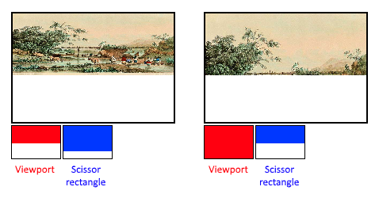

= 고정 함수 (Fixed-function)
include::../common/header.adoc[]
:imagesdir!:

이전 세대의 그래픽 API들은 파이프라인의 대부분의 단계에 기본값(default state)을 자동으로 제공했습니다. 하지만 {vk}에서는 거의 모든 파이프라인 상태를 개발자가 직접 명시해야 합니다. 한 번 설정된 파이프라인 상태는 변경할 수 없는 고정 객체(immutable object)로 굳어지기 때문입니다. 따라서 이번 장에서는 이 고정 기능(fixed-function) 단계들을 구성하는 모든 구조체를 하나씩 직접 채워보겠습니다.

== 동적 상태 (Dynamic state)

대부분의 파이프라인 상태는 파이프라인 생성 시점에 고정되어야 하지만, 몇몇 특정 상태들은 파이프라인을 다시 만들지 않고도 그리기(draw) 직전에 자유롭게 변경할 수 있습니다. 대표적인 예로 뷰포트(viewport) 크기, 선 두께(line width), 블렌드 상수(blend constants) 등이 있습니다. 이처럼 특정 설정을 파이프라인에 고정하지 않고 동적으로 제어하고 싶다면, 다음과 같이 {VkPipelineDynamicStateCreateInfo}[``VkPipelineDynamicStateCreateInfo``] 구조체를 채워주어야 합니다.

[soruce,cpp]
----
std::vector<VkDynamicState> dynamicStates = {
    VK_DYNAMIC_STATE_VIEWPORT,
    VK_DYNAMIC_STATE_SCISSOR,
};

VkPipelineDynamicStateCreateInfo dynamicState{
    .sType = VK_STRUCTURE_TYPE_PIPELINE_DYNAMIC_STATE_CREATE_INFO,
    .pNext = nullptr,
    .dynamicStateCount = static_cast<uint32_t>(dynamicStates.size()),
    .pDynamicStates = dynamicStates.data(),
};
----

이렇게 설정하면 파이프라인 생성 시 해당 값들의 초기화 과정은 건너뛰게 되며, 대신 그리기 명령을 내릴 때 반드시 실제 값을 직접 지정해 주어야 합니다. 이 방식을 사용하면 구조가 훨씬 유연해집니다. 특히 뷰포트나 시저(scissor) 상태처럼 상황에 따라 자주 변하는 설정의 경우, 파이프라인에 고정해 두면 구조가 불필요하게 복잡해지기 때문에 실무에서 동적 상태로 매우 자주 쓰입니다.

== 정점 입력 (Vertex input)

{VkPipelineVertexInputStateCreateInfo}[``VkPipelineVertexInputStateCreateInfo``] 구조체는 정점 셰이더(vertex shader)로 전달할 정점 데이터의 형식을 정의합니다. 데이터의 형태는 크게 다음 두 가지 방식으로 서술합니다.

* 바인딩 (Bindings): 데이터 간의 간격(인덱스 증가 시 메모리 이동 거리)과, 이 데이터를 정점마다 처리할지 또는 인스턴스마다 처리할지(link:https://en.wikipedia.org/wiki/Geometry_instancing[인스턴싱] 참고) 결정합니다.
* 속성 정의 (Attribute descriptions): 정점 셰이더로 넘어가는 데이터의 자료형(타입)을 지정하고, 해당 데이터를 몇 번 바인딩에서 읽어올지, 그리고 메모리 시작 시점에서 얼마나 떨어진 위치(오프셋)에 있는지 설정합니다.

이번 예제에서는 정점 데이터를 정점 셰이더 내부에 직접 하드코딩하여 사용할 예정입니다. 따라서 지금은 불러올 정점 데이터가 없다는 의미로 이 구조체를 비워두고 넘어가겠습니다. 자세한 데이터 전달 방법은 이후 정점 버퍼(vertex buffer) 단원에서 다시 자세히 다루겠습니다.

[source,cpp]
----
VkPipelineVertexInputStateCreateInfo vertexInputInfo{
    .sType = VK_STRUCTURE_TYPE_PIPELINE_VERTEX_INPUT_STATE_CREATE_INFO,
    .pNext = nullptr,
    .vertexBindingDescriptionCount = 0,
    .pVertexBindingDescriptions = nullptr, // Optional
    .vertextAttributeDescriptionCount = 0,
    .pVertexAttributeDescriptions = nullptr, // Optional
};
----

``pVertexBindingDescriptions``와 ``pVertexAttributeDescriptions`` 멤버는 방석 기술한 정점 데이터 로딩 방식을 정의하는 구조체 배열을 가리키는 포인터입니다. 이제 이 구조체를 ``createGraphicsPipeline`` 함수 안에서 ``shaderStages`` 배열 바로 다음 위치에 추가해 주면 됩니다.

== 입력 데이터 조립 (Input assembly)

{VkPipelineInputAssemblyStateCreateInfo}[``VkPipelineInputAssemblyStateCreateInfo``] 구조체는 크게 두 가지를 정의합니다. 하나는 정점들을 조합해 어떤 종류의 기하학적 도형(도형 토폴로지)을 그릴 것인지이며, 다른 하나는 프리미티브 재시작(primitive restart) 기능을 켤지 여부입니다. 그릴 도형의 종류는 ``topology`` 멤버로 지정하며, 다음과 같은 설정값들을 사용할 수 있습니다.

[cols="4a,6",options=header]
|===
|열거형
|설명

|``VK_PRIMITIVE_TOPOLOGY_POINT_LIST``
|각 정점을 독립된 점으로 그립니다.

|``VK_PRIMITIVE_TOPOLOGY_LINE_LIST``
|정점 2개씩 쌍을 묶어 독립된 선분들로 연결합니다. (정점 재사용 없음)

|``VK_PRIMITIVE_TOPOLOGY_LINE_STRIP``
|이전에 그린 선분의 끝점을 다음 선분의 시작점으로 이어 가며 연속된 선을 그립니다.

|``VK_PRIMITIVE_TOPOLOGY_TRIANGLE_LIST``
|정점 3개씩 묶어 독립된 삼각형들로 그립니다. (정점 재사용 없음)

|``VK_PRIMITIVE_TOPOLOGY_TRIANGLE_STRIP``
|직전 삼각형의 두 번째와 세 번째 정점을 다음 삼각형의 첫 번째와 두 번째 정점으로 재사용하며 연속된 삼각형들을 그려 나갑니다.
|===

기본적으로 정점들은 정점 버퍼에 저장된 순서대로 차례차례 불러옵니다. 하지만 엘리먼트 버퍼(인덱스 버퍼)를 사용하면 정점을 불러올 순서를 개발자가 원하는 대로 직접 지정할 수 있습니다. 이 방식을 활용하면 중복되는 정점을 재사용하는 등의 최적화가 가능합니다. 만약 ``primitiveRestartEnable`` 멤버를 ``VK_TRUE``로 설정하면, 연속해서 도형을 이어 그리는 ``_STRIP`` 모드에서 ``0xFFFF``나 ``0xFFFFFFFF`` 같은 특수한 인덱스 값을 신호로 주어 선이나 삼각형의 연결을 끊고 새로 시작할 수 있습니다.

이번 튜토리얼 전체 과정에서는 삼각형을 그리는 것이 목적이므로, 이 구조체의 설정을 다음과 같이 지정하여 사용하겠습니다.

[source,cpp]
----
VkPipelineInputAssemblyStateCreateInfo inputAssembly{
    .sType = VK_STRUCTURE_TYPE_PIPELINE_INPUT_ASSEMBLY_STATE_CREATE_INFO,
    .pNext = nullptr,
    .topology = VK_PRIMITIVE_TOPOLOGY_TRIANGLE_LIST,
    .primitiveRestartEnable = VK_FALSE,
};
----

== 뷰포트와 시저 (Viewports and scissors)

뷰포트는 쉽게 말해 최종 출력물이 렌더링될 프레임버퍼의 창 영역을 정의합니다. 대부분의 경우 화면의 왼쪽 위 구석인 ``(0, 0)``부터 화면의 ``(가로, 세로)`` 크기까지 전체 영역으로 지정하며, 이번 튜토리얼에서도 마찬가지로 전체 영역을 사용합니다.

[source,cpp]
----
VkViewport viewport{
    .x = 0.0f,
    .y = 0.0f,
    .width = static_cast<float>(_swapChainExtent.width),
    .height = static_cast<float>(_swapChainExtent.height),
    .minDepth = 0.0f,
    .maxDepth = 1.0f,
};
----

여기서 한 가지 기억할 점은, 스왑 체인(swap chain)과 그 내부 이미지들의 크기가 처음에 설정한 창의 ``가로(WIDTH)``·``세로(HEIGHT)`` 크기와 간혹 다를 수 있다는 것입니다. 나중에 스왑 체인 이미지들이 그대로 프레임버퍼로 쓰이기 때문에, **창 크기가 아니라 스왑 체인의 실제 크기를 기준으로 맞춰야 안전**합니다.

``minDepth``와 ``maxDepth``는 프레임버퍼에서 사용할 깊이(depth) 값의 범위를 지정합니다. 기본적으로 ``[0.0f, 1.0f]`` 범위 내에 있어야 하며, 독특하게도 ``minDepth``를 ``maxDepth``보다 더 큰 값으로 설정하는 것도 가능합니다. 특별한 효과를 내려는 게 아니라면, 표준 값인 ``0.0f``와 ``1.0f``를 그대로 사용하는 것이 무난합니다.

뷰포트가 이미지를 프레임버퍼 화면에 맞추는 '변환(transformation)' 역할을 한다면, 시저 사각형(scissor rectangles)은 픽셀이 실제로 저장될 '영역(region)'을 제한합니다. 시저 사각형을 벗어나는 모든 픽셀은 래스터라이저 단계에서 가차 없이 버려집니다. 즉, 변환을 거치는 게 아니라 특정 영역만 통과시키는 필터처럼 작동합니다. 원본 이미지와 비교했을 때, 시저 사각형이 뷰포트보다 크기만 하다면 최종 결과물에는 아무런 영향을 주지 않습니다.

따라서 프레임버퍼 전체 영역에 온전히 그림을 그리려면, 화면 전체를 덮도록 시저 사각형을 다음과 같이 지정해야 합니다.

[source,cpp]
----
VkRect2D scissor{
    .offset = {0, 0},
    .extent = _swapChainExtent,
};
----

뷰포트와 시저 사각형은 파이프라인 생성 시점에 미리 고정(static)해 둘 수도 있고, 커맨드 버퍼를 통해 언제든 바꿀 수 있는 동적 상태(link:./FixedFunctions.html#_동적_상태_dynamic_state[dynamic state])로 켤 수도 있습니다. 전자가 다른 파이프라인 설정들의 고정적인 특징과 일맥상통하지만, 실무에서는 유연성이 훨씬 뛰어난 동적 상태로 설정하는 것이 훨씬 편리합니다. 실제로도 매우 대중적인 방식이며, 모든 그래픽 카드 하드웨어에서 성능 저하 없이 이 동적 상태를 완벽하게 지원합니다.

만약 동적 뷰포트와 시저 사각형을 쓰고 싶다면, 먼저 파이프라인 생성 시점에 해당 기능들을 동적 상태로 활성화해 주어야 합니다.

[source,cpp]
----
std::vector<VkDynamicState> dynamicStates = {
    VK_DYNAMIC_STATE_VIEWPORT,
    VK_DYNAMIC_STATE_SCISSOR,
};

VkPipelineDynamicStateCreateInfo dynamicState{
    .sType = VK_STRUCTURE_TYPE_PIPELINE_DYNAMIC_STATE_CREATE_INFO,
    .pNext = nullptr,
    .dynamicStateCount = static_cast<uint32_t>(dynamicState.size()),
    .pDynamicStates = dynamicStates,
};
----

이렇게 동적 상태를 켜 두면, 파이프라인을 만들 때는 사용할 뷰포트와 시저의 '개수'만 가볍게 지정해 주면 끝납니다.

[source,cpp]
----
VkPipelineViewportStateCreateInfo viewportState{
    .sType = VK_STRUCTURE_TYPE_PIPELINE_VIEWPORT_STATE_CREAT_INFO,
    .pNext = nullptr,
    .viewportCount = 1,
    .scissorCount = 1,
};
----

그리고 실제 구체적인 뷰포트 크기와 시저 영역 좌표는 나중에 그리기 명령을 내리는 시점에 실시간으로 채워 넣게 됩니다.

동적 상태를 활용하면 심지어 단 하나의 커맨드 버퍼 안에서도 서로 다른 여러 개의 뷰포트나 시저 사각형을 번갈아 가며 적용할 수도 있습니다.

반대로 동적 상태를 쓰지 않는다면, 파이프라인을 만들 때 {VkPipelineViewportStateCreateInfo}[``VkPipelineViewportStateCreateInfo``] 구조체에 실제 뷰포트와 시저 값을 직접 통째로 넘겨야 합니다. 이렇게 되면 이 파이프라인의 뷰포트와 시저는 완전히 고정(immutable)되어 버립니다. 만약 창 크기가 바뀌는 등의 이유로 이 값들을 조금이라도 수정해야 한다면, 새로운 값을 적용한 파이프라인 객체를 완전히 처음부터 다시 생성해야만 합니다.

[source,cpp]
----
VkPipelineViewportStateCreateInfo viewportState{
    .sType = VK_STRUCTURE_TYPE_PIPELINE_VIEWPORT_STATE_CREATE_INFO,
    .pNext = nullptr,
    .viewportCount = 1,
    pViewports = &viewport,
    scissorCount = 1,
    pScissors = &scissor,
};
----

어떤 방식을 선택하든, 최신 그래픽 카드 중에는 여러 개의 뷰포트와 시저 사각형을 동시에 띄워 놓고 쓸 수 있는 제품들이 있습니다. 이 때문에 구조체 멤버 이름들이 단수형이 아니라 배열 형태를 가리키도록 설계되어 있습니다. 다만 여러 개의 멀티 뷰포트를 사용하려면 장치 생성 시점에 특정 GPU 기능(feature)을 명시적으로 활성화해야 합니다.

== 래스터라이저 (Rasterizer)

래스터라이저는 정점 셰이더(vertex shader)를 거쳐 형태가 잡힌 기하학적 도형을 받아, 프래그먼트 셰이더(fragment shader)가 색을 입힐 수 있도록 픽셀 단위의 '프래그먼트(fragment)'로 쪼개는 역할을 합니다. 또한 깊이 테스트(link:https://en.wikipedia.org/wiki/Z-buffering[depth testing]), 페이스 컬링(link:https://en.wikipedia.org/wiki/Back-face_culling[face culling]), 시저 테스트(scissor test) 등을 수행하며, 도형 내부를 프래그먼트로 가득 채울지 아니면 외곽선만 그릴지(와이어프레임 렌더링) 설정할 수도 있습니다. 이 모든 세부 설정은 {VkPipelineRasterizationStateCreateInfo}[``VkPipelineRasterizationStateCreateInfo``] 구조체를 통해 제어합니다.

[source,cpp]
----
VkPipelineRasterizationStateCreateInfo rasterizer{
    .sType = VK_STRUCTURE_TYPE_PIPELINE_RASTERIZATION_STATE_CREATE_INFO,
    .pNext = nullptr,
    depthClampEnable = VK_FALSE,
};
----

``depthClampEnable``을 ``VK_TRUE``로 설정하면, 카메라의 가시거리인 최소(near) 및 최대(far) 평면을 벗어나는 프래그먼트들을 잘라내서 버리는 대신, 그 경계면의 깊이값으로 고정(clamping)합니다. 이 기능은 그림자 맵(shadow maps) 처럼 특수한 기법을 구현할 때 유용하게 쓰이며, 활성화하려면 별도의 GPU 기능(feature)을 켜야 합니다.

[source,cpp]
----
rasterizer.rasterizerDiscardEnable = VK_FALSE;
----

만약 ``rasterizerDiscardEnable``을 ``VK_TRUE``로 설정하면, 도형 데이터가 래스터라이저 단계를 전혀 통과하지 못하게 됩니다. 결과적으로 프레임버퍼로의 모든 출력이 차단됩니다.

[source,cpp]
----
rasterizer.polygonMode = VK_POLYGON_MODE_FILL;
----

``polygonMode``는 도형을 어떤 형태로 쪼개어 프래그먼트를 생성할지 결정합니다. 사용할 수 있는 모드는 다음과 같습니다.

[cols="4a,6",options=header]
|===
|열거형
|설명

|``VK_POLYGON_MODE_FILL``
|도형의 내부 면적을 프래그먼트로 가득 채웁니다. (일반적인 렌더링 방식)

|``VK_POLYGON_MODE_LINE``
|도형의 외곽선만 선분 형태로 그립니다.

|``VK_POLYGON_MODE_POINT``
|도형의 모서리(정점)들만 점 형태로 그립니다.
|===

내부를 채우는 ``FILL`` 모드 외에 다른 모드(``VK_POLYGON_MODE_LINE``, ``VK_POLYGON_MODE_POINT``)들을 사용하려면 GPU 기능을 따로 활성화해야 합니다.

[source,cpp]
----
rasterizer.lineWidth = 1.0f;
----

``lineWidth`` 멤버는 말 그대로 선의 두께를 프래그먼트 개수(픽셀 단위) 기준으로 지정합니다. 지원되는 최대 선 두께는 그래픽 카드 하드웨어마다 다르며, ``1.0f``보다 두꺼운 선을 그리려면 ``wideLines``라는 GPU 기능을 활성화해야 합니다.

[source,cpp]
----
rasterizer.cullMode = VK_CULL_MODE_BACK_BIT;
rasterizer.frontFace = VK_FRONT_FACE_CLOCKWISE;
----

``cullMode`` 변수는 어떤 면을 화면에서 제외할지(페이스 컬링) 결정합니다. 컬링을 아예 끌 수도 있고, 앞면이나 뒷면, 혹은 양면 모두를 지우도록 설정할 수도 있습니다. ``frontFace`` 변수는 정점이 어떤 방향으로 배열되어 있어야 앞면으로 판정할지 지정하는 옵션이며, 시계 방향(clockwise)이나 반시계 방향(counterclockwise) 중 하나를 선택할 수 있습니다.

[source,cpp]
----
rasterizer.depthBiasEnable = VK_FALSE;
rasterizer.depthBiasConstantFactor = 0.0f; // Optional
rasterizer.depthBiasClamp = 0.0f; // Optional
rasterizer.depthBiasSlopeFactor = 0.0f; // Optional
----

래스터라이저는 상수를 더하거나 프래그먼트의 기울기에 비례하는 가중치를 주어 깊이 값을 의도적으로 왜곡(bias)할 수 있습니다. 이 기법은 주로 그림자 매핑에서 그림자가 깨지는 현상(shadow acne)을 막기 위해 쓰이지만, 이번에는 사용하지 않으므로 ``depthBiasEnable``을 ``VK_FALSE``로 설정하고 넘어가겠습니다.

== 멀티샘플링 (Multisampling)

{VkPipelineMultisampleStateCreateInfo}[``VkPipelineMultisampleStateCreateInfo``] 구조체는 계단 현상을 방지하는 안티앨리어싱(link:https://en.wikipedia.org/wiki/Multisample_anti-aliasing[anti-aliasing]) 기법 중 하나인 멀티샘플링을 설정합니다. 이 방식은 동일한 픽셀 영역에 겹치는 여러 도형들의 프래그먼트 셰이더 연산 결과를 조합하여 작동합니다. 계단 현상은 주로 도형의 외곽선 경계면에서 두드러지게 발생하므로 이 기법 역시 주로 그 경계면에서 효과를 발휘합니다. 하나의 픽셀에 단 하나의 도형만 걸쳐 있는 경우에는 프래그먼트 셰이더를 여러 번 반복해서 실행하지 않기 때문에, 단순히 해상도를 높여서 그린 뒤 크기를 줄이는 방식(다운스케일링)보다 연산 비용이 훨씬 저렴합니다. 다만 이 기능을 켜려면 별도의 GPU 기능(feature)을 활성화해야 합니다.

[source,cpp]
----
VkPipelineMultisampleStateCreateInfo multiSampling{
    .sType = VK_STRUCTURE_TYPE_PIPELINE_MULTISAMPLE_STATE_CREATE_INFO,
    .pNext = nullptr,
    .sampleShadingEnable = VK_FALSE,
    .rasterizationSamples = VK_SAMPLE_COUNT_1_BIT,
    .minSampleShading = 1.0f, // Optional
    .pSampleMask = nullptr, // Optional
    .alphaToCoverageEnable = VK_FALSE, // Optional
    .alphaToOneEnable = VK_FALSE, // Optional
};
----

멀티샘플링은 이후 단원에서 다시 다룰 예정이므로, 지금은 기능을 끈 상태(기본 설정)로 두고 넘어가겠습니다.

== 깊이 및 스텐실 테스트 (Depth and stencil testing)

만약 깊이 버퍼(depth buffer)나 스텐실 버퍼(stencil buffer)를 사용하고 있다면, {VkPipelineDepthStencilStateCreateInfo}[``VkPipelineDepthStencilStateCreateInfo``] 구조체를 통해 깊이 및 스텐실 테스트를 구성해야 합니다. 하지만 지금은 해당 버퍼들을 준비하지 않았으므로, 구조체 주소 대신 간단히 ``nullptr``을 넘겨주면 됩니다. 이 부분은 이후 깊이 버퍼링(depth buffering) 단원에서 다시 자세히 다루겠습니다.

== 색상 블렌딩 (Color blending)

프래그먼트 셰이더가 최종 색상을 반환하고 나면, 이 색상을 프레임버퍼에 이미 기록되어 있는 기존 색상과 어떻게 조합할지 결정해야 합니다. 이 과정을 색상 블렌딩(Color blending)이라고 하며, 크게 다음 두 가지 방식으로 처리할 수 있습니다.

* 기존 값과 새로운 값을 수학적으로 섞어서 최종 색상을 도출하는 방식
* 기존 값과 새로운 값을 비트 연산(bitwise operation)으로 조합하는 방식

{vk}에서 색상 블렌딩을 설정할 때는 두 가지 구조체가 쓰입니다. 첫 번째는 프레임버퍼 개별 타겟(attachment)마다 세부 설정을 맡는 {VkPipelineColorBlendAttachmentState}[``VkPipelineColorBlendAttachmentState``]이고, 두 번째는 파이프라인 전체의 전역 블렌딩 옵션을 다루는 {VkPipelineColorBlendStateCreateInfo}[``VkPipelineColorBlendStateCreateInfo``]입니다. 이번 예제에서는 단 하나의 프레임버퍼만 사용하므로 다음과 같이 설정합니다.

[source,cpp]
----
VkPipelineColorBlendAttachmentState colorBlendAttachment{
    .colorWriteMask = VK_COLOR_COMPONENT_R_BIT | VK_COLOR_COMPONENT_G_BIT | VK_COLOR_COMPONENT_B_BIT | VK_COLOR_COMPONENT_A_BIT,
    .blendEnable = VK_FALSE,
    .srcColorBlendFactor = VK_BLEND_FACTOR_ONE, // Optional
    .dstColorBlendFactor = VK_BLEND_FACTOR_ZERO, // Optional
    .colorBlendOp = VK_BLEND_OP_ADD, // Optional
    .srcAlphaBlendFactor = VK_BLEND_FACTOR_ONE, // Optional
    .dstAlphaBlendFactor = VK_BLEND_FACTOR_ZERO, // Optional
    .alphaBlendOp = VK_BLEND_OP_ADD,
};
----

이 개별 프레임버퍼 설정 구조체는 앞서 말한 첫 번째 방식(수학적으로 섞는 방식)을 제어합니다. 내부적으로 어떤 연산이 일어나는지는 다음의 의사코드(pseudocode) 흐름을 보시면 쉽게 이해할 수 있습니다.

[source,cpp]
----
if (blendEnable) {
    finalColor.rgb = (srcColorBlendFactor * newColor.rgb) <colorBlendOp> (dstColorBlendFactor * oldColor.rgb);
    finalColor.a = (srcAlphaBlendFactor * newColor.a) <alphaBlendOp> (dstAlphaBlendFactor * oldColor.a);
} else {
    finalColor = newColor;
}

finalColor = finalColor & colorWriteMask;
----

만약 ``blendEnable``을 ``VK_FALSE``로 두면 셰이더가 계산한 새 색상이 아무런 가공 없이 그대로 덮어써집니다. 반대로 이 값을 켜면 두 색상을 지정된 공식에 따라 섞는 연산이 수행됩니다. 이렇게 도출된 최종 색상은 마지막으로 ``colorWriteMask``와 AND 비트 연산을 거쳐, 실제로 어떤 색상 채널(R, G, B, A)에만 값을 기록할지 최종 결정합니다.

가장 대중적인 블렌딩 활용법은 불투명도(알파값)에 따라 앞뒤 색을 자연스럽게 섞는 알파 블렌딩(Alpha blending)입니다. 이때 우리가 원하는 최종 색상(finalColor)의 형태는 다음과 같습니다.

[source,cpp]
----
finalColor.rgb = newAlpha * newColor + (1 - newAlpha) * oldColor;
finalColor.a = newAlpha.a;
----

이 설정을 그대로 구현하려면 구조체의 파라미터들을 다음과 같이 매칭해 주어야 합니다.

[source,cpp]
----
colorBlendAttachment.blendEnable = VK_TRUE;
colorBlendAttachment.srcColorBlendFactor = VK_BLEND_FACTOR_SRC_ALPHA;
colorBlendAttachment.dstColorBlendFactor = VK_BLEND_FACTOR_ONE_MINUS_SRC_ALPHA;
colorBlendAttachment.colorBlendOp = VK_BLEND_OP_ADD;
colorBlendAttachment.srcAlphaBlendFactor = VK_BLEND_FACTOR_ONE;
colorBlendAttachment.dstAlphaBlendFactor = VK_BLEND_FACTOR_ZERO;
colorBlendAttachment.alphaBlendOp = VK_BLEND_OP_ADD;
----

지원되는 모든 블렌딩 방식과 연산 공식은 {vk} 명세서(Specification)의 {VkBlendFactor}[``VkBlendFactor``] 및 {VkBlendOp}[``VkBlendOp``] 열거형 항목에서 확인하실 수 있습니다.

두 번째 구조체는 앞서 설정한 개별 프레임버퍼 구조체들의 배열을 가리키며, 상술한 블렌딩 공식에서 가중치(인자)로 활용할 수 있는 전역 블렌드 상수(blend constants)를 지정하는 역할도 합니다.

[source,cpp]
----
VkPipelineColorBlendStateCreateInfo colorBlending{
    .sType = VK_STRUCTURE_TYPE_PIPELINE_COLOR_BLEND_STATE_CREATE_INFO,
    .pNext = nullptr,
    .logicOpEnable = VK_FALSE,
    .logicOp = VK_LOGIC_OP_COPY, // Optional
    .attachmentCount = 1,
    .pAttachments = &colorBlendAttachment,
    .blendConstants[0] = 0.0f, // Optional
    .blendConstants[1] = 0.0f, // Optional
    .blendConstants[2] = 0.0f, // Optional
    .blendConstants[3] = 0.0f, // Optional
};
----

만약 첫 번째 방식 대신 두 번째 방식인 비트 연산 조합을 쓰고 싶다면, ``logicOpEnable``을 ``VK_TRUE``로 설정하고 ``logicOp`` 필드에 원하는 비트 연산 종류를 지정하면 됩니다. 주의할 점은 비트 연산을 켜는 순간, 모든 개별 프레임버퍼의 ``blendEnable``을 ``VK_FALSE``로 둔 것처럼 첫 번째 방식의 수학적 블렌딩은 자동으로 비활성화된다는 것입니다. 이 모드에서도 ``colorWriteMask``는 프레임버퍼의 어느 채널에 연산 결과를 반영할지 결정하는 필터로 작동합니다. 물론 이번 예제처럼 두 가지 블렌딩 모드를 모두 꺼두는 것도 가능하며, 이 경우 셰이더가 출력한 색상이 아무런 변형 없이 프레임버퍼에 그대로 저장됩니다.

== 파이프라인 레이아웃 (Pipeline layout)

셰이더 내부에서는 전역 변수와 유사한 유니폼(``uniform``) 값을 사용할 수 있습니다. 유니폼 값은 앞서 다룬 동적 상태 변수들처럼 그리기 직전에 언제든 바꿀 수 있어서, 파이프라인을 다시 만들지 않고도 셰이더의 동작을 실시간으로 제어할 수 있게 해줍니다. 보통 정점 셰이더에 변환 행렬(transformation matrix)을 넘겨주거나, 프래그먼트 셰이더에서 텍스처 샘플러(texture samplers)를 생성할 때 자주 쓰입니다.

이러한 유니폼 값들을 활용하려면 파이프라인을 생성하는 시점에 {VkPipelineLayout}[``VkPipelineLayout``] 객체를 미리 만들어 어떤 데이터들이 오갈지 정의해 두어야 합니다. 이번 단원에서는 유니폼 값을 다루지 않지만, {vk} 구조상 비어 있는 형태의 파이프라인 레이아웃이라도 반드시 생성해서 연결해 주어야 합니다.

나중에 다른 함수에서도 이 객체를 계속 참조해야 하므로, 우선 클래스 멤버 변수로 선언해 둡니다.

[source,cpp]
----
VkPipelineLayout _pipelineLayout;
----

그다음 ``createGraphicsPipeline`` 함수 내부에서 다음과 같이 객체를 생성합니다.

[source,cpp]
----
VkPipelineLayoutCreateInfo pipelineLayoutInfo{
    .sType = VK_STRUCTURE_TYPE_PIPELINE_LAYOUT_CREATE_INFO,
    .pNext = nullptr,
    .setLayoutCount = 0, // Optional
    .pSetLayouts = nullptr, // Optional
    .pushConstantRangeCount = 0, // Optional
    .pPushConstantRanges = nullptr, // Optional
};

if (vkCreatePipelineLayout(_device, &pipelineLayoutInfo, nullptr, &_pipelineLayout) != VK_SUCCESS) {
    throw std::runtime_error("failed to create pipeline layout!");
}
----

이 구조체에서는 푸시 상수(push constants)라는 것도 설정할 수 있는데, 이는 유니폼 외에 셰이더에 동적인 값을 빠르게 넘기는 또 다른 방법이며 추후 단원에서 다룰 기회가 있을 것입니다. 파이프라인 레이아웃은 프로그램이 실행되는 내내 계속 사용되므로, 프로그램이 종료되는 시점에 다음과 같이 안전하게 해제해 주어야 합니다.

[source,cpp]
----
void cleanup() {
    vkDestroyPipelineLayout(_device, _pipelineLayout, nullptr);
    ...
}
----

== {conclusion}

이것으로 고정 기능(fixed-function) 단계들을 설정하는 긴 과정이 모두 끝났습니다! 맨땅에서 이 모든 상태를 하나하나 직접 구성하는 것이 꽤나 번거롭고 고된 작업이지만, 덕분에 우리는 그래픽스 파이프라인 내부에서 어떤 일들이 벌어지는지 완벽하게 파악할 수 있게 되었습니다! 특정 컴포넌트의 기본값(default state)이 예상과 달라 원인 모를 버그나 렌더링 오류로 야기되는 예기치 못한 상황들을 사전에 차단할 수 있다는 점이 바로 {vk} 방식의 큰 장점입니다.

다만, 마침내 그래픽스 파이프라인을 온전히 완성하기 전에 딱 하나 더 만들어야 할 객체가 남아있는데, 그것이 바로 렌더 패스(link:./RenderPasses.html[render pass])입니다.