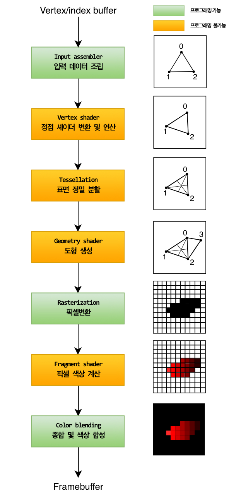

= 들어가며 (Introduction)
include::../common/header.adoc[]
:imagesdir!:
:fn-normal-line: footnote:[Normal line, 法線 : 곡선상의 한 점을 지나고, 이 점의 접선에 수직인 직선. 또는, 곡면상의 한 점을 지나고, 이 점의 접평면(接平面)에 수직인 직선.]

다음 몇 챕터 동안 우리는 첫 번째 삼각형을 그리도록 구성된 {gpl}을 설정합니다. {gpl}은 렌더 타겟의 픽셀까지 메쉬의 꼭지점과 텍스처를 취하는 일련의 작업입니다. 아래에 단순화 된 개요가 표시됩니다(출처 : link:https://vulkan-tutorial.com/Drawing_a_triangle/Graphics_pipeline_basics/Introduction[Vulkan Tutorial]).

[NOTE]
====
* 원본 이미지를 이해하기 위해 약간 수정함
* 각 단계별 설명은 원문과 다르게 소제목으로 분류해서 번역함
* 원문을 같이 첨부하며, 부가적인 내용은 별도로 표시
====

== 입력 데이터 조립 (Input assembler)

입력 데이터 조립은 지정한 버퍼에서 원시 정점 데이터를 수집하고 인덱스 버퍼를 사용하여 정점 데이터 자체를 복제하지 않고도 특정 요소를 반복할 수도 있습니다.

[quote,Vulkan Tutorial]
____
The input assembler collects the raw vertex data from the buffers you specify and may also use an index buffer to repeat certain elements without having to replicate the vertex data itself.
____

=== 자료 조사 (Goolgle, AI mode 응답)

* 한 줄 정의 : CPU가 넘겨준 가공되지 않은 메모리 데이터(정점 배열)를 읽어와, GPU가 이해할 수 있는 초기 단위로 조립하는 단계 입니다.
* 특징 : 개발자가 작성한 셰이더 코드가 실행되는 단계가 아닌, GPU가 고정된 기능으로 처리하는 고정 함수(Fixed-function) 단계 입니다.

Input assembler 단계는 크게 두 가지 작업을 수행합니다.

==== 1. 정점 데이터 수집 (Fetch Vertex Data)

* Vulkan buffer 읽기 : CPU가 메모리(Vulkan buffer)에 저정해 둔 정점(Vertex) 데이터들의 위치, 색상, 텍스처 좌표(UV) 등의 스트림을 순서대로 읽어옵니다.
* Index buffer 활용 : 만약 인덱스 버퍼를 사용한다면, 정점 데이터의 중복을 피하기 위해 인덱스 번호를 참조하여 필요한 정점만 골라 처리 효율을 높입니다.

==== 2. 기본 도형 조립 (Primitive Assembly)

단순한 점들의 나열을 설정된 위상(Topology)에 맞춰 선이나 삼각형 같은 기하학적 도형으로 묶어줍니다. 대표적인 위상 설정은 다음과 같습니다.

* Point list : 각 정점을 독립된 하나의 **점**으로 취급 합니다.
* Line list / Line strip : 정점을 두 개씩 이어 **선**으로 만들거나, 줄지어 이어지는 선을 만듭니다.
* Triangle list : 정점을 3개씩 묶어 독립된 **삼각형**을 만듭니다(3D 그래픽에서 가장 많이 사용).
* Patch list : 표면 정밀 분할(__Tessellation__) 단계로 데이터를 보낼 때 사용하는 특수한 제어점(Control point)의 집합 입니다.

== 정점 셰이더 변환 및 연산 (Vertex shader)

정점 셰이더는 모든 정점에 대해 실행되며 일반적으로 모델 공간에서 화면 공간으로 정점 위치를 전환하기 위해 변환을 적용합니다. 또한 최신 데이터를 파이프 라인 아래로 전달합니다.

[quote,Vulkan Tutorial]
____
The vertex shader is run for every vertex and generally applies transformations to turn vertex positions from model space to screen space. It also passes per-vertex data down the pipeline.
____

=== 자료 조사 (Google, AI mode 응답)

* 한 줄 정의 : 입력 어셈블러가 조립해 준 각각의 정점(Vertex) 위치를 3D 가상 공간 안에서 알맞은 위치로 변환하고, 정점별 속성(색상, 텍스처 좌표 등)을 계산하는 단계입니다.
* 특징 : 모든 정점은 서로 독립적이며, GPU의 수많은 코어가 각 정점을 병렬로 처리합니다(예 : 정점이 1만 개가 있을 경우 1만 번 수행됨).

Vertex shader의 가장 주요한 임무는 **공간 변환**과 **데이터 전달** 입니다.

==== 1. 3D 공간 좌표 변환 (MVP 행렬 연산)

[CAUTION]
====
뭔가 게임엔진 위주로 설명을 해서 이 부분은 추후 재조사 필요함
====

3D 모델 데이터는 고유의 중심점을 기준으로 한 좌표(로컬 공간)로 저장되어 있습니다. 이를 모니터 화면(2D 클립 공간)에 그리기 위해 수학적 변환 연산을 거칩니다. 보통 **MVP 행렬**을 정점 좌표에 곱해 수행합니다.

* Model(모델 변환) : 물체를 게임 월드의 특정 위치로 옮기고, 회전시키고, 크기를 키웁니다(local -> world).
* View(뷰 변환) : 카메라의 위치와 각도를 기준으로 세상을 재배치 합니다(world -> view / camera).
* Projection(투영 변환) : 원근감을 적용하여 3D 공간을 2D 화면 안의 사각 공간으로 찌그러뜨립니다(view -> clip).

==== 2. 정점 속성 가공 및 전달 (Per-Vertex Attribute)

정점이 가진 추가 정보를 가공하여 다음 파이프라인 단계로 넘겨줍니다.

* ##법선{fn-normal-line} 벡터 변환## : 빛 계산을 위해 정점이 바라보는 방향(느낌)을 월드 공간에 맞게 변환합니다.
* 텍스처 좌표(UV) 전달 : 이미지를 입힐 좌표를 그대로 다음 단계로 토스합니다.

== 표면 정밀 분할 (Tessellation)

테셀레이션 셰이더를 사용하면 메쉬 품질을 높이기 위해 특정 규칙에 따라 지오메트리를 세분화할 수 있습니다. 이것은 종종 벽돌 벽과 계단과 같은 표면을 근처에있을 때 덜 평평하게 보이게하는 데 사용됩니다.

[quote,Vulkan Tutorial]
____
The tessellation shaders allow you to subdivide geometry based on certain rules to increase the mesh quality. This is often used to make surfaces like brick walls and staircases look less flat when they are nearby.
____

=== 자료 조사 (Google, AI mode 응답)

* 한 줄 정의 : 정점 셰이더가 너겨준 거진 도형(Patch)을 받아서, 설정된 밀도에 따라 **수많은 작은 삼각형으로 자동 분할**하여 정밀한 입체감을 만드는 단계입니다.
* 존재 이유 : 처음부터 정점이 수백만 개인 고해상도 모델을 쓰면 메모리와 전송 대역폭이 버티지 못합니다. 따라서 메모리에는 가벼운 모델(**Low-poly**)만 올리고, 화면에 가까워질 때만 **GPU가 실시간으로 정점을 늘려** 효율성을 극대화합니다.
* 구성 : 하드웨어 고정 기능과 프로그래밍 가능한 2개의 셰이더를 포함해 **총 3개의 세부 단계**로 이루어져 있습니다.

이 단계는 3D 그래픽의 혁신 중 하나로, CPU의 간섭 없이 **GPU 내부에서 스스로 다각형을 잘게 쪼개어 그래픽의 디테일을 폭발적으로 끌어올리는 프로그래밍 가능 단계**입니다.
Tessellation은 파이프라인 내부에서 다음과 같은 순서로 정밀 분할을 수행합니다.

==== 1. 테셀레이션 제어 셰이더 (Tessellation Control Shader, TCS)

* 역할 : "도형을 얼마나 잘게 쪼갤 것인가?"를 결정합니다.
* 상세 : 입력 어셈블러로부터 전달받은 제어점(Control Point)들을 가공하고, 테셀레이션 레벨(Tessellation level, 분할 빈도)을 계산하여 하드웨어 분할기에 전달합니다.
* 활용 : 카메라와 물체의 거리를 계산하여, 가까운 물체는 세밀하게(tessellation level을 높게), 먼 물체는 뭉툭하게(tessellation level을 낮게) 쪼개도록 동적으로 조절합니다(LOD 기법)

==== 2. 테셀레이션 원시형 생성기 (Tessellation Primitive Generator, TPG)

* 역할 : 하드웨어가 고정 기능(Fixed-function)으로 실제 분할을 수행하는 장소입니다.
* 상세 : 앞서 TCS(Tessellation Control Shader)가 정해준 분할 레벨에 맞춰, 패치 영역을 수많은 점과 선, 삼각형 격자로 사정없이(ㅋㅋㅋ) 조각냅니다. 이 단계는 프로그램을 할 수 없으며, GPU가 하드웨어적으로 매우 빠르게 처리합니다.

==== 3. 테셀레이션 평가 셰이더 (Tessellation Evaluation Shader, TES)

* 역할 : "새롭게 생성된 정점들의 최종 위치"를 결정합니다.
* 상세 : 원시형 생성기가 쪼개놓은 수많은 정점의 논리적 위치를 받아, 실제 3D 공간의 물리적인 좌표(Position)로 변환합니다. 정점 셰이더의 역할을 분할된 정점들에 대해 대신 수행한다고 보시면 됩니다.
* 핵심 활용(디스플레이먼트 매핑) : 밋밋하게 쪼개지기만 한 표졈에 흑백 높낮이 지도(Height Map)를 적용하여 정점들을 실제로 위아래로 튀어나오게 만듭니다. 이를 통해 울퉁불퉁한 돌벽, 거친 땅, 잔 물결 등을 완벽한 입체로 표현합니다.

== 기하 셰이더 (Geometry Shader)

기하학 셰이더는 모든 원시(삼각형, 선, 점)에서 실행되며, 그것을 버리거나 들어온 것보다 더 많은 원시를 출력할 수 있습니다. 이것은 테셀레이션 셰이더와 유사하지만 훨씬 더 유연합니다. 그러나 인텔의 통합 GPU를 제외한 대부분의 그래픽 카드에서 성능이 좋지 않기 때문에 오늘날의 응용 프로그램에서 많이 사용되지 않습니다.

[quote,Vulkan Tutorial]
____
The geometry shader is run on every primitive (triangle, line, point) and can discard it or output more primitives than came in. This is similar to the tessellation shader, but much more flexible. However, it is not used much in today's applications because the performance is not that good on most graphics cards except for Intel's integrated GPUs.
____

=== 자료 조사 (Google, AI mode 응답)

기하 셰이더는 정점 셰이더(Vertex shader)나 테셀레이션(Tessellation) 단계를 거쳐온 완성된 도형(점, 선, 삼각형) 하나를 통째로 입력받아, 이를 수정하거나 완전히 새로운 도형으로 변형/복제할 수 있는 **프로그래밍 가능 단계**입니다.

* 한 줄 정의 : 이미 만들어진 기본 도형(Primitive)을 통째로 넘겨받아, 이를 파괴하거나 완전히 새로운 도형들을 실시간으로 창조해내는 단계 입니다.
* 특징 : 앞선 단게들은 정점 1개를 받아 정점 1개를 출력했지만, 기하 셰이더는 **삼각형 1개를 받아서 점 0개를 출력(소멸)할 수도 있고, 점/선/삼각형 수십 개를 출력(생성)**할 수도 있습니다.
* 주의점 : GPU 내부의 메모리 대역폭을 많이 소모하는 경향이 있어, 최신 그래픽스(Vulkan / Direct 12 이후)에서는 성능 최적화를 위해 메쉬 셰이더(Mesh shader)등으로 대체되는 추세이지만, 특정 기능 구현에는 여전히 매우 강력합니다.

==== 1. 완전히 새로운 기하 구조 생성 (Geometry Generation)

* 입자(Particle) 효과 : 단 하나의 **점(Point)** 데이터만 입력받은 뒤, 기하 셰이더 안에서 사각형 판(삼각형 2개)으로 확장시켜 불꽃, 연기, 눈송이 같은 파티글을 순식간에 생성합니다(이를 빌보드 기법이라고 합니다).
* 머리카락 / 풀(Grass) 시뮬레이션 : 캐릭터의 두피나 지형의 정점(삼각형)들을 기반으로, 기하 셰이더가 수많은 선(Line)을 뽑아내고 실시간으로 무성한 풀밭이나 머리카락을 자라나게 만듭니다.

==== 2. 프리미티브 소멸 및 변형

* 와이어프레임 연산 : 삼각형의 내부에 선을 추가로 그려 물체의 뼈대(Wireframe)를 표현합니다.
* 폭발 효과(Explosion) : 게임에서 오브젝트가 터질 때, 삼각형들을 각자의 법선 벡터 방향으로 튕겨나가게 연산하여 물체가 조각조각 부서져 흩어지는 연출을 합니다.

==== 3. 레이어드 렌더링 (큐브맵 / 그림자 매핑)

* 하나의 삼각형을 입력받아 카메라 6개 방향(큐브맵의 6개 면)으로 동시에 복제하여 보낼 수 있습니다. 이를 통해 동적 **환경 매핑이나 3D 점광원의 그림자(Shadow map)를 단 한번의 패스로 빠르게 생성** 합니다.

[CAUTION]
====
무슨 말인지 이해가 안됨. 추가 조사 필요
====

=== 픽셀 변환 (Rasterization)

래스터레이션 단계는 원시를 단편으로 구분합니다. 이들은 framebuffer에서 채우는 픽셀 요소입니다. 화면 외부에 떨어지는 모든 조각은 폐기되고 정점 셰이더에 의해 출력된 속성은 그림과 같이 조각 전체에 걸쳐 보간됩니다. 일반적으로 다른 원시 조각 뒤에있는 조각은 깊이 테스트 때문에 여기에서 폐기됩니다.

[quote, Vulkan tutorial]
____
The rasterization stage discretizes the primitives into fragments. These are the pixel elements that they fill on the framebuffer. Any fragments that fall outside the screen are discarded and the attributes outputted by the vertex shader are interpolated across the fragments, as shown in the figure. Usually the fragments that are behind other primitive fragments are also discarded here because of depth testing.
____

=== 자료 조사 (Google, AI mode 응답)

이 단계는 정점과 선으로 이루어진 3D 수학적 공각(벡터 데이터)을 우리가 사용하는 모니터 화면의 **2D 픽셀 격자(디지털 이미지) 데이터로 변환하는 물리적인 전환점**입니다.

래스터화 단계는 단순히 점을 픽셀로 바꾸는 것뿐만 아니라, 연산량을 줄이고 데이터를 채워 넣는 매우 스마트한 작업들을 수행합니다.

* 한 줄 정의 : 앞선 단계들을 거쳐 2D 화면에 배치된 삼각형들이 **"화면의 어떤 픽셀(Pixel)들을 덮고 있는가?"**를 찾아내서, 실제 색을 칠할 후보 조각(Fragment)들을 생성하는 단계입니다.
* 특징 : 개발자가 코딩하는 단계가 아닙니다. 하드웨어가 칩센 수준에서 초고속으로 처리하는 대표적인 **고정 함수(Fixed-function) 단계**입니다.

==== 1. 클리핑 및 시야 부피 컬링 (Clipping & View Frustum Culling)

* 화면 밖 솎아내기 : 모니터 화면(카메라 시야) 밖에 있는 삼각형들은 그릴 필요가 없으므로 과감히 버립니다.
* 잘라내기(Clipping) : 삼각형이 화면 경계에 걸쳐있다면, 화면 안에 보이는 부분만 남기고 칼로 자르듯 잘라내어 새로운 형태의 다각형으로 재구성합니다.

==== 2. 후면 컬링 (Back-face Culling)

* 카메라를 등지고 있는 삼각형(예 : 캐릭터의 뒤통수 안쪽 벽면 등 보이지 않는 내부 면)을 판별하여 그리기 전에 미리 제거합니다. 이 과정만으로도 **그려야 할 데이터의 절반 가까이를 줄여 성능을 대폭 향상**시킵니다.

==== 3. 스캔 변환 및 프래그먼트 생성 (Scan Conversion)

* 화면 좌표계로 정렬된 삼각형 내부를 위에서 아래로 한 줄씩 스캔(Scan)하면서, 삼각형 영역 안에 정확히 들어오는 픽셀들을 찾아냅니다.
* 이때 찾아진 픽셀 하나하나를 **'프래그먼트(Fragment)'**라고 부릅니다(아직 최종 색상이 결정되지 않았기 때문에 픽셀 후보라는 의미로 프래그먼트라 칭합니다).

==== 4. 속성 보간 (Attribute Interpolcation)

* 원리 : 삼각형의 세 꼭짓점(정점)이 가진 정보(색상, UV 좌표, 깊이 값 등)를 바탕으로, **삼각형 내부 공간에 위치한 수많은 프래그먼트들의 값을 수학적으로 부드럽게 계산(보간)**해 줍니다.
* 예시 : 정점 A는 빨간색, 정점 B는 파란색일 때, 두 정점의 한가운데 위치한 프래그먼트는 래스터화 과정에 의해 자동으로 보라색 값을 부여받게 됩니다.

=== 픽셀 색상 계산 (Fragment shader)

.어차피 DirectX도 같이 공부해야 하니 참고용으로 LLM 응답 기록
[NOTE]
====
Direct3D(DirectX) 진영에서는 이를 픽셀 셰이더(Pixel Shader)라고 부르기도 합니다. 3D 그래픽스에서 **빛, 그림자, 질감, 반사 효과를 계산하여 실감 나는 화면을 만들어내는 시각 연산의 핵심 주인공** 입니다.
====

* 한 줄 정의 : 래스터화 단계를 통해 생성된 각각의 픽셀 후보(프래그먼트)를 받아, **"이 픽셀의 최종 색상은 무엇인가?"**를 수학적으로 계산해 내는 프로그래밍 가능 단계입니다.
* 특징 : 화면에 보여지는 해상도(예 : 4K 해상도일 경우 수백만 픽셀)와 물체의 밀도에 따라 **수천만 번 이상 엄청나게 실행**되므로, GPU 부하가 가장 큰 단계 중 하나입니다.

개발자는 프래그먼트 셰이더 코드를 작성하여 모니터 화면에 최종적으로 보일 빛과 색을 완벽하게 통제합니다.

==== 1. 텍스처 매핑 (Texture Mapping / Sampling)

* 정점 셰이더에서 넘어와 래스터화 단계에서 보간된 **UV좌표**를 이용해, 준비된 2D 이미지(텍스처)에서 알맞은 위치의 색상 값을 콕 집어 읽어옵니다(샘플링). 물체에 가죽, 메탈, 콘크리트 등의 옷을 입히는 기본 과정입니다.

==== 2. 조명 및 음영 계산 (Lighting & Shading)

* 3D 가상 공간 내에 배치된 조명(Light)의 위치, 방향, 세기 데이터와 물체의 표면 방향(Normal) 데이터를 조합하여 수학적 빛 연산을 수행합니다.
* 현대 그래픽스에서는 실제 물리 법칙을 기반으로 빛의 반사를 계산하는 PBR(Physically Based Rendering, 물리 기반 렌더링) 수식을 이 단계에서 연산하여 극도로 현실적인 질감을 표현합니다.

==== 3. 특수 효과 구현 (그림자, 안개 등)

* 그림자 맴(Shadow map) 텍스처를 읽어와 현재 픽셀이 그림자에 가려진 영역인지 판별하여 어둡게 처리하거나, 카메라와의 거리에 따라 안개(Fog) 효과를 섞어 원근감을 극대화 합니다.
