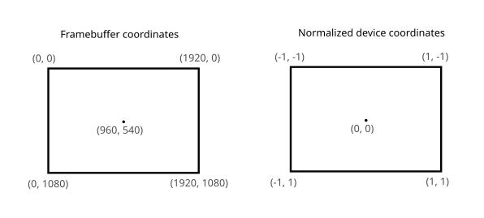
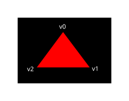
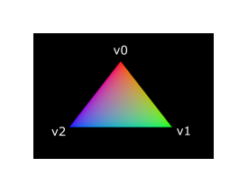

= 셰이더 모듈 (Shader modules)
include::../common/header.adoc[]
:imagesdir!:

이전 API와 달리 {vk}의 셰이더 코드는 {glsl}[``GLSL``] 및 {hlsl}[``HLSL``]과 같은 사람이 읽을 수 있는 구문과 달리 바이트 코드 형식으로 지정해야 합니다. 이 바이트 코드 형식은 {spirv}[``SPIR-V``]라고하며 {vk}과 OpenCL (Khronos API 모두)과 함께 사용하도록 설계되었습니다. 그래픽을 작성하고 셰이더를 계산하는 데 사용할 수있는 형식이지만이 튜토리얼에서 {vk}의 그래픽 파이프 라인에 사용되는 셰이더에 중점을 둘 것입니다.

바이트 코드 형식을 사용하는 장점은 GPU 공급 업체가 셰이더 코드를 기본 코드로 전환하기 위해 작성한 컴파일러가 훨씬 덜 복잡하다는 것입니다. 과거 GLSL과 같은 사람이 읽을 수있는 구문을 사용하면 일부 GPU 공급 업체가 표준에 대한 해석이 다소 유연하다는 것을 보여주었습니다. 이러한 공급 업체 중 하나에서 GPU로 사소한 비 셰이더를 작성하면 다른 공급 업체의 드라이버가 구문 오류로 인해 코드를 거부하거나 컴파일러 버그로 인해 셰이더가 다르게 실행되는 경우가 있습니다. SPIR-V와 같은 간단한 바이트 코드 형식을 사용하면 피할 수 있기를 바랍니다.

그러나 이것이 우리가 손으로이 바이트 코드를 작성해야한다는 것을 의미하지는 않습니다. Khronos는 GLSL을 SPIR-V로 컴파일하는 자체 공급 업체 독립적 인 컴파일러를 출시했습니다. 이 컴파일러는 셰이더 코드가 완전히 표준 준수되고 프로그램과 함께 배송할 수 있는 하나의 SPIR-V 바이너리를 생성하도록 설계되었습니다. 런타임에 SPIR-V를 생성하는 라이브러리로 이 컴파일러를 포함할 수도 있지만 이 자습서에서는 그렇게 하지 않습니다. ``glslangValidator.exe``를 통해이 컴파일러를 직접 사용할 수 있지만 대신 Google에서 ``glsllc.exe``를 사용합니다. ``glslc``의 장점은 GCC 및 Clang과 같은 잘 알려진 컴파일러와 동일한 매개 변수 형식을 사용하고 포함 된 추가 기능을 포함한다는 것입니다. 둘 다 이미 {vk} SDK에 포함되어 있으므로 추가 다운로드 할 필요가 없습니다.

GLSL은 C 스타일 구문이 있는 음영 언어입니다. 그 안에 작성된 프로그램에는 모든 개체에 대해 호출되는 ``main`` 함수가 있습니다. 입력 및 출력으로 반환 값을 사용하는 대신 GLSL은 입력 및 출력을 처리하기 위해 글로벌 변수를 사용합니다. 이 언어에는 내장 벡터 및 매트릭스 원시와 같은 그래픽 프로그래밍을 지원하는 많은 기능이 포함되어 있습니다. 교차 제품, 모체 벡터 제품 및 벡터 주변의 반사와 같은 연산에 대한 함수가 포함됩니다. 벡터 유형은 요소의 양을 나타내는 숫자의 ``vec``이라고 합니다. 예를 들어, 3D 위치는 ``vec3``에 저장됩니다. ``.x``와 같은 멤버를 통해 단일 구성 요소에 액세스할 수 있지만 동시에 여러 구성 요소에서 새 벡터를 생성할 수도 있습니다. 예를 들어, ``vec3(1.0, 2.0, 3.0).xy``는 ``vec2``를 초래합니다. 벡터의 생성자는 벡터 개체와 스칼라 값의 조합을 취할 수도 있습니다. 예를 들어, ``vec3``은 ``vec3(vec2(1.0, 2.0), 3.0)``으로 건설될 수 있다.

이전 장에서 언급했듯이 화면에 삼각형을 얻으려면 {vertexshd}와 {fragmentshd}을 작성해야합니다. 다음 두 섹션은 각 섹션의 GLSL 코드를 포함하며 그 후에는 두 개의 SPIR-V 바이너리를 제작하고 프로그램에로드하는 방법을 보여 드리겠습니다.

== 정점 셰이더 (Vertex shader)

{vertexshd}는 각 들어오는 정점을 처리합니다. 모델 공간 위치, 색상, 정상 및 텍스처 좌표와 같은 속성을 입력으로 사용합니다. 출력은 클립 좌표의 최종 위치와 색상 및 텍스처 좌표와 같은 프래그먼트 셰이더에 전달되어야 하는 속성입니다. 그런 다음 이러한 값은 래스터라이저에 의해 조각 위에 보간되어 매끄러운 그라디언트를 생성합니다.

클립 좌표는 {vertexshd}의 4차원 벡터로 전체 벡터를 분할하여 정규화된 장치 좌표로 전환됩니다. 이러한 정규화된 장치 좌표는 다음과 같이 보이는 [-1, 1] 좌표계에 의해 framebuffer를 [-1, 1] 좌표계에 매핑하는 균질 좌표입니다.

[NOTE]
====
**Framebuffer coordinates**는 실제 화면상의 좌표(pixel)이며, **Normalized device coordinates**는 표준 상대 좌표(기기 독립형 기준 좌표)임. ``-0.1``에서 ``1.0`` 사이의 비율을 가진다.
====

이전에 컴퓨터 그래픽에 담았던 경우 이미 이에 익숙해야합니다. 이전에 OpenGL을 사용한 적이 있다면 Y 좌표의 표시가 이제 뒤집혀 있음을 알 수 있습니다. Z 좌표는 이제 Direct3D에서 0에서 1까지의 동일한 범위를 사용합니다.

첫 번째 삼각형의 경우 변환을 적용하지 않습니다. 세 가지 정점의 위치를 정규화된 장치 좌표로 직접 지정하여 다음 모양을 만듭니다.

우리는 마지막으로 설정된 구성 요소가 ``1``로 설정된 {vertexshd}에서 클립 좌표로 출력하여 정규화된 장치 좌표를 직접 출력할 수 있습니다. 이렇게 하면 클립 좌표를 정규화된 장치 좌표로 변환하는 분할은 아무 것도 변경되지 않습니다.

일반적으로 이러한 좌표는 정점 버퍼에 저장되지만 {vk}에서 정점 버퍼를 만들고 데이터로 채우는 것은 사소한 것이 아닙니다. 따라서 나는 우리가 화면에 삼각형이 나타나는 것을 볼 수있는 만족감을 가질 때까지 그것을 연기하기로 결정했습니다. 우리는 그 사이에 약간 비정통적인 무언가를 할 것입니다. 바로 옆에있는 좌표를 포함하십시오. 코드는 다음과 같습니다.

[source,glsl]
----
#version 450

vec2 positions[3] = vec2,
    vec2(0.5, 0.5),
    vec2(-0.5, 0.5)
);

void main() {
    gl_Position = vec4(positions[gl_VertexIndex], 0.0, 1.0);
}
----

``main`` 함수는 모든 정점에 대해 호출됩니다. 내장 ``gl_VertexIndex`` 변수에는 현재 정점의 인덱스가 포함되어 있습니다. 이것은 일반적으로 정점 버퍼에 대한 인덱스이지만, 우리의 경우에는 정점 데이터의 하드 코딩 배열에 인덱스가 될 것입니다. 각 정점의 위치는 셰이더의 상수 배열에서 액세스되고 더미 ``z`` 및 ``w`` 구성 요소와 결합하여 클립 좌표에서 위치를 생성합니다. 내장 변수 ``gl_Position``은 출력으로 작동합니다.

== 픽셀 색상 계산 (Fragment shader)

{vertexshd}의 위치에 의해 형성되는 삼각형은 화면의 영역을 단편으로 채 웁니다. {vertexshd}는 ##프레임 버퍼 (또는 frame 버퍼)##(depth for the framebuffer (or buffers))에 대한 색상과 깊이를 생성하기 위해 이러한 조각에 호출됩니다. 전체 삼각형에 대해 빨간색을 출력하는 간단한 조각 셰이더는 다음과 같습니다.

[source,glsl]
----
#version 450

layout(location = 0) out vec4 outColor;

void main() {
    outColor = vec4(1.0, 0.0, 0.0, 1.0);
}
----

``main`` 함수는 모든 {vertexshd} ``main`` 함수가 모든 정점에 대해 호출되는 것과 마찬가지로 모든 조각에 대해 호출됩니다. GLSL의 색상은 [0, 1] 범위 내에서 R, G, B 및 알파 채널이 있는 4개의 구성 요소 벡터입니다. {vertexshd}의 ``gl_Position``과 달리 현재 단편에 대한 색상을 출력할 수 있는 기본 변수가 없습니다. 레이아웃(위치 = 0) 수식어가 framebuffer의 인덱스를 지정하는 각 프레임 버퍼에 대해 자체 출력 변수를 지정해야 합니다. 빨간색은 인덱스 ``0``에서 첫 번째(및 유일한) 프레임 버퍼에 연결된 이 outColor 변수에 기록됩니다.

== 정점별 색상 (Per-vertex colors)

전체 삼각형을 빨간색으로 만드는 것은 그다지 흥미롭지 않습니다. 다음과 같은 것이 훨씬 멋지게 보이지 않을까요?

이를 달성하기 위해 두 셰이더를 모두 몇 가지 변경해야합니다. 우선, 우리는 세 가지 정점 각각에 대해 뚜렷한 색상을 지정해야합니다. 정점 셰이더는 이제 위치와 마찬가지로 색상이 있는 배열을 포함해야 합니다.

[source,glsl]
----
vec3 colors[3] = vec3,
    vec3(0.0, 1.0, 0.0),
    vec3(0.0, 0.0, 1.0)
);
----

이제 우리는 이러한 바이트당 색상을 {fragmentshd}에 전달하여 보간 값을 프레임 버퍼에 출력할 수 있습니다. {vertexshd}에 색상에 대한 출력을 추가하고 ``main`` 함수에 쓰기:

[source,glsl]
----
layout(location = 0) out vec3 fragColor;

void main() {
    gl_Position = vec4(positions[gl_VertexIndex], 0.0, 1.0);
    fragColor = colors[gl_VertexIndex];
}
----

다음으로, {fragmentshd}에 일치하는 입력을 추가해야합니다.

[source,glsl]
----
layout(location = 0) in vec3 fragColor;

void main() {
    outColor = vec4(fragColor, 1.0);
}
----

입력 변수가 반드시 동일한 이름을 사용할 필요는 없으며 ``location`` 지시자(directive)에 의해 지정된 인덱스를 사용하여 함께 연결됩니다. ``main`` 함수는 알파 값과 함께 색상을 출력하도록 수정되었습니다. 위의 이미지와 같이, ``fragColor``의 값은 세 꼭지 사이의 조각(fragment)에 대해 자동으로 보간되어 매끄러운 그라디언트가 발생합니다.

== 셰이더 컴파일 (Compiling the shaders)

프로젝트 루트 디렉토리에 ``shaders``라는 디렉토리를 생성하고, 그 안에 {vertexshd}는 ``shader.vert`` 파일에, {fragmentshd}는 ``shader.frag`` 파일에 저장하세요. GLSL 셰이더는 공식적인 확장자가 없지만, 일반적으로 이 두 가지 확장자를 사용하여 구분합니다.

``shader.vert`` 파일은 다음과 같아야 합니다.

[source,glsl]
----
#version 450

layout(location = 0) out vec3 fragColor;

vec2 positions[3] = vec2,
    vec2(0.5, 0.0=5),
    vec2(-0.5, 0.5)
);

vec3 colors[3] = vec3,
    vec3(0.0, 1.0, 0.0),
    vec3(0.0, 0.0, 1.0)
);

void main() {
    gl_Position = vec4(positions[gl_VertexIndex], 0.0, 1.0);
    fragColor = colors[gl_VertexIndex];
}
----

그리고 ``shader.frag`` 파일의 내용은 다음과 같아야 합니다.

[source,glsl]
----
#version 450

layout(location = 0) in vec3 fragColor;
layout(location = 0) out vec4 outColor;

void main() {
    outColor = vec4(fragColor, 1.0);
}
----

이제 glslcl 프로그램을 사용하여 SPR-V 바이트 코드로 컴파일합니다.

NOTE: 원문은 생략하고 실행 명령어 구문만 명시함

=== Windows

NOTE: PowerShell 기준

[source,powershell]
----
C:\$env:VULKAN_SDK\Bin\glslc.exe shader.vert -o vert.spv
C:\$env:VULKAN_SDK\Bin\glslc.exe shader.frag -o frag.spv
----

=== Linux / macOS

[source,bash]
----
$VULKAN_SDK/bin/glslc shader.vert -o vert.spv
$VULKAN_SDK/bin/glslc shader.frag -o frag.spv
----

== 셰이더 로딩 (Loading a shader)

이제 SPIR-V 셰이더를 생산하는 방법이 있으므로 프로그램에로드하여 어느 시점에서 그래픽 파이프 라인에 연결할 때입니다. 먼저 파일에서 바이너리 데이터를 로드하는 간단한 도우미 함수를 작성합니다.

[source,cpp]
----
#include <fstream>
...
static std::vector<char> readFile(const std::string& filename) {
    std::ifstream file(filename, std::ios::ate | std::ios::binary);

    if (!file.is_open()) {
        throw std::runtime_error("failed to open file!");
    }
}
----

``readFile`` 함수는 지정된 파일의 모든 바이트를 읽고 ``std::vector``에서 관리하는 바이트 배열로 반환합니다. 우리는 두 개의 플래그로 파일을 여는 것으로 시작합니다.

* ``ate`` : 파일의 끝에서 읽기 시작
* ``binary`` : 바이너리 파일로 파일 읽기 (텍스트 변환을 피하십시오)

파일 끝에서 읽기 시작하는 장점은 읽기 위치를 사용하여 파일의 크기를 결정하고 버퍼를 할당할 수 있다는 것입니다.

[source,cpp]
----
size_t fileSize = static_cast<size_t>(file.tellg());
std::vector<char> buffer(fileSize);
----

그 후, 우리는 파일의 시작으로 돌아가서(``file.seekg(0)``) 모든 바이트를 한 번에 읽을 수 있습니다.

[source,cpp]
----
file.seekg(0);
file.read(buffer.data(), fileSize);
----

마지막으로 파일을 닫고 바이트를 반환합니다.

[source,cpp]
----
file.close();

return buffer;
----

이제 createGraphicsPipline에서 이 함수를 호출하여 두 셰이더의 바이트코드를 로드합니다.

[source,cpp]
----
void createGraphicsPipeline() {
    auto vertShaderCode = readFile("shaders/vert.spv");
    auto fragShaderCode = readFile("shaders/frag.spv");
}
----

버퍼의 크기를 인쇄하고 실제 파일 크기와 바이트의 실제 파일 크기와 일치하는지 확인하여 셰이더가 올바르게 로드되어 있는지 확인하십시오. 코드는 바이너리 코드이기 때문에 null이 종료될 필요가 없으며 나중에 해당 크기에 대해 명시합니다.

== 셰이더 모듈 생성 (Creating shader modules)

코드를 파이프라인에 전달하기 전에 {VkShaderModule}[``VkShaderModule``] 개체로 포장해야 합니다. 도우미 함수 ``createShaderModule``을 만들어 그렇게 합시다.

[source,cpp]
----
VkShaderModule createShaderModule(const std::vector<char>& code) {

}
----

함수는 바이트코드를 매개 변수로 사용하여 버퍼를 가져와 {VkShaderModule}[``VkShaderModule``]을 만듭니다.

셰이더 모듈을 만드는 것은 간단합니다. 바이트 코드와 길이를 가진 버퍼에 대한 포인터를 지정하기만 하면 됩니다. 이 정보는 {VkShaderModuleCreateInfo}[``VkShaderModuleCreateInfo``] 구조에 명시되어 있습니다. 하나의 캐치는 바이트의 크기가 바이트로 지정되지만 바이트 코드 포인터는 ``char`` 포인터가 아닌 ``uint32_t`` 포인터입니다. 따라서 아래와 같이 ``reinterpret_cast``로 포인터를 캐스팅해야 합니다. 이와 같은 캐스트를 수행 할 때 데이터가 ``uint32_t``의 정렬 요구 사항을 충족하는지 확인해야합니다. 운이 좋게도 데이터는 기본 할당자가 이미 데이터가 최악의 경우 정렬 요구 사항을 충족하는지 확인하는 ``std::vector``에 저장됩니다.

[source,cpp]
----
VkShaderModuleCreateInfo{
    .sType = VK_STRUCTUR_TYPE_SHADER_MODULE_CREATE_INFO,
    .pNext = nullptr,
    .codeSize = code.size(),
    .pCode = reinterpret_cast<const uint32_t*>(code.data());
};
----

{VkShaderModule}[``VkShaderModule``]은 {vkCreateShaderModule}[``vkCreateShaderModule``]에 대한 호출로 만들 수 있습니다.

[source,cpp]
----
VkShaderModule shaderModule;

if (vkCreateShaderModule(_device, &createInfo, nullptr, &shaderModule) != VK_SUCCESS) {
    throw std::runtime_error("failed to create shader module!");
}
----

매개 변수는 이전 개체 생성 함수의 것과 동일합니다. 논리 장치, 정보 구조를 만드는 포인터, 사용자 지정 할당자에 대한 선택적 포인터 및 출력 변수를 처리합니다. 코드가있는 버퍼는 셰이더 모듈을 만든 직후에 해제 할 수 있습니다. 생성된 셰이더 모듈을 반환하는 것을 잊지 마십시오.

[source,cpp]
----
return shaderModule;
----

셰이더 모듈은 이전에 파일에서 로드한 셰이더 바이트 코드 주변의 얇은 래퍼와 그 안에 정의된 함수입니다. SPR-V 바이트코드를 GPU에 의한 실행용 머신 코드로 컴파일 및 링크는 그래픽 파이프라인이 생성될 때까지 발생하지 않습니다. 즉, 파이프라인 생성이 완료되는 즉시 셰이더 모듈을 다시 파괴할 수 있으므로 클래스 멤버 대신 createGraphicsPipeline 함수에서 로컬 변수를 만들 것입니다.

[source,cpp]
----
void createGraphicsPipeline() {
    auto vertShaderCode = readFile("shaders/vert.spv");
    auto fragShaderCode = readFile("shaders/frag.spv");

    VkShaderModule vertShaderModule = createShaderModule(vertShaderCode);
    VkShaderModule fragShaderModule = createShaderModule(fragShaderCode);
}
----

그런 다음 청소는 {vkDestroyShaderModule}[``vkDestroyShaderModule``]에 두 번의 호출을 추가하여 함수의 끝에서 발생해야합니다. 이 챕터의 나머지 코드는 모두 이 줄들 앞에 삽입됩니다.

[source,cpp]
----
    ....
    vkDestroyShaderModule(_device, fragShaderModule, nullptr);
    vkDestroyShaderModule(_device, vertShaderModule, nullptr);
}
----

== 셰이더 스테이지 생성 (Shader stage creation)

실제로 셰이더를 사용하려면 실제 파이프라인 생성 프로세스의 일부로 {VkPipelineShareerStageCreateInfo}[``VkPipelineShareerStageCreateInfo``] 구조를 통해 특정 파이프라인 단계에 할당해야 합니다.

우리는 {vertexshd}에 대한 구조를 다시 작성하는 것으로 시작할 것입니다. ``createGraphicsPipline`` 함수에서 다시.

[source,cpp]
----
VkPipelineShaderStageCreateInfo vertStageInfo{
    .sType = VK_STRUCTURE_TYPE_PIPELINE_SHADER_STAGE_CREATE_INFO,
    .pNext = nullptr,
    .stage = VK_SHADER_STAGE_VERTEX_BIT,
    .module = vertShaderModule,
    .pName = "main",
};
----

필수 ``sType`` 멤버 외에도 첫 번째 단계는 {vk}에게 어떤 파이프라인 스테이지가 셰이더가 사용될 것인지 알려주는 것입니다. 이전 장에 설명된 각 프로그래밍 가능한 단계에 대해 enum 값이 있습니다.

다음 두 멤버는 코드를 포함하는 셰이더 모듈과 호출할 함수를 지정합니다. 즉, 여러 {fragmentshd}를 단일 셰이더 모듈에 결합하고 다른 진입 점을 사용하여 행동을 구별하는 것이 가능합니다. 이 경우 우리는 표준 ``main`` 고수 할 것입니다.

하나 더 (선택 사항) 멤버가 있습니다. ``pSpecializationInfo``는 여기에서 사용하지 않지만 논의할 가치가 있습니다. 셰이더 상수에 대한 값을 지정할 수 있습니다. 사용 된 상수에 대해 다른 값을 지정하여 파이프 라인 생성에서 동작을 구성 할 수있는 단일 셰이더 모듈을 사용할 수 있습니다. 이것은 렌더링 시간에 변수를 사용하여 셰이더를 구성하는 것보다 더 효율적입니다. 컴파일러는 이러한 값에 의존하는 ``if`` 문이 있는 경우 제거와 같은 최적화를 수행할 수 있기 때문입니다. 그런 상수가 없으면 멤버를 ``nullptr``로 설정할 수 있습니다.

{fragmentshd}에 맞게 구조를 수정하는 것은 쉽습니다.

[source,cpp]
----
VkPipelineShaderStageCreateInfo fragStageInfo{
    .sType = VK_STRUCTURE_TYPE_PIPELINE_SHADER_STAGE_CREATE_INFO,
    .pNext = nullptr,
    .stage = VK_SHADER_STAGE_FRAGMENT_BIT,
    .module = fragShaderModule,
    .pName = "main",
};
----

이 두 구조체가 포함된 배열을 정의하여 완료하면 나중에 실제 파이프라인 생성 단계에서 참조하는 데 사용할 것입니다.

[source,cpp]
----
VkPipelineShaderStageCreateInfo shaderStages[] = {vertStageInfo, fragStageInfo};
----

이것이 파이프 라인의 프로그래밍 가능한 단계를 설명하는 것입니다. link:./FixedFunctions.html[다음 장]에서는 고정 기능 단계를 살펴 보겠습니다.

.작성자 버전의 전체 소스
[%collapsible]
====

.main.cpp
[source,cpp,linenums]
----
//
// Created by JoonHo Son on 2026-05-17.
//
#include <vulkan/vulkan.h>
#include <vulkan/vulkan_core.h>

#include <algorithm>
#include <cstddef>
#include <cstdint>
#include <cstring>
#include <fstream>
#include <limits>
#include <optional>
#include <set>
#include <stdexcept>
#include <vector>

#if !defined(NDEBUG) || defined(_DEBUG)
#define DEBUG_BUILD
#define SPDLOG_ACTIVE_LEVEL SPDLOG_LEVEL_TRACE
#else
#define SPDLOG_ACTIVE_LEVEL SPDLOG_LEVEL_INFO
#endif

#define GLFW_INCLUDE_VULKAN
#include <GLFW/glfw3.h>
#include <spdlog/spdlog.h>

#include "cliff3_vulkan_util.h"

#define GLM_FORCE_RADIANS
#define GLM_FORCE_DEPTH_ZERO_TO_ONE
#include <glm/mat4x4.hpp>
#include <glm/vec4.hpp>

const uint32_t WIDTH = 800;
const uint32_t HEIGHT = 600;

const std::vector<const char*> validationLayers{
    "VK_LAYER_KHRONOS_validation",
};

const std::vector<const char*> deviceExtensions = {
    VK_KHR_SWAPCHAIN_EXTENSION_NAME,
};

#ifdef DEBUG_BUILD
const bool enableValidationLayers = true;
#else
const bool enableValidationLayers = false;
#endif

VkResult CreateDebugUtilsMessengerEXT(VkInstance instance, const VkDebugUtilsMessengerCreateInfoEXT* pCreateInfo,
                                      const VkAllocationCallbacks* pAllocator,
                                      VkDebugUtilsMessengerEXT* pDebugMessenger) {
    auto func = (PFN_vkCreateDebugUtilsMessengerEXT)vkGetInstanceProcAddr(instance, "vkCreateDebugUtilsMessengerEXT");

    if (func != nullptr) {
        return func(instance, pCreateInfo, pAllocator, pDebugMessenger);
    } else {
        return VK_ERROR_EXTENSION_NOT_PRESENT;
    }
}

void DestroyDebugUtilsMessengerEXT(VkInstance instance, VkDebugUtilsMessengerEXT debugMessenger,
                                   const VkAllocationCallbacks* pAllocator) {
    auto func = (PFN_vkDestroyDebugUtilsMessengerEXT)vkGetInstanceProcAddr(instance, "vkDestroyDebugUtilsMessengerEXT");

    if (func != nullptr) {
        func(instance, debugMessenger, pAllocator);
    }
}

struct QueueFamilyIndices {
    std::optional<uint32_t> graphicsFamily;
    std::optional<uint32_t> presentFamily;

    bool isComplete() { return graphicsFamily.has_value() && presentFamily.has_value(); }
};

struct SwapChainSupportDetails {
    VkSurfaceCapabilitiesKHR capabilities;
    std::vector<VkSurfaceFormatKHR> formats;
    std::vector<VkPresentModeKHR> presentModes;
};

class HelloTriangleApplication {
public:
    void run() {
        initWindow();
        initVulkan();
        mainLoop();
        cleanup();
    }

private:
    GLFWwindow* _window;

    VkInstance _instance;

    VkDebugUtilsMessengerEXT _debugMessenger;

    VkPhysicalDevice _physicalDevice = VK_NULL_HANDLE;

    VkDevice _device;

    VkQueue _graphicsQueue;

    VkQueue _presentQueue;

    VkSurfaceKHR _surface;

    VkSwapchainKHR _swapChain;

    std::vector<VkImage> _swapChainImages;

    VkFormat _swapChainImageFormat;

    VkExtent2D _swapChainExtent;

    std::vector<VkImageView> _swapChainImageViews;

    void initWindow() {
        glfwInit();
        glfwWindowHint(GLFW_CLIENT_API, GLFW_NO_API);
        glfwWindowHint(GLFW_RESIZABLE, GLFW_FALSE);

        _window = glfwCreateWindow(WIDTH, HEIGHT, "Vulkan", nullptr, nullptr);
    }

    void initVulkan() {
        createInstance();
        setupDebugMessenger();
        createSurface();
        pickPhysicalDevice();
        createLogicalDevice();
        createSwapChain();
        createImageViews();
        createGraphicsPipeline();
    }

    void createImageViews() {
        _swapChainImageViews.resize(_swapChainImages.size());

        for (size_t i = 0; i < _swapChainImages.size(); i++) {
            VkImageViewCreateInfo createInfo{
                .sType = VK_STRUCTURE_TYPE_IMAGE_VIEW_CREATE_INFO,
                .pNext = nullptr,
                .image = _swapChainImages[i],
                .viewType = VK_IMAGE_VIEW_TYPE_2D,
                .format = _swapChainImageFormat,
                .components ={
                        .r = VK_COMPONENT_SWIZZLE_IDENTITY,
                        .g = VK_COMPONENT_SWIZZLE_IDENTITY,
                        .b = VK_COMPONENT_SWIZZLE_IDENTITY,
                        .a = VK_COMPONENT_SWIZZLE_IDENTITY,
                },
                .subresourceRange = {
                        .aspectMask = VK_IMAGE_ASPECT_COLOR_BIT,
                        .baseMipLevel = 0,
                        .levelCount = 1,
                        .baseArrayLayer = 0,
                        .layerCount = 1,
                },
            };

            if (vkCreateImageView(_device, &createInfo, nullptr, &_swapChainImageViews[i]) != VK_SUCCESS) {
                throw std::runtime_error("failed to create image views!");
            }
        }
    }

    void createGraphicsPipeline() {
        auto vertShaderCode = readFile("shader/vert.spv");
        auto fragShaderCode = readFile("shader/frag.spv");

        VkShaderModule vertShaderModule = createShaderModule(vertShaderCode);
        VkShaderModule fragShaderModule = createShaderModule(fragShaderCode);

        VkPipelineShaderStageCreateInfo vertStageInfo{
            .sType = VK_STRUCTURE_TYPE_PIPELINE_SHADER_STAGE_CREATE_INFO,
            .pNext = nullptr,
            .stage = VK_SHADER_STAGE_VERTEX_BIT,
            .module = vertShaderModule,
            .pName = "main",
        };

        VkPipelineShaderStageCreateInfo fragStageInfo{
            .sType = VK_STRUCTURE_TYPE_PIPELINE_SHADER_STAGE_CREATE_INFO,
            .pNext = nullptr,
            .stage = VK_SHADER_STAGE_FRAGMENT_BIT,
            .module = fragShaderModule,
            .pName = "main",
        };

        VkPipelineShaderStageCreateInfo shaderStages[] = {vertStageInfo, fragStageInfo};

        vkDestroyShaderModule(_device, fragShaderModule, nullptr);
        vkDestroyShaderModule(_device, vertShaderModule, nullptr);
    }

    VkShaderModule createShaderModule(const std::vector<char>& code) {
        VkShaderModuleCreateInfo createInfo{
            .sType = VK_STRUCTURE_TYPE_SHADER_MODULE_CREATE_INFO,
            .pNext = nullptr,
            .codeSize = code.size(),
            .pCode = reinterpret_cast<const uint32_t*>(code.data()),
        };
        VkShaderModule shaderModule;

        if (vkCreateShaderModule(_device, &createInfo, nullptr, &shaderModule) != VK_SUCCESS) {
            throw std::runtime_error("failed to create shader module!");
        }

        return shaderModule;
    }

    void mainLoop() {
        while (!glfwWindowShouldClose(_window)) {
            glfwPollEvents();
        }
    }

    void cleanup() {
        for (auto imageView : _swapChainImageViews) {
            vkDestroyImageView(_device, imageView, nullptr);
        }

        vkDestroySwapchainKHR(_device, _swapChain, nullptr);
        vkDestroyDevice(_device, nullptr);

        if (enableValidationLayers) {
            DestroyDebugUtilsMessengerEXT(_instance, _debugMessenger, nullptr);
        }

        vkDestroySurfaceKHR(_instance, _surface, nullptr);
        vkDestroyInstance(_instance, nullptr);
        glfwDestroyWindow(_window);
        glfwTerminate();
    }

    void createInstance() {
        if (enableValidationLayers && !checkValidationLayerSupport()) {
            throw std::runtime_error("validation layers requested, but not available!");
        }

        VkApplicationInfo appInfo{
            .sType = VK_STRUCTURE_TYPE_APPLICATION_INFO,
            .pApplicationName = "Hello Triangle",
            .applicationVersion = VK_MAKE_VERSION(1, 0, 0),
            .pEngineName = "No Engine",
            .engineVersion = VK_MAKE_VERSION(1, 0, 0),
            .apiVersion = VK_API_VERSION_1_0,
        };

        auto extensions = getRequiredExtensions();

        VkInstanceCreateInfo createInfo{
            .sType = VK_STRUCTURE_TYPE_INSTANCE_CREATE_INFO,
            .pApplicationInfo = &appInfo,
            .enabledExtensionCount = static_cast<uint32_t>(extensions.size()),
            .ppEnabledExtensionNames = extensions.data(),
        };

        VkDebugUtilsMessengerCreateInfoEXT debugCreateInfo{};

        if (enableValidationLayers) {
            createInfo.enabledLayerCount = static_cast<uint32_t>(validationLayers.size());
            createInfo.ppEnabledLayerNames = validationLayers.data();

            populateDebugMessengerCreateInfo(debugCreateInfo);
            createInfo.pNext = (VkDebugUtilsMessengerCreateInfoEXT*)&debugCreateInfo;
        } else {
            createInfo.enabledLayerCount = 0;
            createInfo.pNext = nullptr;
        }

        if (vkCreateInstance(&createInfo, nullptr, &_instance) != VK_SUCCESS) {
            SPDLOG_ERROR("----------------------------------------");
            SPDLOG_ERROR("failed to create instance!");
            SPDLOG_ERROR("----------------------------------------");

            throw std::runtime_error("failed to create instance!");
        }

        for (const auto& extension : extensions) {
            SPDLOG_DEBUG("\t {}", extension);
        }
    }

    void populateDebugMessengerCreateInfo(VkDebugUtilsMessengerCreateInfoEXT& createInfo) {
        createInfo = {
            .sType = VK_STRUCTURE_TYPE_DEBUG_UTILS_MESSENGER_CREATE_INFO_EXT,
            .messageSeverity = VK_DEBUG_UTILS_MESSAGE_SEVERITY_VERBOSE_BIT_EXT
                               | VK_DEBUG_UTILS_MESSAGE_SEVERITY_WARNING_BIT_EXT
                               | VK_DEBUG_UTILS_MESSAGE_SEVERITY_ERROR_BIT_EXT,
            .messageType = VK_DEBUG_UTILS_MESSAGE_TYPE_GENERAL_BIT_EXT | VK_DEBUG_UTILS_MESSAGE_TYPE_VALIDATION_BIT_EXT
                           | VK_DEBUG_UTILS_MESSAGE_TYPE_PERFORMANCE_BIT_EXT,
            .pfnUserCallback = debugCallback,
        };
    }

    void setupDebugMessenger() {
        if (!enableValidationLayers) {
            return;
        }

        VkDebugUtilsMessengerCreateInfoEXT createInfo;

        populateDebugMessengerCreateInfo(createInfo);

        if (CreateDebugUtilsMessengerEXT(_instance, &createInfo, nullptr, &_debugMessenger) != VK_SUCCESS) {
            throw std::runtime_error("failed to set up debug messenger!");
        }
    }

    void createSurface() {
        if (glfwCreateWindowSurface(_instance, _window, nullptr, &_surface) != VK_SUCCESS) {
            throw std::runtime_error("failed to create window surface!");
        }
    }

    void pickPhysicalDevice() {
        uint32_t deviceCount = 0;
        vkEnumeratePhysicalDevices(_instance, &deviceCount, nullptr);

        if (deviceCount == 0) {
            SPDLOG_ERROR("Vulkan을 지원하는 GPU를 찾을 수 없음.");

            throw std::runtime_error("failed to find GPUs with Vulkan support!");
        }

        std::vector<VkPhysicalDevice> devices(deviceCount);
        vkEnumeratePhysicalDevices(_instance, &deviceCount, devices.data());

        for (const auto& device : devices) {
            if (isDeviceSuitable(device)) {
                _physicalDevice = device;

                break;
            }
        }

        if (_physicalDevice == VK_NULL_HANDLE) {
            SPDLOG_ERROR("사용 가능한 GPU를 찾지 못함");

            throw std::runtime_error("failed to find a suitable GPU!");
        }
    }

    void createLogicalDevice() {
        QueueFamilyIndices indices = findQueueFamilies(_physicalDevice);
        std::vector<VkDeviceQueueCreateInfo> queueCreateInfos;
        std::set<uint32_t> uniqueQueueFamilies = {
            indices.graphicsFamily.value(),
            indices.presentFamily.value(),
        };
        float queuePriority = 1.0f;

        for (uint32_t queueFamily : uniqueQueueFamilies) {
            VkDeviceQueueCreateInfo queueCreateInfo{
                .sType = VK_STRUCTURE_TYPE_DEVICE_QUEUE_CREATE_INFO,
                .queueFamilyIndex = queueFamily,
                .queueCount = 1,
                .pQueuePriorities = &queuePriority,
            };

            queueCreateInfos.push_back(queueCreateInfo);
        }

        VkPhysicalDeviceFeatures deviceFeatures{};
        VkDeviceCreateInfo createInfo{
            .sType = VK_STRUCTURE_TYPE_DEVICE_CREATE_INFO,
            .queueCreateInfoCount = static_cast<uint32_t>(queueCreateInfos.size()),
            .pQueueCreateInfos = queueCreateInfos.data(),
            .enabledExtensionCount = static_cast<uint32_t>(deviceExtensions.size()),
            .ppEnabledExtensionNames = deviceExtensions.data(),
            .pEnabledFeatures = &deviceFeatures,
        };

        if (enableValidationLayers) {
            createInfo.enabledLayerCount = static_cast<uint32_t>(validationLayers.size());
            createInfo.ppEnabledLayerNames = validationLayers.data();
        } else {
            createInfo.enabledLayerCount = 0;
        }

        if (vkCreateDevice(_physicalDevice, &createInfo, nullptr, &_device) != VK_SUCCESS) {
            throw std::runtime_error("failed to create logical device!");
        }

        vkGetDeviceQueue(_device, indices.graphicsFamily.value(), 0, &_graphicsQueue);
        vkGetDeviceQueue(_device, indices.presentFamily.value(), 0, &_presentQueue);
    }

    void createSwapChain() {
        SwapChainSupportDetails swapChainSupport = querySwapChainSupport(_physicalDevice);
        VkSurfaceFormatKHR surfaceFormat = chooseSwapSurfaceFormat(swapChainSupport.formats);
        VkPresentModeKHR presentMode = chooseSwapPresentMOde(swapChainSupport.presentModes);
        VkExtent2D extent = chooseSwapExtent(swapChainSupport.capabilities);
        uint32_t imageCount = swapChainSupport.capabilities.minImageCount + 1;

        if (swapChainSupport.capabilities.maxImageCount > 0
            && imageCount > swapChainSupport.capabilities.maxImageCount) {
            imageCount = swapChainSupport.capabilities.maxImageCount;
        }

        VkSwapchainCreateInfoKHR createInfo{
            .sType = VK_STRUCTURE_TYPE_SWAPCHAIN_CREATE_INFO_KHR,
            .surface = _surface,
            .minImageCount = imageCount,
            .imageFormat = surfaceFormat.format,
            .imageColorSpace = surfaceFormat.colorSpace,
            .imageExtent = extent,
            .imageArrayLayers = 1,
            .imageUsage = VK_IMAGE_USAGE_COLOR_ATTACHMENT_BIT,
            .preTransform = swapChainSupport.capabilities.currentTransform,
            .compositeAlpha = VK_COMPOSITE_ALPHA_OPAQUE_BIT_KHR,
            .presentMode = presentMode,
            .clipped = VK_TRUE,
            .oldSwapchain = VK_NULL_HANDLE,
        };

        QueueFamilyIndices indices = findQueueFamilies(_physicalDevice);
        uint32_t queueFamilyIndices[] = {
            indices.graphicsFamily.value(),
            indices.presentFamily.value(),
        };

        if (indices.graphicsFamily != indices.presentFamily) {
            createInfo.imageSharingMode = VK_SHARING_MODE_CONCURRENT;
            createInfo.queueFamilyIndexCount = 2;
            createInfo.pQueueFamilyIndices = queueFamilyIndices;
        } else {
            createInfo.imageSharingMode = VK_SHARING_MODE_EXCLUSIVE;
            createInfo.queueFamilyIndexCount = 0;
            createInfo.pQueueFamilyIndices = nullptr;
        }

        if (vkCreateSwapchainKHR(_device, &createInfo, nullptr, &_swapChain) != VK_SUCCESS) {
            throw std::runtime_error("failed to create swap chain!");
        }

        vkGetSwapchainImagesKHR(_device, _swapChain, &imageCount, nullptr);
        _swapChainImages.resize(imageCount);
        vkGetSwapchainImagesKHR(_device, _swapChain, &imageCount, _swapChainImages.data());

        _swapChainImageFormat = surfaceFormat.format;
        _swapChainExtent = extent;
    }

    VkSurfaceFormatKHR chooseSwapSurfaceFormat(const std::vector<VkSurfaceFormatKHR>& availableFormats) {
        for (const auto& format : availableFormats) {
            if (format.format == VK_FORMAT_B8G8R8A8_SRGB && format.colorSpace == VK_COLOR_SPACE_SRGB_NONLINEAR_KHR) {
#ifdef DEBUG_BUILD
                SPDLOG_DEBUG("--------------------------------------------------------");
                SPDLOG_DEBUG("Selected format informat");
                SPDLOG_DEBUG("  format      : VK_FORMAT_B8G8R8A8_SRBG");
                SPDLOG_DEBUG("  color space : VK_COLOR_SPACE_SRGB_NONLINEAR_KHR");
                SPDLOG_DEBUG("--------------------------------------------------------");
#endif
                return format;
            }
        }

#ifdef DEBUG_BUILD
        SPDLOG_DEBUG("--------------------------------------------------------");
        SPDLOG_DEBUG("  format      : {}",
                     cliff3::vulkan::util::getSurfaceFormatKHRFormatName(availableFormats[0].format));
        SPDLOG_DEBUG("  color space : {}",
                     cliff3::vulkan::util::getSurfaceFormatKHRColorSpaceName(availableFormats[0].colorSpace));
        SPDLOG_DEBUG("--------------------------------------------------------");
#endif

        return availableFormats[0];
    }

    VkPresentModeKHR chooseSwapPresentMOde(const std::vector<VkPresentModeKHR>& availablePresentModes) {
        for (const auto& presentMode : availablePresentModes) {
            if (presentMode == VK_PRESENT_MODE_MAILBOX_KHR) {
                return presentMode;
            }
        }

        return VK_PRESENT_MODE_FIFO_KHR;
    }

    VkExtent2D chooseSwapExtent(const VkSurfaceCapabilitiesKHR& capabilities) {
        if (capabilities.currentExtent.width != std::numeric_limits<uint32_t>::max()) {
            return capabilities.currentExtent;
        }

        int width, height;
        glfwGetFramebufferSize(_window, &width, &height);

        VkExtent2D actualExtent{
            .width = static_cast<uint32_t>(width),
            .height = static_cast<uint32_t>(height),
        };

        actualExtent.width
            = std::clamp(actualExtent.width, capabilities.minImageExtent.width, capabilities.maxImageExtent.width);
        actualExtent.height
            = std::clamp(actualExtent.height, capabilities.minImageExtent.height, capabilities.maxImageExtent.height);

        return actualExtent;
    }

    SwapChainSupportDetails querySwapChainSupport(VkPhysicalDevice device) {
        SwapChainSupportDetails details;
        vkGetPhysicalDeviceSurfaceCapabilitiesKHR(device, _surface, &details.capabilities);

        uint32_t formatCount;
        vkGetPhysicalDeviceSurfaceFormatsKHR(device, _surface, &formatCount, nullptr);

        if (formatCount != 0) {
            details.formats.resize(formatCount);
            vkGetPhysicalDeviceSurfaceFormatsKHR(device, _surface, &formatCount, details.formats.data());
        }

        uint32_t presentModeCount;
        vkGetPhysicalDeviceSurfacePresentModesKHR(device, _surface, &presentModeCount, nullptr);

        if (presentModeCount != 0) {
            details.presentModes.resize(presentModeCount);
            vkGetPhysicalDeviceSurfacePresentModesKHR(device, _surface, &presentModeCount, details.presentModes.data());
        }

        return details;
    }

    bool isDeviceSuitable(VkPhysicalDevice device) {
        QueueFamilyIndices indices = findQueueFamilies(device);
        bool extensionsSupported = checkDeviceExtensionSupport(device);
        bool swapChainAdequate = false;

        if (extensionsSupported) {
            SwapChainSupportDetails swapChainSupport = querySwapChainSupport(device);
            swapChainAdequate = !swapChainSupport.formats.empty() && !swapChainSupport.presentModes.empty();
        }

        return indices.isComplete() && extensionsSupported && swapChainAdequate;
    }

    bool checkDeviceExtensionSupport(VkPhysicalDevice device) {
        uint32_t extensionCount;
        vkEnumerateDeviceExtensionProperties(device, nullptr, &extensionCount, nullptr);

        std::vector<VkExtensionProperties> availableExtensions(extensionCount);
        vkEnumerateDeviceExtensionProperties(device, nullptr, &extensionCount, availableExtensions.data());
        std::set<std::string> requiredExtensions(deviceExtensions.begin(), deviceExtensions.end());

        for (const auto& extension : availableExtensions) {
            requiredExtensions.erase(extension.extensionName);
        }

        return requiredExtensions.empty();
    }

    QueueFamilyIndices findQueueFamilies(VkPhysicalDevice device) {
        QueueFamilyIndices indices;
        uint32_t queueFamilyCount = 0;

        vkGetPhysicalDeviceQueueFamilyProperties(device, &queueFamilyCount, nullptr);
        std::vector<VkQueueFamilyProperties> queueFamilies(queueFamilyCount);
        vkGetPhysicalDeviceQueueFamilyProperties(device, &queueFamilyCount, queueFamilies.data());

        for (uint32_t i = 0; i < queueFamilies.size(); i++) {
            if (queueFamilies[i].queueFlags & VK_QUEUE_GRAPHICS_BIT) {
                indices.graphicsFamily = 1;
            }

            VkBool32 presentSupport = false;
            vkGetPhysicalDeviceSurfaceSupportKHR(device, i, _surface, &presentSupport);

            if (presentSupport) {
                indices.presentFamily = 1;
            }

            if (indices.isComplete()) {
                break;
            }
        }

        return indices;
    }

    std::vector<const char*> getRequiredExtensions() {
        uint32_t glfwExtensionCount = 0;
        const char** glfwExtensions;
        glfwExtensions = glfwGetRequiredInstanceExtensions(&glfwExtensionCount);

        std::vector<const char*> extensions(glfwExtensions, glfwExtensions + glfwExtensionCount);

        if (enableValidationLayers) {
            extensions.push_back(VK_EXT_DEBUG_UTILS_EXTENSION_NAME);
        }

        return extensions;
    }

    bool checkValidationLayerSupport() {
        uint32_t layerCount;
        vkEnumerateInstanceLayerProperties(&layerCount, nullptr);

        std::vector<VkLayerProperties> availableLayers(layerCount);
        vkEnumerateInstanceLayerProperties(&layerCount, availableLayers.data());

        for (const char* layerName : validationLayers) {
            bool layerFound = false;

            for (const auto& layerProperties : availableLayers) {
                SPDLOG_DEBUG("----------------------------------------------");
                SPDLOG_DEBUG("layerName : {}", layerName);
                SPDLOG_DEBUG("property's name : {}", layerProperties.layerName);

                if (strcmp(layerName, layerProperties.layerName) == 0) {
                    layerFound = true;

                    break;
                }
            }

            if (!layerFound) {
                return false;
            }
        }

        return true;
    }

    static VKAPI_ATTR VkBool32 VKAPI_CALL
    debugCallback([[maybe_unused]] VkDebugUtilsMessageSeverityFlagBitsEXT messageSeverity,
                  [[maybe_unused]] VkDebugUtilsMessageTypeFlagsEXT messageType,
                  const VkDebugUtilsMessengerCallbackDataEXT* pcallbackData, [[maybe_unused]] void* pUserData) {
        SPDLOG_ERROR("validation layer: {}", pcallbackData->pMessage);

        return VK_FALSE;
    }

    static std::vector<char> readFile(const std::string& filename) {
        std::ifstream file(filename, std::ios::ate | std::ios::binary);

        if (!file.is_open()) {
            throw std::runtime_error("failed to open file!");
        }

        size_t fileSize = static_cast<size_t>(file.tellg());
        std::vector<char> buffer(fileSize);

        file.seekg(0);
        file.read(buffer.data(), fileSize);
        file.close();

        return buffer;
    }
};

int main() {
#ifdef DEBUG_BUILD
    spdlog::set_level(spdlog::level::debug);
    spdlog::set_pattern("[%Y-%m-%d %H:%M:%S.%e] [%l] [%s:%#] %v");
#else
    spdlog::set_level(spdlog::level::info);
#endif
    HelloTriangleApplication app;

    try {
        app.run();
    } catch (const std::exception& e) {
        SPDLOG_ERROR("{}", e.what());

        return EXIT_FAILURE;
    }

    return EXIT_SUCCESS;
}
----

.shaders/shader.vert
[source,glsl]
----
#version 450

layout(location = 0) out vec3 fragColor;

vec2 positions[3] = vec2,
    vec2(0.5, 0.5),
    vec2(-0.5, 0.5)
);

vec3 colors[3] = vec3,
    vec3(0.0, 1.0, 0.0),
    vec3(0.0, 0.0, 1.0)
);

void main() {
    gl_Position = vec4(positions[gl_VertexIndex], 0.0, 1.0);
    fragColor = colors[gl_VertexIndex];
}
----

.shader/shader.frag
[source,glsl]
----
#version 450

layout(location = 0) in vec3 fragColor;
layout(location = 0) out vec4 outColor;

void main() {
    outColor = vec4(fragColor, 1.0);
}
----
====