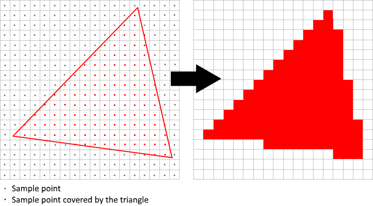
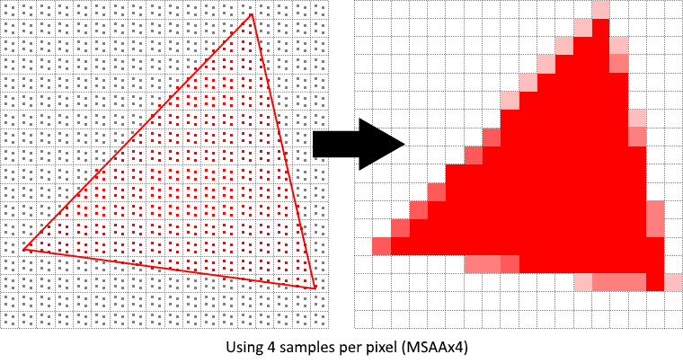
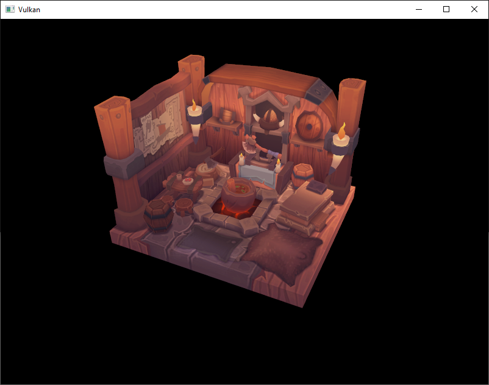
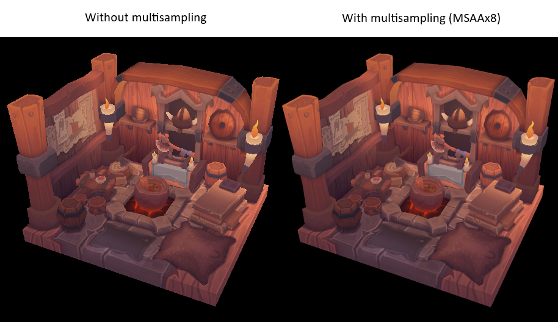
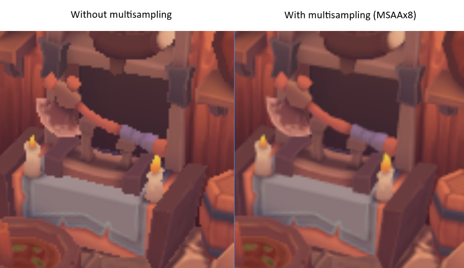
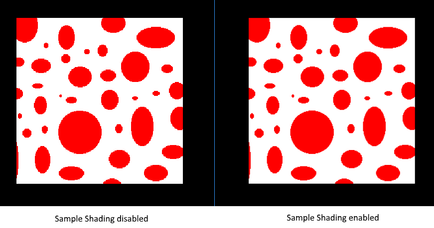

= 멀티샘플링 (Multisampling)
include::./common/header.adoc[]
:imagesdir!:

== 개요 (Introduction)

이제 우리 프로그램은 텍스처의 다양한 LOD(상세 수준)를 로드할 수 있어, 카메라와 멀리 떨어진 오브젝트를 렌더링할 때 발생하는 아티팩트(왜곡 현상)를 해결했습니다. 전체적인 이미지는 훨씬 부드러워졌지만, 자세히 살펴보면 그려진 기하학적 도형의 가장자리를 따라 톱날 모양의 계단 현상이 나타나는 것을 볼 수 있습니다. 이 현상은 사각형(Quad)을 렌더링했던 초기 프로그램 중 하나에서 특히 두드러지게 나타납니다.

NOTE: 작성자 이미지로 대체

image::./assets/rectangle_windows_mov.png[align=center,width=80%]

이처럼 원치 않는 왜곡 현상을 '외어리어싱(Aliasing)'footnote:[그냥 알리아싱으로 부르는 편이...] 이라고 부르며, 렌더링에 사용할 수 있는 픽셀의 수가 한정되어 있기 때문에 발생합니다. 해상도가 무한한 디스플레이는 존재하지 않으므로, 이 현상은 어떤 방식으로든 항상 보일 수밖에 없습니다. 이를 해결하는 방법은 여러 가지가 있는데, 이번 장에서는 가장 대중적인 방법 중 하나인 link:https://en.wikipedia.org/wiki/Multisample_anti-aliasing[MSAA(멀티샘플 안티외어리어싱)]footnote:[멀티샘플 안티 알리어싱 ㅡㅡ;]에 집중해 보겠습니다.

일반적인 렌더링에서는 화면에 표시될 대상 픽셀의 중심(대부분의 경우)에 위치한 단 하나의 샘플 포인트를 기준으로 픽셀 색상을 결정합니다. 그려지는 선의 일부가 특정 픽셀을 통과하더라도 이 샘플 포인트를 지나지 않으면 해당 픽셀은 빈 상태로 남게 되며, 결국 삐죽삐죽한 '계단 현상'으로 이어집니다.

MSAA가 하는 역할은 그 이름처럼 픽셀당 여러 개의 샘플 포인트를 사용하여 최종 색상을 결정하는 것입니다. 예상하시겠지만 샘플 수가 많을수록 더 나은 결과를 얻을 수 있지만, 그만큼 연산 비용도 커집니다.

이번 구현에서 우리는 하드웨어가 지원하는 최대 샘플 개수를 사용하는 데 초점을 맞출 것입니다. 다만 애플리케이션의 특성에 따라 이 방식이 항상 최선은 아닐 수 있습니다. **최종 결과물이 요구하는 품질 기준을 만족한다면, 더 높은 성능을 확보하기 위해 샘플 수를 낮추는 것이 더 좋은 선택**일 수 있습니다.

== 사용 가능한 샘플 개수 구하기 (Getting available sample count)

먼저 우리 하드웨어가 지원할 수 있는 샘플 수가 몇 개인지 알아보는 것부터 시작해 보겠습니다. 최신 GPU는 대부분 최소 8개의 샘플을 지원하지만, 이 수치가 모든 환경에서 동일하다고 보장할 수는 없습니다. 이 값을 계속 추적할 수 있도록 클래스 멤버 변수를 새로 추가하겠습니다.

[source,cpp]
----
...
VkSamplecountFlagBits _msaaSamples = VK_SAMPLE_COUNT_1_BIT;
...
----

기본적으로 우리는 픽셀당 하나의 샘플만 사용할 것인데, 이는 멀티샘플링을 적용하지 않는 것과 같습니다. 이 경우 최종 이미지는 이전과 완전히 동일합니다. 하드웨어가 지원하는 정확한 최대 샘플 수는 우리가 선택한 물리 디바이스의 {VkPhysicalDeviceProperties}[``VkPhysicalDeviceProperties``]에서 추출할 수 있습니다. 현재 우리는 뎁스 버퍼(깊이 버퍼)를 사용하고 있으므로, 컬러와 뎁스 각각의 샘플 개수를 모두 고려해야 합니다. 이 둘 모두가 지원하는(&) 가장 높은 샘플 수가 우리가 사용할 수 있는 최댓값이 됩니다. 이 정보를 가져올 함수를 하나 추가해 보겠습니다.

[source,cpp,opts="nowrap"]
----
VkSampleCountFlagBits getMaxUsableSampleCount() {
    VkPhysicalDeviceProperties properties;

    vkGetPhysicalDeviceProperties(_physicalDevice, &properties);

    VkSampleCountFlags count
        = properties.limits.framebufferColorSampleCounts & properties.limits.framebufferDepthSampleCounts;

    if (count & VK_SAMPLE_COUNT_64_BIT) {
        return VK_SAMPLE_COUNT_64_BIT;
    }

    if (count & VK_SAMPLE_COUNT_32_BIT) {
        return VK_SAMPLE_COUNT_32_BIT;
    }

    if (count & VK_SAMPLE_COUNT_16_BIT) {
        return VK_SAMPLE_COUNT_16_BIT;
    }

    if (count & VK_SAMPLE_COUNT_8_BIT) {
        return VK_SAMPLE_COUNT_8_BIT;
    }

    if (count & VK_SAMPLE_COUNT_4_BIT) {
        return VK_SAMPLE_COUNT_4_BIT;
    }

    if (count & VK_SAMPLE_COUNT_2_BIT) {
        return VK_SAMPLE_COUNT_2_BIT;
    }

    return VK_SAMPLE_COUNT_1_BIT;
}
----

이제 물리 디바이스를 선택하는 과정에서 이 함수를 호출하여 msaaSamples 변수를 설정하겠습니다. 이를 위해 pickPhysicalDevice 함수를 약간 수정해야 합니다.

[source,cpp]
----
void pickPhysicalDevice() {
    ...
    for (const auto& device : devices) {
        if (isDeviceSuitable(device)) {
            _physicalDevice = device;
            msaaSamples = getMaxUsableSampleCount();
            
            break;
        }
    }
    ...
}
----

== 렌더 타겟 설정하기 (Setting up render target)

MSAA 환경에서는 각 픽셀을 먼저 오프스크린 버퍼에서 샘플링한 다음 화면에 렌더링합니다. 이 새로운 버퍼는 지금까지 우리가 렌더링해 왔던 일반 이미지와는 조금 다릅니다. 픽셀당 하나 이상의 샘플을 저장할 수 있어야 하기 때문입니다. 이렇게 멀티샘플링 버퍼가 생성되고 나면, 이를 다시 (픽셀당 단 하나의 샘플만 저장하는) 기본 프레임버퍼로 리졸브(Resolve)해 주어야 합니다. 이 때문에 새로운 렌더 타겟을 추가로 생성하고 기존의 드로잉 과정을 수정해야 하는 것입니다. 깊이 버퍼(Depth buffer)와 마찬가지로 한 번에 하나의 드로잉 작업만 활성화되므로, 렌더 타겟은 하나만 있으면 됩니다. 다음과 같이 클래스 멤버를 추가해 줍니다.

[source,cpp]
----
...
VkImage _colorImage;
VkDeviceMemory _colorImageMemory;
VkImageView _colorImageView;
----

이 새로운 이미지는 픽셀당 지정된 개수의 샘플을 저장해야 하므로, 이미지를 생성할 때 {VkImageCreateInfo}[``VkImageCreateInfo``]에 이 수치를 전달해야 합니다. ``createImage`` 함수에 ``numSamples`` 파라미터를 추가하여 수정해 줍니다.

[source,cpp]
----
void createImage(uint32_t width, uint32_t height, uint32_t mipLevels, VkSampleCountFlagBits numSamples,
                 VkFormat format, VkImageTiling tiling, VkImageUsageFlags usage, VkMemoryPropertyFlags properties,
                 VkImage& image, VkDeviceMemory& imageMemory) {
    ...
    VkImageCreateInfo imageInfo{
        .sType = VK_STRUCTURE_TYPE_IMAGE_CREATE_INFO,
        .flags = 0,
        .imageType = VK_IMAGE_TYPE_2D,
        .format = format,
        .extent = extent,
        .mipLevels = mipLevels,
        .arrayLayers = 1,
        .samples = numSamples,
        .tiling = tiling,
        .usage = usage,
        .sharingMode = VK_SHARING_MODE_EXCLUSIVE,
        .initialLayout = VK_IMAGE_LAYOUT_UNDEFINED,
    };
    ...
}
----

우선은 구현을 진행하면서 적절한 값으로 대체할 수 있도록, 이 함수를 호출하는 모든 곳의 인자를 ``VK_SAMPLE_COUNT_1_BIT``로 업데이트해 둡니다.

[source,cpp,opts="nowrap"]
----
// void createDepthResources()
createImage(_swapChainExtent.width, _swapChainExtent.height, 1, VK_SAMPLE_COUNT_1_BIT, depthFormat,
            VK_IMAGE_TILING_OPTIMAL, VK_IMAGE_USAGE_DEPTH_STENCIL_ATTACHMENT_BIT,
            VK_MEMORY_PROPERTY_DEVICE_LOCAL_BIT, _depthImage, _depthImageMemory);

// void createTextureImage()
createImage(texWidth, texHeight, _mipLevels, VK_SAMPLE_COUNT_1_BIT, VK_FORMAT_R8G8B8A8_SRGB,
            VK_IMAGE_TILING_OPTIMAL,
            VK_IMAGE_USAGE_TRANSFER_SRC_BIT | VK_IMAGE_USAGE_TRANSFER_DST_BIT | VK_IMAGE_USAGE_SAMPLED_BIT,
            VK_MEMORY_PROPERTY_DEVICE_LOCAL_BIT, _textureImage, _textureImageMemory);
----

이제 멀티샘플링 컬러 버퍼를 생성해 보겠습니다. ``createColorResources`` 함수를 추가합니다. 여기서 ``createImage`` 함수의 파라미터로 ``msaaSamples``를 전달하고 있음에 주목하세요. 또한 밉 레벨(Mip level)은 단 1개만 사용하는데, Vulkan 명세상 픽셀당 1개 초과의 샘플을 갖는 이미지에는 밉맵을 사용할 수 없도록 강제되어 있기 때문입니다. 게다가 이 컬러 버퍼는 텍스처로 사용될 것이 아니기 때문에 애초에 밉맵이 필요하지도 않습니다.

[source,cpp]
----
void createColorResources() {
    VkFormat colorFormat = _swapChainImageFormat;

    createImage(_swapChainExtent.width, _swapChainExtent.height, 1, _msaaSamples, colorFormat,
                VK_IMAGE_TILING_OPTIMAL,
                VK_IMAGE_USAGE_TRANSIENT_ATTACHMENT_BIT | VK_IMAGE_USAGE_COLOR_ATTACHMENT_BIT,
                VK_MEMORY_PROPERTY_DEVICE_LOCAL_BIT, _colorImage, _colorImageMemory);

    _colorImageView = createImageView(_colorImage, colorFormat, VK_IMAGE_ASPECT_COLOR_BIT, 1);
}
----

일관성을 유지하기 위해, ``createDepthResources`` 바로 직전에 이 함수를 호출하도록 합니다.

[source,cpp]
----
void initVulkan() {
    ...
    createColorResources();
    createDepthResources();
    ...
}
----

멀티샘플링 컬러 버퍼가 준비되었으니 이제 깊이 버퍼를 처리할 차례입니다. ``createDepthResources`` 함수를 수정하여 깊이 버퍼가 사용하는 샘플 수를 업데이트해 줍니다.

[source,cpp]
----
void createDepthResources() {
    ...
    createImage(_swapChainExtent.width, _swapChainExtent.height, 1, _msaaSamples, depthFormat,
                VK_IMAGE_TILING_OPTIMAL, VK_IMAGE_USAGE_DEPTH_STENCIL_ATTACHMENT_BIT,
                VK_MEMORY_PROPERTY_DEVICE_LOCAL_BIT, _depthImage, _depthImageMemory);
    ...
}
----

몇 가지 새로운 Vulkan 리소스를 생성했으므로, 필요한 시점에 이 리소스들을 해제하는 것도 잊지 말고 작성해 줍니다.

[source,cpp]
----
void cleanupSwapChain() {
    vkDestroyImageView(_device, _colorImageView, nullptr);
    vkDestroyImage(_device, _colorImage, nullptr);
    vkFreeMemory(_device, _colorImageMemory, nullptr);
    ...
}
----

그리고 창 크기가 조절되었을 때 새로운 컬러 이미지가 올바른 해상도로 다시 생성될 수 있도록 ``recreateSwapChain`` 함수를 업데이트합니다.

[source,cpp]
----
void recreateSwapChain() {
    ...
    createImageViews();
    createColorResources();
    createDepthResources();
    ...
}
----

이제 MSAA의 초기 설정 단계를 마쳤습니다. 다음 단계에서는 이 새로운 리소스를 그래픽스 파이프라인, 프레임버퍼, 렌더 패스에 적용하고 그 결과를 확인해 보겠습니다!

== 새로운 어태치먼트 추가하기 (Adding new attachments)

먼저 렌더 패스(Render pass)부터 처리해 보겠습니다. ``createRenderPass`` 함수를 수정하고 컬러 및 깊이 어태치먼트(Attachment)의 생성 정보 구조체를 업데이트합니다.

[source,cpp]
----
// void createRenderPass()
...
VkAttachmentDescription colorAttachment{
    .format = _swapChainImageFormat,
    .samples = _msaaSamples,
    .loadOp = VK_ATTACHMENT_LOAD_OP_CLEAR,
    .storeOp = VK_ATTACHMENT_STORE_OP_STORE,
    .stencilLoadOp = VK_ATTACHMENT_LOAD_OP_DONT_CARE,
    .stencilStoreOp = VK_ATTACHMENT_STORE_OP_DONT_CARE,
    .initialLayout = VK_IMAGE_LAYOUT_UNDEFINED,
    .finalLayout = VK_IMAGE_LAYOUT_COLOR_ATTACHMENT_OPTIMAL,
};
...
VkAttachmentDescription depthAttachment{
    .format = findDepthFormat(),
    .samples = _msaaSamples,
    .loadOp = VK_ATTACHMENT_LOAD_OP_CLEAR,
    .storeOp = VK_ATTACHMENT_STORE_OP_DONT_CARE,
    .stencilLoadOp = VK_ATTACHMENT_LOAD_OP_DONT_CARE,
    .stencilStoreOp = VK_ATTACHMENT_STORE_OP_DONT_CARE,
    .initialLayout = VK_IMAGE_LAYOUT_UNDEFINED,
    .finalLayout = VK_IMAGE_LAYOUT_DEPTH_STENCIL_ATTACHMENT_OPTIMAL,
};
----

기존의 ``finalLayout``이 ``VK_IMAGE_LAYOUT_PRESENT_SRC_KHR``에서 ``VK_IMAGE_LAYOUT_COLOR_ATTACHMENT_OPTIMAL``로 변경된 것을 볼 수 있습니다. 멀티샘플링된 이미지는 화면에 직접 프레젠트(출력)할 수 없기 때문입니다. 따라서 이를 일반 이미지로 먼저 리졸브(Resolve)해 주어야 합니다. 이 제약은 화면에 출력될 일이 없는 깊이 버퍼에는 적용되지 않습니다. 결과적으로 우리는 이른바 '리졸브 어태치먼트'라고 불리는, 컬러를 위한 단 하나의 새로운 어태치먼트만 추가하면 됩니다.

[source,cpp]
----
// void createRenderPass()
...
VkAttachmentDescription colorAttachmentResolve{
    .format = _swapChainImageFormat,
    .samples = VK_SAMPLE_COUNT_1_BIT,
    .loadOp = VK_ATTACHMENT_LOAD_OP_DONT_CARE,
    .storeOp = VK_ATTACHMENT_STORE_OP_STORE,
    .stencilLoadOp = VK_ATTACHMENT_LOAD_OP_DONT_CARE,
    .stencilStoreOp = VK_ATTACHMENT_STORE_OP_DONT_CARE,
    .initialLayout = VK_IMAGE_LAYOUT_UNDEFINED,
    .finalLayout = VK_IMAGE_LAYUOUT_PRESENT_SRC_KHR,
};
...
----

이제 멀티샘플링된 컬러 이미지를 일반 어태치먼트로 리졸브하도록 렌더 패스에 지시해야 합니다. 리졸브 타겟 역할을 할 컬러 버퍼를 가리키는 새로운 어태치먼트 참조(Attachment reference)를 생성합니다.

[source,cpp]
----
// void createRenderPass()
...
VkAttachmentReference colorAttachmentResolveRef{
    .attachment = 2,
    .layout = VK_IMAGE_LAYOUT_COLOR_ATTACHMENT_OPTIMAL,
};
...
----

서브패스(Subpass) 구조체의 ``pResolveAttachments`` 멤버가 방금 생성한 어태치먼트 참조를 가리키도록 설정합니다. 이것만으로도 렌더 패스가 멀티샘플 리졸브 작업을 정의하도록 만들 수 있으며, 이를 통해 이미지를 화면에 렌더링할 수 있게 됩니다.

[source,cpp]
----
// void createRenderPass()
...
VkSubpassDescription subpass{
    .pipelineBindPoint = VK_PIPELINE_BIND_POINT_GRAPHICS,
    .colorAttachmentCount = 1,
    .pColorAttachments = &colorAttachmentRef,
    .pDepthStencilAttachment = &depthAttachmentRef,
    .pResolveAttachment = &colorAttachmentResolveRef,
};
...
----

멀티샘플링된 컬러 이미지를 재사용하기 때문에, {VkSubpassDependency}[``VkSubpassDependency``]의 ``srcAccessMask``를 반드시 업데이트해야 합니다. 이 업데이트를 통해 컬러 어태치먼트에 대한 모든 쓰기 작업이 다음 작업 시작 전에 완료되도록 보장하며, 렌더링 결과가 불안정해질 수 있는 WAW(Write-After-Write) 해저드(데이터 의존성 문제)를 방지할 수 있습니다.

[source,cpp]
----
// void createRenderPass()
...
VkSubpassDependency dependency{
    .srcSubpass = VK_SUBPASS_EXTERNAL,
    .dstSubpass = 0,
    .srcStageMask = VK_PIPELINE_STAGE_COLOR_ATTACHMENT_OUTPUT_BIT | VK_PIPELINE_STAGE_LATE_FRAGMENT_TESTS_BIT,
    .dstStageMask = VK_PIPELINE_STAGE_COLOR_ATTACHMENT_OUTPUT_BIT | VK_PIPELINE_STAGE_EARLY_FRAGMENT_TESTS_BIT,
    .srcAccessMask = VK_ACCESS_COLOR_ATTACHMENT_WRITE_BIT | VK_ACCESS_DEPTH_STENCIL_ATTACHMENT_WRITE_BIT,
    .dstAccessMask = VK_ACCESS_COLOR_ATTACHMENT_WRITE_BIT | VK_ACCESS_DEPTH_STENCIL_ATTACHMENT_WRITE_BIT,
};
...
----

이제 새로운 컬러 어태치먼트를 포함하도록 렌더 패스 정보 구조체를 업데이트합니다.

[source,cpp]
----
// void createRenderPass()
std::array<VkAttachmentDescription, 3> attachments = {
    colorAttachment,
    depthAttachment,
    colorAttachmentResolve,
};
----

렌더 패스 설정이 완료되었으므로, ``createFramebuffers`` 함수를 수정하여 목록에 새로운 이미지 뷰(Image view)를 추가합니다.

[source,cpp]
----
void createFramebuffers() {
    ...
    std::array<VkImageView, 3> attachments = {
        _colorImageView,
        _depthImageView,
        _swapChainImageViews[i],
    };
    ...
}
----

마지막으로 ``createGraphicsPipeline`` 함수를 수정하여, 새로 생성된 파이프라인이 하나 이상의 샘플을 사용하도록 설정합니다.

[source,cpp]
----
void createGraphicsPipeline() {
    ...
    VkPipelineMultisampleStateCreateInfo multisampling{
        .sType = VK_STRUCTURE_TYPE_PIPELINE_MULTISAMPLE_STATE_CREATE_INFO,
        .rasterizationSamples = _msaaSamples,
        .sampleShadingEnable = VK_FALSE,
    };
    ...
}
----

이제 프로그램을 실행하면 다음과 같은 결과를 볼 수 있습니다.

밉매핑(Mipmapping) 때와 마찬가지로, 변화가 바로 눈에 띄지 않을 수도 있습니다. 하지만 자세히 살펴보면 가장자리의 톱날 모양 계단 현상이 줄어들고, 원본에 비해 전체적인 이미지가 한층 부드러워진 것을 확인할 수 있습니다.

가장자리 중 하나를 가까이서 확대해 보면 그 차이가 더욱 명확하게 드러납니다.

== 품질 개선하기 (Quality improvements)

현재 우리가 구현한 MSAA 방식에는 몇 가지 한계가 있어, 디테일이 복잡한 장면에서는 출력 이미지의 품질에 영향을 줄 수 있습니다. 예를 들어, 지금은 셰이더 에일리어싱(Shader aliasing)으로 인해 발생할 수 있는 문제를 해결하지 못합니다. 즉, MSAA는 기하학적 도형의 가장자리만 부드럽게 만들 뿐, 내부를 채우는 영역에는 영향을 주지 못합니다. 이 때문에 화면에 렌더링된 다각형의 외각선은 부드럽지만, 대비가 강한 색상이 포함된 텍스처를 적용하면 내부 텍스처에는 여전히 계단 현상이 남아 지저분해 보일 수 있습니다. 이 문제에 접근하는 한 가지 방법은 '샘플 셰이딩(link:https://www.khronos.org/registry/vulkan/specs/1.3-extensions/html/chap27.html#primsrast-sampleshading[Sample Shading])'을 활성화하는 것입니다. 이를 통해 성능 비용은 추가로 들지만 이미지 품질을 훨씬 더 끌어올릴 수 있습니다.

[source,cpp, opts="nowrap"]
----
void createLogicalDevice() {
    ...
    deviceFeatures.sampleRateShading = VK_TRUE;  // enable sample shading feature for the device
    ...
}

void createGraphicsPipeline() {
    ...
    multisampling.sampleShadingEnable= VK_TRUE;  // enable sample shading in the pipeline
    multisampling.minSampleShading = .2f;  // min fraction for sample shading; closer to one is smoother
    ...
}
----

이번 예제에서는 샘플 셰이딩을 비활성화된 상태로 두겠지만, 특정 상황에서는 품질 개선 효과를 확실히 체감할 수 있을 것입니다.

== 마치며 (Conclusion)

여기까지 오는데 정말 많은 노력이 필요했지만, 이제 여러분은 마침내 Vulkan 프로그램을 개발하기 위한 훌륭한 기반을 갖추게 되었습니다. 여러분이 이제 막 습득한 Vulkan의 기본 원리들에 대한 지식은 다음과 같은 더 많은 기능들을 탐구하기에 충분할 것입니다.

* 푸시 상수
* 인스턴스드 렌더링
* 다이내믹 유니폼
* 분리된 이미지 및 샘플러 디스크립터
* 파이프라인 캐시
* 멀티스레드 커맨드 버퍼 생성
* 다중 서브패스
* 컴퓨트 셰이더

현재 프로그램은 블린-퐁 라이팅(Blinn-Phong lighting), 포스트 프로세싱 이펙트(후처리 효과), 섀도 매핑(그림자 매핑) 등을 추가하는 등 다양한 방식으로 확장할 수 있습니다. Vulkan이 명시적인 API이긴 하지만 많은 개념이 다른 그래픽스 API와 동일하게 작동하므로, 다른 API용 튜토리얼을 통해서도 이러한 효과들의 작동 방식을 충분히 배우실 수 있을 것입니다.