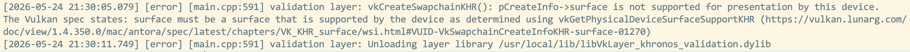

= Swap chain
include::../common/header.adoc[]
:imagesdir!:

{vk}은 "기본 프레임 버퍼"의 개념이 없으므로 화면에서 시각화하기 전에 렌더링 할 버퍼를 소유 할 인프라가 필요합니다. 이 인프라는 {swchain}으로 알려져 있으며 {vk}에서 명시적으로 생성되어야 합니다. 스왑 체인은 본질적으로 화면에 표시되기를 기다리는 이미지 대기열입니다. 우리의 응용 프로그램은 그러한 이미지를 획득하여 그 다음에 대기열로 반환합니다. 대기열이 정확히 작동하는 방법과 대기열에서 이미지를 제시하는 조건은 {swchain}이 설정되는 방법에 따라 다르지만 {swchain}의 일반적인 목적은 이미지의 프레젠테이션을 화면의 재생 빈도와 동기화하는 것입니다.

== 스왑 체인 지원 확인 (Checking for swap chain support)

##모든 그래픽 카드가 여러 가지 이유로 이미지를 화면에 직접 표시 할 수있는 것은 아닙니다. 예를 들어 서버를 위해 설계되었으며 디스플레이 출력이 없기 때문입니다. 둘째, 이미지 프레젠테이션이 창 시스템과 창문과 관련된 {surface}에 크게 묶여 있기 때문에 실제로 {vk} 코어의 일부가 아닙니다. 지원을 요청한 후 ``VK_KHR_swapchain`` 장치 확장을 활성화해야 합니다##(__Not all graphics cards are capable of presenting images directly to a screen for various reasons, for example because they are designed for servers and don't have any display outputs. Secondly, since image presentation is heavily tied into the window system and the surfaces associated with windows, it is not actually part of the Vulkan core. You have to enable the VK_KHR_swapchain device extension after querying for its support__).

이러한 목적을 위해 먼저 ``isDeviceSuitable`` 함수를 확장하여 이 확장이 지원되는지 확인합니다. 이전에 {VkPhysicalDevice}[``VkPhysicalDevice``]에서 지원하는 확장 프로그램을 나열하는 방법을 보았으므로 그렇게 하는 것은 상당히 간단해야 합니다. {vk} 헤더 파일은 ``VK_KHR_swapchain``으로 정의되는 멋진 매크로 ``VK_KHR_SWAPCHAIN_EXTENSION_NAME``을 제공합니다. 이 매크로를 사용하는 장점은 컴파일러가 철자 오류를 잡을 것이라는 것입니다.

먼저 활성화할 유효성 검사 계층 목록과 유사한 필요한 장치 확장 프로그램 목록을 선언합니다.

[source,cpp]
----
const std::vector<const char*> deviceExtensions = {
    VK_KHR_SWAPCHAIN_EXTENSION_NAME,
};
----

그런 다음 ``isDeviceSuitable``에서 호출되는 새 함수 ``checkDeviceExtensionSupport``를 추가 검사로 만듭니다.

[source,cpp]
----
bool isDeviceSuitable(VkPhysicalDevice device) {
    QueueFamilyIndices = findQueueFamilies(device);
    bool extensionSupported = checkDeviceExtensionSupport(device);

    return indices.isComplete() && extensionSupported;
}

bool checkDeviceExtensionSupport(VkPhysicalDevice device) {
    return true;
}
----

함수의 본문을 수정하여 확장을 열거하고 필요한 모든 확장이 그들 사이에 있는지 확인합니다.

[source,cpp]
----
bool checkDeviceExtensionSupport(VkPhysicalDevice device) {
    uint32_t extensionCount;
    vkEnumerateDeviceExtensionProperties(device, nullptr, &extensionCount, nullptr);
    
    std::vector<VkExtensionProperties> availableExteions(extensionCount);
    vkEnumerateDeviceExtensionProperties(device, nullptr, &extensionCount, availableExtensions.data());

    std::set<std::string> requiredExtensions(deviceExtensions.begin(), deviceExtensions.end());

    for (const auto& extension: availableExtensions) {
        requiredExtensions.erase(extension.extensionName);
    }

    return requiredExtensions.empty();
}
----

확인되지 않은 필수 확장을 나타내기 위해 여기에 문자열 세트를 사용하기로 결정했습니다. 그렇게 하면 사용 가능한 확장의 순서를 열거하면서 쉽게 체크 아웃할 수 있습니다. 물론`` checkValidationLayerSupport``와 같은 중첩 루프를 사용할 수도 있습니다. ##성능 차이는 무관하다##(__The performance difference is irrelevant__). 이제 코드를 실행하고 그래픽 카드가 실제로 {swchain}을 만들 수 있는지 확인합니다. 이전 장에서 확인한 것처럼 프레젠테이션 대기열의 가용성은 {swchain} 확장이 지원되어야 함을 의미합니다. 그러나 사물에 대해 명시하는 것은 여전히 좋으며 확장은 명시적으로 활성화되어야 합니다.

== 장치 확장 활성화 (Enabling device extensions)

{swchain}을 사용하려면 ``VK_KHR_swapchain`` 확장 프로그램을 먼저 활성화해야 합니다. 확장을 활성화하려면 논리적 장치 생성 구조에 대한 작은 변경이 필요합니다.

[source,cpp]
----
createInfo.enabledExtensionCount = static_cast<uint32_t>(deviceExtensions.size());
createInfo.ppEnabledExtensionNames = deviceExtensions.data();
----

##기존 ``createInfo.enabledExtensionCount = 0;`` 그렇게 할 때 교체하십시오##(__Make sure to replace the existing line createInfo.enabledExtensionCount = 0; when you do so__).

== 스왑 체인 지원의 세부 정보 쿼리 (Querying details of swap chain support)

{swchain}을 사용할 수 있는지 확인하는 것만으로는 충분하지 않습니다. 실제로 {windowSurface}과 호환되지 않을 수 있기 때문입니다. {swchain}을 만드는 것은 또한 인스턴스 및 장치 생성보다 훨씬 더 많은 설정을 포함하므로 진행하기 전에 더 자세한 내용을 쿼리해야 합니다.

기본적으로 우리가 확인해야 할 세 가지 종류의 속성이 있습니다.

* ##기본적인 {surface} 가능성 (스왑 체인, 분/최대 폭 및 이미지의 고도에 있는 이미지의 최소/최대 수)##(__Basic surface capabilities (min/max number of images in swap chain, min/max width and height of images)__)
* {surface} 형식 (픽셀 형식, 색깔 공간)
* 사용 가능한 프레젠테이션 모드

``findQueueFamilies``와 비슷하게 이러한 세부 정보를 쿼리 한 후 이러한 세부 정보를 전달하는 방법을 사용합니다. 앞서 언급 한 세 가지 유형의 속성은 다음 구조 및 구조 목록의 형태로 제공됩니다.

[source,cpp]
----
struct SwapChainSupportDetails {
    VkSurfaceCapabilitiesKHR capabilities;
    std::vector<VkSurfaceFormatKHR> formats;
    std::vector<VkPresentModeKHR> presentModes;
};
----

이제 이 구조체를 채우는 새로운 함수 ``querySwapChainSupport``를 만들 것입니다.

[source,cpp]
----
SwapChainSupportDetails querySwapChainSupport(VkPhysicalDevice device) {
    SwapChainSupportDetails details;

    return details;
}
----

이 섹션에서는 이 정보를 포함하는 구조체를 쿼리하는 방법을 다룹니다. 이러한 구조체의 의미와 그들이 포함하는 데이터는 다음 섹션에서 논의됩니다.

기본 {surface} 기능부터 시작하겠습니다. 이러한 속성은 쿼리가 간단하며 단일 ``VkSurfaceCapabilitiesKHR`` 구조체로 반환됩니다.

[source,cpp]
----
vkGetPhysicalDeviceSurfaceCapabilitiesKHR(device, surface, &details.capabilities);
----

이 기능은 지원되는 기능을 결정할 때 지정된 {VkPhysicalDevice}[``VkPhysicalDevice``] 및 ``VkSurfaceKHR`` {windowSurface}을 고려합니다. 모든 지원 쿼리 함수는 {swchain}의 핵심 구성 요소이기 때문에 이 두 가지를 첫 번째 매개 변수로 가지고 있습니다.

다음 단계는 지원되는 {surface} 형식을 쿼리하는 것입니다. 이것은 구조대의 명부이기 때문에, 그것은 2개의 기능 외침의 익숙한 의식을 따릅니다:

[source,cpp]
----
uint32_t formatCount;
vkGetPhysicalDeviceSurfaceFormatsKHR(device, surface, &formatCount, nullptr);

if (formatCount != 0) {
    details.formats.resize(formatCount);
    vkGetPhysicalDeviceSurfaceFormatsKHR(device, surface, &formatCount, details.formats.data());
}
----

벡터가 사용 가능한 모든 형식을 보유하도록 크기를 조정했는지 확인합니다. 마지막으로 지원되는 프레젠테이션 모드를 쿼리하는 것은 ``vkGetPhysicalDeviceSurfacePresentModesKHR``과 정확히 동일한 방식으로 작동합니다.

[source,cpp]
----
uint32_t presentModeCount;
vkGetPhysicalDeviceSurfacePresentModesKHR(device, surface, &presentModeCount, nullptr);

if (presentModeCount != 0) {
    details.presentModes.resize(presentModeCount);
    vkGetPhysicalDeviceSurfacePresentModesKHR(device, surface, &presentModeCount, details.presentModes.data());
}
----

##모든 세부 사항은 현재 구조체에 있으므로 이 기능을 사용하여 다시 한 번 ``isDeviceSuitable``을 확장하여 {swchain} 지원이 적절한지 확인합시다. {swchain} 지원은 우리가 가지고있는 창 표면을 감안할 때 지원되는 이미지 형식과 하나의 지원되는 프레젠테이션 모드가있는 경우이 자습서에 충분합니다##(__All of the details are in the struct now, so let's extend isDeviceSuitable once more to utilize this function to verify that swap chain support is adequate. Swap chain support is sufficient for this tutorial if there is at least one supported image format and one supported presentation mode given the window surface we have.__).

[source,cpp]
----
bool swapChainAdequate = false;

if (extensionsSupported) {
    SwapChainSupportDetails swapChainSupport = querySwapChainSupport(device);
    swapChainAdequate = !swapChainSupport.formats.empty() && swapChainSupport.presentModes.empty();
}
----

확장이 가능한지 확인한 후에만 {swchain} 지원을 쿼리하려고 하는 것이 중요합니다. 함수(``__isDeviceSuitable()__``)의 마지막 줄은 다음과 같이 변경됩니다.

[source,cpp]
----
return indices.isComplete() && extensionsSupported && swapChainAdequate;
----

== 스왑 체인에 적합한 설정 선택 (Choosing the right settings for the swap chain)

``swapChainAdequate`` 조건이 충족되면 지원은 확실히 충분하지만 다양한 최적 모드가 여전히 있을 수 있습니다. 이제 최상의 {swchain}에 적합한 설정을 찾기 위해 몇 가지 기능을 작성할 것입니다. 결정하기 위한 세 가지 유형의 설정이 있습니다.

* {surface} 형식 (색상 깊이)
* 프레젠테이션 모드 (이미지를 화면에 "스왑"하기위한 조건)
* 스왑 범위 (스왑 체인에서 이미지의 해상도)

이러한 각 설정에 대해 우리는 그것이 사용 가능한 경우 함께 갈 것이라는 점을 염두에두고 다음 최고의 것을 찾기 위해 몇 가지 논리를 만들 것입니다.

=== Surface 형식 (Surface format)

이 설정에 대한 기능은 이렇게 시작됩니다. 나중에 ``SwapChainSupportDetails``의 형식 멤버를 인수로 전달합니다.

[source,cpp]
----
VkSurfaceFormatKHR chooseSwapSurfaceFormat(const std::vector<VkSurfaceFormatKHR>& availableFormats) {

}
----

각 ``VkSurfaceFormatKHR`` 항목에는 ``format``과 ``colorSpace`` 멤버가 포함되어 있습니다. ``format`` 멤버는 색상 채널 및 유형을 지정합니다. 예를 들어, ``VK_FORMAT_B8G8R8A8_SRGB``는 B, G, R 및 알파 채널(A)을 픽셀당 총 32비트에 대해 8비트 부호 없는 정수로 해당 순서로 저장한다는 것을 의미합니다. ``colorSpace`` 멤버는 SRGB 색상 공간이 ``VK_COLOR_SPACE_SRGB_NONLINEAR_KHR`` 플래그를 지원하거나 사용하지 않는지 여부를 나타냅니다. 이 플래그는 사양의 이전 버전에서 ``VK_COLORSPACE_SRGB_NONLINEAR_KHR``이라고 하는 데 사용되었습니다.

.format 예시
[TIP]
====
```
VK_FORMAT_B8G8R8A8_SRGB
          ________
          │││││││└── 8BIT
          ││││││└─── Alpha
          │││││└──── 8BIT
          ││││└───── Red
          │││└────── 8BIT
          ││└─────── Green
          │└──────── 8BIT
          └───────── Blue
```
====

색상 공간의 경우 SRGB를 사용할 수 있습니다. link:http://stackoverflow.com/questions/12524623/[##더 정확한 인식된 색상을 초래하기 때문입니다##](__results in more accurate perceived colors__). 또한 나중에 사용할 텍스처와 같은 이미지의 표준 색상 공간입니다. 그 때문에 우리는 또한 SRGB 색상 형식을 사용해야하며, 그 중 가장 일반적인 것 중 하나는 ``VK_FORMAT_B8G8R8A8_SRGB``입니다.

목록을 살펴보고 선호하는 조합을 사용할 수 있는지 살펴 보겠습니다.

[source,cpp]
----
for (const auto& format : availableFormats) {
    if (format.format == VK_FORMAT_B8G8R8A8_SRGB && format.colorSpace == VK_COLOR_SPACE_SRGB_NONLINEAR_KHR) {
        return format;
    }
}
----

그것이 또한 실패하면 **좋은**방법에 따라 사용 가능한 형식 순위를 시작할 수 있지만 대부분의 경우 지정된 첫 번째 형식으로 정착하는 것이 좋습니다.

[source,cpp]
----
VkSurfaceFormatKHR chooseSwapSurfaceFormat(const std::vector<VkSurfaceFormatKHR>& availableFormats) {
    for (const auto& format : availableFormats) {
        if (format.format == VK_FORMAT_B8G8R8A8_SRGB && format.colorSpace == VK_COLOR_SPACE_SRGB_NONLINEAR_KHR) {
            return format;
        }
    }

    return availableFormats[0];
}
----

== 프리젠테이션 모드 (Presentation mode)

프리젠테이션 모드는 틀림없이 {swchain}의 가장 중요한 설정입니다. 왜냐하면 그것은 화면에 이미지를 표시하는 실제 조건을 나타 내기 때문입니다. {vk}에는 4가지 가능한 모드가 있습니다.

[cols="4a,6",options=header]
|===
| 모드
| 설명

| ``VK_PRESENT_MODE_IMMEDIATE_KHR``
| ##신청서에 의해 제출된 이미지는 즉시 화면으로 전송되어 찢어질 수 있습니다##(__Images submitted by your application are transferred to the screen right away, which may result in tearing__).

| ``VK_PRESENT_MODE_FIFO_KHR``
| ##{swchain}은 디스플레이가 새로 고쳐지고 프로그램이 큐 뒷면에 렌더링된 이미지를 삽입할 때 디스플레이가 대기열의 전면에서 이미지를 찍는 대기열입니다. 대기열이 가득 찼으면 프로그램이 기다려야합니다. 이것은 현대 게임에서 발견되는 수직 동기화와 가장 유사합니다. 디스플레이가 새로 고쳐지는 순간은 "수직 공백"으로 알려져 있습니다##(__The swap chain is a queue where the display takes an image from the front of the queue when the display is refreshed and the program inserts rendered images at the back of the queue. If the queue is full then the program has to wait. This is most similar to vertical sync as found in modern games. The moment that the display is refreshed is known as "vertical blank"__).

| ``VK_PRESENT_MODE_MODE_RELAXED_KHR``
| ##이 모드는 애플리케이션이 늦었고 마지막 세로 빈에서 대기열이 비어 있는 경우에만 이전 모드와 다릅니다. 다음 세로 공백을 기다리는 대신 이미지가 마침내 도착하면 이미지가 즉시 전송됩니다. 이것은 눈에 보이는 찢어짐을 초래할 수 있습니다##(__This mode only differs from the previous one if the application is late and the queue was empty at the last vertical blank. Instead of waiting for the next vertical blank, the image is transferred right away when it finally arrives. This may result in visible tearing__).

| ``VK_PRESENT_MODE_MAILBOX_KHR``
| ##이것은 두 번째 모드의 또 다른 변형입니다. 대기열이 가득 차면 응용 프로그램을 차단하는 대신 이미 대기열에 있는 이미지는 단순히 새 이미지로 대체됩니다. 이 모드는 여전히 찢어짐을 피하면서 가능한 한 빨리 프레임을 렌더링하는 데 사용할 수 있으므로 표준 수직 동기화보다 대기 시간 문제가 적습니다. 이것은 일반적으로 "트리플 버퍼링"으로 알려져 있지만, 세 개의 버퍼의 존재만으로도 프레임 속도가 잠금 해제된다는 것을 반드시 의미하지는 않습니다##(__This is another variation of the second mode. Instead of blocking the application when the queue is full, the images that are already queued are simply replaced with the newer ones. This mode can be used to render frames as fast as possible while still avoiding tearing, resulting in fewer latency issues than standard vertical sync. This is commonly known as "triple buffering", although the existence of three buffers alone does not necessarily mean that the framerate is unlocked__).
|===

``VK_PRESENT_MODE_FIFO_KHR`` 모드만 사용할 수 있으므로 사용 가능한 최상의 모드를 찾는 함수를 다시 작성해야 합니다.

[source,cpp]
----
VkPresentModeKHR chooseSwapPresentMode(const std::vector<VkPresentModeKHR>& availablePresentModes) {
    return VK_PRESENT_MODE_FIFO_KHR;
}
----

저는 개인적으로 ``VK_PRESENT_MODE_MAILBOX_KHR``이 에너지 사용이 문제가되지 않으면 매우 좋은 절충안이라고 생각합니다. 그것은 우리가 수직 공백까지 가능한 한 최신의 새로운 이미지를 렌더링하여 상당히 낮은 대기 시간을 유지하면서 여전히 찢어지는 것을 피할 수 있습니다. 에너지 사용량이 더 중요한 모바일 장치에서는 ``VK_PRESENT_MODE_FIFO_KHR`` 대신 사용할 수 있습니다. 이제 목록을 살펴보고 ``VK_PRESENT_MODE_MAILBOX_KHR``을 사용할 수 있는지 살펴보겠습니다.

[source,cpp]
----
VkPrensetModeKHR chooseSwapPresentMode(const std::vector<VkPresentModeKHR>& availablePresentModes) {
    for (const auto& presentMode : availablePresentModes) {
        if (presentMode == VK_PRESENT_MODE_MAILBOX_KHR) {
            reteurn presentMode; // 지원할 경우 VK_PRESENT_MODE_MAILBOX_KHR 사용
        }
    }

    return VK_PRESENT_MODE_FIFO_KHR;
}
----

=== 스왑 범위 (Swap extent)

그것은 하나의 주요 속성 만 남겨 두며, 우리는 하나의 마지막 기능을 추가합니다.

[source,cpp]
----
VkExtent2D chooseSwapExtent(const VkSurfaceCapabilitiesKHR& capabilities) {

}
----

{swextent}는 {swchain} 이미지의 해상도이며 픽셀로 그리는 창의 해상도와 거의 항상 동일합니다 (잠시 후 더). 가능한 해상도의 범위는 ``VkSurfaceCapabilitiesKHR`` 구조체에서 정의됩니다. {vk}은 ``currentExtent`` 멤버의 너비와 높이를 설정하여 창의 해상도와 일치하도록 지시합니다. 그러나 일부 창 관리자는 여기에서와 다를 수 있으며 이는 현재의 너비와 높이를 ``uint32_t``의 최대 값으로 설정하여 표시됩니다. 이 경우 ``minImageExtent`` 및 ``maxImageExtent`` 바운드 내에서 창과 가장 잘 일치하는 해상도를 선택합니다. 그러나 우리는 올바른 단위에 해상도를 지정해야 합니다.

GLFW는 크기를 측정할 때 픽셀과 화면 좌표의 두 단위를 사용합니다. 예를 들어 창을 만들 때 이전에 지정한 해상도 ``{WIDTH, HEIGHT}`` 화면 좌표에서 측정됩니다. 그러나 {vk}은 픽셀로 작동하므로 {swchain} 범위는 픽셀에도 지정되어야합니다. 불행히도 높은 DPI 디스플레이(Apple의 Retina 디스플레이와 같은)를 사용하는 경우 화면 좌표는 픽셀에 해당하지 않습니다. 대신 픽셀 밀도가 높기 때문에 픽셀의 창의 해상도는 화면 좌표의 해상도보다 커집니다. 따라서 {vk}이 우리를 위해 스왑 범위를 수정하지 않으면 원본 ``{WIDTH, HEIGHT}``만 사용할 수 없습니다. 대신, 우리는 ``gfwGetFramebufferSize``를 사용하여 최소 및 최대 이미지 범위와 일치시키기 전에 픽셀에서 창의 해상도를 쿼리해야 합니다.

[source,cpp]
----
#include <cstdint>
#include <limits>
#include <algorithm>
...
VkExtent2D chooseSwapExtent(const VkSurfaceCapabilitiesKHR& capabilities) {
    if (capabilities.currentExtnt.width != std::numeric_limits<uint32_t>::max()) {
        return capabilities.currentExtent;
    }

    int width, height;
    glfwGetFramebufferSize(_window, &width, &height);

    VkExtent2D actualExtent = {
        static_cast<uint32_t>(width),
        static_cast<uint32_t>(height),
    };

    actualExtent.width = std::clamp(actualExtent.width, capabilities.minImageExtent.width, capabilities.maxImageExtent.width);
    actualExtent.height = std::clamp(actualExtent.height, capabilities.minImageExtent.height, capabilities.maxImageExtent.height);

    return actualExtent;
}
----

``clamp`` 함수는 구현에서 지원하는 허용된 최소 범위와 최대 범위 사이의 너비와 높이의 값을 바인딩하는 데 사용됩니다.

== 스왑 체인 만들기 (Creating the swap chain)

이제 우리는 런타임에 우리가해야 할 선택을 지원하는 이러한 모든 도우미 기능을 가지고 있으므로 마침내 실제 {vk}을 만드는 데 필요한 모든 정보를 갖게되었습니다.

##``createSwapChain`` 함수는 이러한 호출의 결과로 시작하여 논리적 장치 생성 후 ``initVulkan``에서 호출해야 합니다##(__Create a createSwapChain function that starts out with the results of these calls and make sure to call it from initVulkan after logical device creation__).

[source,cpp]
----
void initVulkan() {
    createInstance();
    setupDebugMessenger();
    createSurface();
    pickPhysicalDevice();
    createLogicalDevice();
    createSwapChain();
}

void createSwapChain() {
    SwapChainSupportDetails swapChainSupport = querySwapChainSupport(_physicalDevice);
    VkSurfaceFormatKHR surfaceFormat = chooseSwapChainSurfaceFormat(swapChainSupport.format);
    VkPresentModeKHR presentMode = chooseSwapPresentMode(swapChainSupport.presentModes);
    VkExtent2D extent = chooseSwapExtent(swapChainSupport.capabilities);
}
----

이러한 속성 외에도 우리는 {swchain}에서 얼마나 많은 이미지를 갖고 싶은지 결정해야 합니다. 구현은 작동해야 하는 최소 숫자를 지정합니다:

[source,cpp]
----
uint32_t imageCount = swapChainSupport.capabilities.minImageCount;
----

그러나 단순히 최소값을 고수한다는 것은 우리가 렌더링 할 다른 이미지를 얻기 전에 때때로 내부 작업을 완료하기 위해 드라이버를 기다려야 할 수도 있음을 의미합니다. 따라서 최소 이미지보다 적어도 하나의 이미지를 더 요청하는 것이 좋습니다.

[source,cpp]
----
uint32_t imageCount = swapChainSupport.capabilities.minImageCount + 1;
----

또한 이렇게 하는 동안 최대 이미지 수를 초과하지 않도록 해야 합니다. 여기서 0은 최대 값이 없음을 의미하는 특수 값입니다.

[source,cpp]
----
if (swapChainSupport.capabilities.maxImageCount > 0 && imageCount > swapChainSupport.capabilities.maxImageCount) {
    imageCount = swapChainSupport.capabilities.maxImageCount;
}
----

{vk} 객체의 전통과 마찬가지로 {swchain} 개체를 만들려면 구조체의 맴버 변수에 값을 할당해야 합니다. 그것은 매우 친숙하게 시작됩니다:

[source,cpp]
----
VkSwapchainCreateInfoKHR createInfo{
    .sType = VK_STRUCTURE_TYPE_SWAPCHAIN_CREATE_INFO_KRH,
    .surface = _surface,
    .minImageCount = imageCount,
    .imageFormat = surfaceFormat.format,
    .imagColorSpace = surfaceFormat.colorSpace,
    .imageExtent = extent,
    .imageArrayLayers = 1,
    .imageUsage = VK_IMAGE_USAGE_COLOR_ATTACHMENT_BIT,
};
----

``imageArrayLayers``는 각 이미지가 구성하는 레이어의 양을 지정합니다. 이것은 입체영상(stereoscopic) 3D 응용 프로그램을 개발하지 않는 한 **항상 1**입니다. ``imageUsage`` 비트 필드는 {swchain}의 이미지를 어떤 종류의 작업에 사용할지 지정합니다. 이 튜토리얼에서는 그들에게 직접 렌더링 할 것입니다. 즉, 색상 첨부 파일로 사용됩니다. 또한 이미지를 별도의 이미지로 렌더링하여 후 처리와 같은 작업을 수행할 수도 있습니다. 이 경우 대신 ``VK_IMAGE_USAGE_TRANSFER_DST_BIT``와 같은 값을 사용하고 메모리 작업을 사용하여 렌더링된 이미지를 스왑 체인 이미지로 전송할 수 있습니다.

[source,cpp]
----
QueueFamilyIndides indices = findQueueFamilies(_pysicalDevice);
uint32_t queueFamilyIndices[] = {
    indices.graphicsFamily.value(),
    indices.presentFamily.value(),
};

if (indices.graphicsFamily != indices.presentFamily) {
    createInfo.imageSharingMode = VK_SHARING_MODE_CONCURRENT;
    createInfo.queueFamilyIndexCount = 2;
    createInfo.pQueueFamilyIndices = queueFamilyIndices;
} else {
    createInfo.imageSharingMode = VK_SHARING_MODE_EXCLUSIVE;
    createInfo.queyeFamilyIndexCount = 0; // Optional
    createInfo.pQueueFamilyIndices = nullptr; // Optional
}
----

다음으로 여러 {queueF}에서 사용할 {swchain} 이미지를 처리하는 방법을 지정해야 합니다. 그래픽 {queueF}가 {presentationQ}와 다른 경우 애플리케이션의 경우입니다. 그래픽 {queue}에서 {swchain}의 이미지를 그린 다음 {presentationF}에 제출합니다. 여러 {queueF}에서 액세스하는 이미지를 처리하는 방법에는 두 가지가 있습니다.

[cols="4a,6",options=header]
|===
| 열거형
| 설명

| ``VK_SHARING_MODE_EXCLUSIVE``
| 이미지는 한 번에 한 {queueF}가 소유하고 있으며 소유권은 다른 {queueF}에서 사용하기 전에 명시적으로 이전해야 합니다. **이 옵션은 최고의 성능을 제공합니다**.

| ``VK_SHARING_MODE_CONCURRENT``
| 이미지는 명시적인 소유권 이전 없이 여러 {queueF}에서 사용할 수 있습니다.
|===

##{queueF}가 다른 경우 소유권 챕터를 수행하지 않도록 이 자습서에서는 동시 모드(``VK_SHARING_MODE_CONCURRENT``)를 사용합니다. 여기에는 나중에 더 잘 설명된 개념이 포함되어 있기 때문입니다. 동시 모드에서는 ``queueFamilyIndexCount`` 및 ``pQueueFamilyIndices`` 매개 변수를 사용하여 어떤 {queueF}에 소유권이 공유되는지 미리 지정해야 합니다. 그래픽 {queueF} 및 {presentationF}가 동일한 경우 대부분의 하드웨어에서 해당되는 경우 동시 모드에서는 최소 두 개의 별개의 {queueF}를 지정해야 하기 때문에 독점 모드를 고수해야 합니다##(__If the queue families differ, then we'll be using the concurrent mode in this tutorial to avoid having to do the ownership chapters, because these involve some concepts that are better explained at a later time. Concurrent mode requires you to specify in advance between which queue families ownership will be shared using the queueFamilyIndexCount and pQueueFamilyIndices parameters. If the graphics queue family and presentation queue family are the same, which will be the case on most hardware, then we should stick to exclusive mode, because concurrent mode requires you to specify at least two distinct queue families__).

[source,cpp]
----
createInfo.preTransform = swapChainSupport.capabilities.currentTransform;
----

우리는 90도 시계 방향 회전 또는 수평 플립과 같이 지원되는 경우 (``capabilities``의 ``supportedTransforms``)가 지원되는 경우 {swchain}의 이미지에 특정 변환을 적용해야한다고 지정할 수 있습니다. 변환을 원하지 않는다는 것을 지정하려면 현재 변환을 지정하기만 하면 됩니다.

[source,cpp]
----
createInfo.compositeAlpha = VK_COMPOSITE_ALPHA_OPAQUE_BIT_KHR;
----

``compositeAlpha`` 필드는 알파 채널이 {windowSystem}의 다른 창과 블렌딩하는 데 사용되어야 하는지 여부를 지정합니다. 거의 항상 알파 채널을 무시하기를 원할 것이므로 ``VK_COMPOSITE_ALPPA_OPAQUE_BIT_KHR``로 지정합니다.

[source,cpp]
----
createInfo.presentMode = presentMode;
createInfo.clipped = VK_TRUE;
----

##``presentMode`` 멤버는 스스로 말한다. ``clipped`` 멤버가 ``VK_TRUE``로 설정된 경우 예를 들어 다른 창이 그들 앞에 있기 때문에 가려진 픽셀의 색상에 대해 신경 쓰지 않는다는 것을 의미합니다. 이 픽셀을 다시 읽고 예측 가능한 결과를 얻을 필요가 없다면 **클리핑을 활성화하여 최상의 성능**을 얻을 수 있습니다##(__The presentMode member speaks for itself. If the clipped member is set to VK_TRUE then that means that we don't care about the color of pixels that are obscured, for example because another window is in front of them. Unless you really need to be able to read these pixels back and get predictable results, you'll get the best performance by enabling clipping__).

[source,cpp]
----
createInfo.oldSwapchain = VK_NULL_HANDLE;
----

마지막 필드, oldSwapchain을 남깁니다. {vk}을 사용하면 애플리케이션이 실행되는 동안 {swchain}이 유효하지 않거나 최적화되지 않을 수 있습니다. 예를 들어 창이 크기 조정되었기 때문입니다. 이 경우 {swchain}은 실제로 처음부터 다시 생성되어야하며 이전 체인에 대한 참조는이 필드(``oldSwapchain``)에 지정되어야합니다. 이것은 우리가 미래의 장에서 더 많은 것을 배울 수있는 복잡한 주제입니다. 현재로서는 하나의 {swchain}만 만들 것이라고 가정 할 것입니다.

이제 클래스 멤버를 추가하여 ``VkSwapchainKHR`` 개체를 저장합니다.

[source,cpp]
----
VkSwapchainKHR _swapChain;
----

{swchain}을 만드는 것은 이제 ``vkCreateSwapchainKHR``을 호출하는 것만 큼 간단합니다.

[source,cpp]
----
if (vkCreateSwapchainKHR(_device, &createInfo, nullptr, &_swapChain) != VK_SUCCESS) {
    throw std::runtime_error("failed to create swap chain!");
}
----

매개 변수는 논리적 장치, 체인 생성 정보 교환, 선택적 사용자 정의 할당자 및 핸들을 저장할 변수에 대한 포인터입니다. 거기에 놀라움은 없습니다. 장치 전에 ``vkDestroySwapchainKHR``을 사용하여 청소해야 합니다:

[source,cpp]
----
void cleanup() {
    vkDestroySwapchainKHR(_device, _swapChain, nullptr);
    ...
}
----

이제 {swchain}이 성공적으로 생성되도록 신청서를 실행하십시오! 이 시점에서 ``vkCreateSwapchainKHR``에서 액세스 위반 오류가 발생하거나 ``Failed to find 'vkGetInstanceProcAddress' in layer SteamOverlayVulkanLayer.dll`` 메시지가 표시되면 Steam 오버레이 레이어에 대한 link:https://vulkan-tutorial.com/FAQ[FAQ] 항목을 참조하십시오.

``createInfo.imageExtent = extent;`` 유효성 검사 계층이 활성화된 라인. 유효성 검사 계층 중 하나가 즉시 실수를 포착하고 유용한 메시지가 인쇄되는 것을 볼 수 있습니다.

.macOS에서는 오류 발생함
[NOTE]
====

====

== 스왑 체인 이미지 검색 (Retrieving the swap chain images)

스왑 체인이 지금 생성되었으므로 남아있는 모든 것은 {VkImages}[``VkImage``]의 핸들을 검색하는 것입니다. 우리는 나중에 챕터에서 렌더링 작업 중에 이를 참조할 것입니다. 핸들을 저장할 클래스 멤버를 추가하십시오.

[source,cpp]
----
std::vector<VkImage> _swapChainImages;
----

이미지는 {swchain}에 대한 구현에 의해 생성되었으며 {swchain}이 파괴되면 자동으로 정리되므로 정리 코드를 추가 할 필요가 없습니다.

``vkCreateSwapchainKHR`` 호출 직후 ``createSwapChain`` 함수의 끝에 핸들을 검색하기 위해 코드를 추가하고 있습니다. 그것들을 검색하는 것은 우리가 {vk}에서 일련의 개체를 검색 한 다른 시간과 매우 유사합니다. {swchain}에서 최소 이미지 수만 지정했기 때문에 구현은 더 많은 것을 가진 {swchain}을 만들 수 있습니다. 그렇기 때문에 먼저 ``vkGetSwapchainImagesKHR``로 최종 이미지 수를 쿼리한 다음 컨테이너의 크기를 조정한 다음 마지막으로 다시 호출하여 핸들을 검색합니다.

[source,cpp]
----
vkGetSwapchainImagesKHR(_device, _swapChain, &imageCount, nullptr);
_swapChainImages.resize(imageCount);
vkGetSwapchainImagesKHR(_device, _swapChain, &imageCount, _swapChainImages.data());
----

마지막으로, 스왑 체인 이미지에 대해 선택한 형식과 범위를 멤버 변수에 저장합니다. 우리는 미래의 챕터에 그들을 필요로 할 것입니다.

[source,cpp]
----
VkSwapchainKHR _swapChain;
std::vector<VkImage> _swapChainImages;
VkFormat _swapChainImageFormat;
VkExtent2D _swapChainExtent;
...
_swapChainImageFormat = surfaceFormat.format;
_swapChainExtent = extent;
----

이제 우리는 이제 그릴 수 있고 창에 표시 될 수있는 이미지 세트를 가지고 있습니다. link:./ImageViews.html[다음 챕터]는 이미지를 렌더링 대상으로 설정하는 방법을 다루기 시작하고 실제 그래픽 파이프 라인 및 그리기 명령을 살펴보기 시작합니다!

.작성자 버전의 전체 소스
[%collapsible]
====

.main.cpp
[source,cpp,linenums]
----
//
// Created by JoonHo Son on 2026-05-17.
//
#include <vulkan/vulkan.h>
#include <vulkan/vulkan_core.h>

#include <algorithm>
#include <cstddef>
#include <cstdint>
#include <cstring>
#include <limits>
#include <optional>
#include <set>
#include <stdexcept>
#include <vector>

#if !defined(NDEBUG) || defined(_DEBUG)
#define DEBUG_BUILD
#define SPDLOG_ACTIVE_LEVEL SPDLOG_LEVEL_TRACE
#else
#define SPDLOG_ACTIVE_LEVEL SPDLOG_LEVEL_INFO
#endif

#define GLFW_INCLUDE_VULKAN
#include <GLFW/glfw3.h>
#include <spdlog/spdlog.h>

#include "cliff3_vulkan_util.h"

#define GLM_FORCE_RADIANS
#define GLM_FORCE_DEPTH_ZERO_TO_ONE
#include <glm/mat4x4.hpp>
#include <glm/vec4.hpp>

const uint32_t WIDTH = 800;
const uint32_t HEIGHT = 600;

const std::vector<const char*> validationLayers{
    "VK_LAYER_KHRONOS_validation",
};

const std::vector<const char*> deviceExtensions = {
    VK_KHR_SWAPCHAIN_EXTENSION_NAME,
};

#ifdef DEBUG_BUILD
const bool enableValidationLayers = true;
#else
const bool enableValidationLayers = false;
#endif

VkResult CreateDebugUtilsMessengerEXT(
    VkInstance instance, const VkDebugUtilsMessengerCreateInfoEXT* pCreateInfo,
    const VkAllocationCallbacks* pAllocator,
    VkDebugUtilsMessengerEXT* pDebugMessenger) {
    auto func = (PFN_vkCreateDebugUtilsMessengerEXT)vkGetInstanceProcAddr(
        instance, "vkCreateDebugUtilsMessengerEXT");

    if (func != nullptr) {
        return func(instance, pCreateInfo, pAllocator, pDebugMessenger);
    } else {
        return VK_ERROR_EXTENSION_NOT_PRESENT;
    }
}

void DestroyDebugUtilsMessengerEXT(VkInstance instance,
                                   VkDebugUtilsMessengerEXT debugMessenger,
                                   const VkAllocationCallbacks* pAllocator) {
    auto func = (PFN_vkDestroyDebugUtilsMessengerEXT)vkGetInstanceProcAddr(
        instance, "vkDestroyDebugUtilsMessengerEXT");

    if (func != nullptr) {
        func(instance, debugMessenger, pAllocator);
    }
}

struct QueueFamilyIndices {
    std::optional<uint32_t> graphicsFamily;
    std::optional<uint32_t> presentFamily;

    bool isComplete() {
        return graphicsFamily.has_value() && presentFamily.has_value();
    }
};

struct SwapChainSupportDetails {
    VkSurfaceCapabilitiesKHR capabilities;
    std::vector<VkSurfaceFormatKHR> formats;
    std::vector<VkPresentModeKHR> presentModes;
};

class HelloTriangleApplication {
public:
    void run() {
        initWindow();
        initVulkan();
        mainLoop();
        cleanup();
    }

private:
    GLFWwindow* _window;

    VkInstance _instance;

    VkDebugUtilsMessengerEXT _debugMessenger;

    VkPhysicalDevice _physicalDevice = VK_NULL_HANDLE;

    VkDevice _device;

    VkQueue _graphicsQueue;

    VkQueue _presentQueue;

    VkSurfaceKHR _surface;

    VkSwapchainKHR _swapChain;

    std::vector<VkImage> _swapChainImages;

    VkFormat _swapChainImageFormat;

    VkExtent2D _swapChainExtent;

    void initWindow() {
        glfwInit();
        glfwWindowHint(GLFW_CLIENT_API, GLFW_NO_API);
        glfwWindowHint(GLFW_RESIZABLE, GLFW_FALSE);

        _window = glfwCreateWindow(WIDTH, HEIGHT, "Vulkan", nullptr, nullptr);
    }

    void initVulkan() {
        createInstance();
        setupDebugMessenger();
        createSurface();
        pickPhysicalDevice();
        createLogicalDevice();
        createSwapChain();
    }

    void mainLoop() {
        while (!glfwWindowShouldClose(_window)) {
            glfwPollEvents();
        }
    }

    void cleanup() {
        vkDestroySwapchainKHR(_device, _swapChain, nullptr);
        vkDestroyDevice(_device, nullptr);

        if (enableValidationLayers) {
            DestroyDebugUtilsMessengerEXT(_instance, _debugMessenger, nullptr);
        }

        vkDestroySurfaceKHR(_instance, _surface, nullptr);
        vkDestroyInstance(_instance, nullptr);
        glfwDestroyWindow(_window);
        glfwTerminate();
    }

    void createInstance() {
        if (enableValidationLayers && !checkValidationLayerSupport()) {
            throw std::runtime_error(
                "validation layers requested, but not available!");
        }

        VkApplicationInfo appInfo{
            .sType = VK_STRUCTURE_TYPE_APPLICATION_INFO,
            .pApplicationName = "Hello Triangle",
            .applicationVersion = VK_MAKE_VERSION(1, 0, 0),
            .pEngineName = "No Engine",
            .engineVersion = VK_MAKE_VERSION(1, 0, 0),
            .apiVersion = VK_API_VERSION_1_0,
        };

        auto extensions = getRequiredExtensions();

        VkInstanceCreateInfo createInfo{
            .sType = VK_STRUCTURE_TYPE_INSTANCE_CREATE_INFO,
            .pApplicationInfo = &appInfo,
            .enabledExtensionCount = static_cast<uint32_t>(extensions.size()),
            .ppEnabledExtensionNames = extensions.data(),
        };

        VkDebugUtilsMessengerCreateInfoEXT debugCreateInfo{};

        if (enableValidationLayers) {
            createInfo.enabledLayerCount =
                static_cast<uint32_t>(validationLayers.size());
            createInfo.ppEnabledLayerNames = validationLayers.data();

            populateDebugMessengerCreateInfo(debugCreateInfo);
            createInfo.pNext =
                (VkDebugUtilsMessengerCreateInfoEXT*)&debugCreateInfo;
        } else {
            createInfo.enabledLayerCount = 0;
            createInfo.pNext = nullptr;
        }

        if (vkCreateInstance(&createInfo, nullptr, &_instance) != VK_SUCCESS) {
            SPDLOG_ERROR("----------------------------------------");
            SPDLOG_ERROR("failed to create instance!");
            SPDLOG_ERROR("----------------------------------------");

            throw std::runtime_error("failed to create instance!");
        }

        for (const auto& extension : extensions) {
            SPDLOG_DEBUG("\t {}", extension);
        }
    }

    void populateDebugMessengerCreateInfo(
        VkDebugUtilsMessengerCreateInfoEXT& createInfo) {
        createInfo = {
            .sType = VK_STRUCTURE_TYPE_DEBUG_UTILS_MESSENGER_CREATE_INFO_EXT,
            .messageSeverity = VK_DEBUG_UTILS_MESSAGE_SEVERITY_VERBOSE_BIT_EXT |
                               VK_DEBUG_UTILS_MESSAGE_SEVERITY_WARNING_BIT_EXT |
                               VK_DEBUG_UTILS_MESSAGE_SEVERITY_ERROR_BIT_EXT,
            .messageType = VK_DEBUG_UTILS_MESSAGE_TYPE_GENERAL_BIT_EXT |
                           VK_DEBUG_UTILS_MESSAGE_TYPE_VALIDATION_BIT_EXT |
                           VK_DEBUG_UTILS_MESSAGE_TYPE_PERFORMANCE_BIT_EXT,
            .pfnUserCallback = debugCallback,
        };
    }

    void setupDebugMessenger() {
        if (!enableValidationLayers) {
            return;
        }

        VkDebugUtilsMessengerCreateInfoEXT createInfo;

        populateDebugMessengerCreateInfo(createInfo);

        if (CreateDebugUtilsMessengerEXT(_instance, &createInfo, nullptr,
                                         &_debugMessenger) != VK_SUCCESS) {
            throw std::runtime_error("failed to set up debug messenger!");
        }
    }

    void createSurface() {
        if (glfwCreateWindowSurface(_instance, _window, nullptr, &_surface) !=
            VK_SUCCESS) {
            throw std::runtime_error("failed to create window surface!");
        }
    }

    void pickPhysicalDevice() {
        uint32_t deviceCount = 0;
        vkEnumeratePhysicalDevices(_instance, &deviceCount, nullptr);

        if (deviceCount == 0) {
            SPDLOG_ERROR("Vulkan을 지원하는 GPU를 찾을 수 없음.");

            throw std::runtime_error(
                "failed to find GPUs with Vulkan support!");
        }

        std::vector<VkPhysicalDevice> devices(deviceCount);
        vkEnumeratePhysicalDevices(_instance, &deviceCount, devices.data());

        for (const auto& device : devices) {
            if (isDeviceSuitable(device)) {
                _physicalDevice = device;

                break;
            }
        }

        if (_physicalDevice == VK_NULL_HANDLE) {
            SPDLOG_ERROR("사용 가능한 GPU를 찾지 못함");

            throw std::runtime_error("failed to find a suitable GPU!");
        }
    }

    void createLogicalDevice() {
        QueueFamilyIndices indices = findQueueFamilies(_physicalDevice);
        std::vector<VkDeviceQueueCreateInfo> queueCreateInfos;
        std::set<uint32_t> uniqueQueueFamilies = {
            indices.graphicsFamily.value(),
            indices.presentFamily.value(),
        };
        float queuePriority = 1.0f;

        for (uint32_t queueFamily : uniqueQueueFamilies) {
            VkDeviceQueueCreateInfo queueCreateInfo{
                .sType = VK_STRUCTURE_TYPE_DEVICE_QUEUE_CREATE_INFO,
                .queueFamilyIndex = queueFamily,
                .queueCount = 1,
                .pQueuePriorities = &queuePriority,
            };

            queueCreateInfos.push_back(queueCreateInfo);
        }

        VkPhysicalDeviceFeatures deviceFeatures{};
        VkDeviceCreateInfo createInfo{
            .sType = VK_STRUCTURE_TYPE_DEVICE_CREATE_INFO,
            .queueCreateInfoCount =
                static_cast<uint32_t>(queueCreateInfos.size()),
            .pQueueCreateInfos = queueCreateInfos.data(),
            .enabledExtensionCount =
                static_cast<uint32_t>(deviceExtensions.size()),
            .pEnabledFeatures = &deviceFeatures,
            .ppEnabledExtensionNames = deviceExtensions.data(),
        };

        if (enableValidationLayers) {
            createInfo.enabledLayerCount =
                static_cast<uint32_t>(validationLayers.size());
            createInfo.ppEnabledLayerNames = validationLayers.data();
        } else {
            createInfo.enabledLayerCount = 0;
        }

        if (vkCreateDevice(_physicalDevice, &createInfo, nullptr, &_device) !=
            VK_SUCCESS) {
            throw std::runtime_error("failed to create logical device!");
        }

        vkGetDeviceQueue(_device, indices.graphicsFamily.value(), 0,
                         &_graphicsQueue);
        vkGetDeviceQueue(_device, indices.presentFamily.value(), 0,
                         &_presentQueue);
    }

    void createSwapChain() {
        SwapChainSupportDetails swapChainSupport =
            querySwapChainSupport(_physicalDevice);
        VkSurfaceFormatKHR surfaceFormat =
            chooseSwapSurfaceFormat(swapChainSupport.formats);
        VkPresentModeKHR presentMode =
            chooseSwapPresentMOde(swapChainSupport.presentModes);
        VkExtent2D extent = chooseSwapExtent(swapChainSupport.capabilities);
        uint32_t imageCount = swapChainSupport.capabilities.minImageCount + 1;

        if (swapChainSupport.capabilities.maxImageCount > 0 &&
            imageCount > swapChainSupport.capabilities.maxImageCount) {
            imageCount = swapChainSupport.capabilities.maxImageCount;
        }

        VkSwapchainCreateInfoKHR createInfo{
            .sType = VK_STRUCTURE_TYPE_SWAPCHAIN_CREATE_INFO_KHR,
            .surface = _surface,
            .minImageCount = imageCount,
            .imageFormat = surfaceFormat.format,
            .imageColorSpace = surfaceFormat.colorSpace,
            .imageExtent = extent,
            .imageArrayLayers = 1,
            .imageUsage = VK_IMAGE_USAGE_COLOR_ATTACHMENT_BIT,
            .preTransform = swapChainSupport.capabilities.currentTransform,
            .compositeAlpha = VK_COMPOSITE_ALPHA_OPAQUE_BIT_KHR,
            .presentMode = presentMode,
            .clipped = VK_TRUE,
            .oldSwapchain = VK_NULL_HANDLE,
        };

        QueueFamilyIndices indices = findQueueFamilies(_physicalDevice);
        uint32_t queueFamilyIndices[] = {
            indices.graphicsFamily.value(),
            indices.presentFamily.value(),
        };

        if (indices.graphicsFamily != indices.presentFamily) {
            createInfo.imageSharingMode = VK_SHARING_MODE_CONCURRENT;
            createInfo.queueFamilyIndexCount = 2;
            createInfo.pQueueFamilyIndices = queueFamilyIndices;
        } else {
            createInfo.imageSharingMode = VK_SHARING_MODE_EXCLUSIVE;
            createInfo.queueFamilyIndexCount = 0;
            createInfo.pQueueFamilyIndices = nullptr;
        }

        if (vkCreateSwapchainKHR(_device, &createInfo, nullptr, &_swapChain) !=
            VK_SUCCESS) {
            throw std::runtime_error("failed to create swap chain!");
        }

        vkGetSwapchainImagesKHR(_device, _swapChain, &imageCount, nullptr);
        _swapChainImages.resize(imageCount);
        vkGetSwapchainImagesKHR(_device, _swapChain, &imageCount,
                                _swapChainImages.data());

        _swapChainImageFormat = surfaceFormat.format;
        _swapChainExtent = extent;
    }

    VkSurfaceFormatKHR chooseSwapSurfaceFormat(
        const std::vector<VkSurfaceFormatKHR>& availableFormats) {
        for (const auto& format : availableFormats) {
            if (format.format == VK_FORMAT_B8G8R8A8_SRGB &&
                format.colorSpace == VK_COLOR_SPACE_SRGB_NONLINEAR_KHR) {
#ifdef DEBUG_BUILD
                SPDLOG_DEBUG(
                    "--------------------------------------------------------");
                SPDLOG_DEBUG("Selected format informat");
                SPDLOG_DEBUG("  format      : VK_FORMAT_B8G8R8A8_SRBG");
                SPDLOG_DEBUG(
                    "  color space : VK_COLOR_SPACE_SRGB_NONLINEAR_KHR");
                SPDLOG_DEBUG(
                    "--------------------------------------------------------");
#endif
                return format;
            }
        }

#ifdef DEBUG_BUILD
        SPDLOG_DEBUG(
            "--------------------------------------------------------");
        SPDLOG_DEBUG("  format      : {}",
                     cliff3::vulkan::util::getSurfaceFormatKHRFormatName(
                         availableFormats[0].format));
        SPDLOG_DEBUG("  color space : {}",
                     cliff3::vulkan::util::getSurfaceFormatKHRColorSpaceName(
                         availableFormats[0].colorSpace));
        SPDLOG_DEBUG(
            "--------------------------------------------------------");
#endif

        return availableFormats[0];
    }

    VkPresentModeKHR chooseSwapPresentMOde(
        const std::vector<VkPresentModeKHR>& availablePresentModes) {
        for (const auto& presentMode : availablePresentModes) {
            if (presentMode == VK_PRESENT_MODE_MAILBOX_KHR) {
                return presentMode;
            }
        }

        return VK_PRESENT_MODE_FIFO_KHR;
    }

    VkExtent2D chooseSwapExtent(const VkSurfaceCapabilitiesKHR& capabilities) {
        if (capabilities.currentExtent.width !=
            std::numeric_limits<uint32_t>::max()) {
            return capabilities.currentExtent;
        }

        int width, height;
        glfwGetFramebufferSize(_window, &width, &height);

        VkExtent2D actualExtent{
            .width = static_cast<uint32_t>(width),
            .height = static_cast<uint32_t>(height),
        };

        actualExtent.width =
            std::clamp(actualExtent.width, capabilities.minImageExtent.width,
                       capabilities.maxImageExtent.width);
        actualExtent.height =
            std::clamp(actualExtent.height, capabilities.minImageExtent.height,
                       capabilities.maxImageExtent.height);

        return actualExtent;
    }

    SwapChainSupportDetails querySwapChainSupport(VkPhysicalDevice device) {
        SwapChainSupportDetails details;
        vkGetPhysicalDeviceSurfaceCapabilitiesKHR(device, _surface,
                                                  &details.capabilities);

        uint32_t formatCount;
        vkGetPhysicalDeviceSurfaceFormatsKHR(device, _surface, &formatCount,
                                             nullptr);

        if (formatCount != 0) {
            details.formats.resize(formatCount);
            vkGetPhysicalDeviceSurfaceFormatsKHR(device, _surface, &formatCount,
                                                 details.formats.data());
        }

        uint32_t presentModeCount;
        vkGetPhysicalDeviceSurfacePresentModesKHR(device, _surface,
                                                  &presentModeCount, nullptr);

        if (presentModeCount != 0) {
            details.presentModes.resize(presentModeCount);
            vkGetPhysicalDeviceSurfacePresentModesKHR(
                device, _surface, &presentModeCount,
                details.presentModes.data());
        }

        return details;
    }

    bool isDeviceSuitable(VkPhysicalDevice device) {
        QueueFamilyIndices indices = findQueueFamilies(device);
        bool extensionsSupported = checkDeviceExtensionSupport(device);
        bool swapChainAdequate = false;

        if (extensionsSupported) {
            SwapChainSupportDetails swapChainSupport =
                querySwapChainSupport(device);
            swapChainAdequate = !swapChainSupport.formats.empty() &&
                                !swapChainSupport.presentModes.empty();
        }

        return indices.isComplete() && extensionsSupported && swapChainAdequate;
    }

    bool checkDeviceExtensionSupport(VkPhysicalDevice device) {
        uint32_t extensionCount;
        vkEnumerateDeviceExtensionProperties(device, nullptr, &extensionCount,
                                             nullptr);

        std::vector<VkExtensionProperties> availableExtensions(extensionCount);
        vkEnumerateDeviceExtensionProperties(device, nullptr, &extensionCount,
                                             availableExtensions.data());
        std::set<std::string> requiredExtensions(deviceExtensions.begin(),
                                                 deviceExtensions.end());

        for (const auto& extension : availableExtensions) {
            requiredExtensions.erase(extension.extensionName);
        }

        return requiredExtensions.empty();
    }

    QueueFamilyIndices findQueueFamilies(VkPhysicalDevice device) {
        QueueFamilyIndices indices;
        uint32_t queueFamilyCount = 0;

        vkGetPhysicalDeviceQueueFamilyProperties(device, &queueFamilyCount,
                                                 nullptr);
        std::vector<VkQueueFamilyProperties> queueFamilies(queueFamilyCount);
        vkGetPhysicalDeviceQueueFamilyProperties(device, &queueFamilyCount,
                                                 queueFamilies.data());

        for (uint32_t i = 0; i < queueFamilies.size(); i++) {
            if (queueFamilies[i].queueFlags & VK_QUEUE_GRAPHICS_BIT) {
                indices.graphicsFamily = 1;
            }

            VkBool32 presentSupport = false;
            vkGetPhysicalDeviceSurfaceSupportKHR(device, i, _surface,
                                                 &presentSupport);

            if (presentSupport) {
                indices.presentFamily = 1;
            }

            if (indices.isComplete()) {
                break;
            }
        }

        return indices;
    }

    std::vector<const char*> getRequiredExtensions() {
        uint32_t glfwExtensionCount = 0;
        const char** glfwExtensions;
        glfwExtensions = glfwGetRequiredInstanceExtensions(&glfwExtensionCount);

        std::vector<const char*> extensions(
            glfwExtensions, glfwExtensions + glfwExtensionCount);

        if (enableValidationLayers) {
            extensions.push_back(VK_EXT_DEBUG_UTILS_EXTENSION_NAME);
        }

        return extensions;
    }

    bool checkValidationLayerSupport() {
        uint32_t layerCount;
        vkEnumerateInstanceLayerProperties(&layerCount, nullptr);

        std::vector<VkLayerProperties> availableLayers(layerCount);
        vkEnumerateInstanceLayerProperties(&layerCount, availableLayers.data());

        for (const char* layerName : validationLayers) {
            bool layerFound = false;

            for (const auto& layerProperties : availableLayers) {
                SPDLOG_DEBUG("----------------------------------------------");
                SPDLOG_DEBUG("layerName : {}", layerName);
                SPDLOG_DEBUG("property's name : {}", layerProperties.layerName);

                if (strcmp(layerName, layerProperties.layerName) == 0) {
                    layerFound = true;

                    break;
                }
            }

            if (!layerFound) {
                return false;
            }
        }

        return true;
    }

    static VKAPI_ATTR VkBool32 VKAPI_CALL debugCallback(
        [[maybe_unused]] VkDebugUtilsMessageSeverityFlagBitsEXT messageSeverity,
        [[maybe_unused]] VkDebugUtilsMessageTypeFlagsEXT messageType,
        const VkDebugUtilsMessengerCallbackDataEXT* pcallbackData,
        [[maybe_unused]] void* pUserData) {
        SPDLOG_ERROR("validation layer: {}", pcallbackData->pMessage);

        return VK_FALSE;
    }
};

int main() {
#ifdef DEBUG_BUILD
    spdlog::set_level(spdlog::level::debug);
    spdlog::set_pattern("[%Y-%m-%d %H:%M:%S.%e] [%l] [%s:%#] %v");
#else
    spdlog::set_level(spdlog::level::info);
#endif
    HelloTriangleApplication app;

    try {
        app.run();
    } catch (const std::exception& e) {
        SPDLOG_ERROR("{}", e.what());

        return EXIT_FAILURE;
    }

    return EXIT_SUCCESS;
}
----

.cliff3_vulkan_util.h
[source,cpp]
----
#include <string_view>
#ifndef CLIFF3_VULKAN_UTIL_H_
#define CLIFF3_VULKAN_UTIL_H_ 1

#include <vulkan/vulkan_core.h>

namespace cliff3::vulkan::util {
inline std::string_view getSurfaceFormatKHRColorSpaceName(
    const VkColorSpaceKHR colorSpace) {
    if (VK_COLOR_SPACE_SRGB_NONLINEAR_KHR == colorSpace) {
        return "VK_COLOR_SPACE_SRGB_NONLINEAR_KHR";
    } else if (VK_COLOR_SPACE_DISPLAY_P3_NONLINEAR_EXT == colorSpace) {
        return "VK_COLOR_SPACE_DISPLAY_P3_NONLINEAR_EXT";
    } else if (VK_COLOR_SPACE_EXTENDED_SRGB_LINEAR_EXT == colorSpace) {
        return "VK_COLOR_SPACE_EXTENDED_SRGB_LINEAR_EXT";
    } else if (VK_COLOR_SPACE_DISPLAY_P3_LINEAR_EXT == colorSpace) {
        return "VK_COLOR_SPACE_DISPLAY_P3_LINEAR_EXT";
    } else if (VK_COLOR_SPACE_DCI_P3_NONLINEAR_EXT == colorSpace) {
        return "VK_COLOR_SPACE_DCI_P3_NONLINEAR_EXT";
    } else if (VK_COLOR_SPACE_BT709_LINEAR_EXT == colorSpace) {
        return "VK_COLOR_SPACE_BT709_LINEAR_EXT";
    } else if (VK_COLOR_SPACE_BT709_NONLINEAR_EXT == colorSpace) {
        return "VK_COLOR_SPACE_BT709_NONLINEAR_EXT";
    } else if (VK_COLOR_SPACE_BT2020_LINEAR_EXT == colorSpace) {
        return "VK_COLOR_SPACE_BT2020_LINEAR_EXT";
    } else if (VK_COLOR_SPACE_HDR10_ST2084_EXT == colorSpace) {
        return "VK_COLOR_SPACE_HDR10_ST2084_EXT";
    } else if (VK_COLOR_SPACE_DOLBYVISION_EXT == colorSpace) {
        return "VK_COLOR_SPACE_DOLBYVISION_EXT";
    } else if (VK_COLOR_SPACE_HDR10_HLG_EXT == colorSpace) {
        return "VK_COLOR_SPACE_HDR10_HLG_EXT";
    } else if (VK_COLOR_SPACE_ADOBERGB_LINEAR_EXT == colorSpace) {
        return "VK_COLOR_SPACE_ADOBERGB_LINEAR_EXT";
    } else if (VK_COLOR_SPACE_ADOBERGB_NONLINEAR_EXT == colorSpace) {
        return "VK_COLOR_SPACE_ADOBERGB_NONLINEAR_EXT";
    } else if (VK_COLOR_SPACE_PASS_THROUGH_EXT == colorSpace) {
        return "VK_COLOR_SPACE_PASS_THROUGH_EXT";
    } else if (VK_COLOR_SPACE_EXTENDED_SRGB_NONLINEAR_EXT == colorSpace) {
        return "VK_COLOR_SPACE_EXTENDED_SRGB_NONLINEAR_EXT";
    } else if (VK_COLOR_SPACE_DISPLAY_NATIVE_AMD == colorSpace) {
        return "VK_COLOR_SPACE_DISPLAY_NATIVE_AMD";
    } else if (VK_COLORSPACE_SRGB_NONLINEAR_KHR == colorSpace) {
        return "VK_COLORSPACE_SRGB_NONLINEAR_KHR";
    } else if (VK_COLOR_SPACE_DCI_P3_LINEAR_EXT == colorSpace) {
        return "VK_COLOR_SPACE_DCI_P3_LINEAR_EXT";
    } else if (VK_COLOR_SPACE_MAX_ENUM_KHR == colorSpace) {
        return "VK_COLOR_SPACE_MAX_ENUM_KHR";
    } else {
        return "Not matched!!!!!";
    }
}

inline std::string_view getSurfaceFormatKHRFormatName(const VkFormat format) {
    switch (format) {
        case VK_FORMAT_UNDEFINED:
            return "VK_FORMAT_UNDEFINED";
        case VK_FORMAT_R4G4_UNORM_PACK8:
            return "VK_FORMAT_R4G4_UNORM_PACK8";
        case VK_FORMAT_R4G4B4A4_UNORM_PACK16:
            return "VK_FORMAT_R4G4B4A4_UNORM_PACK16";
        case VK_FORMAT_B4G4R4A4_UNORM_PACK16:
            return "VK_FORMAT_B4G4R4A4_UNORM_PACK16";
        case VK_FORMAT_R5G6B5_UNORM_PACK16:
            return "VK_FORMAT_R5G6B5_UNORM_PACK16";
        case VK_FORMAT_B5G6R5_UNORM_PACK16:
            return "VK_FORMAT_B5G6R5_UNORM_PACK16";
        case VK_FORMAT_R5G5B5A1_UNORM_PACK16:
            return "VK_FORMAT_R5G5B5A1_UNORM_PACK16";
        case VK_FORMAT_B5G5R5A1_UNORM_PACK16:
            return "VK_FORMAT_B5G5R5A1_UNORM_PACK16";
        case VK_FORMAT_A1R5G5B5_UNORM_PACK16:
            return "VK_FORMAT_A1R5G5B5_UNORM_PACK16";
        case VK_FORMAT_R8_UNORM:
            return "VK_FORMAT_R8_UNORM";
        case VK_FORMAT_R8_SNORM:
            return "VK_FORMAT_R8_SNORM";
        case VK_FORMAT_R8_USCALED:
            return "VK_FORMAT_R8_USCALED";
        case VK_FORMAT_R8_SSCALED:
            return "VK_FORMAT_R8_SSCALED";
        case VK_FORMAT_R8_UINT:
            return "VK_FORMAT_R8_UINT";
        case VK_FORMAT_R8_SINT:
            return "VK_FORMAT_R8_SINT";
        case VK_FORMAT_R8_SRGB:
            return "VK_FORMAT_R8_SRGB";
        case VK_FORMAT_R8G8_UNORM:
            return "VK_FORMAT_R8G8_UNORM";
        case VK_FORMAT_R8G8_SNORM:
            return "VK_FORMAT_R8G8_SNORM";
        case VK_FORMAT_R8G8_USCALED:
            return "VK_FORMAT_R8G8_USCALED";
        case VK_FORMAT_R8G8_SSCALED:
            return "VK_FORMAT_R8G8_SSCALED";
        case VK_FORMAT_R8G8_UINT:
            return "VK_FORMAT_R8G8_UINT";
        case VK_FORMAT_R8G8_SINT:
            return "VK_FORMAT_R8G8_SINT";
        case VK_FORMAT_R8G8_SRGB:
            return "VK_FORMAT_R8G8_SRGB";
        case VK_FORMAT_R8G8B8_UNORM:
            return "VK_FORMAT_R8G8B8_UNORM";
        case VK_FORMAT_R8G8B8_SNORM:
            return "VK_FORMAT_R8G8B8_SNORM";
        case VK_FORMAT_R8G8B8_USCALED:
            return "VK_FORMAT_R8G8B8_USCALED";
        case VK_FORMAT_R8G8B8_SSCALED:
            return "VK_FORMAT_R8G8B8_SSCALED";
        case VK_FORMAT_R8G8B8_UINT:
            return "VK_FORMAT_R8G8B8_UINT";
        case VK_FORMAT_R8G8B8_SINT:
            return "VK_FORMAT_R8G8B8_SINT";
        case VK_FORMAT_R8G8B8_SRGB:
            return "VK_FORMAT_R8G8B8_SRGB";
        case VK_FORMAT_B8G8R8_UNORM:
            return "VK_FORMAT_B8G8R8_UNORM";
        case VK_FORMAT_B8G8R8_SNORM:
            return "VK_FORMAT_B8G8R8_SNORM";
        case VK_FORMAT_B8G8R8_USCALED:
            return "VK_FORMAT_B8G8R8_USCALED";
        case VK_FORMAT_B8G8R8_SSCALED:
            return "VK_FORMAT_B8G8R8_SSCALED";
        case VK_FORMAT_B8G8R8_UINT:
            return "VK_FORMAT_B8G8R8_UINT";
        case VK_FORMAT_B8G8R8_SINT:
            return "VK_FORMAT_B8G8R8_SINT";
        case VK_FORMAT_B8G8R8_SRGB:
            return "VK_FORMAT_B8G8R8_SRGB";
        case VK_FORMAT_R8G8B8A8_UNORM:
            return "VK_FORMAT_R8G8B8A8_UNORM";
        case VK_FORMAT_R8G8B8A8_SNORM:
            return "VK_FORMAT_R8G8B8A8_SNORM";
        case VK_FORMAT_R8G8B8A8_USCALED:
            return "VK_FORMAT_R8G8B8A8_USCALED";
        case VK_FORMAT_R8G8B8A8_SSCALED:
            return "VK_FORMAT_R8G8B8A8_SSCALED";
        case VK_FORMAT_R8G8B8A8_UINT:
            return "VK_FORMAT_R8G8B8A8_UINT";
        case VK_FORMAT_R8G8B8A8_SINT:
            return "VK_FORMAT_R8G8B8A8_SINT";
        case VK_FORMAT_R8G8B8A8_SRGB:
            return "VK_FORMAT_R8G8B8A8_SRGB";
        case VK_FORMAT_B8G8R8A8_UNORM:
            return "VK_FORMAT_B8G8R8A8_UNORM";
        case VK_FORMAT_B8G8R8A8_SNORM:
            return "VK_FORMAT_B8G8R8A8_SNORM";
        case VK_FORMAT_B8G8R8A8_USCALED:
            return "VK_FORMAT_B8G8R8A8_USCALED";
        case VK_FORMAT_B8G8R8A8_SSCALED:
            return "VK_FORMAT_B8G8R8A8_SSCALED";
        case VK_FORMAT_B8G8R8A8_UINT:
            return "VK_FORMAT_B8G8R8A8_UINT";
        case VK_FORMAT_B8G8R8A8_SINT:
            return "VK_FORMAT_B8G8R8A8_SINT";
        case VK_FORMAT_B8G8R8A8_SRGB:
            return "VK_FORMAT_B8G8R8A8_SRGB";
        case VK_FORMAT_A8B8G8R8_UNORM_PACK32:
            return "VK_FORMAT_A8B8G8R8_UNORM_PACK32";
        case VK_FORMAT_A8B8G8R8_SNORM_PACK32:
            return "VK_FORMAT_A8B8G8R8_SNORM_PACK32";
        case VK_FORMAT_A8B8G8R8_USCALED_PACK32:
            return "VK_FORMAT_A8B8G8R8_USCALED_PACK32";
        case VK_FORMAT_A8B8G8R8_SSCALED_PACK32:
            return "VK_FORMAT_A8B8G8R8_SSCALED_PACK32";
        case VK_FORMAT_A8B8G8R8_UINT_PACK32:
            return "VK_FORMAT_A8B8G8R8_UINT_PACK32";
        case VK_FORMAT_A8B8G8R8_SINT_PACK32:
            return "VK_FORMAT_A8B8G8R8_SINT_PACK32";
        case VK_FORMAT_A8B8G8R8_SRGB_PACK32:
            return "VK_FORMAT_A8B8G8R8_SRGB_PACK32";
        case VK_FORMAT_A2R10G10B10_UNORM_PACK32:
            return "VK_FORMAT_A2R10G10B10_UNORM_PACK32";
        case VK_FORMAT_A2R10G10B10_SNORM_PACK32:
            return "VK_FORMAT_A2R10G10B10_SNORM_PACK32";
        case VK_FORMAT_A2R10G10B10_USCALED_PACK32:
            return "VK_FORMAT_A2R10G10B10_USCALED_PACK32";
        case VK_FORMAT_A2R10G10B10_SSCALED_PACK32:
            return "VK_FORMAT_A2R10G10B10_SSCALED_PACK32";
        case VK_FORMAT_A2R10G10B10_UINT_PACK32:
            return "VK_FORMAT_A2R10G10B10_UINT_PACK32";
        case VK_FORMAT_A2R10G10B10_SINT_PACK32:
            return "VK_FORMAT_A2R10G10B10_SINT_PACK32";
        case VK_FORMAT_A2B10G10R10_UNORM_PACK32:
            return "VK_FORMAT_A2B10G10R10_UNORM_PACK32";
        case VK_FORMAT_A2B10G10R10_SNORM_PACK32:
            return "VK_FORMAT_A2B10G10R10_SNORM_PACK32";
        case VK_FORMAT_A2B10G10R10_USCALED_PACK32:
            return "VK_FORMAT_A2B10G10R10_USCALED_PACK32";
        case VK_FORMAT_A2B10G10R10_SSCALED_PACK32:
            return "VK_FORMAT_A2B10G10R10_SSCALED_PACK32";
        case VK_FORMAT_A2B10G10R10_UINT_PACK32:
            return "VK_FORMAT_A2B10G10R10_UINT_PACK32";
        case VK_FORMAT_A2B10G10R10_SINT_PACK32:
            return "VK_FORMAT_A2B10G10R10_SINT_PACK32";
        case VK_FORMAT_R16_UNORM:
            return "VK_FORMAT_R16_UNORM";
        case VK_FORMAT_R16_SNORM:
            return "VK_FORMAT_R16_SNORM";
        case VK_FORMAT_R16_USCALED:
            return "VK_FORMAT_R16_USCALED";
        case VK_FORMAT_R16_SSCALED:
            return "VK_FORMAT_R16_SSCALED";
        case VK_FORMAT_R16_UINT:
            return "VK_FORMAT_R16_UINT";
        case VK_FORMAT_R16_SINT:
            return "VK_FORMAT_R16_SINT";
        case VK_FORMAT_R16_SFLOAT:
            return "VK_FORMAT_R16_SFLOAT";
        case VK_FORMAT_R16G16_UNORM:
            return "VK_FORMAT_R16G16_UNORM";
        case VK_FORMAT_R16G16_SNORM:
            return "VK_FORMAT_R16G16_SNORM";
        case VK_FORMAT_R16G16_USCALED:
            return "VK_FORMAT_R16G16_USCALED";
        case VK_FORMAT_R16G16_SSCALED:
            return "VK_FORMAT_R16G16_SSCALED";
        case VK_FORMAT_R16G16_UINT:
            return "VK_FORMAT_R16G16_UINT";
        case VK_FORMAT_R16G16_SINT:
            return "VK_FORMAT_R16G16_SINT";
        case VK_FORMAT_R16G16_SFLOAT:
            return "VK_FORMAT_R16G16_SFLOAT";
        case VK_FORMAT_R16G16B16_UNORM:
            return "VK_FORMAT_R16G16B16_UNORM";
        case VK_FORMAT_R16G16B16_SNORM:
            return "VK_FORMAT_R16G16B16_SNORM";
        case VK_FORMAT_R16G16B16_USCALED:
            return "VK_FORMAT_R16G16B16_USCALED";
        case VK_FORMAT_R16G16B16_SSCALED:
            return "VK_FORMAT_R16G16B16_SSCALED";
        case VK_FORMAT_R16G16B16_UINT:
            return "VK_FORMAT_R16G16B16_UINT";
        case VK_FORMAT_R16G16B16_SINT:
            return "VK_FORMAT_R16G16B16_SINT";
        case VK_FORMAT_R16G16B16_SFLOAT:
            return "VK_FORMAT_R16G16B16_SFLOAT";
        case VK_FORMAT_R16G16B16A16_UNORM:
            return "VK_FORMAT_R16G16B16A16_UNORM";
        case VK_FORMAT_R16G16B16A16_SNORM:
            return "VK_FORMAT_R16G16B16A16_SNORM";
        case VK_FORMAT_R16G16B16A16_USCALED:
            return "VK_FORMAT_R16G16B16A16_USCALED";
        case VK_FORMAT_R16G16B16A16_SSCALED:
            return "VK_FORMAT_R16G16B16A16_SSCALED";
        case VK_FORMAT_R16G16B16A16_UINT:
            return "VK_FORMAT_R16G16B16A16_UINT";
        case VK_FORMAT_R16G16B16A16_SINT:
            return "VK_FORMAT_R16G16B16A16_SINT";
        case VK_FORMAT_R16G16B16A16_SFLOAT:
            return "VK_FORMAT_R16G16B16A16_SFLOAT";
        case VK_FORMAT_R32_UINT:
            return "VK_FORMAT_R32_UINT";
        case VK_FORMAT_R32_SINT:
            return "VK_FORMAT_R32_SINT";
        case VK_FORMAT_R32_SFLOAT:
            return "VK_FORMAT_R32_SFLOAT";
        case VK_FORMAT_R32G32_UINT:
            return "VK_FORMAT_R32G32_UINT";
        case VK_FORMAT_R32G32_SINT:
            return "VK_FORMAT_R32G32_SINT";
        case VK_FORMAT_R32G32_SFLOAT:
            return "VK_FORMAT_R32G32_SFLOAT";
        case VK_FORMAT_R32G32B32_UINT:
            return "VK_FORMAT_R32G32B32_UINT";
        case VK_FORMAT_R32G32B32_SINT:
            return "VK_FORMAT_R32G32B32_SINT";
        case VK_FORMAT_R32G32B32_SFLOAT:
            return "VK_FORMAT_R32G32B32_SFLOAT";
        case VK_FORMAT_R32G32B32A32_UINT:
            return "VK_FORMAT_R32G32B32A32_UINT";
        case VK_FORMAT_R32G32B32A32_SINT:
            return "VK_FORMAT_R32G32B32A32_SINT";
        case VK_FORMAT_R32G32B32A32_SFLOAT:
            return "VK_FORMAT_R32G32B32A32_SFLOAT";
        case VK_FORMAT_R64_UINT:
            return "VK_FORMAT_R64_UINT";
        case VK_FORMAT_R64_SINT:
            return "VK_FORMAT_R64_SINT";
        case VK_FORMAT_R64_SFLOAT:
            return "VK_FORMAT_R64_SFLOAT";
        case VK_FORMAT_R64G64_UINT:
            return "VK_FORMAT_R64G64_UINT";
        case VK_FORMAT_R64G64_SINT:
            return "VK_FORMAT_R64G64_SINT";
        case VK_FORMAT_R64G64_SFLOAT:
            return "VK_FORMAT_R64G64_SFLOAT";
        case VK_FORMAT_R64G64B64_UINT:
            return "VK_FORMAT_R64G64B64_UINT";
        case VK_FORMAT_R64G64B64_SINT:
            return "VK_FORMAT_R64G64B64_SINT";
        case VK_FORMAT_R64G64B64_SFLOAT:
            return "VK_FORMAT_R64G64B64_SFLOAT";
        case VK_FORMAT_R64G64B64A64_UINT:
            return "VK_FORMAT_R64G64B64A64_UINT";
        case VK_FORMAT_R64G64B64A64_SINT:
            return "VK_FORMAT_R64G64B64A64_SINT";
        case VK_FORMAT_R64G64B64A64_SFLOAT:
            return "VK_FORMAT_R64G64B64A64_SFLOAT";
        case VK_FORMAT_B10G11R11_UFLOAT_PACK32:
            return "VK_FORMAT_B10G11R11_UFLOAT_PACK32";
        case VK_FORMAT_E5B9G9R9_UFLOAT_PACK32:
            return "VK_FORMAT_E5B9G9R9_UFLOAT_PACK32";
        case VK_FORMAT_D16_UNORM:
            return "VK_FORMAT_D16_UNORM";
        case VK_FORMAT_X8_D24_UNORM_PACK32:
            return "VK_FORMAT_X8_D24_UNORM_PACK32";
        case VK_FORMAT_D32_SFLOAT:
            return "VK_FORMAT_D32_SFLOAT";
        case VK_FORMAT_S8_UINT:
            return "VK_FORMAT_S8_UINT";
        case VK_FORMAT_D16_UNORM_S8_UINT:
            return "VK_FORMAT_D16_UNORM_S8_UINT";
        case VK_FORMAT_D24_UNORM_S8_UINT:
            return "VK_FORMAT_D24_UNORM_S8_UINT";
        case VK_FORMAT_D32_SFLOAT_S8_UINT:
            return "VK_FORMAT_D32_SFLOAT_S8_UINT";
        case VK_FORMAT_BC1_RGB_UNORM_BLOCK:
            return "VK_FORMAT_BC1_RGB_UNORM_BLOCK";
        case VK_FORMAT_BC1_RGB_SRGB_BLOCK:
            return "VK_FORMAT_BC1_RGB_SRGB_BLOCK";
        case VK_FORMAT_BC1_RGBA_UNORM_BLOCK:
            return "VK_FORMAT_BC1_RGBA_UNORM_BLOCK";
        case VK_FORMAT_BC1_RGBA_SRGB_BLOCK:
            return "VK_FORMAT_BC1_RGBA_SRGB_BLOCK";
        case VK_FORMAT_BC2_UNORM_BLOCK:
            return "VK_FORMAT_BC2_UNORM_BLOCK";
        case VK_FORMAT_BC2_SRGB_BLOCK:
            return "VK_FORMAT_BC2_SRGB_BLOCK";
        case VK_FORMAT_BC3_UNORM_BLOCK:
            return "VK_FORMAT_BC3_UNORM_BLOCK";
        case VK_FORMAT_BC3_SRGB_BLOCK:
            return "VK_FORMAT_BC3_SRGB_BLOCK";
        case VK_FORMAT_BC4_UNORM_BLOCK:
            return "VK_FORMAT_BC4_UNORM_BLOCK";
        case VK_FORMAT_BC4_SNORM_BLOCK:
            return "VK_FORMAT_BC4_SNORM_BLOCK";
        case VK_FORMAT_BC5_UNORM_BLOCK:
            return "VK_FORMAT_BC5_UNORM_BLOCK";
        case VK_FORMAT_BC5_SNORM_BLOCK:
            return "VK_FORMAT_BC5_SNORM_BLOCK";
        case VK_FORMAT_BC6H_UFLOAT_BLOCK:
            return "VK_FORMAT_BC6H_UFLOAT_BLOCK";
        case VK_FORMAT_BC6H_SFLOAT_BLOCK:
            return "VK_FORMAT_BC6H_SFLOAT_BLOCK";
        case VK_FORMAT_BC7_UNORM_BLOCK:
            return "VK_FORMAT_BC7_UNORM_BLOCK";
        case VK_FORMAT_BC7_SRGB_BLOCK:
            return "VK_FORMAT_BC7_SRGB_BLOCK";
        case VK_FORMAT_ETC2_R8G8B8_UNORM_BLOCK:
            return "VK_FORMAT_ETC2_R8G8B8_UNORM_BLOCK";
        case VK_FORMAT_ETC2_R8G8B8_SRGB_BLOCK:
            return "VK_FORMAT_ETC2_R8G8B8_SRGB_BLOCK";
        case VK_FORMAT_ETC2_R8G8B8A1_UNORM_BLOCK:
            return "VK_FORMAT_ETC2_R8G8B8A1_UNORM_BLOCK";
        case VK_FORMAT_ETC2_R8G8B8A1_SRGB_BLOCK:
            return "VK_FORMAT_ETC2_R8G8B8A1_SRGB_BLOCK";
        case VK_FORMAT_ETC2_R8G8B8A8_UNORM_BLOCK:
            return "VK_FORMAT_ETC2_R8G8B8A8_UNORM_BLOCK";
        case VK_FORMAT_ETC2_R8G8B8A8_SRGB_BLOCK:
            return "VK_FORMAT_ETC2_R8G8B8A8_SRGB_BLOCK";
        case VK_FORMAT_EAC_R11_UNORM_BLOCK:
            return "VK_FORMAT_EAC_R11_UNORM_BLOCK";
        case VK_FORMAT_EAC_R11_SNORM_BLOCK:
            return "VK_FORMAT_EAC_R11_SNORM_BLOCK";
        case VK_FORMAT_EAC_R11G11_UNORM_BLOCK:
            return "VK_FORMAT_EAC_R11G11_UNORM_BLOCK";
        case VK_FORMAT_EAC_R11G11_SNORM_BLOCK:
            return "VK_FORMAT_EAC_R11G11_SNORM_BLOCK";
        case VK_FORMAT_ASTC_4x4_UNORM_BLOCK:
            return "VK_FORMAT_ASTC_4x4_UNORM_BLOCK";
        case VK_FORMAT_ASTC_4x4_SRGB_BLOCK:
            return "VK_FORMAT_ASTC_4x4_SRGB_BLOCK";
        case VK_FORMAT_ASTC_5x4_UNORM_BLOCK:
            return "VK_FORMAT_ASTC_5x4_UNORM_BLOCK";
        case VK_FORMAT_ASTC_5x4_SRGB_BLOCK:
            return "VK_FORMAT_ASTC_5x4_SRGB_BLOCK";
        case VK_FORMAT_ASTC_5x5_UNORM_BLOCK:
            return "VK_FORMAT_ASTC_5x5_UNORM_BLOCK";
        case VK_FORMAT_ASTC_5x5_SRGB_BLOCK:
            return "VK_FORMAT_ASTC_5x5_SRGB_BLOCK";
        case VK_FORMAT_ASTC_6x5_UNORM_BLOCK:
            return "VK_FORMAT_ASTC_6x5_UNORM_BLOCK";
        case VK_FORMAT_ASTC_6x5_SRGB_BLOCK:
            return "VK_FORMAT_ASTC_6x5_SRGB_BLOCK";
        case VK_FORMAT_ASTC_6x6_UNORM_BLOCK:
            return "VK_FORMAT_ASTC_6x6_UNORM_BLOCK";
        case VK_FORMAT_ASTC_6x6_SRGB_BLOCK:
            return "VK_FORMAT_ASTC_6x6_SRGB_BLOCK";
        case VK_FORMAT_ASTC_8x5_UNORM_BLOCK:
            return "VK_FORMAT_ASTC_8x5_UNORM_BLOCK";
        case VK_FORMAT_ASTC_8x5_SRGB_BLOCK:
            return "VK_FORMAT_ASTC_8x5_SRGB_BLOCK";
        case VK_FORMAT_ASTC_8x6_UNORM_BLOCK:
            return "VK_FORMAT_ASTC_8x6_UNORM_BLOCK";
        case VK_FORMAT_ASTC_8x6_SRGB_BLOCK:
            return "VK_FORMAT_ASTC_8x6_SRGB_BLOCK";
        case VK_FORMAT_ASTC_8x8_UNORM_BLOCK:
            return "VK_FORMAT_ASTC_8x8_UNORM_BLOCK";
        case VK_FORMAT_ASTC_8x8_SRGB_BLOCK:
            return "VK_FORMAT_ASTC_8x8_SRGB_BLOCK";
        case VK_FORMAT_ASTC_10x5_UNORM_BLOCK:
            return "VK_FORMAT_ASTC_10x5_UNORM_BLOCK";
        case VK_FORMAT_ASTC_10x5_SRGB_BLOCK:
            return "VK_FORMAT_ASTC_10x5_SRGB_BLOCK";
        case VK_FORMAT_ASTC_10x6_UNORM_BLOCK:
            return "VK_FORMAT_ASTC_10x6_UNORM_BLOCK";
        case VK_FORMAT_ASTC_10x6_SRGB_BLOCK:
            return "VK_FORMAT_ASTC_10x6_SRGB_BLOCK";
        case VK_FORMAT_ASTC_10x8_UNORM_BLOCK:
            return "VK_FORMAT_ASTC_10x8_UNORM_BLOCK";
        case VK_FORMAT_ASTC_10x8_SRGB_BLOCK:
            return "VK_FORMAT_ASTC_10x8_SRGB_BLOCK";
        case VK_FORMAT_ASTC_10x10_UNORM_BLOCK:
            return "VK_FORMAT_ASTC_10x10_UNORM_BLOCK";
        case VK_FORMAT_ASTC_10x10_SRGB_BLOCK:
            return "VK_FORMAT_ASTC_10x10_SRGB_BLOCK";
        case VK_FORMAT_ASTC_12x10_UNORM_BLOCK:
            return "VK_FORMAT_ASTC_12x10_UNORM_BLOCK";
        case VK_FORMAT_ASTC_12x10_SRGB_BLOCK:
            return "VK_FORMAT_ASTC_12x10_SRGB_BLOCK";
        case VK_FORMAT_ASTC_12x12_UNORM_BLOCK:
            return "VK_FORMAT_ASTC_12x12_UNORM_BLOCK";
        case VK_FORMAT_ASTC_12x12_SRGB_BLOCK:
            return "VK_FORMAT_ASTC_12x12_SRGB_BLOCK";
        case VK_FORMAT_G8B8G8R8_422_UNORM:
            return "VK_FORMAT_G8B8G8R8_422_UNORM_KHR || "
                   "VK_FORMAT_G8B8G8R8_422_UNORM";
        case VK_FORMAT_B8G8R8G8_422_UNORM:
            return "VK_FORMAT_B8G8R8G8_422_UNORM_KHR || "
                   "VK_FORMAT_B8G8R8G8_422_UNORM";
        case VK_FORMAT_G8_B8_R8_3PLANE_420_UNORM:
            return "VK_FORMAT_G8_B8_R8_3PLANE_420_UNORM_KHR || "
                   "VK_FORMAT_G8_B8_R8_3PLANE_420_UNORM";
        case VK_FORMAT_G8_B8R8_2PLANE_420_UNORM:
            return "VK_FORMAT_G8_B8R8_2PLANE_420_UNORM_KHR || "
                   "VK_FORMAT_G8_B8R8_2PLANE_420_UNORM";
        case VK_FORMAT_G8_B8_R8_3PLANE_422_UNORM:
            return "VK_FORMAT_G8_B8_R8_3PLANE_422_UNORM_KHR || "
                   "VK_FORMAT_G8_B8_R8_3PLANE_422_UNORM";
        case VK_FORMAT_G8_B8R8_2PLANE_422_UNORM:
            return "VK_FORMAT_G8_B8R8_2PLANE_422_UNORM_KHR || "
                   "VK_FORMAT_G8_B8R8_2PLANE_422_UNORM";
        case VK_FORMAT_G8_B8_R8_3PLANE_444_UNORM:
            return "VK_FORMAT_G8_B8_R8_3PLANE_444_UNORM_KHR || "
                   "VK_FORMAT_G8_B8_R8_3PLANE_444_UNORM";
        case VK_FORMAT_R10X6_UNORM_PACK16:
            return "VK_FORMAT_R10X6_UNORM_PACK16_KHR || "
                   "VK_FORMAT_R10X6_UNORM_PACK16";
        case VK_FORMAT_R10X6G10X6_UNORM_2PACK16:
            return "VK_FORMAT_R10X6G10X6_UNORM_2PACK16_KHR || "
                   "VK_FORMAT_R10X6G10X6_UNORM_2PACK16";
        case VK_FORMAT_R10X6G10X6B10X6A10X6_UNORM_4PACK16:
            return "VK_FORMAT_R10X6G10X6B10X6A10X6_UNORM_4PACK16_KHR || "
                   "VK_FORMAT_R10X6G10X6B10X6A10X6_UNORM_4PACK16";
        case VK_FORMAT_G10X6B10X6G10X6R10X6_422_UNORM_4PACK16:
            return "VK_FORMAT_G10X6B10X6G10X6R10X6_422_UNORM_4PACK16_KHR || "
                   "VK_FORMAT_G10X6B10X6G10X6R10X6_422_UNORM_4PACK16";
        case VK_FORMAT_B10X6G10X6R10X6G10X6_422_UNORM_4PACK16:
            return "VK_FORMAT_B10X6G10X6R10X6G10X6_422_UNORM_4PACK16_KHR || "
                   "VK_FORMAT_B10X6G10X6R10X6G10X6_422_UNORM_4PACK16";
        case VK_FORMAT_G10X6_B10X6_R10X6_3PLANE_420_UNORM_3PACK16:
            return "VK_FORMAT_G10X6_B10X6_R10X6_3PLANE_420_UNORM_3PACK16_KHR "
                   "|| VK_FORMAT_G10X6_B10X6_R10X6_3PLANE_420_UNORM_3PACK16";
        case VK_FORMAT_G10X6_B10X6R10X6_2PLANE_420_UNORM_3PACK16:
            return "VK_FORMAT_G10X6_B10X6R10X6_2PLANE_420_UNORM_3PACK16_KHR || "
                   "VK_FORMAT_G10X6_B10X6R10X6_2PLANE_420_UNORM_3PACK16";
        case VK_FORMAT_G10X6_B10X6_R10X6_3PLANE_422_UNORM_3PACK16:
            return "VK_FORMAT_G10X6_B10X6_R10X6_3PLANE_422_UNORM_3PACK16_KHR "
                   "|| VK_FORMAT_G10X6_B10X6_R10X6_3PLANE_422_UNORM_3PACK16";
        case VK_FORMAT_G10X6_B10X6R10X6_2PLANE_422_UNORM_3PACK16:
            return "VK_FORMAT_G10X6_B10X6R10X6_2PLANE_422_UNORM_3PACK16_KHR || "
                   "VK_FORMAT_G10X6_B10X6R10X6_2PLANE_422_UNORM_3PACK16";
        case VK_FORMAT_G10X6_B10X6_R10X6_3PLANE_444_UNORM_3PACK16:
            return "VK_FORMAT_G10X6_B10X6_R10X6_3PLANE_444_UNORM_3PACK16_KHR "
                   "|| VK_FORMAT_G10X6_B10X6_R10X6_3PLANE_444_UNORM_3PACK16";
        case VK_FORMAT_R12X4_UNORM_PACK16:
            return "VK_FORMAT_R12X4_UNORM_PACK16_KHR || "
                   "VK_FORMAT_R12X4_UNORM_PACK16";
        case VK_FORMAT_R12X4G12X4_UNORM_2PACK16:
            return "VK_FORMAT_R12X4G12X4_UNORM_2PACK16_KHR || "
                   "VK_FORMAT_R12X4G12X4_UNORM_2PACK16";
        case VK_FORMAT_R12X4G12X4B12X4A12X4_UNORM_4PACK16:
            return "VK_FORMAT_R12X4G12X4B12X4A12X4_UNORM_4PACK16_KHR || "
                   "VK_FORMAT_R12X4G12X4B12X4A12X4_UNORM_4PACK16";
        case VK_FORMAT_G12X4B12X4G12X4R12X4_422_UNORM_4PACK16:
            return "VK_FORMAT_G12X4B12X4G12X4R12X4_422_UNORM_4PACK16_KHR || "
                   "VK_FORMAT_G12X4B12X4G12X4R12X4_422_UNORM_4PACK16";
        case VK_FORMAT_B12X4G12X4R12X4G12X4_422_UNORM_4PACK16:
            return "VK_FORMAT_B12X4G12X4R12X4G12X4_422_UNORM_4PACK16_KHR || "
                   "VK_FORMAT_B12X4G12X4R12X4G12X4_422_UNORM_4PACK16";
        case VK_FORMAT_G12X4_B12X4_R12X4_3PLANE_420_UNORM_3PACK16:
            return "VK_FORMAT_G12X4_B12X4_R12X4_3PLANE_420_UNORM_3PACK16_KHR "
                   "|| VK_FORMAT_G12X4_B12X4_R12X4_3PLANE_420_UNORM_3PACK16";
        case VK_FORMAT_G12X4_B12X4R12X4_2PLANE_420_UNORM_3PACK16:
            return "VK_FORMAT_G12X4_B12X4R12X4_2PLANE_420_UNORM_3PACK16_KHR || "
                   "VK_FORMAT_G12X4_B12X4R12X4_2PLANE_420_UNORM_3PACK16";
        case VK_FORMAT_G12X4_B12X4_R12X4_3PLANE_422_UNORM_3PACK16:
            return "VK_FORMAT_G12X4_B12X4_R12X4_3PLANE_422_UNORM_3PACK16_KHR "
                   "|| VK_FORMAT_G12X4_B12X4_R12X4_3PLANE_422_UNORM_3PACK16";
        case VK_FORMAT_G12X4_B12X4R12X4_2PLANE_422_UNORM_3PACK16:
            return "VK_FORMAT_G12X4_B12X4R12X4_2PLANE_422_UNORM_3PACK16_KHR || "
                   "VK_FORMAT_G12X4_B12X4R12X4_2PLANE_422_UNORM_3PACK16";
        case VK_FORMAT_G12X4_B12X4_R12X4_3PLANE_444_UNORM_3PACK16:
            return "VK_FORMAT_G12X4_B12X4_R12X4_3PLANE_444_UNORM_3PACK16_KHR "
                   "|| VK_FORMAT_G12X4_B12X4_R12X4_3PLANE_444_UNORM_3PACK16";
        case VK_FORMAT_G16B16G16R16_422_UNORM:
            return "VK_FORMAT_G16B16G16R16_422_UNORM_KHR || "
                   "VK_FORMAT_G16B16G16R16_422_UNORM";
        case VK_FORMAT_B16G16R16G16_422_UNORM:
            return "VK_FORMAT_B16G16R16G16_422_UNORM_KHR || "
                   "VK_FORMAT_B16G16R16G16_422_UNORM";
        case VK_FORMAT_G16_B16_R16_3PLANE_420_UNORM:
            return "VK_FORMAT_G16_B16_R16_3PLANE_420_UNORM_KHR || "
                   "VK_FORMAT_G16_B16_R16_3PLANE_420_UNORM";
        case VK_FORMAT_G16_B16R16_2PLANE_420_UNORM:
            return "VK_FORMAT_G16_B16R16_2PLANE_420_UNORM_KHR || "
                   "VK_FORMAT_G16_B16R16_2PLANE_420_UNORM";
        case VK_FORMAT_G16_B16_R16_3PLANE_422_UNORM:
            return "VK_FORMAT_G16_B16_R16_3PLANE_422_UNORM_KHR || "
                   "VK_FORMAT_G16_B16_R16_3PLANE_422_UNORM";
        case VK_FORMAT_G16_B16R16_2PLANE_422_UNORM:
            return "VK_FORMAT_G16_B16R16_2PLANE_422_UNORM_KHR || "
                   "VK_FORMAT_G16_B16R16_2PLANE_422_UNORM";
        case VK_FORMAT_G16_B16_R16_3PLANE_444_UNORM:
            return "VK_FORMAT_G16_B16_R16_3PLANE_444_UNORM_KHR || "
                   "VK_FORMAT_G16_B16_R16_3PLANE_444_UNORM";
        case VK_FORMAT_G8_B8R8_2PLANE_444_UNORM:
            return "VK_FORMAT_G8_B8R8_2PLANE_444_UNORM_EXT || "
                   "VK_FORMAT_G8_B8R8_2PLANE_444_UNORM";
        case VK_FORMAT_G10X6_B10X6R10X6_2PLANE_444_UNORM_3PACK16:
            return "VK_FORMAT_G10X6_B10X6R10X6_2PLANE_444_UNORM_3PACK16_EXT || "
                   "VK_FORMAT_G10X6_B10X6R10X6_2PLANE_444_UNORM_3PACK16";
        case VK_FORMAT_G12X4_B12X4R12X4_2PLANE_444_UNORM_3PACK16:
            return "VK_FORMAT_G12X4_B12X4R12X4_2PLANE_444_UNORM_3PACK16_EXT || "
                   "VK_FORMAT_G12X4_B12X4R12X4_2PLANE_444_UNORM_3PACK16";
        case VK_FORMAT_G16_B16R16_2PLANE_444_UNORM:
            return "VK_FORMAT_G16_B16R16_2PLANE_444_UNORM_EXT || "
                   "VK_FORMAT_G16_B16R16_2PLANE_444_UNORM";
        case VK_FORMAT_A4R4G4B4_UNORM_PACK16:
            return "VK_FORMAT_A4R4G4B4_UNORM_PACK16_EXT || "
                   "VK_FORMAT_A4R4G4B4_UNORM_PACK16";
        case VK_FORMAT_A4B4G4R4_UNORM_PACK16:
            return "VK_FORMAT_A4B4G4R4_UNORM_PACK16_EXT || "
                   "VK_FORMAT_A4B4G4R4_UNORM_PACK16";
        case VK_FORMAT_ASTC_4x4_SFLOAT_BLOCK:
            return "VK_FORMAT_ASTC_4x4_SFLOAT_BLOCK_EXT || "
                   "VK_FORMAT_ASTC_4x4_SFLOAT_BLOCK";
        case VK_FORMAT_ASTC_5x4_SFLOAT_BLOCK:
            return "VK_FORMAT_ASTC_5x4_SFLOAT_BLOCK_EXT || "
                   "VK_FORMAT_ASTC_5x4_SFLOAT_BLOCK";
        case VK_FORMAT_ASTC_5x5_SFLOAT_BLOCK:
            return "VK_FORMAT_ASTC_5x5_SFLOAT_BLOCK_EXT || "
                   "VK_FORMAT_ASTC_5x5_SFLOAT_BLOCK";
        case VK_FORMAT_ASTC_6x5_SFLOAT_BLOCK:
            return "VK_FORMAT_ASTC_6x5_SFLOAT_BLOCK_EXT || "
                   "VK_FORMAT_ASTC_6x5_SFLOAT_BLOCK";
        case VK_FORMAT_ASTC_6x6_SFLOAT_BLOCK:
            return "VK_FORMAT_ASTC_6x6_SFLOAT_BLOCK_EXT || "
                   "VK_FORMAT_ASTC_6x6_SFLOAT_BLOCK";
        case VK_FORMAT_ASTC_8x5_SFLOAT_BLOCK:
            return "VK_FORMAT_ASTC_8x5_SFLOAT_BLOCK_EXT || "
                   "VK_FORMAT_ASTC_8x5_SFLOAT_BLOCK";
        case VK_FORMAT_ASTC_8x6_SFLOAT_BLOCK:
            return "VK_FORMAT_ASTC_8x6_SFLOAT_BLOCK_EXT || "
                   "VK_FORMAT_ASTC_8x6_SFLOAT_BLOCK";
        case VK_FORMAT_ASTC_8x8_SFLOAT_BLOCK:
            return "VK_FORMAT_ASTC_8x8_SFLOAT_BLOCK_EXT || "
                   "VK_FORMAT_ASTC_8x8_SFLOAT_BLOCK";
        case VK_FORMAT_ASTC_10x5_SFLOAT_BLOCK:
            return "VK_FORMAT_ASTC_10x5_SFLOAT_BLOCK_EXT || "
                   "VK_FORMAT_ASTC_10x5_SFLOAT_BLOCK";
        case VK_FORMAT_ASTC_10x6_SFLOAT_BLOCK:
            return "VK_FORMAT_ASTC_10x6_SFLOAT_BLOCK_EXT || "
                   "VK_FORMAT_ASTC_10x6_SFLOAT_BLOCK";
        case VK_FORMAT_ASTC_10x8_SFLOAT_BLOCK:
            return "VK_FORMAT_ASTC_10x8_SFLOAT_BLOCK_EXT || "
                   "VK_FORMAT_ASTC_10x8_SFLOAT_BLOCK";
        case VK_FORMAT_ASTC_10x10_SFLOAT_BLOCK:
            return "VK_FORMAT_ASTC_10x10_SFLOAT_BLOCK_EXT || "
                   "VK_FORMAT_ASTC_10x10_SFLOAT_BLOCK";
        case VK_FORMAT_ASTC_12x10_SFLOAT_BLOCK:
            return "VK_FORMAT_ASTC_12x10_SFLOAT_BLOCK_EXT || "
                   "VK_FORMAT_ASTC_12x10_SFLOAT_BLOCK";
        case VK_FORMAT_ASTC_12x12_SFLOAT_BLOCK:
            return "VK_FORMAT_ASTC_12x12_SFLOAT_BLOCK_EXT || "
                   "VK_FORMAT_ASTC_12x12_SFLOAT_BLOCK";
        case VK_FORMAT_A1B5G5R5_UNORM_PACK16:
            return "VK_FORMAT_A1B5G5R5_UNORM_PACK16";
        case VK_FORMAT_A8_UNORM:
            return "VK_FORMAT_A8_UNORM";
        case VK_FORMAT_PVRTC1_2BPP_UNORM_BLOCK_IMG:
            return "VK_FORMAT_PVRTC1_2BPP_UNORM_BLOCK_IMG";
        case VK_FORMAT_PVRTC1_4BPP_UNORM_BLOCK_IMG:
            return "VK_FORMAT_PVRTC1_4BPP_UNORM_BLOCK_IMG";
        case VK_FORMAT_PVRTC2_2BPP_UNORM_BLOCK_IMG:
            return "VK_FORMAT_PVRTC2_2BPP_UNORM_BLOCK_IMG";
        case VK_FORMAT_PVRTC2_4BPP_UNORM_BLOCK_IMG:
            return "VK_FORMAT_PVRTC2_4BPP_UNORM_BLOCK_IMG";
        case VK_FORMAT_PVRTC1_2BPP_SRGB_BLOCK_IMG:
            return "VK_FORMAT_PVRTC1_2BPP_SRGB_BLOCK_IMG";
        case VK_FORMAT_PVRTC1_4BPP_SRGB_BLOCK_IMG:
            return "VK_FORMAT_PVRTC1_4BPP_SRGB_BLOCK_IMG";
        case VK_FORMAT_PVRTC2_2BPP_SRGB_BLOCK_IMG:
            return "VK_FORMAT_PVRTC2_2BPP_SRGB_BLOCK_IMG";
        case VK_FORMAT_PVRTC2_4BPP_SRGB_BLOCK_IMG:
            return "VK_FORMAT_PVRTC2_4BPP_SRGB_BLOCK_IMG";
        case VK_FORMAT_ASTC_3x3x3_UNORM_BLOCK_EXT:
            return "VK_FORMAT_ASTC_3x3x3_UNORM_BLOCK_EXT";
        case VK_FORMAT_ASTC_3x3x3_SRGB_BLOCK_EXT:
            return "VK_FORMAT_ASTC_3x3x3_SRGB_BLOCK_EXT";
        case VK_FORMAT_ASTC_3x3x3_SFLOAT_BLOCK_EXT:
            return "VK_FORMAT_ASTC_3x3x3_SFLOAT_BLOCK_EXT";
        case VK_FORMAT_ASTC_4x3x3_UNORM_BLOCK_EXT:
            return "VK_FORMAT_ASTC_4x3x3_UNORM_BLOCK_EXT";
        case VK_FORMAT_ASTC_4x3x3_SRGB_BLOCK_EXT:
            return "VK_FORMAT_ASTC_4x3x3_SRGB_BLOCK_EXT";
        case VK_FORMAT_ASTC_4x3x3_SFLOAT_BLOCK_EXT:
            return "VK_FORMAT_ASTC_4x3x3_SFLOAT_BLOCK_EXT";
        case VK_FORMAT_ASTC_4x4x3_UNORM_BLOCK_EXT:
            return "VK_FORMAT_ASTC_4x4x3_UNORM_BLOCK_EXT";
        case VK_FORMAT_ASTC_4x4x3_SRGB_BLOCK_EXT:
            return "VK_FORMAT_ASTC_4x4x3_SRGB_BLOCK_EXT";
        case VK_FORMAT_ASTC_4x4x3_SFLOAT_BLOCK_EXT:
            return "VK_FORMAT_ASTC_4x4x3_SFLOAT_BLOCK_EXT";
        case VK_FORMAT_ASTC_4x4x4_UNORM_BLOCK_EXT:
            return "VK_FORMAT_ASTC_4x4x4_UNORM_BLOCK_EXT";
        case VK_FORMAT_ASTC_4x4x4_SRGB_BLOCK_EXT:
            return "VK_FORMAT_ASTC_4x4x4_SRGB_BLOCK_EXT";
        case VK_FORMAT_ASTC_4x4x4_SFLOAT_BLOCK_EXT:
            return "VK_FORMAT_ASTC_4x4x4_SFLOAT_BLOCK_EXT";
        case VK_FORMAT_ASTC_5x4x4_UNORM_BLOCK_EXT:
            return "VK_FORMAT_ASTC_5x4x4_UNORM_BLOCK_EXT";
        case VK_FORMAT_ASTC_5x4x4_SRGB_BLOCK_EXT:
            return "VK_FORMAT_ASTC_5x4x4_SRGB_BLOCK_EXT";
        case VK_FORMAT_ASTC_5x4x4_SFLOAT_BLOCK_EXT:
            return "VK_FORMAT_ASTC_5x4x4_SFLOAT_BLOCK_EXT";
        case VK_FORMAT_ASTC_5x5x4_UNORM_BLOCK_EXT:
            return "VK_FORMAT_ASTC_5x5x4_UNORM_BLOCK_EXT";
        case VK_FORMAT_ASTC_5x5x4_SRGB_BLOCK_EXT:
            return "VK_FORMAT_ASTC_5x5x4_SRGB_BLOCK_EXT";
        case VK_FORMAT_ASTC_5x5x4_SFLOAT_BLOCK_EXT:
            return "VK_FORMAT_ASTC_5x5x4_SFLOAT_BLOCK_EXT";
        case VK_FORMAT_ASTC_5x5x5_UNORM_BLOCK_EXT:
            return "VK_FORMAT_ASTC_5x5x5_UNORM_BLOCK_EXT";
        case VK_FORMAT_ASTC_5x5x5_SRGB_BLOCK_EXT:
            return "VK_FORMAT_ASTC_5x5x5_SRGB_BLOCK_EXT";
        case VK_FORMAT_ASTC_5x5x5_SFLOAT_BLOCK_EXT:
            return "VK_FORMAT_ASTC_5x5x5_SFLOAT_BLOCK_EXT";
        case VK_FORMAT_ASTC_6x5x5_UNORM_BLOCK_EXT:
            return "VK_FORMAT_ASTC_6x5x5_UNORM_BLOCK_EXT";
        case VK_FORMAT_ASTC_6x5x5_SRGB_BLOCK_EXT:
            return "VK_FORMAT_ASTC_6x5x5_SRGB_BLOCK_EXT";
        case VK_FORMAT_ASTC_6x5x5_SFLOAT_BLOCK_EXT:
            return "VK_FORMAT_ASTC_6x5x5_SFLOAT_BLOCK_EXT";
        case VK_FORMAT_ASTC_6x6x5_UNORM_BLOCK_EXT:
            return "VK_FORMAT_ASTC_6x6x5_UNORM_BLOCK_EXT";
        case VK_FORMAT_ASTC_6x6x5_SRGB_BLOCK_EXT:
            return "VK_FORMAT_ASTC_6x6x5_SRGB_BLOCK_EXT";
        case VK_FORMAT_ASTC_6x6x5_SFLOAT_BLOCK_EXT:
            return "VK_FORMAT_ASTC_6x6x5_SFLOAT_BLOCK_EXT";
        case VK_FORMAT_ASTC_6x6x6_UNORM_BLOCK_EXT:
            return "VK_FORMAT_ASTC_6x6x6_UNORM_BLOCK_EXT";
        case VK_FORMAT_ASTC_6x6x6_SRGB_BLOCK_EXT:
            return "VK_FORMAT_ASTC_6x6x6_SRGB_BLOCK_EXT";
        case VK_FORMAT_ASTC_6x6x6_SFLOAT_BLOCK_EXT:
            return "VK_FORMAT_ASTC_6x6x6_SFLOAT_BLOCK_EXT";
        case VK_FORMAT_R8_BOOL_ARM:
            return "VK_FORMAT_R8_BOOL_ARM";
        case VK_FORMAT_R16_SFLOAT_FPENCODING_BFLOAT16_ARM:
            return "VK_FORMAT_R16_SFLOAT_FPENCODING_BFLOAT16_ARM";
        case VK_FORMAT_R8_SFLOAT_FPENCODING_FLOAT8E4M3_ARM:
            return "VK_FORMAT_R8_SFLOAT_FPENCODING_FLOAT8E4M3_ARM";
        case VK_FORMAT_R8_SFLOAT_FPENCODING_FLOAT8E5M2_ARM:
            return "VK_FORMAT_R8_SFLOAT_FPENCODING_FLOAT8E5M2_ARM";
        case VK_FORMAT_R16G16_SFIXED5_NV:
            return "VK_FORMAT_R16G16_SFIXED5_NV";
        case VK_FORMAT_R10X6_UINT_PACK16_ARM:
            return "VK_FORMAT_R10X6_UINT_PACK16_ARM";
        case VK_FORMAT_R10X6G10X6_UINT_2PACK16_ARM:
            return "VK_FORMAT_R10X6G10X6_UINT_2PACK16_ARM";
        case VK_FORMAT_R10X6G10X6B10X6A10X6_UINT_4PACK16_ARM:
            return "VK_FORMAT_R10X6G10X6B10X6A10X6_UINT_4PACK16_ARM";
        case VK_FORMAT_R12X4_UINT_PACK16_ARM:
            return "VK_FORMAT_R12X4_UINT_PACK16_ARM";
        case VK_FORMAT_R12X4G12X4_UINT_2PACK16_ARM:
            return "VK_FORMAT_R12X4G12X4_UINT_2PACK16_ARM";
        case VK_FORMAT_R12X4G12X4B12X4A12X4_UINT_4PACK16_ARM:
            return "VK_FORMAT_R12X4G12X4B12X4A12X4_UINT_4PACK16_ARM";
        case VK_FORMAT_R14X2_UINT_PACK16_ARM:
            return "VK_FORMAT_R14X2_UINT_PACK16_ARM";
        case VK_FORMAT_R14X2G14X2_UINT_2PACK16_ARM:
            return "VK_FORMAT_R14X2G14X2_UINT_2PACK16_ARM";
        case VK_FORMAT_R14X2G14X2B14X2A14X2_UINT_4PACK16_ARM:
            return "VK_FORMAT_R14X2G14X2B14X2A14X2_UINT_4PACK16_ARM";
        case VK_FORMAT_R14X2_UNORM_PACK16_ARM:
            return "VK_FORMAT_R14X2_UNORM_PACK16_ARM";
        case VK_FORMAT_R14X2G14X2_UNORM_2PACK16_ARM:
            return "VK_FORMAT_R14X2G14X2_UNORM_2PACK16_ARM";
        case VK_FORMAT_R14X2G14X2B14X2A14X2_UNORM_4PACK16_ARM:
            return "VK_FORMAT_R14X2G14X2B14X2A14X2_UNORM_4PACK16_ARM";
        case VK_FORMAT_G14X2_B14X2R14X2_2PLANE_420_UNORM_3PACK16_ARM:
            return "VK_FORMAT_G14X2_B14X2R14X2_2PLANE_420_UNORM_3PACK16_ARM";
        case VK_FORMAT_G14X2_B14X2R14X2_2PLANE_422_UNORM_3PACK16_ARM:
            return "VK_FORMAT_G14X2_B14X2R14X2_2PLANE_422_UNORM_3PACK16_ARM";
        default:
            return "Not matched!!!!!";
    }
}
}  // namespace cliff3::vulkan::util
#endif

----
====