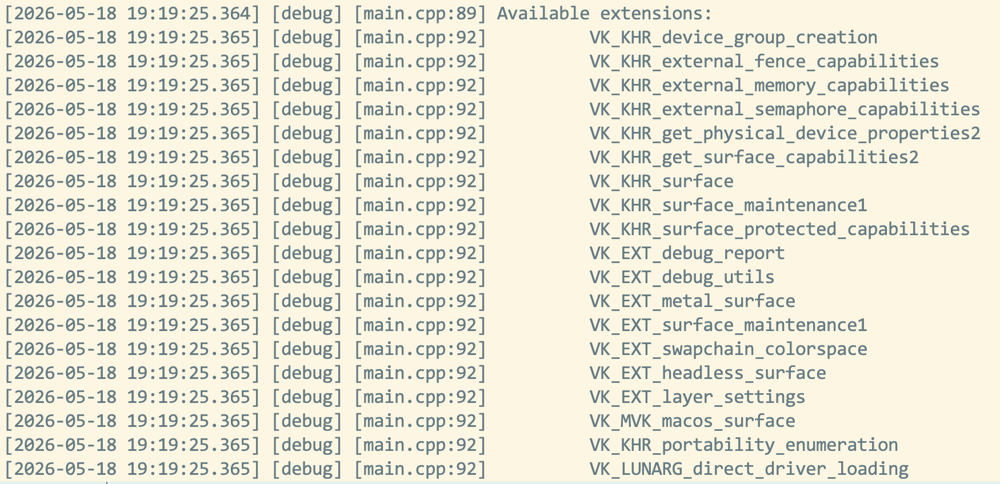

= 인스턴스 (Instance)
include::../common/header.adoc[]
:imagesdir!:

== 인스턴스 생성 (Creating an instance)

가장 먼저해야 할 일은 인스턴스를 만들어 {vk} 라이브러리를 초기화하는 것입니다. 인스턴스는 애플리케이션과 {vk} 라이브러리 간의 연결이며 이를 만드는 것은 드라이버에 대한 응용 프로그램에 대한 세부 정보를 지정하는 것입니다.

``createInstance`` 함수를 추가하고 ``initVulkan`` 함수에서 호출하는 것으로 시작합니다.

[source,cpp]
----
void initVulkan() {
    createInstance();
}
----

또한 데이터 멤버를 추가하여 인스턴스에 핸들을 유지합니다.

[source,cpp]
----
private:
    VkInstance _instance;
----

이제 인스턴스를 만들려면 먼저 응용 프로그램에 대한 정보가 포함 된 구조체를 작성해야합니다. 이 데이터는 기술적으로 선택 사항이지만 특정 응용 프로그램을 최적화하기 위해 드라이버에 유용한 정보를 제공 할 수 있습니다 (e.g. 특정 특수 동작이있는 잘 알려진 그래픽 엔진을 사용하기 때문에). 이 구조는 link:https://www.khronos.org/registry/vulkan/specs/1.0/man/html/VkApplicationInfo.html[``VkApplicationInfo``]라고 합니다.

[source,cpp]
----
void createInstance() {
    VkApplicationInfo appInfo{
        .sType = VK_STRUCTURE_TYPE_APPLICATION_INFO,
        .pApplicationName = "Hello triangle",
        .applicationVersion = VK_MAKE_VERSION(1, 0, 0),
        .pEngineName = "No Engine",
        .engineVersion = VK_MAKE_VERSION(1, 0, 0),
        .apiVersion = VK_API_VERSION_1_0,
    };
}
----

앞서 언급했듯이 {vk}의 많은 구조는 sType 멤버의 형식을 명시적으로 지정해야 합니다. 이것은 또한 ``pNext`` 멤버가 미래에 확장 정보를 지적 할 수있는 많은 구조 중 하나입니다. 여기에서 value initializeization을 사용하여 ``nullptr``로 둡니다.

{vk}의 많은 정보는 함수 매개 변수 대신 구조를 통과하며 인스턴스를 만들기에 충분한 정보를 제공하기 위해 한 가지 더 구성 요소를 작성해야 합니다. 이 다음 구조는 선택 사항이 아니며 {vk} 드라이버에게 사용하려는 글로벌 확장 및 유효성 검사 계층을 알려줍니다. 여기에서 글로벌은 특정 장치가 아닌 전체 프로그램에 적용한다는 것을 의미하며, 이는 다음 몇 장에서 명확해질 것입니다.

[source,cpp]
----
VkInstanceCreateInfo createInfo{
    .sType = VK_STRUCTURE_TYPE_INSTANCE_CREATE_INFO,
    .pApplicationInfo = &appInfo,
};
----

처음 두 매개 변수는 간단합니다. 다음 두 레이어는 원하는 전역 확장을 지정합니다. 개요 장에서 언급했듯이 {vk}은 플랫폼 독립적인 API이므로 window 시스템과 인터페이스할 확장명이 필요합니다. GLFW에는 우리가 구조에 전달할 수 있는 확장이 필요한 확장을 반환하는 편리한 붙박이 기능이 있습니다(__The first two parameters are straightforward. The next two layers specify the desired global extensions. As mentioned in the overview chapter, Vulkan is a platform agnostic API, which means that you need an extension to interface with the window system. GLFW has a handy built-in function that returns the extension(s) it needs to do that which we can pass to the struct:__):

[source,cpp]
----
uint32_t glfwExtensionCount = 0;
const char** glfwExtensions;

glfwExtensions = glfwGetReqeuiredInstanceExtensions(&glfwExtensionCount);

createInfo.enabledExtensionCount = glfwExtensionCount;
createInfo.ppEnabledExtensionNames = glfwExtensions;
----

구조체의 마지막 두 멤버는 활성화할 글로벌 유효성 검사 계층을 결정합니다. 다음 장에서 더 심층적 인 것에 대해 이야기 할 것입니다. 지금 당장은 이것을 비워 두십시오.

[source,cpp]
----
createInfo.enabledLayerCount = 0;
----

이제 {vk}이 인스턴스를 만드는 데 필요한 모든 것을 지정했으며 마침내 {vkCreateInstance}[``vkCreateInstance``] 호출을 발행할 수 있습니다.

[source,cpp]
----
VkResult result = vkCreateInstance(&createInfo, nullptr, &_instance);
----

보시다시피, {vk}의 객체 생성 함수 매개 변수가 따르는 일반적인 패턴은 다음과 같습니다.

* 생성 정보를 가진 구조하기 위하여 포인터
* 사용자 지정 할당자 콜백을 가리키며, 이 자습서에서 항상 ``nullptr``
* 핸들을 새 개체에 저장하는 변수에 대한 포인터

모든 것이 잘 진행되면 인스턴스의 핸들이 {VkInstance}[``VkInstance``] 클래스 멤버에 저장됩니다. 거의 모든 {vk} 함수는 ``VK_SUCCESS`` 또는 오류 코드인 유형 {VkResult}[``VkResult``]의 값을 반환합니다. 인스턴스가 성공적으로 생성되었는지 확인하려면 결과를 저장할 필요가 없으며 대신 성공 값에 대한 수표를 사용할 수 있습니다.

[source,cpp]
----
if(vkCreateInstance(&createInfo, nullptr, &_instance) != VK_SUCCESS) {
    throw std::runtime_error("failed to create instance!");
}
----

이제 프로그램을 실행하여 인스턴스가 성공적으로 생성되었는지 확인합니다.

== VK_ERROR_INCOMPATIBLE_DRIVER 오류 발생 (Encounterd VK_ERROR_INCOMPATIBLE_DRIVER)

macOS에서 최신 MoltenVK sdk를 사용하는 경우 {vkCreateInstance}[``vkCreateInstance``]에서 ``VK_ERROR_INCOMPAIBLE_DRIVER``을 반환받을 수 있습니다. link:https://vulkan.lunarg.com/doc/sdk/1.3.216.0/mac/getting_started.html[Getting Start Notes]에 따르면. 1.3.216 {vk}} SDK부터 ``VK_KHR_PORTABILITY_subset`` 확장은 필수입니다.

이 오류를 극복하려면 먼저 ``VK_INSTANCE_CREATE_ENUMERATE_PORTABILITY_BIT_KHR`` 비트를 {VkInstanceCreateInfo}[``VkInstanceCreateInfo``] 구조체의 플래그에 추가한 다음 ``VK_KHR_PORTABILITY_ENUMERATION_EXTENSION_NAME``을 인스턴스 지원 확장 목록에 추가합니다.

일반적으로 코드는 다음과 같을 수 있습니다.

[source,cpp]
----
...

std::vector<const char*> requiredExtensions;

for (uint32_t i = 0; i < glfwExtensionCount; i++) {
    requiredExtensions.emplace_back(glfwExtensions[i]);
}

requiredExtensions.emplace_back(VK_KHR_PORTABLILITY_ENUMERATION_EXTENSION_NAME);

createInfo.flags |= VK_INSTANCE_CREATE_ENUMERATE_PORTABILITY_BIT_KHR;

createInfo.enabledExtensionCount = static_cast<uint32_t>(requiredExtensions.size());
createInfo.ppEnabledExtensionNames = requiredExtensions.data();

if (vkCreateInstance(&createInfo, nullptr, &_instance) != VK_SUCCESS) {
    throw std::runtime_error("failed to create instance!");
}
----

CAUTION: 위 내용은 확인 필요

== 확장 지원 확인 (Checking for extension support)

{vkCreateInstance}[``vkCreateInstance``] 문서를 보면 가능한 오류 코드 중 하나가 ``VK_ERROR_EXTENSION_NOT_PRESENT``임을 알 수 있습니다. 우리는 단순히 필요한 확장을 지정하고 해당 오류 코드가 다시 올 경우 종료할 수 있습니다. 그것은 창 시스템 인터페이스와 같은 필수 확장에 의미가 있지만 옵션 기능을 확인하려면 어떻게해야합니까?

인스턴스를 만들기 전에 지원되는 확장 프로그램의 목록을 검색하려면 {vkEnumerateInstanceExtensionProperties}[``vkEnumerateInstanceExtensionProperties``] 함수가 있습니다. 확장의 수와 {VkExtensionProperties}[``VkExtensionProperties``]의 배열을 저장하는 변수에 대한 포인터가 필요합니다. 또한 특정 유효성 검사 계층에 의해 확장을 필터링할 수 있는 선택적 첫 번째 매개변수가 필요하며, 이는 현재로서는 무시할 것입니다.

확장 세부 정보를 보유하기 위해 배열을 할당하려면 먼저 얼마나 많은 것이 있는지 알아야합니다. 후자의 매개 변수를 비워 두어 확장 횟수를 요청할 수 있습니다.

[source,cpp]
----
uint32_t extensionCount = 0;
vkEnumerateInstanceExtensionProperties(nullptr, &extensionCount, nullptr);
----

이제 확장 세부 정보를 보유하기 위해 배열을 할당합니다(``#include <vector>필요``):

[source,cpp]
----
std::vector<VkExtensionProperties> extensions(extensionCount);
----

마지막으로 확장 세부 정보를 조회할 수 있습니다.

[source,cpp]
----
vkEnumerateInstanceExtensionProperties(nullptr, &extensionCount, extensions.data());
----

각 link:https://www.khronos.org/registry/vulkan/specs/1.0/man/html/VkExtensionProperties.html[``VkExtensionProperties``] 구조체는 확장의 이름과 버전이 포함되어 있습니다. 우리는 루프를 이용해 간단히 내용을 확인할 수 있습니다(\t는 들여 쓰기를위한 탭입니다).

[source,cpp]
----
std::cout << "available extionsions:\n";

for (const auto& extension: extensions) {
    std::cout << "\t" << extension.extensionName << "\n";
}
----

{vk} 지원에 대한 세부 정보를 제공하려는 경우 ``createInstance`` 함수에 이 코드를 추가할 수 있습니다. 도전 과제로 ``glfwGetRequiredInstanceExtensions``가 지원되는 확장 프로그램 목록에 포함된 모든 확장 프로그램이 있는지 확인하는 함수를 만듭니다.

== 정리 (Cleaning up)

link:https://www.khronos.org/registry/vulkan/specs/1.0/man/html/VkInstance.html[``VkInstance``]는 프로그램이 종료되기 직전에만 제거(**destroy**)되어야 합니다. ``cleanup`` 함수에서 link:https://www.khronos.org/registry/vulkan/specs/1.0/man/html/vkDestroyInstance.html[``vkDestroyInstance``] 함수로 정리할 때 제거(**destroy**)할 수 있습니다.

[source,cpp]
----
void cleanup() {
    vkDestroyInstance(_instance, nullptr);
    glfwDestroyWindow(_window);
    glfwTerminate();
}
----

link:https://www.khronos.org/registry/vulkan/specs/1.0/man/html/vkDestroyInstance.html[``vkDestroyInstance``] 함수의 매개 변수는 간단합니다. 이전 장에서 언급했듯이 {vk}의 할당 및 트랜잭션 할당 함수는 ``nullptr``를 전달하여 무시할 선택적 할당자 콜백이 있습니다. 다음 챕터에서 만들 다른 모든 {vk} 리소스는 인스턴스가 파괴되기 전에 정리해야 합니다.

인스턴스 생성 후 더 복잡한 단계를 계속하기 전에 link:./ValidationLayers.html[유효성 검사 계층]을 확인하여 디버깅 옵션을 평가할 때입니다.

.작성자 버전의 전체 소스
[%collapsible]
====
[source,cpp,linenums]
----
//
// Created by JoonHo Son on 2026-05-17.
//
#include <stdexcept>

#include "vulkan_core.h"
#if !defined(NDEBUG) || defined(_DEBUG)
#define DEBUG_BUILD
#define SPDLOG_ACTIVE_LEVEL SPDLOG_LEVEL_TRACE
#else
#define SPDLOG_ACTIVE_LEVEL SPDLOG_LEVEL_INFO
#endif

#define GLFW_INCLUDE_VULKAN
#include <GLFW/glfw3.h>
#include <spdlog/spdlog.h>

#define GLM_FORCE_RADIANS
#define GLM_FORCE_DEPTH_ZERO_TO_ONE
#include <glm/mat4x4.hpp>
#include <glm/vec4.hpp>

const uint32_t WIDTH = 800;
const uint32_t HEIGHT = 600;

class HelloTriangleApplication {
public:
    void run() {
        initWindow();
        initVulkan();
        mainLoop();
        cleanup();
    }

private:
    GLFWwindow* _window;

    VkInstance _instance;

    void initWindow() {
        glfwInit();
        glfwWindowHint(GLFW_CLIENT_API, GLFW_NO_API);
        glfwWindowHint(GLFW_RESIZABLE, GLFW_FALSE);

        _window = glfwCreateWindow(WIDTH, HEIGHT, "Vulkan", nullptr, nullptr);
    }

    void initVulkan() { createInstance(); }

    void createInstance() {
        VkApplicationInfo appInfo{
            .sType = VK_STRUCTURE_TYPE_APPLICATION_INFO,
            .pApplicationName = "Hello Triangle",
            .applicationVersion = VK_MAKE_VERSION(1, 0, 0),
            .pEngineName = "No Engine",
            .engineVersion = VK_MAKE_VERSION(1, 0, 0),
            .apiVersion = VK_API_VERSION_1_0,
        };

        uint32_t glfwExtensionCount = 0;
        const char** glfwExtensions;

        glfwExtensions = glfwGetRequiredInstanceExtensions(&glfwExtensionCount);

        VkInstanceCreateInfo createInfo{
            .sType = VK_STRUCTURE_TYPE_INSTANCE_CREATE_INFO,
            .pApplicationInfo = &appInfo,
            .enabledExtensionCount = glfwExtensionCount,
            .ppEnabledExtensionNames = glfwExtensions,
            .enabledLayerCount = 0,
        };

        if (vkCreateInstance(&createInfo, nullptr, &_instance) != VK_SUCCESS) {
            SPDLOG_ERROR("----------------------------------------");
            SPDLOG_ERROR("failed to create instance!");
            SPDLOG_ERROR("----------------------------------------");

            throw std::runtime_error("failed to create instance!");
        }

        // Checking for extension support
        uint32_t extensionCount = 0;
        vkEnumerateInstanceExtensionProperties(nullptr, &extensionCount,
                                               nullptr);
        std::vector<VkExtensionProperties> extensions(extensionCount);
        vkEnumerateInstanceExtensionProperties(nullptr, &extensionCount,
                                               extensions.data());

        SPDLOG_DEBUG("Available extensions:");

        for (const auto& extension : extensions) {
            SPDLOG_DEBUG("\t {}", extension.extensionName);
        }
    }

    void mainLoop() {
        while (!glfwWindowShouldClose(_window)) {
            glfwPollEvents();
        }
    }

    void cleanup() {
        vkDestroyInstance(_instance, nullptr);
        glfwDestroyWindow(_window);
        glfwTerminate();
    }
};

int main() {
#ifdef DEBUG_BUILD
    spdlog::set_level(spdlog::level::debug);
    spdlog::set_pattern("[%Y-%m-%d %H:%M:%S.%e] [%l] [%s:%#] %v");
#else
    spdlog::set_level(spdlog::level::info);
#endif
    HelloTriangleApplication app;

    try {
        app.run();
    } catch (const std::exception& e) {
        SPDLOG_ERROR("{}", e.what());

        return EXIT_FAILURE;
    }

    return EXIT_SUCCESS;
}
----

.vkEnumerateInstanceExtensionProperties 실행 결과

====
