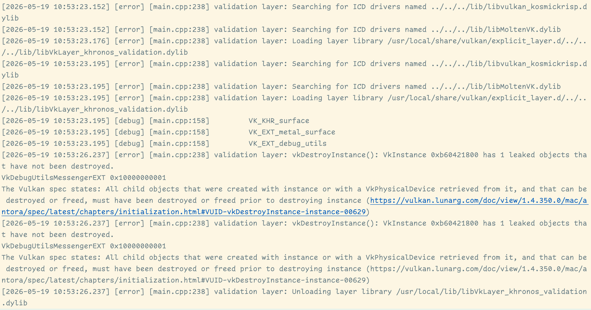
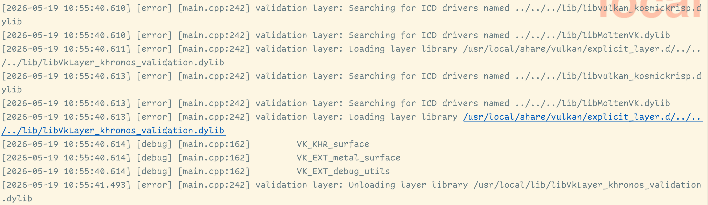

= 유효성 검사 레이어 (Validation layers)
include::../common/header.adoc[]
:imagesdir!:

== 유효성 검사 계층은 무엇입니까? (What are validation layers?)

{vk} API는 최소한의 드라이버 오버헤드의 아이디어를 중심으로 설계되었으며 그 목표의 징후 중 하나는 기본적으로 API에 매우 제한된 오류가 있다는 것입니다. 잘못된 값으로 열거를 설정하거나 null 포인터를 필수 매개 변수에 전달하는 것만 큼 간단한 실수조차도 일반적으로 명시적으로 처리되지 않으며 단순히 충돌 또는 정의되지 않은 동작이 발생합니다. {vk}은 당신이하고있는 모든 일에 대해 매우 명시적이어야합니다. 새로운 GPU 기능을 사용하고 논리적 인 장치 생성 시간에 요청하는 것을 잊어 버리는 것과 같은 많은 작은 실수를 쉽게 할 수 있습니다.

그러나 이것이 이러한 검사가 API에 추가될 수 없다는 것을 의미하지는 않습니다. {vk}은 유효성 검사 계층으로 알려진 이를 위한 우아한 시스템을 소개합니다. 유효성 검사 계층은 추가 작업을 적용하기 위해 {vk} 함수 호출에 연결하는 선택적 구성 요소입니다. 유효성 검사 계층의 일반적인 작업은 다음과 같습니다.

* 오용을 감지하는 사양에 대한 매개 변수의 값 확인
* 리소스 누출을 찾기 위해 개체의 생성 및 파괴 추적
* 호출이 발생하는 스레드를 추적하여 스레드 안전을 확인합니다.
* 모든 호출 및 해당 매개 변수를 표준 출력에 로깅
* {vk} 추적은 프로파일링 및 재생을 요구합니다.

다음은 진단 유효성 검사 계층에서 함수의 구현이 어떻게 보일 수 있는지에 대한 예입니다.

[source,cpp]
----
VkResult vkCreateInstance(const VkInstanceCreateInfo *pCreateInfo, const VkAllocationCallbacks *pAllocator, VkInstance *instance) {
    if (pCreateInfo == nullptr || instance == nullptr) {
        log("Null pointer passed to required parameter!");

        return VK_ERROR_INITIALIZATION_FAILED;
    }

    return real_vkCreateInstance(pCreateInfo, pAllocator, instance);
}
----

이러한 유효성 검사 계층은 귀하가 관심 있는 모든 디버깅 기능을 포함하도록 자유롭게 쌓을 수 있습니다. 디버그 빌드에 대한 유효성 검사 레이어를 활성화하고 릴리스 빌드를 완전히 비활성화할 수 있으므로 두 세계의 장점을 모두 얻을 수 있습니다!

{vk}에는 유효성 검사 계층이 내장되어 있지 않지만 LunarG {vk} SDK는 일반적인 오류를 확인하는 멋진 레이어 세트를 제공합니다. 그들은 또한 완전히 link:https://github.com/KhronosGroup/Vulkan-ValidationLayers[오픈 소스]이므로 어떤 종류의 실수를 확인하고 기여할 수 있는지 확인할 수 있습니다. 유효성 검사 레이어를 사용하는 것은 실수로 정의되지 않은 동작에 의존하여 애플리케이션이 다른 드라이버를 깰 수 없도록 하는 가장 좋은 방법입니다.

유효성 검사 계층은 시스템에 설치된 경우에만 사용할 수 있습니다. 예를 들어, LunarG 유효성 검사 계층은 Vulkan SDK가 설치된 PC에서만 사용할 수 있습니다.

이전에 {vk}에는 두 가지 유형의 유효성 검사 계층이 있었습니다. 인스턴스 및 장치 특정. 아이디어는 인스턴스 레이어가 인스턴스와 같은 글로벌 {vk} 개체와 관련된 호출(call)에서만 확인하고 장치 특정 레이어는 특정 GPU와 관련된 호출(call)에서만 확인하는 것입니다. 장치 특정 계층은 이제 더 이상 사용되지 않습니다. 즉, 인스턴스 유효성 검사 계층이 모든 {vk} 호출에 적용됩니다. 사양 문서는 여전히 일부 구현에서 요구하는 호환성뿐만 아니라 장치 수준에서 유효성 검사 계층을 활성화할 것을 권장합니다. 우리는 단순히 논리적 장치 수준에서 인스턴스와 동일한 레이어를 지정할 것입니다. link:./LogicalDeviceAndQueues.html[나중에 볼 수 있습니다].

== 유효성 검사 계증 사용하기 (Using validation layers)

이 섹션에서는 {vk} SDK에서 제공하는 표준 진단 계층을 활성화하는 방법을 확인합니다. 확장과 마찬가지로 이름을 지정하여 유효성 검사 계층을 활성화해야 합니다. 유용한 표준 유효성 검사는 모두 ``VK_LAYER_KHRONOS_validation``으로 알려진 SDK에 포함된 계층에 번들로 제공됩니다.

먼저 프로그램에 두 개의 구성 변수를 추가하여 활성화할 레이어와 활성화 여부를 지정하도록 합니다. 프로그램이 디버그 모드에서 컴파일되고 있는지 여부에 따라 해당 값을 기반으로 선택했습니다. ``NDEBUG`` 매크로는 C++ 표준의 일부이며 " 디버그하지 않음"을 의미합니다.

[source,cpp]
----
const uint32_t WIDTH = 800;
const uint32_t HEIGHT = 600;

const std::vector<const char*> validationLayers = {"VK_LAYER_KHRONOS_validation"};

#ifdef NDEBUG
    const bool enableValidationLayers = false;
#else
    const bool enableValidationLayers = true;
#endif
----

요청된 모든 레이어를 사용할 수 있는지 확인하는 새 함수 ``checkValidationLayerSupport``를 추가합니다. 먼저 link:https://www.khronos.org/registry/vulkan/specs/1.0/man/html/vkEnumerateInstanceLayerProperties.html[``vkEnumerateInstanceLayerProperties``] 함수를 사용하여 사용 가능한 모든 레이어를 나열합니다. 그 사용법은 인스턴스 생성 장에서 논의된 link:https://www.khronos.org/registry/vulkan/specs/1.0/man/html/vkEnumerateInstanceExtensionProperties.html[``vkEnumateInstanceExtensionProperties``]의 사용법과 동일합니다.

[source,cpp]
----
bool checkValidationLayerSupport() {
    uint32_t layerCount;
    vkEnumerateInstanceLayerProperties(&layerCount, nullptr);
    std::vector<VkLayerProperties> availableLayers(layerCount);
    vkEnumerateInstanceLayerProperties(&layerCount, availableLayers.data());

    return false;
}
----

그런 다음 ``validationLayers``가 ``availableLayers`` 목록에 있는지 확인합니다. ``strcmp``에 ``<cstring>``을 포함해야 할 수도 있습니다.

[source,cpp]
----
for (const char* layerName : validationLayers) {
    bool layerFound = false;

    for (const auto& layerProperties: availableLayers) {
        if (strcmp(layerName, layerProperties.layername) == 0) {
            layerFound = true;

            break;
        }
    }

    if (!layerFound) {
        return false;
    }
}

return true;
----

이제 ``createInstance``에서 이 함수를 사용할 수 있습니다.

[source,cpp]
----
void createInstance() {
    if (enableValidationLayers && !checkValidationLayerSupport()) {
        throw std::runtime_error("validation layers requested, but not available!");
    }

    ...
}
----

이제 디버그 모드에서 프로그램을 실행하고 오류가 발생하지 않도록 합니다. 그렇다면 FAQ를 살펴보십시오.

마지막으로 link:https://www.khronos.org/registry/vulkan/specs/1.0/man/html/VkInstanceCreateInfo.html[``VkInstanceCreateInfo``] 구조체 인스턴스화를 수정하여 활성화된 경우 유효성 검사 계층 이름을 포함합니다.

[source,cpp]
----
if (enableValidationLayers) {
    createInfo.enabledLayerCount = static_cast<uint32_t>(validationLayers.size());
    createInfo.ppEnabledExtensionNames = validationLayers.data();
} else {
    createInfo.enabledLayerCount = 0;
}
----

검사가 성공하면 {vkCreateInstance}[``vkCreateInstance``]는 ``VK_ERROR_LAYER_NOT_PRESENT`` 오류를 반환하지 않아야하지만 프로그램을 실행하여 확인해야합니다.

== 메시지 콜백 (Message callback)

유효성 검사 계층은 디버그 메시지를 기본적으로 표준 출력에 출력하지만 프로그램에서 명시적인 콜백을 제공하여 직접 처리할 수도 있습니다. 이것은 또한 모든 사람이 반드시 (치명적인) 오류가 아니기 때문에 어떤 종류의 메시지를보고 싶은지 결정할 수 있습니다. 지금 당장 그렇게하고 싶지 않다면이 장의 마지막 섹션으로 건너 뛸 수 있습니다.

메시지 및 관련 세부 정보를 처리하기 위해 프로그램에서 콜백을 설정하려면 ``VK_EXT_debug_utils`` 확장 프로그램을 사용하여 콜백으로 디버그 메신저를 설정해야 합니다.

먼저 ``getRequiredExtensions`` 함수를 만들어 유효성 검사 계층이 활성화되었는지 여부에 따라 필요한 확장 목록을 반환합니다.

[source,cpp]
----
std::vector<const char*> getRequiredExtensions() {
    utin32_t glfwExtensionCount = 0;
    const char** glfwExtensions;
    glfwExtensions = glfwGetReqeuiredInstanceExtensions(&glfwExtensionCount);

    std::vector<const char*> extensions(glfwExtensions, glfwExtensions + glfwExtensionCount);

    if (enableValidationLayers) {
        extensions.push_back(VK_EXT_DEBUG_UTILS_EXTENSION_NAME);
    }

    return extensions;
}
----

GLFW에서 지정한 확장은 항상 필요하지만 디버그 메신저 확장은 조건부로 추가됩니다. 여기서 ``VK_EXT_DEBUG_UTILS_EXTENSION_NAME`` 매크로를 사용했는데, 이는 문자 그대로의 문자열 "VK_EXT_debug_utils"와 같습니다. 이 매크로를 사용하면 오타를 피할 수 있습니다.

이제 우리는 이 함수를 ``createInstance`` 함수에서 사용할 수 있습니다.

[source,cpp]
----
auto extensions = getRequiredExtensions();
createInfo.enabledExtensionCount = static_cast<uint32_t>(extensions.size());
createInfo.ppEnabledExteionNames = extensions.data();
----

프로그램을 실행하여 ``VK_ERROR_EXTENSION_NOT_PRESENT`` 오류가 수신되지 않도록 합니다. 유효성 검사 계층의 가용성에 의해 암시되어야 하기 때문에 이 확장의 존재를 실제로 확인할 필요가 없습니다.

이제 debug 콜백 함수가 어떻게 생겼는지 봅시다. ``PFN_vkDebugUtilsMessingerCallbackEXT`` 프로토타입을 사용하여 ``debugCallback``이라는 새로운 정적 멤버 함수를 추가합니다. ``VKAPI_ATTR`` 및 ``VKAPI_CALL``은 기능이 {vk}이 호출하는 데 적합한 서명을 갖도록 합니다.

[source,cpp]
----
static VKAPI_ATTR VkBool32 VKAPI_CALL debugCallback(
    VkDebugUtilsMessageSeverityFlagBitsEXT messageSeverity,
    VkDebugUtilsMessageTypeFlagsEXT messageType,
    const VkDebugUtilsMessageCallbackDataEXT* pCallbackData,
    void* pUserData) {

    std::cerr << "validation layer: " << pCallbackData->pMessage << std::endl;

    return VK_FALSE;
}
----

첫 번째 매개 변수는 메시지의 심각도를 지정합니다. 이는 다음 플래그 중 하나입니다.

[cols="5a,5",options=header]
|===
|플래그
|설명

|``VK_DEBUG_UTILS_MESSAGE_SEVERITY_VERBOSE_BIT_EXT``
|진단 메시지

|``VK_DEBUG_UTILS_MESSAGE_SEVERITY_INFO_BIT_EXT``
|리소스 생성과 같은 정보 메시지

|``VK_DEBUG_UTILS_MESSAGE_SEVERITY_WARNING_BIT_EXT``
|반드시 오류가 아니라 응용 프로그램의 버그 일 가능성이 매우 높은 동작에 대한 메시지

|``VK_DEBUG_UTILS_MESSAGE_SEVERITY_ERROR_BIT_EXT``
|유효하지 않으며 충돌을 일으킬 수있는 행동에 대한 메시지
|===

이 열거자의 값은 비교 작업을 사용하여 메시지가 일부 수준의 심각도에 비해 동등하거나 더 나쁜지 확인할 수 있는 방식으로 설정됩니다.

[source,cpp]
----
if (messagSeverity >= VK_DEBUG_UTILS_MESSAGE_SEVERITY_WARNING_BIT_EXT) {
    // Message is important enough to show
}
----

``messageType`` 매개 변수에는 다음 값이 있을 수 있습니다.

[cols="5a,5",options=header]
|===
|플래그
|설명

|``VK_DEBUG_UTILS_MESSAGE_TYPE_GENERAL_BIT_EXT``
|사양 또는 성능과 관련이없는 일부 이벤트가 발생했습니다.

|``VK_DEBUG_UTILS_MESSAGE_TYPE_VALIDATION_BIT_EXT``
|사양을 위반하거나 가능한 실수를 나타내는 일이 발생했습니다.

|``VK_DEBUG_UTILS_MESSAGE_TYPE_PERFORMANCE_BIT_EXT``
|{vk}의 잠재적 비 최적 사용
|===

``pCallbackData`` 매개 변수는 메시지 자체의 세부 정보가 포함된 ``VkDebugUtilsMessengerCallbackDataEXT`` 구조체를 말하며 가장 중요한 멤버는 다음과 같습니다.

[cols="5a,5",options=header]
|===
|멤버변수
|설명

|``pMessage``
|null 종료 문자열로 디버그 메시지

|``pObjects``
|메시지와 관련된 {vk} 객체 핸들의 배열

|``objectCount``
|메시지와 관련된 {vk} 객체 핸들의 배열 크기
|===

마지막으로 ``pUserData`` 매개 변수에는 콜백 설정 중에 지정된 포인터가 포함되어 있으며 자신의 데이터를 전달할 수 있습니다.

콜백은 유효성 검사 계층 메시지를 트리거한 {vk} 호출을 중지해야 하는지 나타내는 부울(bool)을 반환합니다. 콜백이 true를 반환하면 호출이 ``VK_ERROR_VALIDATION_FAILED_EXT`` 오류로 중단됩니다. 이것은 일반적으로 유효성 검사 계층 자체를 테스트하는 데만 사용되므로 항상 ``VK_FALSE``를 반환해야합니다(__The callback returns a boolean that indicates if the Vulkan call that triggered the validation layer message should be aborted. If the callback returns true, then the call is aborted with the ``VK_ERROR_VALIDATION_FAILED_EXT`` error. This is normally only used to test the validation layers themselves, so you should always return ``VK_FALSE``__).

이제 남아있는 모든 것은 {vk}에게 콜백 기능에 대해 말하고 있습니다. 아마도 다소 놀랍게도, {vk}의 디버그 콜백조차도 명시적으로 생성되고 파괴되어야 하는 핸들로 관리됩니다. 이러한 콜백은 디버그 메신저의 일부이며 원하는만큼 많은 콜백을 가질 수 있습니다. ``instance`` 바로 아래에 이 핸들에 대한 클래스 멤버를 추가합니다.

[source,cpp]
----
VkDebugUtilsMessagerEXT _debugMessenger;
----

이제 ``createInstance`` 직후 ``initVulkan``에서 함수 ``setupDebugMessenger``를 호출하도록 변경합니다.

[source,cpp]
----
void initVulkan() {
    createInstance();
    setupDebugMessenger();
}

void setupDebugMessenger() {
    if (!enableValidationLayer) return;
}
----

메신저 및 콜백에 대한 세부 정보가 포함된 구조를 작성해야 합니다.

[source,cpp]
----
VkDebugUtilsMessengerCreateInfoEXT createInfo{
    .sType = VK_STRUCTURE_TYPE_DEBUG_UTILS_MESSENGER_CREATE_INFO_EXT,
    .messageSeverity = VK_DEBUG_UTILS_MESSAGE_SEVERITY_VERBOSE_BIT_EXT | VK_DEBUG_UTILS_MESSAGE_SEVERITY_WARNING_BIT_EXT | VK_DEBUG_UTILS_MESSAGE_SEVERITY_ERROR_BIT_EXT,
    .messageType = VK_DEBUG_UTILS_MESSAGE_TYPE_GENERAL_BIT_EXT | VK_DEBUG_UTILS_MESSAGE_TYPE_VALIDATION_BIT_EXT | VK_DEBUG_UTILS_MESSAGE_TYPE_PERFORMANCE_BIT_EXT,
    .pfnUserCallback = debugCallback,
    .pUserData = nullptr, // Optional
};
----

``messagesSeverity`` 필드를 사용하면 콜백이 호출되는 모든 유형의 심각도를 지정할 수 있습니다. 여기서는 ``VK_DEBUG_UTILS_MESSAGE_SEVERITY_INFO_BIT_EXT``를 제외한 모든 유형을 여기에서 지정하여 일반적인 디버그 정보를 제외하면서 가능한 문제에 대한 알림을 수신했습니다.

마찬가지로 ``messageType`` 필드를 사용하면 콜백이 알림을 받는 메시지 유형을 필터링할 수 있습니다. 여기서는 모든 유형을 활성화했습니다. 불필요한 유형은 언제든지 비활성화 할 수 있습니다.

마지막으로 ``pfnUserCallback`` 필드는 콜백 함수에 대한 포인터를 지정합니다. 선택적으로 ``pUserData`` 매개 변수를 통해 콜백 함수에 전달되는 ``pUserData`` 필드에 대한 포인터를 전달할 수 있습니다. 예를 들어 ``HelloTriangleApplication`` 클래스에 대한 포인터를 전달하는 데 사용할 수 있습니다.

유효성 검사 계층 메시지를 구성하고 콜백을 디버깅하는 방법에는 여러 가지가 있지만 이 자습서를 시작하기에 좋은 설정입니다. 가능성에 대한 자세한 내용은 link:https://www.khronos.org/registry/vulkan/specs/1.3-extensions/html/chap50.html#VK_EXT_debug_utils[확장 사양(extension specification)]을 참조하십시오.

이 구조는 ``vkCreateDebugUtilsMessengerEXT`` 함수에 전달되어 ``VkDebugUtilsMessengerEXT`` 개체를 만들어야 합니다. 불행히도, 이 함수는 확장 함수이기 때문에, 자동적으로 로드되지 않습니다. 우리는 link:https://www.khronos.org/registry/vulkan/specs/1.0/man/html/vkGetInstanceProcAddr.html[``vkGetInstanceProcAddr``]를 사용하여 주소를 스스로 찾아야합니다. 우리는 백그라운드에서이를 처리하는 자체 프록시 기능을 만들 것입니다. ``HelloTriangleApplication`` 클래스 정의 바로 위에 추가했습니다.

[source,cpp]
----
VkResult CreateDebugUtilsMessengerEXT(VkInstance instance, const VkDebugUtilsMessengerCreateInfoEXT* pCreateInfo, const VkAllocationCallbacks* pAllocator, VkDebugUtilsMessengerEXT* pDebugMessenger) {
    auto func = (PFN_vkCreateDebugUtilsMessengerEXT) vkGetInstanceProcAddr(instance, "vkCreateDebugUtilsMessengerEXT");

    if (func != nullptr) {
        return func(instance, pCreateInfo, pAllocator, pDebugMessenger);
    } else {
        return VK_ERROR_EXTENSION_NOT_PRESENT;
    }
}
----

기능이 로드되지 않은 경우 link:https://www.khronos.org/registry/vulkan/specs/1.0/man/html/vkGetInstanceProcAddr.html[``vkGetInstanceProcAddr``] 함수는 ``nullptr``를 반환합니다. 이제 이 함수를 호출하여 사용 가능한 경우 확장 개체를 만들 수 있습니다.

[source,cpp]
----
if (CreateDebugUtilsMessengerEXT(_instance, &createInfo, nullptr, &_debugMessenger) != VK_SUCCESS) {
    throw std::runtime_error("failed to set up debug messenger!");
}
----

두 번째에서 마지막 매개 변수는 다시 ``nullptr``로 설정한 선택적 할당자 콜백입니다. 매개 변수가 상당히 간단합니다. 디버그 메신저는 {vk} 인스턴스와 해당 레이어에 고유하므로 첫 번째 인수로 명시적으로 지정되어야 합니다. 또한 나중에 다른 자식 개체와 함께이 패턴을 볼 수 있습니다.

``VkDebugUtilsMessengerEXT`` 개체도 ``vkDestroyDebugUtilsMessengerEXT``에 대한 호출로 정리해야 합니다. ``vkCreateDebugUtilsMessengerEXT``와 마찬가지로 함수는 명시적으로 로드되어야 합니다.

``CreateDebugUtilsMessengerEXT`` 바로 아래에 있는 다른 프록시 함수 만듭니다.

[source,cpp]
----
void DestroyDebugUtilsMessengerEXT(VkInstance instance, VkDebugUtilsMessengerEXT debugMessenger, const VkAllocationCallbacks* pAllocator) {
    auto func = (PFN_vkDestroyDebugUtilsMessengerEXT) vkGetInstanceProcAddr(instance, "vkDestroyDebugUtilsMessengerEXT");

    if (func != nullptr) {
        func(instance, debugMessenger, pAllocator);
    }
}
----

이 함수는 정적 클래스 함수인지 또는 클래스 외부의 함수인지 확인합니다. 그런 다음 정리 기능에서 호출 할 수 있습니다.

[source,cpp]
----
void cleanup() {
    if (enableValidationLayer) {
        DestroyDebugUtilsMessengerEXT(_instance, _debugMessenger, nullptr);
    }

    vkDestroyInstance(_instance, nullptr);
    glfwDestroyWindow(_window);
    glfwTerminate();
}
----

== 디버그 인스턴스 생성 및 파괴 (Debugging instance creation and destruction)

이제 프로그램에 유효성 검사 계층이 포함된 디버깅을 추가했지만 아직 모든 것을 다루지는 않습니다. ``vkCreateDebugUtilsMessengerEXT`` 호출은 유효한 인스턴스가 생성되어야 하며, 인스턴스가 파괴되기 전에 ``vkDestroyDebugUtilsMessengerEXT`` 호출해야 합니다. 이것은 현재 {vkCreateInstance}[``vkCreateInstance``] 및 {vkDestroyInstance}[``vkDestroyInstance``] 호출에서 문제를 디버깅할 수 없습니다.

그러나 link:https://github.com/KhronosGroup/Vulkan-Docs/blob/main/appendices/VK_EXT_debug_utils.adoc#examples[확장 문서(extension documentation]를 자세히 읽으면 해당 두 함수 호출에 대해 특별히 별도의 디버그 사용 메신저를 만드는 방법이 있음을 알 수 있습니다. {VkInstanceCreateInfo}[``VkInstanceCreateInfo``]의 ``pNext`` 확장 필드에서 ``VkDebugUtilsMessengerCreateInfoEXT`` 구조체에 대한 포인터를 간단히 전달해야 합니다. 메신저의 첫 번째 추출 개체군은 별도의 기능으로 정보를 만듭니다.

[source,cpp]
----
void populateDebugMessengerCreateInfo(VkDebugUtilsMessengerCreateInfoEXT& createInfo) {
    createInfo = {
        .sType = VK_STRUCTURE_TYPE_DEBUG_UTILS_MESSENGER_CREATE_INFO_EXT,
        .messageSeverity = VK_DEBUG_UTILS_MESSAGE_SEVERITY_VERBOSE_BIT_EXT | VK_DEBUG_UTILS_MESSAGE_SEVERITY_WARNING_BIT_EXT | VK_DEBUG_UTILS_MESSAGE_SEVERITY_ERROR_BIT_EXT,
        .messageType = VK_DEBUG_UTILS_MESSAGE_TYPE_GENERAL_BIT_EXT | VK_DEBUG_UTILS_MESSAGE_TYPE_VALIDATION_BIT_EXT | VK_DEBUG_UTILS_MESSAGE_TYPE_PERFORMANTCE_BIT_EXT,
        .pfnUserCallback = debugCallback;
    };
}

...

void setupDebugMessenger() {
    if (!enableValidationLayers) return;

    VkDebugUtilsMessengerCreateInfoEXT createInfo;
    populcateDebugMessengerCreateInfo(createInfo);

    if (CreateDebugUtilsMessengerEXT(_instance, &createInfo, nullptr, &_debugMessenger) != VK_SUCCESS) {
        throw std::runtime_error("failed to set up debug messenger!");
    }
}
----

우리는 이제 이 함수를 ``createInstance`` 함수에서 재사용 할 수 있습니다.

[source,cpp]
----
void createInstance() {
    ...

    VkInstanceCreateInfo createInfo{
        .stype = VK_STRUCTURE_TYPE_INSTANCE_CREATE_INFO,
        .pApplicationInfo = &appINfo,
        ...
    };

    VkDebugUtilsMessengerCreateInfoEXT debugCreateInfo{};

    if (enableValidationLayers) {
        createInfo.enabledLayerCount = static_cast<utin32_t>(validationLayers.size());
        createInfo.ppEnabledLayerNames = validationLayers.data();

        populateDebugMessengerCreateInfo(debugCreateInfo);
        createInfo.pnext = (VkDebugUtilsMessengerCreateInfoEXT*) &debugCreateInfo;
    } else {
        createInfo.enabledLayerCount = 0;
        createInfo.pNext = nullptr;
    }

    if (vkCreateInstance(&createInfo, nullptr, &_instance) != VK_SUCCESS) {
        throw std::runtime_error("failed to create instance!");
    }
}
----

``debugCreateInfo`` 변수는 if 문 외부에 배치되어 {vkCreateInstance}[``vkCreateInstance``] 호출 전에 파괴되지 않도록 합니다. 이 방법으로 추가 디버그 메신저를 생성하면 {vkCreateInstance}[``vkCreateInstance``] 및 {vkDestroyInstance}[``vkDestroyInstance``] 중에 자동으로 사용되고 그 후에 정리됩니다.

== 테스트 (Testing)

이제 의도적으로 실행중인 유효성 검사 계층을 보는 실수를 반복합시다. 일시적으로 정리 기능에서 ``DestroyDebugUtilsMessengerEXT``에 대한 호출을 제거하고 프로그램을 실행합니다. 그러면 다음과 비슷한 로그가 화면에 출력되어야 합니다:

.여기서는 macOS에서의 테스트 결과로 대신함
[NOTE]
====
``VkInstance 0x... has 1 leaked objects that have not been destroyed.`` 부분 확인
====

.만약 위와 같은 메세지가 출력되지 않는다면 다음의 항목을 참고하십니다.
[NOTE]
====
* link:https://vulkan.lunarg.com/doc/view/1.4.350.0/windows/getting_started.html#user-content-verify-the-installation[Windows]
* link:https://vulkan.lunarg.com/doc/view/1.4.350.0/linux/getting_started.html#user-content-verify-the-installation[Linux]
* link:https://vulkan.lunarg.com/doc/view/1.4.350.0/mac/getting_started.html#user-content-verify-the-installation[macOS]
====

어떤 호출이 메시지를 트리거하는지 확인하려면 메시지 콜백에 중단점을 추가하고 스택 추적을 볼 수 있습니다.

=== 추가

만약 다음과 같이 ``DestroyDebugUtilsMessengerEXT``를 호출할 경우 위 화면에서 발생한 ``VkInstance 0x... has 1 leaked objects that have not been destroyed.`` 부분이 출력되지 않음을 확인할 수 있다.

[source,cpp]
----
void cleanup() {
    // DestroyDebugUtilsMessengerEXT 호출
    if (enableValidationLayers) {
        DestroyDebugUtilsMessengerEXT(_instance, _debugMessenger, nullptr);
    }

    vkDestroyInstance(_instance, nullptr);
    glfwDestroyWindow(_window);
    glfwTerminate();
}
----

== 구성 (Configuration)

``VkDebugUtilsMessengerCreateInfoEXT`` 구조체에 지정된 플래그보다 유효성 검사 계층의 동작에 대한 설정이 훨씬 더 많습니다. {vk} SDK를 검색하고 ``Config`` 디렉토리로 이동합니다. 거기에서 레이어를 구성하는 방법을 설명하는 ``vk_layer_settings.txt`` 파일을 찾을 수 있습니다.

자체 응용 프로그램에 대한 레이어 설정을 구성하려면 프로젝트의 ``Debug`` 및 ``Release`` 디렉터리에 파일을 복사하고 지침에 따라 원하는 동작을 설정합니다. 그러나 이 자습서의 나머지 부분에 대해 기본 설정을 사용하고 있다고 가정합니다.

이 튜토리얼을 통해 나는 검증 계층이 그들을 잡는 데 얼마나 도움이되는지 보여주고 Vulkan으로 무엇을하고 있는지 정확히 아는 것이 얼마나 중요한지 가르쳐주기 위해 몇 가지 의도적 인 실수를 할 것입니다. 이제 link:./PhysicalDevicesAndQueueFamilies.html[시스템의 Vulkan 장치를 살펴봅시다].

.작성자 버전의 전체 소스
[%collapsible]
====
[source,cpp,linenums]
----
//
// Created by JoonHo Son on 2026-05-17.
//
#include <vulkan/vulkan.h>

#include <cstddef>
#include <cstdint>
#include <cstring>
#include <optional>
#include <stdexcept>
#include <vector>

#include "vulkan/vulkan_core.h"

#if !defined(NDEBUG) || defined(_DEBUG)
#define DEBUG_BUILD
#define SPDLOG_ACTIVE_LEVEL SPDLOG_LEVEL_TRACE
#else
#define SPDLOG_ACTIVE_LEVEL SPDLOG_LEVEL_INFO
#endif

#define GLFW_INCLUDE_VULKAN
#include <GLFW/glfw3.h>
#include <spdlog/spdlog.h>

#define GLM_FORCE_RADIANS
#define GLM_FORCE_DEPTH_ZERO_TO_ONE
#include <glm/mat4x4.hpp>
#include <glm/vec4.hpp>

const uint32_t WIDTH = 800;
const uint32_t HEIGHT = 600;

const std::vector<const char*> validationLayers{
    "VK_LAYER_KHRONOS_validation",
};

#ifdef DEBUG_BUILD
const bool enableValidationLayers = true;
#else
const bool enableValidationLayers = false;
#endif

VkResult CreateDebugUtilsMessengerEXT(
    VkInstance instance, const VkDebugUtilsMessengerCreateInfoEXT* pCreateInfo,
    const VkAllocationCallbacks* pAllocator,
    VkDebugUtilsMessengerEXT* pDebugMessenger) {
    auto func = (PFN_vkCreateDebugUtilsMessengerEXT)vkGetInstanceProcAddr(
        instance, "vkCreateDebugUtilsMessengerEXT");

    if (func != nullptr) {
        return func(instance, pCreateInfo, pAllocator, pDebugMessenger);
    } else {
        return VK_ERROR_EXTENSION_NOT_PRESENT;
    }
}

void DestroyDebugUtilsMessengerEXT(VkInstance instance,
                                   VkDebugUtilsMessengerEXT debugMessenger,
                                   const VkAllocationCallbacks* pAllocator) {
    auto func = (PFN_vkDestroyDebugUtilsMessengerEXT)vkGetInstanceProcAddr(
        instance, "vkDestroyDebugUtilsMessengerEXT");

    if (func != nullptr) {
        func(instance, debugMessenger, pAllocator);
    }
}

class HelloTriangleApplication {
public:
    void run() {
        initWindow();
        initVulkan();
        mainLoop();
        cleanup();
    }

private:
    GLFWwindow* _window;

    VkInstance _instance;

    VkDebugUtilsMessengerEXT _debugMessenger;

    void initWindow() {
        glfwInit();
        glfwWindowHint(GLFW_CLIENT_API, GLFW_NO_API);
        glfwWindowHint(GLFW_RESIZABLE, GLFW_FALSE);

        _window = glfwCreateWindow(WIDTH, HEIGHT, "Vulkan", nullptr, nullptr);
    }

    void initVulkan() {
        createInstance();
        setupDebugMessenger();
    }

    void mainLoop() {
        while (!glfwWindowShouldClose(_window)) {
            glfwPollEvents();
        }
    }

    void cleanup() {
        if (enableValidationLayers) {
            DestroyDebugUtilsMessengerEXT(_instance, _debugMessenger, nullptr);
        }

        vkDestroyInstance(_instance, nullptr);
        glfwDestroyWindow(_window);
        glfwTerminate();
    }

    void createInstance() {
        if (enableValidationLayers && !checkValidationLayerSupport()) {
            throw std::runtime_error(
                "validation layers requested, but not available!");
        }

        VkApplicationInfo appInfo{
            .sType = VK_STRUCTURE_TYPE_APPLICATION_INFO,
            .pApplicationName = "Hello Triangle",
            .applicationVersion = VK_MAKE_VERSION(1, 0, 0),
            .pEngineName = "No Engine",
            .engineVersion = VK_MAKE_VERSION(1, 0, 0),
            .apiVersion = VK_API_VERSION_1_0,
        };

        auto extensions = getRequiredExtensions();

        VkInstanceCreateInfo createInfo{
            .sType = VK_STRUCTURE_TYPE_INSTANCE_CREATE_INFO,
            .pApplicationInfo = &appInfo,
            .enabledExtensionCount = static_cast<uint32_t>(extensions.size()),
            .ppEnabledExtensionNames = extensions.data(),
        };

        VkDebugUtilsMessengerCreateInfoEXT debugCreateInfo{};

        if (enableValidationLayers) {
            createInfo.enabledLayerCount =
                static_cast<uint32_t>(validationLayers.size());
            createInfo.ppEnabledLayerNames = validationLayers.data();

            populateDebugMessengerCreateInfo(debugCreateInfo);
            createInfo.pNext =
                (VkDebugUtilsMessengerCreateInfoEXT*)&debugCreateInfo;
        } else {
            createInfo.enabledLayerCount = 0;
            createInfo.pNext = nullptr;
        }

        if (vkCreateInstance(&createInfo, nullptr, &_instance) != VK_SUCCESS) {
            SPDLOG_ERROR("----------------------------------------");
            SPDLOG_ERROR("failed to create instance!");
            SPDLOG_ERROR("----------------------------------------");

            throw std::runtime_error("failed to create instance!");
        }

        for (const auto& extension : extensions) {
            SPDLOG_DEBUG("\t {}", extension);
        }
    }

    void populateDebugMessengerCreateInfo(
        VkDebugUtilsMessengerCreateInfoEXT& createInfo) {
        createInfo = {
            .sType = VK_STRUCTURE_TYPE_DEBUG_UTILS_MESSENGER_CREATE_INFO_EXT,
            .messageSeverity = VK_DEBUG_UTILS_MESSAGE_SEVERITY_VERBOSE_BIT_EXT |
                               VK_DEBUG_UTILS_MESSAGE_SEVERITY_WARNING_BIT_EXT |
                               VK_DEBUG_UTILS_MESSAGE_SEVERITY_ERROR_BIT_EXT,
            .messageType = VK_DEBUG_UTILS_MESSAGE_TYPE_GENERAL_BIT_EXT |
                           VK_DEBUG_UTILS_MESSAGE_TYPE_VALIDATION_BIT_EXT |
                           VK_DEBUG_UTILS_MESSAGE_TYPE_PERFORMANCE_BIT_EXT,
            .pfnUserCallback = debugCallback,
        };
    }

    void setupDebugMessenger() {
        if (!enableValidationLayers) {
            return;
        }

        VkDebugUtilsMessengerCreateInfoEXT createInfo;

        populateDebugMessengerCreateInfo(createInfo);

        if (CreateDebugUtilsMessengerEXT(_instance, &createInfo, nullptr,
                                         &_debugMessenger) != VK_SUCCESS) {
            throw std::runtime_error("failed to set up debug messenger!");
        }
    }

    std::vector<const char*> getRequiredExtensions() {
        uint32_t glfwExtensionCount = 0;
        const char** glfwExtensions;
        glfwExtensions = glfwGetRequiredInstanceExtensions(&glfwExtensionCount);

        std::vector<const char*> extensions(
            glfwExtensions, glfwExtensions + glfwExtensionCount);

        if (enableValidationLayers) {
            extensions.push_back(VK_EXT_DEBUG_UTILS_EXTENSION_NAME);
        }

        return extensions;
    }

    bool checkValidationLayerSupport() {
        uint32_t layerCount;
        vkEnumerateInstanceLayerProperties(&layerCount, nullptr);

        std::vector<VkLayerProperties> availableLayers(layerCount);
        vkEnumerateInstanceLayerProperties(&layerCount, availableLayers.data());

        for (const char* layerName : validationLayers) {
            bool layerFound = false;

            for (const auto& layerProperties : availableLayers) {
                if (strcmp(layerName, layerProperties.layerName) == 0) {
                    layerFound = true;

                    break;
                }
            }

            if (!layerFound) {
                return false;
                ;
            }
        }

        return true;
    }

    static VKAPI_ATTR VkBool32 VKAPI_CALL debugCallback(
        [[maybe_unused]] VkDebugUtilsMessageSeverityFlagBitsEXT messageSeverity,
        [[maybe_unused]] VkDebugUtilsMessageTypeFlagsEXT messageType,
        const VkDebugUtilsMessengerCallbackDataEXT* pcallbackData,
        [[maybe_unused]] void* pUserData) {
        SPDLOG_ERROR("validation layer: {}", pcallbackData->pMessage);

        return VK_FALSE;
    }
};

int main() {
#ifdef DEBUG_BUILD
    spdlog::set_level(spdlog::level::debug);
    spdlog::set_pattern("[%Y-%m-%d %H:%M:%S.%e] [%l] [%s:%#] %v");
#else
    spdlog::set_level(spdlog::level::info);
#endif
    HelloTriangleApplication app;

    try {
        app.run();
    } catch (const std::exception& e) {
        SPDLOG_ERROR("{}", e.what());

        return EXIT_FAILURE;
    }

    return EXIT_SUCCESS;
}
----
====