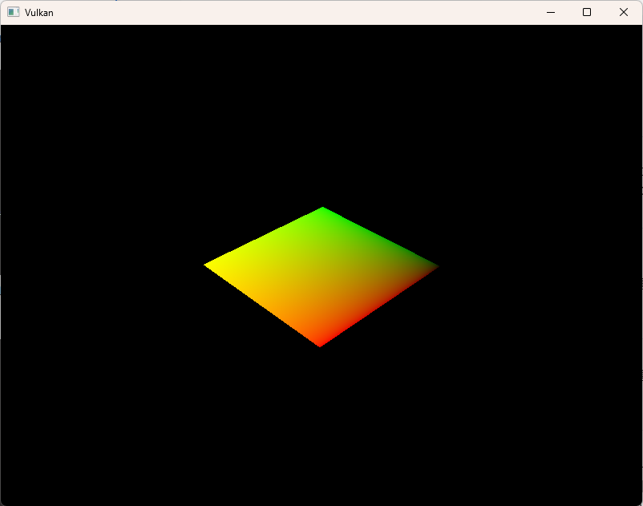
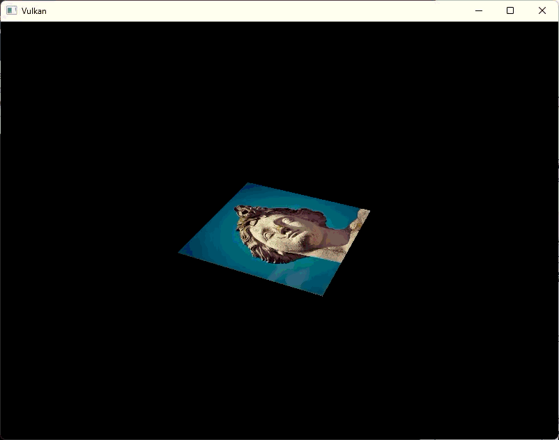
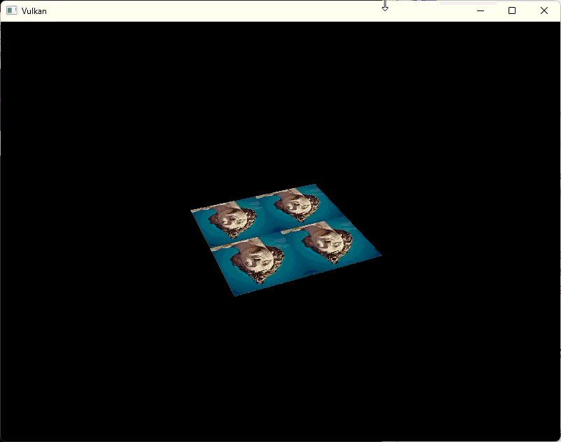
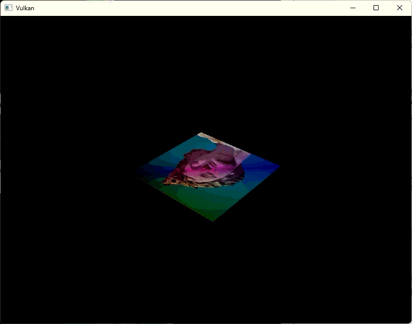

= 결합된 이미지 샘플러 (Combined image sampler)
include::../common/header.adoc[]
:imagesdir!:

== 개요 (Introduction)

우리는 지난 유니폼 버퍼 튜토리얼에서 디스크립터를 처음으로 다루었습니다. 이번 장에서는 '결합된 이미지 샘플러(combined image sampler)'라는 새로운 유형의 디스크립터를 살펴보겠습니다. 이 디스크립터를 사용하면 셰이더가 이전 장에서 만들었던 샘플러 객체를 통해 이미지 리소스에 접근할 수 있습니다.

먼저 디스크립터 세트 레이아웃, 디스크립터 풀, 디스크립터 세트를 수정하여 이 결합된 이미지 샘플러 디스크립터를 포함시켜 보겠습니다. 그런 다음 Vertex 구조체에 텍스처 좌표를 추가하고, 프래그먼트 셰이더가 단순히 정점 색상을 보간하는 대신 텍스처에서 색상을 읽어오도록 수정하겠습니다.

== 디스크립터 업데이트하기 (Updating the descriptors)

``createDescriptorSetLayout`` 함수로 이동하여 결합된 이미지 샘플러 디스크립터를 위한 {VkDescriptorSetLayoutBinding}[``VkDescriptorSetLayoutBinding``]을 추가합니다. 유니폼 버퍼 바인딩 바로 다음 번호에 배치하겠습니다.

[source,cpp]
----
VkDescriptorSetLayoutBinding samplerLayoutBinding{
    .binding = 1,
    .descriptorType = VK_DESCRIPTOR_TYPE_COMBINED_IMAGE_SAMPLER,
    .descriptorCount = 1,
    .stageFlags = VK_SHADER_STAGE_FRAGMENT_BIT,
    .pImmutableSamplers = nullptr,
};

std::array<VkDescriptorSetLayoutBinding, 2> bindings = {uboLayoutBinding, samplerLayoutBinding};

VkDescriptorSetLayoutCreateInfo layoutInfo{
    .sType = VK_STRUCTURE_TYPE_DESCRIPTOR_SET_LAYOUT_CREATE_INFO,
    .bindingCount = static_cast<uint32_t>(bindings.size()),
    .pBindings = bindings.data(),
};
----

프래그먼트 셰이더에서 이 결합된 이미지 샘플러 디스크립터를 사용할 수 있도록 stageFlags를 반드시 설정해야 합니다. 프래그먼트의 최종 색상이 결정되는 곳이 바로 프래그먼트 셰이더이기 때문입니다. 물론 정점 셰이더에서도 텍스처 샘플링을 사용할 수 있습니다. 예를 들어 link:https://en.wikipedia.org/wiki/Heightmap[높이맵(heightmap)]을 이용해 정점 격자를 동적으로 변형할 때 유용합니다.

또한 결합된 이미지 샘플러를 할당할 수 있는 공간을 확보하려면 더 큰 디스크립터 풀을 만들어야 합니다. 이를 위해 {VkDescriptorPoolCreateInfo}[``VkDescriptorPoolCreateInfo``]에 ``VK_DESCRIPTOR_TYPE_COMBINED_IMAGE_SAMPLER`` 타입의 {VkPoolSize}[``VkPoolSize``]를 추가해야 합니다. ``createDescriptorPool`` 함수로 이동하여 이 디스크립터용 {VkDescriptorPoolSize}[``VkDescriptorPoolSize``]를 포함하도록 수정해 주세요.

[source,cpp]
----
std::array<VkDescriptorPoolSize, 2> poolSizes{};

poolSizes[0].type = VK_DESCRIPTOR_TYPE_UNIFORM_BUFFER;
poolSizes[0].descriptorCount = static_cast<uint32_t>(MAX_FRAMES_IN_FLIGHT);
poolSizes[1].type = VK_DESCRIPTOR_TYPE_COMBINED_IMAGE_SAMPLER;
poolSizes[1].descriptorCount = static_cast<uint32_t>(MAX_FRAMES_IN_FLIGHT);

VkDescriptorPoolCreateInfo poolInfo{
    .sType = VK_STRUCTURE_TYPE_DESCRIPTOR_POOL_CREATE_INFO,
    .flags = 0,  // Optional
    .maxSets = static_cast<uint32_t>(MAX_FRAMES_IN_FLIGHT),
    .poolSizeCount = static_cast<uint32_t>(poolSizes.size()),
    .pPoolSizes = poolSizes.data(),
};
----

디스크립터 풀의 용량 부족 문제는 검증 레이어(validation layers)가 잡아내지 못할 수도 있는 대표적인 예시입니다. {vk} 1.1 기준으로, 풀 크기가 충분하지 않으면 {vkAllocateDescriptorSets}[``vkAllocateDescriptorSets``] 함수가 ``VK_ERROR_POOL_OUT_OF_MEMORY`` 오류 코드를 반환하며 실패할 수 있습니다. 하지만 드라이버가 이 문제를 내부적으로 해결하려고 시도할 수도 있습니다. 즉, 하드웨어, 풀 크기, 할당 크기에 따라서는 디스크립터 풀의 한도를 초과하여 할당하더라도 드라이버가 그냥 넘어가는 경우가 있습니다. 반면 어떤 경우에는 실패하여 오류를 반환하기도 합니다. 이 때문에 특정 컴퓨터에서는 할당에 성공하지만 다른 컴퓨터에서는 실패하는 골치 아픈 상황이 발생할 수 있습니다.

{vk}은 할당 책임을 드라이버로 넘겼기 때문에, 디스크립터 풀을 생성할 때 ``descriptorCount``로 지정한 특정 타입(예: ``VK_DESCRIPTOR_TYPE_COMBINED_IMAGE_SAMPLER`` 등)의 개수만큼만 엄격하게 할당해야 하는 제약은 없어졌습니다. 하지만 지정된 개수를 준수하는 것이 여전히 가장 좋은 개발 관행(Best Practice)이며, 향후 link:https://vulkan.lunarg.com/doc/view/1.4.304.0/linux/best_practices.html[``'최적 관행 검증(Best Practice Validation)'``] 기능을 활성화하면 ``VK_LAYER_KHRONOS_validation``에서 이와 관련된 경고를 띄워줄 예정입니다.

마지막 단계는 디스크립터 세트의 디스크립터에 실제 이미지와 샘플러 리소스를 바인딩하는 것입니다. ``createDescriptorSets`` 함수로 이동해 주세요.

[source,cpp]
----
for (size_t i = 0; i < MAX_FRAMES_IN_FLIGHT; i++) {
    VkDescriptorBufferInfo bufferInfo{
        .buffer = _uniformBuffers[i],
        .offset = 0,
        .range = sizeof(UniformBufferObject),
    };
    // 추가
    VkDescriptorImageInfo imageInfo{
        .sampler = _textureSampler,
        .imageView = _textureImageView,
        .imageLayout = VK_IMAGE_LAYOUT_SHADER_READ_ONLY_OPTIMAL,
    };
    ...
}
----

유니폼 버퍼 디스크립터의 버퍼 리소스를 {VkDescriptorBufferInfo}[``VkDescriptorBufferInfo``] 구조체에 지정했던 것처럼, 결합된 이미지 샘플러 구조체의 리소스는 {VkDescriptorImageInfo}[``VkDescriptorImageInfo``] 구조체에 지정해야 합니다. 바로 이 단계에서 이전 장에서 만들었던 객체들이 하나로 합쳐집니다.

[source,cpp, options="nowrap"]
----
std::array<VkWriteDescriptorSet, 2> descriptorWrites{};

descriptorWrites[0].sType = VK_STRUCTURE_TYPE_WRITE_DESCRIPTOR_SET;
descriptorWrites[0].dstSet = _descriptorSets[i];
descriptorWrites[0].dstBinding = 0;
descriptorWrites[0].dstArrayElement = 0;
descriptorWrites[0].descriptorType = VK_DESCRIPTOR_TYPE_UNIFORM_BUFFER;
descriptorWrites[0].descriptorCount = 1;
descriptorWrites[0].pImageInfo = nullptr;
descriptorWrites[0].pBufferInfo = &bufferInfo;
descriptorWrites[0].pTexelBufferView = nullptr;

descriptorWrites[1].sType = VK_STRUCTURE_TYPE_WRITE_DESCRIPTOR_SET;
descriptorWrites[1].dstSet = _descriptorSets[i];
descriptorWrites[1].dstBinding = 1;
descriptorWrites[1].dstArrayElement = 0;
descriptorWrites[1].descriptorType = VK_DESCRIPTOR_TYPE_COMBINED_IMAGE_SAMPLER;
descriptorWrites[1].descriptorCount = 1;
descriptorWrites[1].pImageInfo = &imageInfo;
descriptorWrites[1].pTexelBufferView = nullptr;

vkUpdateDescriptorSets(_device, static_cast<uint32_t>(descriptorWrites.size()), descriptorWrites.data(), 0, nullptr);
----

버퍼를 업데이트했던 것과 마찬가지로, 이 이미지 정보를 사용해 디스크립터를 업데이트해야 합니다. 이번에는 ``pBufferInfo`` 대신 ``pImageInfo`` 배열을 사용합니다. 이제 셰이더에서 디스크립터를 사용할 모든 준비가 끝났습니다!

== 텍스처 좌표 (Texture coordinates)

텍스처 매핑에 꼭 필요한 중요한 요소가 하나 빠졌는데, 바로 각 정점(vertex)의 실제 텍스처 좌표입니다. 이 텍스처 좌표에 따라 이미지가 기하학적 형태(geometry)에 어떻게 배치될지가 결정됩니다.

[source,cpp]
----
struct Vertex {
    glm::vec2 pos;
    glm::vec3 color;
    glm::vec2 texCoord;

    static VkVertexInputBindingDescription getBindingDescription() {
        VkVertexInputBindingDescription bindingDescription{
            .binding = 0,
            .stride = sizeof(Vertex),
            .inputRate = VK_VERTEX_INPUT_RATE_VERTEX,
        };

        return bindingDescription;
    }

    static std::array<VkVertexInputAttributeDescription, 3> getAttributeDescriptions() {
        std::array<VkVertexInputAttributeDescription, 3> attributeDescriptions{};

        attributeDescriptions[0].binding = 0;
        attributeDescriptions[0].location = 0;
        attributeDescriptions[0].format = VK_FORMAT_R32G32_SFLOAT;
        attributeDescriptions[0].offset = offsetof(Vertex, pos);

        attributeDescriptions[1].binding = 0;
        attributeDescriptions[1].location = 1;
        attributeDescriptions[1].format = VK_FORMAT_R32G32B32_SFLOAT;
        attributeDescriptions[1].offset = offsetof(Vertex, color);

        attributeDescriptions[2].binding = 0;
        attributeDescriptions[2].location = 2;
        attributeDescriptions[2].format = VK_FORMAT_R32G32_SFLOAT;
        attributeDescriptions[2].offset = offsetof(Vertex, texCoord);

        return attributeDescriptions;
    }
};
----

``Vertex`` 구조체를 수정하여 텍스처 좌표를 저장할 ``vec2`` 필드를 추가해 주세요. 또한 정점 셰이더에서 이 텍스처 좌표를 입력 값으로 받아서 사용할 수 있도록 {VkVertexInputAttributeDescription}[``VkVertexInputAttributeDescription``]도 함께 추가해야 합니다. 그래야 사각형의 표면을 따라 좌표가 자연스럽게 보간되도록 프래그먼트 셰이더로 전달할 수 있습니다.

[source,cpp]
----
const std::vector<Vertex> vertices = {
    {{-0.5f, -0.5f}, {1.0f, 0.0f, 0.0f}, {1.0f, 0.0f}},
    {{0.5f, -0.5f}, {0.0f, 1.0f, 0.0f}, {0.0f, 0.0f}},
    {{0.5f, 0.5f}, {0.0f, 0.0f, 1.0f}, {0.0f, 1.0f}},
    {{-0.5f, 0.5f}, {1.0f, 1.0f, 1.0f}, {1.0f, 1.0f}},
};
----

이번 튜토리얼에서는 좌측 상단의 ``(0, 0)``부터 우측 하단의 ``(1, 1)``까지의 좌표를 사용하여 사각형을 텍스처로 가득 채워보겠습니다. 다른 좌표를 넣어보며 자유롭게 테스트해 보세요. ``0``보다 작거나 ``1``보다 큰 좌표를 입력해 보면 텍스처 주소 지정 모드(addressing modes)가 어떻게 작동하는지 직접 확인하실 수 있습니다!

== 셰이더 (Shaders)

마지막 단계는 셰이더를 수정하여 텍스처로부터 색상을 샘플링하는 것입니다. 먼저 정점 셰이더를 수정해서 텍스처 좌표가 프래그먼트 셰이더로 그대로 전달되도록 해야 합니다.

[source,glsl]
----
layout(location = 0) in vec2 inPosition;
layout(location = 1) in vec3 inColor;
layout(location = 2) in vec2 inTexCoord;

layout(location = 0) out vec3 fragColor;
layout(location = 1) out vec2 fragTexCoord;

void main() {
    gl_Position = ubo.proj * ubo.view * ubo.model * vec4(inPosition, 0.0, 1.0);
    fragColor = inColor;
    fragTexCoord = inTexCoord;
}
----

정점별 색상과 마찬가지로, ``fragTexCoord`` 값도 래스터라이저(rasterizer)에 의해 사각형 영역 전체에 걸쳐 부드럽게 보간됩니다. 프래그먼트 셰이더가 이 텍스처 좌표를 색상으로 출력하게 만들면 눈으로 직접 확인할 수 있습니다.

[source,glsl]
----
#version 450

layout(location = 0) in vec3 fragColor;
layout(location = 1) in vec2 fragTexCoord;

layout(location = 0) out vec4 outColor;

void main() {
    outColor = vec4(fragTexCoord, 0.0, 1.0);
}
----

아래 이미지와 같은 화면이 나타나야 합니다. 셰이더를 다시 컴파일하는 것을 잊지 마세요!

녹색 채널은 가로 좌표를, 적색 채널은 세로 좌표를 나타냅니다. 모서리가 검은색과 노란색으로 나오는 것을 보니, 사각형 전체에 걸쳐 텍스처 좌표가 ``(0, 0)``에서 ``(1, 1)``까지 올바르게 보간되고 있음을 확인할 수 있습니다. 이처럼 데이터를 색상으로 표현해 시각화하는 것은, 마땅한 대안이 없는 셰이더 프로그래밍 환경에서 printf를 이용해 디버깅하는 것과 같습니다!

GLSL에서 결합된 이미지 샘플러 디스크립터는 sampler 유니폼으로 표현됩니다. 프래그먼트 셰이더에 다음 유니폼 참조 코드를 추가해 주세요.

[source,glsl]
----
layout(binding = 1) uniform sampler2D texSampler;
----

다른 유형의 이미지들을 위해 ``sampler1D``나 ``sampler3D`` 같은 타입도 존재합니다. 여기서는 반드시 올바른 바인딩 번호를 사용해야 합니다.

[source,glsl]
----
void main() {
    outColor = texture(texSampler, fragTexCoord);
}
----

텍스처는 내장 함수인 ``texture``를 사용해 샘플링합니다. 이 함수는 샘플러와 좌표를 인자로 받으며, 샘플러가 백그라운드에서 필터링과 변환 작업을 자동으로 처리해 줍니다. 이제 애플리케이션을 실행하면 사각형에 텍스처가 입혀진 모습을 보실 수 있습니다.

텍스처 좌표를 ``1``보다 큰 값으로 늘려서 주소 지정 모드가 어떻게 바뀌는지 테스트해 보세요. 예를 들어 ``VK_SAMPLER_ADDRESS_MODE_REPEAT`` 모드를 사용할 때, 프래그먼트 셰이더를 다음과 같이 작성하면 아래 이미지와 같은 결과가 나옵니다.

[source,glsl]
----
void main() {
    outColor = texture(texSampler, fragTexCoord * 2.0);
}
----

정점 색상을 활용해 텍스처 색상을 변형할 수도 있습니다.

[source,glsl]
----
void main() {
    outColor = vec4(fragColor * texture(texSampler, fragTexCoord).rgb, 1.0);
}
----

여기서는 알파(투명도) 채널까지 값이 곱해져서 왜곡되는 것을 막기 위해 RGB 채널과 알파 채널을 분리하여 연산했습니다.

이제 셰이더에서 이미지에 접근하는 방법을 마스터하셨습니다! 이 기술은 프레임버퍼에 렌더링된 결과물(이미지)과 결합할 때 엄청난 시너지를 내기 때문에 매우 유용합니다. 이러한 이미지들을 입력값으로 활용하면 후처리(post-processing) 효과나 3D 월드 안의 모니터 화면 같은 멋진 연출을 구현할 수 있습니다.