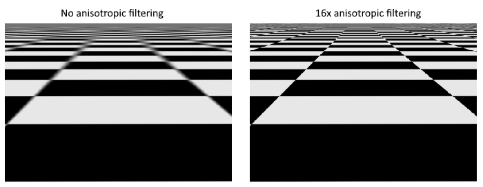
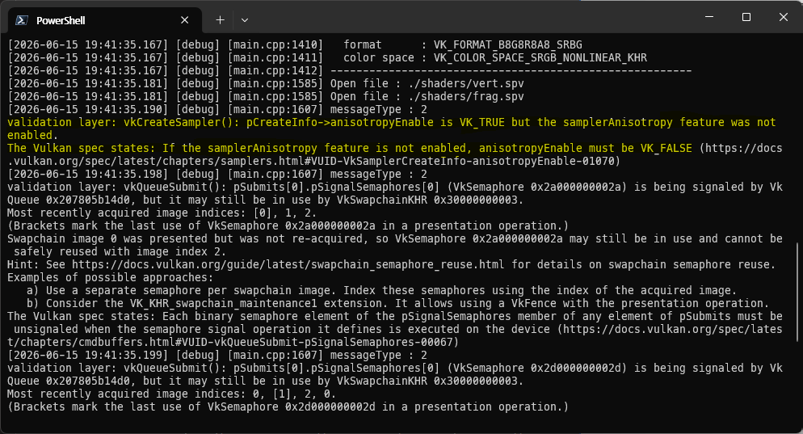

= 이미지 뷰와 샘플러
include::../common/header.adoc[]
:imagesdir!:

이번 장에서는 그래픽스 파이프라인이 이미지를 샘플링하는 데 필요한 두 가지 리소스를 추가로 생성해 보겠습니다. 첫 번째 리소스는 앞서 스왑 체인 이미지를 다룰 때 이미 접해본 것이지만, 두 번째 리소스는 셰이더가 이미지에서 텍셀(texel)을 읽어오는 방식과 관련된 새로운 개념입니다.

== 텍스처 이미지 뷰 (Texture image view)

스왑 체인 이미지 및 프레임버퍼 장에서 살펴보았듯, {vk}에서 이미지에 접근할 때는 직접 접근하지 않고 항상 이미지 뷰를 거쳐야 합니다. 따라서 이번에 만든 텍스처 이미지 역시 그에 맞는 이미지 뷰를 새로 생성해 주어야 합니다.

텍스처 이미지용 {VkImageView}[``VkImageView``]를 저장할 클래스 멤버 변수를 추가하고, 이를 생성할 ``createTextureImageView`` 함수를 새로 정의합니다.

[source,cpp]
----
VkImageView _textureImageView;
...
void initVulkan() {
    ...
    createTextureImage();
    createTextureImageView();
    createVertexBuffer();
    ...
}
...
void createTextureImageView() {

}
----

이 함수의 내부 코드는 기존의 ``createImageViews`` 함수를 그대로 활용할 수 있습니다. 수정해야 할 부분은 포맷(``format``)과 이미지(``image``) 속성, 딱 두 가지뿐입니다.

[source,cpp]
----
VkImageSubresourceRange range{
    .aspectMask = VK_IMAGE_ASPECT_COLOR_BIT,
    .baseMipLevel = 0,
    .levelCount = 1,
    .baseArrayLayer = 0,
    .layerCount = 1,
};
VkImageViewCreateInfo viewInfo{
    .sType = VK_STRUCTURE_TYPE_IMAGE_VIEW_CREATE_INFO,
    .image = _textureImage,
    .viewType = VK_IMAGE_VIEW_TYPE_2D,
    .format = VK_FORMAT_R8G8B8A8_SRGB,
    .subresourceRange = range,
};
----

참고로 ``viewInfo.components``를 명시적으로 초기화하는 코드는 생략했습니다. ``VK_COMPONENT_SWIZZLE_IDENTITY`` 값이 어차피 ``0``으로 정의되어 있기 때문입니다. 이제 {vkCreateImageView}[``vkCreateImageView``]를 호출하여 이미지 뷰 생성을 마무리합니다.

[source,cpp]
----
if (vkCreateImageView(_device, &viewInfo, nullptr, &_textureImageView) != VK_SUCCESS) {
    throw std::runtime_error("failed to create texture image view!");
}
----

기존 ``createImageViews``와 겹치는 로직이 많으므로, 이 공통 부분을 별도의 ``createImageView`` 함수로 분리하여 추상화하는 것이 좋습니다.

[source,cpp]
----
VkImageView createImageView(VkImage image, VkFormat format) {
    VkImageSubresourceRange range{
        .aspectMask = VK_IMAGE_ASPECT_COLOR_BIT,
        .baseMipLevel = 0,
        .levelCount = 1,
        .baseArrayLayer = 0,
        .layerCount = 1,
    };
    VkImageViewCreateInfo viewInfo{
        .sType = VK_STRUCTURE_TYPE_IMAGE_VIEW_CREATE_INFO,
        .image = image,
        .viewType = VK_IMAGE_VIEW_TYPE_2D,
        .format = format,
        .subresourceRange = range,
    };

    VkImageView imageView;

    if (vkCreateImageView(_device, &viewInfo, nullptr, &imageView) != VK_SUCCESS) {
        throw std::runtime_error("failed to create image view!");
    }
}
----

공통 함수를 만들고 나면 ``createTextureImageView`` 함수를 다음과 같이 깔끔하게 줄일 수 있습니다.

[source,cpp]
----
void createTextureImageView() {
    _textureImageView = createImageView(_textureImage, VK_FORMAT_R8G8B8A8_SRGB);
}
----

마찬가지로 기존의 ``createImageViews`` 함수도 훨씬 간결해집니다.

[source,cpp]
----
void createImageViews() {
    _swapChainImageViews.resize(_swapChainImages.size());

    for (size_t i = 0; i < _swapChainImages.size(); i++) {
        _swapChainImageViews[i] = createImageView(_swapChainImages[i], _swapChainImageFormat);
    }
}
----

마지막으로 프로그램이 종료될 때, 텍스처 이미지 자체를 파괴하기 바로 직전 단계에서 이 이미지 뷰를 먼저 해제해야 함을 잊지 마세요.

== 샘플러 (Samplers)

셰이더에서 이미지의 텍셀(texel)을 직접 읽어오는 것도 가능하지만, 이미지를 텍스처로 사용할 때는 그리 흔한 방식이 아닙니다. 보통 텍스처는 '샘플러(sampler)'를 거쳐 접근하며, 이 샘플러는 필터링과 변환 처리를 적용하여 최종적으로 추출할 색상을 계산해 줍니다.

이러한 필터들은 오버샘플링(oversampling) 같은 문제를 해결할 때 매우 유용합니다. 텍셀 수보다 더 많은 프래그먼트를 가진 지오메트리에 텍스처가 매핑되는 상황을 가정해 보겠습니다. 각 프래그먼트의 텍스처 좌표에서 가장 가까운 텍셀을 단순히 가져오기만 한다면, 첫 번째 이미지처럼 계단 현상이 일어난 결과를 얻게 됩니다.

image::../assets/texture_filtering.png[align=center,width=80%]

반면 가장 가까운 텍셀 4개를 선형 보간(linear interpolation)으로 결합하면, 오른쪽 이미지처럼 훨씬 부드러운 결과를 얻을 수 있습니다. 물론 만들고자 하는 애플리케이션의 아트 스타일(예: 마인크래프트)에 따라 왼쪽 방식이 더 어울릴 수도 있겠지만, 일반적인 그래픽스 애플리케이션에서는 오른쪽 방식을 선호합니다. 샘플러 오브젝트는 텍스처에서 색상을 읽을 때 이러한 필터링을 자동으로 적용해 줍니다.

언더샘플링(undersampling)은 이와 반대로 프래그먼트보다 텍셀이 더 많은 상황에서 발생합니다. 체커보드 같은 고주파 패턴의 텍스처를 날카로운 각도에서 샘플링할 때 이 문제가 두드러지며, 화면에 지저분한 아티팩트(왜곡 현상)가 나타나게 됩니다.

왼쪽 이미지에서 볼 수 있듯이, 멀리 있는 텍스처가 형체를 알아보기 힘들 정도로 흐릿하게 뭉개집니다. 이 문제의 해결책이 바로 link:https://en.wikipedia.org/wiki/Anisotropic_filtering[비등방성 필터링(anisotropic filtering)]이며, 이 또한 샘플러가 자동으로 처리해 줄 수 있습니다.

필터링 외에도 샘플러는 텍스처 좌표의 변환을 담당합니다. '어드레싱 모드(addressing mode)' 설정을 통해 이미지 범위를 벗어난 텍셀을 읽으려고 할 때 어떤 처리를 할지 결정합니다. 아래 이미지는 선택할 수 있는 몇 가지 방식을 보여줍니다.

image::../assets/texture_addressing.png[align=center,width=80%]

이제 이러한 샘플러 오브젝트를 설정하는 ``createTextureSampler`` 함수를 만들어 보겠습니다. 여기서 만든 샘플러는 나중에 셰이더에서 텍스처의 색상을 읽어올 때 사용합니다.

[source,cpp]
----
void initVulkan() {
    ...
    createTextureImage();
    createTextureImageView();
    createTextureSampler();
    ...
}
...
void createTextureSampler() {

}
----

샘플러는 {VkSamplerCreateInfo}[``VkSamplerCreateInfo``] 구조체를 통해 설정하며, 여기에 적용할 모든 필터와 변환 방식을 지정하게 됩니다.

[source,cpp]
----
VkSamplerCreateInfo samplerInfo{
    .sType = VK_STRUCTURE_TYPE_SAMPLER_CREATE_INFO,
    .magFilter = VK_FILTER_LINEAR,
    .minFilter = VK_FILTER_LINEAR,
};
----

``magFilter``와 ``minFilter`` 필드는 텍스처가 확대(magnified)되거나 축소(minified)될 때 텍셀을 어떻게 보간할지 지정합니다. 확대는 앞서 언급한 오버샘플링 문제와 관련이 있고, 축소는 언더샘플링 문제와 관련이 있습니다. 선택 항목은 ``VK_FILTER_NEAREST``와 ``VK_FILTER_LINEAR``가 있으며, 각각 위 이미지들에서 보여준 모드에 대응합니다.

[source,cpp]
----
samplerInfo.addressModeU = VK_SAMPLER_ADDRESS_MODE_REPEAT;
samplerInfo.addressModeV = VK_SAMPLER_ADDRESS_MODE_REPEAT;
samplerInfo.addressModeW = VK_SAMPLER_ADDRESS_MODE_REPEAT;
----

어드레싱 모드는 ``addressMode`` 필드를 사용하여 축별로 지정할 수 있습니다. 설정 가능한 값들은 아래와 같으며, 대부분 위 이미지에 예시로 나와 있습니다. 참고로 텍스처 공간 좌표계의 관례에 따라 축 이름은 X(##U##), Y(##V##), Z(##W##) 대신 U, V, W를 사용합니다.

[cols="5a,5",options=header]
|===
|플래그
|설명

|``VK_SAMPLER_ADDRESS_MODE_REPEAT``
|이미지 크기를 벗어나면 텍스처를 반복해서 타일링합니다.

|``VK_SAMPLER_ADDRESS_MODE_MIRRORED_REPEAT``
|repeat과 유사하지만, 범위를 벗어날 때 이미지를 뒤집어서 데칼코마니처럼 대칭으로 반복합니다.

|``VK_SAMPLER_ADDRESS_MODE_CLAMP_TO_EDGE``
|이미지 범위를 벗어나면 좌표에서 가장 가까운 가장자리의 색상을 그대로 연장하여 채웁니다.

|``VK_SAMPLER_ADDRESS_MODE_MIRROR_CLAMP_TO_EDGE``
|clamp to edge와 비슷하지만, 가장 가까운 쪽의 반대편 가장자리 색상을 사용합니다.

|``VK_SAMPLER_ADDRESS_MODE_CLAMP_TO_BORDER``
|이미지 범위를 벗어난 영역을 샘플링할 때 지정한 단색(보더 컬러)을 반환합니다.
|===

이번 튜토리얼에서는 이미지 바깥 영역을 샘플링하지 않을 것이므로 어떤 어드레싱 모드를 선택하든 크게 상관은 없습니다. 하지만 바닥이나 벽면처럼 텍스처를 바둑판식으로 배열할 때 유용하기 때문에, 실무에서는 ``repeat`` 모드가 가장 흔하게 쓰입니다.

[source,cpp]
----
samplerInfo.anisotropyEnable = VK_TRUE;
samplerInfo.maxAnisotropy = ???;
----

이 두 필드는 비등방성 필터링(anisotropic filtering)의 사용 여부를 지정합니다. 성능이 극도로 중요한 상황이 아니라면 이 기능을 굳이 끌 이유가 없습니다. ``maxAnisotropy`` 필드는 최종 색상을 계산하기 위해 사용할 수 있는 텍셀 샘플의 최대 개수를 제한합니다. 이 값이 낮으면 성능은 좋아지지만 화질이 떨어집니다. 적절한 제한 값을 알아내려면 다음과 같이 물리 디바이스의 기능을 쿼리해야 합니다.

[source,cpp]
----
VkPhysicalDeviceProperties properties{};

vkGetPhysicalDeviceProperties(_physicalDevice, &properties);
----

{VkPhysicalDeviceProperties}[``VkPhysicalDeviceProperties``] 구조체의 명세를 보면 ``limits``라는 이름의 {VkPhysicalDeviceLimits}[``VkPhysicalDeviceLimits``] 멤버가 포함되어 있습니다. 이 하위 구조체 안에 있는 ``maxSamplerAnisotropy`` 멤버가 바로 우리가 ``maxAnisotropy``에 지정할 수 있는 최댓값입니다. 최고의 화질을 원한다면 이 값을 직접 대입하면 됩니다.

[source,cpp]
----
samplerInfo.maxAnisotropy = properties.limits.maxSamplerAnisotropy;
----

디바이스 프로퍼티는 프로그램 시작 단계에서 미리 조회한 뒤 필요한 함수에 인자로 넘겨주어도 되고, ``createTextureSampler`` 함수 내부에서 그때그때 직접 쿼리해서 써도 괜찮습니다.

[source,cpp]
----
samplerInfo.borderColor = VK_BORDER_COLOR_INT_OPAQUE_BLACK;
----

``borderColor`` 필드는 어드레싱 모드가 clamp to border일 때 이미지 바깥 영역에서 반환할 색상을 지정합니다. 부동소수점(float) 또는 정수(int) 포맷의 검은색, 흰색, 투명색 중에서만 선택할 수 있으며, **사용자가 임의의 커스텀 색상을 지정하는 것은 불가능**합니다.

[source,cpp]
----
samplerInfo.unnormalizedCoordinates = VK_FALSE;
----

``unnormalizedCoordinates`` 필드는 이미지의 텍셀에 접근할 때 어떤 좌표계를 사용할지 결정합니다. 이 필드를 VK_TRUE로 설정하면 ``[0, 이미지 너비)`` 및 ``[0, 이미지 높이)`` 범위의 픽셀 단위 좌표를 그대로 쓸 수 있습니다. 반면 VK_FALSE로 설정하면 모든 축에서 ``[0, 1)`` 범위의 정규화된 좌표를 사용하게 됩니다. 실무에서는 해상도가 다른 텍스처라도 완전히 동일한 좌표로 재사용할 수 있도록 거의 항상 정규화된 좌표 체계를 사용합니다.

[source,cpp]
----
samplerInfo.compareEnable = VK_FALSE;
samplerInfo.compareOp = VK_COMPARE_OP_ALWAYS;
----

비교 기능(comparison function)을 활성화하면, 텍셀을 읽어오기 전에 특정 값과 먼저 비교한 뒤 그 결과를 필터링 연산에 활용합니다. 이 기능은 주로 그림자 맵(shadow map)에서 link:https://developer.nvidia.com/gpugems/GPUGems/gpugems_ch11.html[PCF(Percentage-Clarer Filtering)]를 구현할 때 쓰이며, 자세한 내용은 이후 장에서 다루겠습니다.

[source,cpp]
----
samplerInfo.mipmapMode = VK_SAMPLER_MIPMAP_MODE_LINEAR;
samplerInfo.mipLodBias = 0.0f;
samplerInfo.minLod = 0.0f;
samplerInfo.maxLod = 0.0f;
----

여기에 포함된 모든 필드는 밉매핑(mipmapping)에 적용되는 설정들입니다. 밉매핑 역시 나중에 link:../GeneratingMipmaps.html[자세히] 다루겠지만, 기본적으로 텍스처에 적용할 수 있는 또 다른 형태의 필터링 기술이라고 이해하시면 됩니다.

이제 샘플러의 동작 방식에 대한 모든 설정이 끝났습니다. 샘플러 오브젝트의 핸들을 저장할 클래스 멤버 변수를 추가하고, {vkCreateSampler}[``vkCreateSampler``]를 호출하여 샘플러를 생성합니다.

[source,cpp]
----
VkImageView _textureImageView;
VkSampler _textureSampler;
...
void createTextureSampler() {
    ...
    if (vkCreateSampler(_device, &samplerInfo, nullptr, &_textureSampler) != VK_SUCCESS) {
        throw std::runtime_error("failed to create texture sampler!");
    }
}
----

여기서 주목할 점은 샘플러를 생성할 때 그 어디에서도 {VkImage}[``VkImage``]를 참조하지 않는다는 것입니다. 샘플러는 텍스처에서 색상을 추출하는 인터페이스만 제공하는 독립적인 오브젝트입니다. 따라서 1D, 2D, 3D에 상관없이 원하는 어떤 이미지에든 자유롭게 가져다 붙여서 쓸 수 있습니다. 이는 텍스처 이미지와 필터링 설정을 하나의 상태로 묶어서 처리하던 옛날 그래픽스 API들과는 확연히 다른 Vulkan만의 특징입니다.

프로그램이 끝날 때, 더 이상 이미지에 접근할 일이 없어지면 마지막 단계에서 이 샘플러 오브젝트도 함께 해제해 줍니다.

[source,cpp]
----
void cleanup() {
    cleanupSwapChain();

    vkDestroySampler(_device, _textureSampler, nullptr);
    vkDestroyImageView(_device, _textureImageView, nullptr);
    ...
}
----

== 비등방성 디바이스 기능 (Anisotropy device feature)

만약 이 상태로 프로그램을 바로 실행한다면, 다음과 같은 검증 레이어(validation layer) 에러 메시지를 보게 될 것입니다.

NOTE: 작성자 버전(Vulkan SDK 1.4.350.0)에서와는 메세지가 약간 달라 작성자 버전의 갈무리로 대체함(노란색 부분).

그 이유는 비등방성 필터링(anisotropic filtering)이 사실 디바이스의 '선택적 기능(optional feature)'이기 때문입니다. 따라서 이 기능을 사용하려면 ``createLogicalDevice`` 함수를 수정하여 해당 기능을 명시적으로 요청해 주어야 합니다.

[source,cpp]
----
VkPhysicalDeviceFeatures deviceFeatures{
    .samplerAnisotropy = VK_TRUE,
};
----

최신 그래픽 카드에서 이 기능을 지원하지 않을 확률은 극히 희박하지만, 확실히 해두기 위해 ``isDeviceSuitable`` 함수도 업데이트하여 해당 기능을 지원하는지 검사하는 로직을 추가하는 것이 좋습니다(##11~14라인##).

[source,cpp, linenums,options="nowrap"]
----
bool isDeviceSuitable(VkPhysicalDevice device) {
    QueueFamilyIndices indices = findQueueFamilies(device);
    bool extensionsSupported = checkDeviceExtensionSupport(device);
    bool swapChainAdequate = false;

    if (extensionsSupported) {
        SwapChainSupportDetails swapChainSupport = querySwapChainSupport(device);
        swapChainAdequate = !swapChainSupport.formats.empty() && !swapChainSupport.presentModes.empty();
    }

    VkPhysicalDeviceFeatures supportedFeatures{};
    vkGetPhysicalDeviceFeatures(device, &supportedFeatures);

    return indices.isComplete() && extensionsSupported && swapChainAdequate && supportedFeatures.samplerAnisotropy;
}
----

{vkGetPhysicalDeviceFeatures}[``vkGetPhysicalDeviceFeatures``] 함수는 {VkPhysicalDeviceFeatures}[``VkPhysicalDeviceFeatures``] 구조체의 불리언(boolean) 값들을 설정하는 방식으로 동작합니다. 이때 구조체는 기능의 '요청'이 아니라, 디바이스가 어떤 기능을 '지원'하는지 나타내는 용도로 재활용됩니다.

만약 비등방성 필터링 지원을 필수 조건으로 강제하고 싶지 않다면, 조건문을 활용해 지원 여부에 따라 설정을 유연하게 바꾸는 방식으로 사용하지 않도록 처리할 수도 있습니다.

[source,cpp]
----
samplerInfo.anisotropyEnable = VK_FALSE;
samplerInfo.maxAnisotropy = 1.0f;
----

link:./CombinedImageSampler.html[다음 장]에서는 이렇게 만든 이미지와 샘플러 오브젝트를 셰이더에 노출시켜, 사각형 화면에 텍스처를 직접 입혀서 그려보도록 하겠습니다.