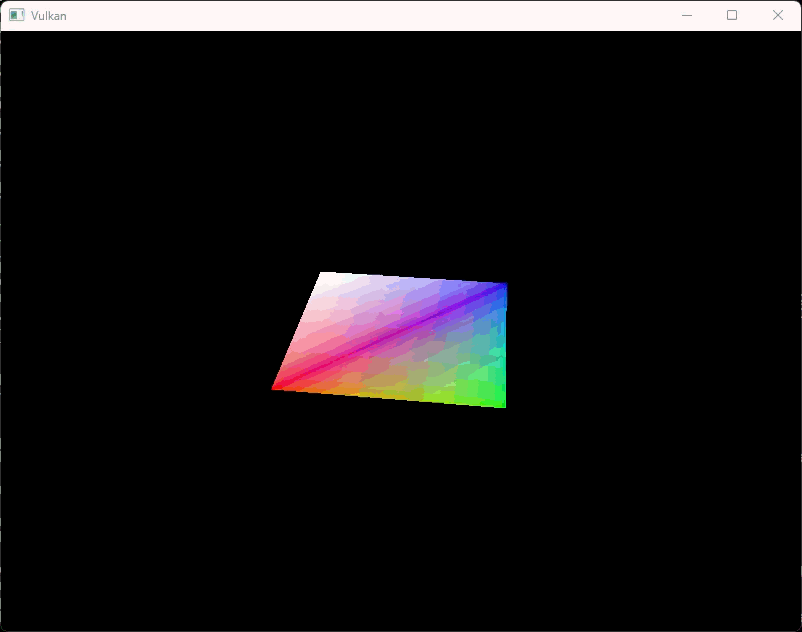

= 디스크립터 풀과 세트 (Descriptor pool and sets)
include::../common/header.adoc[]
:imagesdir!:

== 개요 (Introduction)

이전 장에서 살펴본 디스크립터 세트 레이아웃은 바인딩할 수 있는 디스크립터의 종류를 정의합니다. 이번 장에서는 각 VkBuffer 리소스를 유니폼 버퍼 디스크립터에 연결하기 위해, 버퍼별로 디스크립터 세트를 생성해 보겠습니다.

== 디스크립터 풀 (Descriptor pool)

디스크립터 세트는 직접 생성할 수 없으며, 커맨드 버퍼처럼 풀(Pool)을 통해 할당받아야 합니다. 이 역할을 하는 객체를 '디스크립터 풀'이라고 부릅니다. 이를 설정하기 위해 ``createDescriptorPool``이라는 새로운 함수를 작성하겠습니다.

[source,cpp]
----
void initVulkan() {
    ...
    createUniformBuffers();
    createDescriptorPool();
    ...
}
...
void createDescriptorPool() {

}
----

먼저 {VkDescriptorPoolSize}[``VkDescriptorPoolSize``] 구조체를 사용하여, 생성할 디스크립터 세트에 어떤 타입의 디스크립터가 몇 개나 포함될지 정의해야 합니다.

[source,cpp]
----
VkDescriptorPoolSize poolSize{
    .type = VK_DESCRIPTOR_TYPE_UNIFORM_BUFFER,
    .descriptorCount = static_cast<uint32_t>(MAX_FRAMES_IN_FLIGHT),
};
----

우리는 매 프레임마다 이 디스크립터를 하나씩 할당할 것입니다. 설정한 풀 크기 정보는 메인 구조체인 {VkDescriptorPoolCreateInfo}[``VkDescriptorPoolCreateInfo``]에서 참조합니다.

[source,cpp,linenums]
----
VkDescriptorPoolCreateInfo poolInfo{
    .sType = VK_STRUCTURE_TYPE_DESCRIPTOR_POOL_CREATE_INFO,
    .flags = 0,  // Optional
    .maxSets = static_cast<uint32_t>(MAX_FRAMES_IN_FLIGHT),
    .poolSizeCount = 1,
    .pPoolSizes = &poolSize,
};
----

사용 가능한 개별 디스크립터의 최대 개수뿐만 아니라, 할당할 수 있는 디스크립터 세트의 최대 개수도 함께 지정해야 합니다.

이 구조체에는 커맨드 풀과 유사하게 개별 디스크립터 세트를 해제할 수 있는지 여부를 결정하는 선택적 플래그(``VK_DESCRIPTOR_POOL_CREATE_FREE_DESCRIPTOR_SET_BIT``)가 있습니다. 여기서는 디스크립터 세트를 생성한 후 따로 수정하지 않을 것이므로 이 플래그가 필요 없습니다. ``flags`` 필드는 기본값인 ``0``으로 설정하면 됩니다(##**3번라인**##).

[source,cpp]
----
VkDescriptorPool _descriptorPool;
...
// void createDescriptorPool()
if (vkCreateDescriptorPool(_device, &poolInfo, nullptr, &_descriptorPool) != VK_SUCCESS) {
    throw std::runtime_error("failed to create descriptor pool!");
}
----

디스크립터 풀의 핸들을 저장할 새로운 클래스 멤버 변수를 추가하고, {vkCreateDescriptorPool}[``vkCreateDescriptorPool``]을 호출하여 풀을 생성합니다

== 디스크립터 세트 (Descriptor set)

이제 디스크립터 세트 자체를 할당할 차례입니다. 이를 위해 ``createDescriptorSets`` 함수를 추가하겠습니다.

[source,cpp]
----
void initVulkan() {
    ...
    createDescriptorPool();
    createDescriptorSets();
    ...
}
...
void createDescriptorSets() {

}
----

디스크립터 세트 할당은 {VkDescriptorSetAllocateInfo}[``VkDescriptorSetAllocateInfo``] 구조체로 정의합니다. 여기에는 할당을 진행할 디스크립터 풀, 할당할 디스크립터 세트의 개수, 그리고 기준이 될 디스크립터 세트 레이아웃을 지정해야 합니다.

[source,cpp]
----
//void createDescriptorSets()
std::vector<VkDescriptorSetLayout> layouts(MAX_FRAMES_IN_FLIGHT, _descriptorSetLayout);
VkDescriptorSetAllocateInfo allocInfo{
    .sType = VK_STRUCTURE_TYPE_DESCRIPTOR_SET_ALLOCATE_INFO,
    .descriptorPool = _descriptorPool,
    .descriptorSetCount = static_cast<uint32_t>(MAX_FRAMES_IN_FLIGHT),
    .pSetLayouts = layouts.data(),
};
----

이번 예제에서는 동시 처리 가능한 프레임(frames in flight) 수만큼 디스크립터 세트를 생성하며, 모두 동일한 레이아웃을 사용합니다. 다만, 다음에 호출할 함수가 세트 개수와 일치하는 레이아웃 배열을 요구하기 때문에, 번거롭더라도 레이아웃의 복사본들을 그 개수만큼 준비해야 합니다.

디스크립터 세트 핸들을 저장할 클래스 멤버 변수를 추가하고, {vkAllocateDescriptorSets}[``vkAllocateDescriptorSets``]를 호출하여 할당을 진행합니다.

[source,cpp]
----
VkDescriptorPool _descriptorPool;
std::vector<VkDescriptorSet> _descrpitorSets;
...
// void createDescriptorSets()
_descriptorSets.resize(MAX_FRAMES_IN_FLIGHT);

if (vkAllocateDescriptorSets(_device, &allocInfo, _descriptorSets.data()) != VK_SUCCESS) {
    throw std::runtime_error("fialed to allocate descriptor sets!");
}
----

디스크립터 세트는 디스크립터 풀이 파괴될 때 자동으로 함께 해제되므로, 명시적으로 직접 정리할 필요는 없습니다. {vkAllocateDescriptorSets}[``vkAllocateDescriptorSets``]를 호출하면 각각 하나의 유니폼 버퍼 디스크립터를 포함하는 디스크립터 세트들이 할당됩니다.

[source,cpp]
----
void cleanup() {
    ...
    vkDestroyDescriptorPool(_device, _descriptorPool, nullptr);
    vkDestroyDescriptorSetLayout(_device, _descriptorSetLayout, nullptr);
    ...
}
----

이제 디스크립터 세트는 할당되었지만, 그 내부의 디스크립터들은 아직 설정되지 않은 상태입니다. 루프를 추가하여 각 디스크립터의 내용을 채워보겠습니다.

[source,cpp]
----
// void createDescriptorSets()
for (size_t i = 0; i < MAX_FRAMES_IN_FLIGHT; i++) {

}
----

우리가 사용하는 유니폼 버퍼 디스크립터처럼 버퍼를 참조하는 디스크립터는 {VkDescriptorBufferInfo}[``VkDescriptorBufferInfo``] 구조체로 설정합니다. 이 구조체는 참조할 버퍼와, 디스크립터 데이터가 포함된 버퍼 내부의 특정 영역(구간)을 지정합니다.

[source,cpp]
----
// void createDescriptorSets()
for (size_t i = 0; i < MAX_FRAMES_IN_FLIGHT; i++) {
    VkDescriptorBufferInfo bufferInfo{
        .buffer = _uniformBuffers[i],
        .offset = 0,
        .range = sizeof(UniformBufferObject),
    };
}
----

이번 경우처럼 버퍼 전체를 사용하는 상황이라면, range 필드에 ``VK_WHOLE_SIZE`` 값을 사용할 수도 있습니다. 디스크립터 설정은 {vkUpdateDescriptorSets}[``vkUpdateDescriptorSets``] 함수를 통해 갱신하며, 이 함수는 {VkWriteDescriptorSet}[``VkWriteDescriptorSet``] 구조체 배열을 인자로 받습니다.

[source,cpp,linenums]
----
// void createDescriptorSets()
for (size_t i = 0; i < MAX_FRAMES_IN_FLIGHT; i++) {
    ...
    VkWriteDescriptorSet descriptorWrite{
        .sType = VK_STRUCTURE_TYPE_WRITE_DESCRIPTOR_SET,
        .dstSet = _descriptorSets[i],
        .dstBinding = 0,
        .dstArrayElement = 0,
        .descriptorCount = 1,
        .descriptorType = VK_DESCRIPTOR_TYPE_UNIFORM_BUFFER,
        .pImageInfo = nullptr,  // Optional
        .pBufferInfo = &bufferInfo,
        .pTexelBufferView = nullptr,  // Optional
    };
}
----

첫 두 필드는 갱신할 디스크립터 세트와 바인딩 번호를 지정합니다. 앞서 유니폼 버퍼의 바인딩 인덱스를 ``0``으로 설정했던 것을 기억하실 겁니다. 디스크립터는 배열 형태로도 존재할 수 있으므로, 배열에서 몇 번째 인덱스부터 갱신할지 시작 위치도 지정해야 합니다. 여기서는 배열을 쓰지 않으므로 단순히 ``0``을 입력합니다.

디스크립터의 타입을 다시 한번 지정해야 합니다(##**10번라인**##). ``dstArrayElement`` 인덱스부터 시작하여 배열 내의 여러 디스크립터를 한 번에 갱신하는 것도 가능합니다. ``descriptorCount`` 필드는 배열에서 몇 개의 요소를 갱신할지 그 개수를 지정합니다(##**9번라인**##).

마지막 필드는 실제로 디스크립터를 설정하는 구조체 배열(크기는 ``descriptorCount`` - ##**9번라인**##)을 참조합니다. 디스크립터 타입에 따라 세 가지 포인터 필드 중 어떤 것을 사용할지 결정됩니다. 버퍼 데이터를 참조할 때는 ``pBufferInfo``(##**12번라인**##), 이미지 데이터를 참조할 때는 ``pImageInfo``(##**11번라인**##), 버퍼 뷰를 참조할 때는 ``pTexelBufferView``(##**13번라인**##)를 사용합니다. 우리가 만드는 디스크립터는 버퍼 기반이므로 ``pBufferInfo``를 사용합니다.

[source,cpp]
----
// void createDescriptorSets()
for (size_t i = 0; i < MAX_FRAMES_IN_FLIGHT; i++) {
    ...
    vkUpdateDescriptorSets(_device, 1, &descriptorWrite, 0, nullptr);
}
----

설정된 변경 사항들은 {vkUpdateDescriptorSets}[``vkUpdateDescriptorSets``]를 통해 적용됩니다. 이 함수는 파라미터로 {VkWriteDescriptorSet}[``VkWriteDescriptorSet``] 배열과 {VkCopyDescriptorSet}[``VkCopyDescriptorSet``] 배열 두 가지를 받습니다. 후자는 이름에서 알 수 있듯이 디스크립터 간에 데이터를 복사할 때 사용합니다.

== 디스크립터 세트 사용하기 (Using descriptor sets)

이제 ``recordCommandBuffer`` 함수를 수정하여, 각 프레임에 맞는 올바른 디스크립터 세트를 셰이더 내 디스크립터에 바인딩해야 합니다. 이 작업은 {vkCmdBindDescriptorSets}[``vkCmdBindDescriptorSets``]를 사용하여 이루어지며, {vkCmdDrawIndexed}[``vkCmdDrawIndexed``] 호출 전에 실행해야 합니다.

[source,cpp]
----
// void recordCommandBuffer(VkCommandBuffer commandBuffer, uint32_t imageIndex)
vkCmdBindDescriptorSets(commandBuffer, VK_PIPELINE_BIND_POINT_GRAPHICS, _pipelineLayout, 0, 1,
                        &_descriptorSets[currentFrame], 0, nullptr);
vkCmdDrawIndexed(commandBuffer, static_cast<uint32_t>(indices.size()), 1, 0, 0, 0);
----

정점(Vertex) 버퍼나 인덱스 버퍼와 달리, 디스크립터 세트는 그래픽스 파이프라인 전용이 아닙니다. 따라서 디스크립터 세트를 그래픽스 파이프라인과 컴퓨트 파이프라인 중 어디에 바인딩할지 명시해야 합니다. 그다음 파라미터는 디스크립터의 기준이 되는 레이아웃입니다. 이어지는 세 개의 파라미터는 시작 디스크립터 세트의 인덱스, 바인딩할 세트의 개수, 그리고 바인딩할 세트 배열을 지정합니다. 이 부분은 잠시 후에 다시 살펴보겠습니다. 마지막 두 파라미터는 동적(Dynamic) 디스크립터에 사용되는 오프셋 배열을 지정하는 곳으로, 이에 대해서는 향후 다른 장에서 다루겠습니다.

이제 프로그램을 실행해 보면 안타깝게도 화면에 아무것도 보이지 않을 것입니다. 원인은 투영 행렬(Projection Matrix)에서 Y축을 뒤집었기(Y-flip) 때문에, 정점들이 시계 방향(Clockwise)이 아닌 반시계 방향(Counter-clockwise) 순서로 그려지기 때문입니다. 이로 인해 백페이스 컬링(Backface Culling)이 작동하여 기하구조(Geometry)가 렌더링되지 않는 문제가 발생합니다. ``createGraphicsPipeline`` 함수로 이동하여 {VkPipelineRasterizationStateCreateInfo}[``VkPipelineRasterizationStateCreateInfo``] 구조체의 ``frontFace`` 설정을 다음과 같이 수정해 주세요.

[source,cpp]
----
// void createGraphicsPipeline()
rasterizer.cullMode = VK_CULL_MODE_BACK_BIT;
rasterizer.frontFace = VK_FRONT_FACE_COUNTER_CLOCKWISE;
----

프로그램을 다시 실행하면 다음과 같은 화면을 볼 수 있습니다.

투영 행렬이 화면 종횡비(Aspect Ratio)를 보정해 주기 때문에 직사각형이 정사각형으로 바뀐 것을 확인할 수 있습니다. 화면 크기 조절은 ``updateUniformBuffer``에서 알아서 처리하므로, ``recreateSwapChain`` 함수에서 디스크립터 세트를 다시 생성할 필요는 없습니다.

== 정렬 요구사항 (Alignment requirements)

지금까지 우리가 슬쩍 넘어간 부분 중 하나는, C++ 구조체의 데이터가 셰이더의 유니폼 정의와 어떻게 정확히 일치해야 하는가입니다. 양쪽 모두에 그냥 동일한 타입을 사용하면 아주 명확해 보입니다.

[source,glsl]
----
struct UniformBufferObject {
    glm::mat4 model;
    glm::mat4 view;
    glm::mat4 proj;
};

layout(binding = 0) uniform UniformBufferObject {
    mat4 mode;
    mat4 view;
    mat4 proj;
} ubo;
----

하지만 그게 전부는 아닙니다. 예를 들어 구조체와 셰이더를 다음과 같이 한번 수정해 보세요.

[source,glsl]
----
struct UniformBufferObject {
    glm::vec2 foo;
    glm::mat4 model;
    glm::mat4 view;
    glm::mat4 proj;
};

layout(binding = 0) uniform UniformBufferObject {
    vec2 foo;
    mat4 mode;
    mat4 view;
    mat4 proj;
} ubo;
----

셰이더와 프로그램을 다시 컴파일하고 실행해 보면, 지금까지 공들여 만든 알록달록한 정사각형이 사라진 것을 볼 수 있습니다! 이는 우리가 정렬 요구사항(Alignment requirements)을 고려하지 않았기 때문입니다.

Vulkan은 구조체의 데이터가 메모리상에서 특정한 방식으로 정렬되기를 요구합니다. 예를 들면 다음과 같습니다.

* 스칼라(Scalar) 타입은 N 바이트 크기로 정렬되어야 합니다 (32비트 부동소수점 기준 N = 4바이트)
* ``vec2``는 2N 바이트(= 8바이트) 크기로 정렬되어야 합니다.
* ``vec3`` 또는 ``vec4``는 4N 바이트(= 16바이트) 크기로 정렬되어야 합니다.
* 중첩된 구조체(Nested structure)는 멤버들의 기본 정렬 크기를 기준으로 16의 배수가 되도록 올림하여 정렬되어야 합니다.
* ``mat4`` 행렬은 ``vec4``와 동일한 정렬 기준을 가져야 합니다.

정렬 요구사항에 대한 전체 목록은 link:https://www.khronos.org/registry/vulkan/specs/1.3-extensions/html/chap15.html#interfaces-resources-layout[Vulkan 명세서(Specification)]에서 확인하실 수 있습니다.

처음에 구현했던 세 개의 ``mat4`` 필드만 있던 셰이더는 이미 이 정렬 요구사항을 만족하고 있었습니다. ``mat4`` 하나는 크기가 4 x 4 x 4 = 64바이트이므로, ``model``은 오프셋 ``0``, ``view``는 오프셋 ``64``, ``proj``는 오프셋 ``128``을 가집니다. 이 오프셋들은 모두 **16의 배수**였기 때문에 아무 문제 없이 잘 작동했던 것입니다.

반면 새로 바뀐 구조체는 고작 8바이트 크기인 ``vec2``로 시작하는 바람에 모든 오프셋이 어긋나 버렸습니다. 이제 ``model``은 오프셋 ``8``, ``view``는 오프셋 ``72``, ``proj``는 오프셋 ``136``을 가지게 되며, 이 중 어느 것도 **16의 배수**가 아닙니다. 이 문제를 해결하기 위해 C++11에 도입된 link:https://en.cppreference.com/w/cpp/language/alignas[``alignas``] 지정자(Specifier)를 사용할 수 있습니다.

[source,glsl]
----
struct UniformBufferObject {
    glm::vec2 foo;
    alignas(16) glm::mat4 model;
    glm::mat4 view;
    glm::mat4 proj;
};
----

이제 프로그램을 다시 컴파일하고 실행하면, 셰이더가 다시 행렬 값들을 올바르게 전달받는 것을 확인할 수 있습니다.

다행히도 대부분의 경우 이러한 정렬 요구사항을 일일이 신경 쓰지 않아도 되는 방법이 있습니다. GLM 헤더를 포함(include)하기 직전에 ``GLM_FORCE_DEFAULT_ALIGNED_GENTYPES``를 정의해 주는 것입니다.

[source,cpp]
----
#define GLM_FORCE_RADIANS
#define GLM_FORCE_DEFAULT_ALIGNED_GENTYPES
#include <glm/glm.hpp>
----

이렇게 하면 GLM이 정렬 요구사항이 이미 지정된 버전의 ``vec2``와 ``mat4``를 강제로 사용하도록 만듭니다. 이 정의를 추가하면 코드에서 ``alignas`` 지정자를 지워도 프로그램이 여전히 잘 작동할 것입니다.

안타깝게도 이 방법은 중첩된 구조체를 사용하기 시작하면 한계가 생길 수 있습니다. C++ 코드에서 다음과 같은 정의를 고려해 봅시다.

[source,cpp]
----
struct Foo {
    glm::vec2 v;
}

struct UniformBufferObject {
    Foo f1;
    Foo f2;
}
----

그리고 셰이더에는 다음과 같이 정의되어 있다고 해보겠습니다.

[source,glsl]
----
struct Foo {
    vec2 v;
}

layout(binding = 0) uniform UniformBufferObject {
    Foo f1;
    Foo f2;
} ubo;
----

이 경우 ``f2``는 오프셋 ``8``을 가지게 되지만, 중첩된 구조체이기 때문에 실제로는 **오프셋 ``16``**을 가져야 합니다. 이런 상황에서는 다음과 같이 직접 정렬을 명시해 주어야 합니다.

[source,cpp]
----
struct UniformBufferObject {
    Foo f1;
    alignas(16) Foo f2;
}
----

이러한 예외 상황들이 존재하기 때문에 정렬은 항상 명시적으로 관리하는 것이 좋습니다. 그래야 정렬 오류로 인한 기괴한 증상에 발목을 잡히지 않습니다.

[source,cpp]
----
struct UniformBufferObject {
    alignas(16) glm::mat4 model;
    alignas(16) glm::mat4 view;
    alignas(16) glm::mat4 proj;
};
----

테스트용으로 넣었던 foo 필드를 제거한 후, 셰이더를 다시 컴파일하는 것을 잊지 마세요.

== 다중 디스크립터 세트 (Multiple descriptor sets)

일부 구조체와 함수 호출에서 짐작하셨겠지만, 사실 여러 개의 디스크립터 세트를 동시에 바인딩하는 것이 가능합니다. 파이프라인 레이아웃을 생성할 때 각 디스크립터 세트에 맞는 디스크립터 세트 레이아웃을 각각 지정해 주기만 하면 됩니다. 그러면 셰이더에서는 다음과 같이 특정 디스크립터 세트를 참조할 수 있습니다.

[source,glsl]
----
layout(set = 0, binding = 0) uniform UniformBufferObject { ... }
----

이 기능을 활용하면 오브젝트마다 달라지는 디스크립터와 여러 오브젝트가 공유하는 디스크립터를 서로 다른 디스크립터 세트로 분리하여 관리할 수 있습니다. 이렇게 하면 드로우 콜(Draw call)을 호출할 때마다 대부분의 디스크립터를 매번 다시 바인딩하지 않아도 되므로 성능을 더욱 높일 수 있습니다.