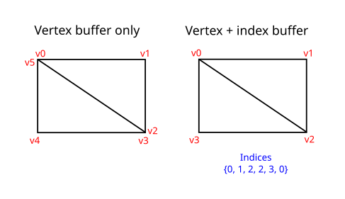
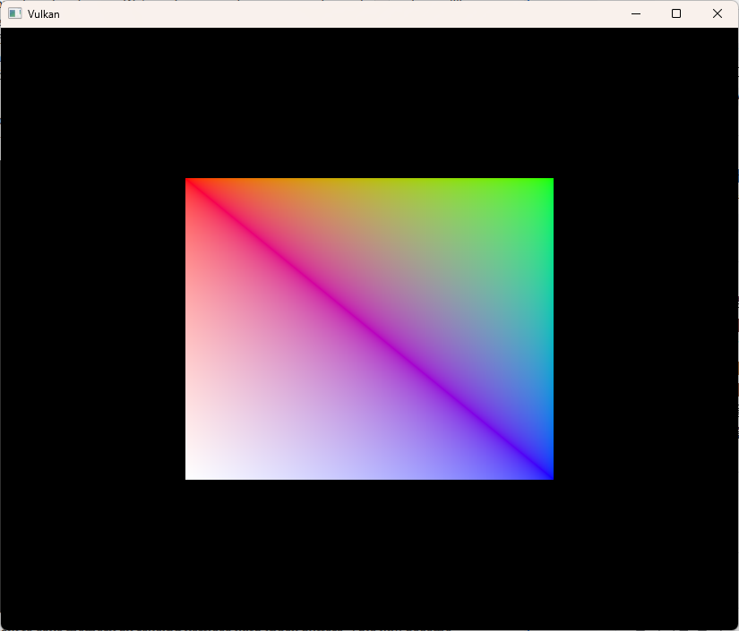

= 인덱스 버퍼 (Index buffer)
include::../common/header.adoc[]
:imagesdir!:

== 소개 (Introduction)

실제 애플리케이션에서 렌더링하게 될 3D 메시는 여러 삼각형이 정점(Vertex)을 서로 공유하는 경우가 많습니다. 이는 직사각형을 그리는 아주 단순한 작업에서도 발생합니다.

직사각형 하나를 그리려면 삼각형 두 개가 필요하므로, 정점 버퍼에 총 6개의 정점 데이터가 들어가야 합니다. 문제는 이 과정에서 정점 2개의 데이터가 중복되어 50%의 데이터 낭비가 생긴다는 점입니다. 복잡한 메시로 갈수록 문제는 더 심각해지며, 하나의 정점이 평균 3개의 삼각형에 서 반복 사용됩니다. 이 문제를 해결하는 방법이 바로 인덱스 버퍼를 사용하는 것입니다.

인덱스 버퍼는 쉽게 말해 정점 버퍼의 위치를 가리키는 포인터 배열입니다. 이를 통해 정점 데이터의 순서를 재구성할 수 있고, 기존 데이터를 여러 정점에서 재사용할 수 있습니다. 위 그림은 고유한 정점 4개를 담은 정점 버퍼가 있을 때, 직사각형을 표현하는 인덱스 버퍼가 어떻게 구성되는지 보여줍니다. 앞의 인덱스 3개는 우상단 삼각형을 정의하고, 뒤의 인덱스 3개는 좌하단 삼각형을 이루는 정점들을 정의합니다.

== 인덱스 버퍼 생성 (Index buffer creation)

이번 장에서는 정점 데이터를 수정하고 인덱스 데이터를 추가하여 앞서 그림으로 보았던 직사각형을 그려보겠습니다. 우선 네 모서리를 표현할 수 있도록 정점 데이터를 다음과 같이 수정합니다.

[source,cpp]
----
const std::vector<Vertex> vertices = {
    {{-0.5f, -0.5f}, {1.0f, 0.0f, 0.0f}},
    {{0.5f, -0.5f}, {0.0f, 1.0f, 0.0f}},
    {{0.5f, 0.5f}, {0.0f, 0.0f, 1.0f}},
    {{-0.5f, 0.5f}, {1.0f, 1.0f, 1.0f}},
};
----

좌상단은 빨간색, 우상단은 초록색, 우하단은 파란색, 좌하단은 흰색입니다. 그리고 인덱스 버퍼에 들어갈 내용을 표현하기 위해 ``indices``라는 새로운 배열을 추가합니다. 이 배열은 그림처럼 우상단 삼각형과 좌하단 삼각형을 그리도록 인덱스 순서가 일치해야 합니다.

[source,cpp]
----
const std::vector<uint16_t> indices = {
    0, 1, 2, 2, 3, 0,
};
----

인덱스 버퍼에는 정점(``vertices``) 수에 따라 ``uint16_t``나 ``uint32_t`` 중 하나를 선택해 사용할 수 있습니다. 지금은 고유 정점 수가 65,535개보다 훨씬 적으므로 ``uint16_t``를 그대로 사용하겠습니다.

정점 데이터와 마찬가지로, GPU가 인덱스에 접근하려면 이 데이터들을 VkBuffer에 올려야 합니다. 인덱스 버퍼 리소스를 관리할 두 개의 클래스 멤버 변수를 새로 정의해 줍니다.

[source,cpp]
----
VkBuffer _vertextBuffer;
VkDeviceMemory _vertexBufferMemory;
VkBuffer _indexBuffer;
VkDeviceMemory _indexBufferMemory;
----

이제 추가할 ``createIndexBuffer`` 함수는 ``createVertexBuffer`` 함수와 거의 똑같습니다.

[source,cpp]
----
void initVulkan() {
    ...
    createVertexBuffer();
    createIndexBuffer();
    ...
}

void createIndexBuffer() {
    VkDeviceSize bufferSize = sizeof(indices[0]) * indices.size();
    VkBuffer stagingBuffer;
    VkDeviceMemory stagingBufferMemory;

    createBuffer(bufferSize, VK_BUFFER_USAGE_TRANSFER_SRC_BIT,
                    VK_MEMORY_PROPERTY_HOST_VISIBLE_BIT | VK_MEMORY_PROPERTY_HOST_COHERENT_BIT, stagingBuffer,
                    stagingBufferMemory);

    void* data;
    vkMapMemory(_device, stagingBufferMemory, 0, bufferSize, 0, &data);
    memcpy(data, indices.data(), (size_t)bufferSize);
    vkUnmapMemory(_device, stagingBufferMemory);

    createBuffer(bufferSize, VK_BUFFER_USAGE_TRANSFER_DST_BIT | VK_BUFFER_USAGE_INDEX_BUFFER_BIT,
                    VK_MEMORY_PROPERTY_DEVICE_LOCAL_BIT, _indexBuffer, _indexBufferMemory);

    copyBuffer(stagingBuffer, _indexBuffer, bufferSize);

    vkDestroyBuffer(_device, stagingBuffer, nullptr);
    vkFreeMemory(_device, stagingBufferMemory, nullptr);
}
----

눈여겨볼 차이점은 딱 두 가지입니다. 첫째, 이제 ``bufferSize``는 인덱스 개수에 인덱스 타입(uint16_t 또는 uint32_t)의 크기를 곱한 값이 됩니다. 둘째, ``indexBuffer``의 용도(usage)는 당연히 ``VK_BUFFER_USAGE_VERTEX_BUFFER_BIT`` 대신 ``VK_BUFFER_USAGE_INDEX_BUFFER_BIT``를 지정해야 합니다. 이 점들을 제외하면 나머지 과정은 완전히 같습니다. 데이터를 임시로 담을 스테이징 버퍼를 만들어 ``indices`` 내용을 복사한 뒤, 최종 디바이스 로컬(Device Local) 인덱스 버퍼로 다시 복사합니다.

인덱스 버퍼도 정점 버퍼와 마찬가지로 프로그램이 종료될 때 메모리를 해제해야 합니다.

== 인덱스 버퍼 사용하기 (Using an index buffer)

인덱스 버퍼를 사용하여 그림을 그리려면 ``recordCommandBuffer`` 함수를 두 군데 수정해야 합니다. 먼저 정점 버퍼 때와 마찬가지로 인덱스 버퍼를 바인딩해야 합니다. 차이점이 있다면 인덱스 버퍼는 단 하나만 바인딩할 수 있다는 것입니다. 아쉽게도 각 정점 어트리뷰트(Attribute)마다 서로 다른 인덱스를 지정하는 것은 불가능합니다. 따라서 단 하나의 어트리뷰트만 다르더라도 나머지 정점 데이터를 완전히 중복해서 넘겨주어야 합니다.

[source,cpp]
----
vkCmdBindVertexBuffers(commandBuffer, 0, 1, _vertexBuffers, offsets);
vkCmdBindIndexBuffer(commandBuffer, _indexBuffer, 0, VK_INDEX_TYPE_UINT16);
----

인덱스 버퍼는 link:https://www.khronos.org/registry/vulkan/specs/1.0/man/html/vkCmdBindIndexBuffer.html[``vkCmdBindIndexBuffer``] 함수로 바인딩합니다. 이 함수는 인덱스 버퍼, 버퍼 내 바이트 오프셋, 그리고 인덱스 데이터 타입을 파라미터로 받습니다. 앞서 언급했듯이 사용할 수 있는 타입은 ``VK_INDEX_TYPE_UINT16``과 ``VK_INDEX_TYPE_UINT32``가 있습니다.

인덱스 버퍼를 바인딩하는 것만으로는 아무것도 바뀌지 않습니다. {vk}에 인덱스 버퍼를 사용하라고 알려주도록 그리기 명령도 수정해야 합니다. 기존 {vkCmdDraw}[``vkCmdDraw``] 호출 코드를 지우고 link:https://www.khronos.org/registry/vulkan/specs/1.0/man/html/vkCmdDrawIndexed.html[``vkCmdDrawIndexed``]로 교체합니다.

[source,cpp]
----
vkCmdDrawIndexed(commandBuffer, static_cast<uint32_t>(indices.size()), 1, 0, 0, 0);
----

이 함수의 호출 방식은 {vkCmdDraw}[``vkCmdDraw``]와 매우 비슷합니다. 처음 두 파라미터는 인덱스 개수와 인스턴스 개수를 지정합니다. 여기서는 인스턴싱을 사용하지 않으므로 인스턴스 개수에 ``1``을 넣습니다. 인덱스 개수는 정점 셰이더로 전달될 정점의 총개수를 의미합니다. 그다음 파라미터는 인덱스 버퍼의 오프셋을 지정하는데, 만약 이 값을 ``1``로 설정하면 그래픽 카드가 두 번째 인덱스부터 읽기 시작합니다. 뒤에서 두 번째 파라미터는 인덱스 버퍼의 값에 더해줄 정수 오프셋(값의 보정치)을 뜻합니다. 마지막 파라미터는 인스턴싱을 위한 오프셋이며, 여기서는 사용하지 않으므로 0을 지정합니다.

이제 프로그램을 실행하면 다음과 같은 화면을 볼 수 있습니다.

지금까지 인덱스 버퍼로 정점을 재사용하여 메모리를 절약하는 방법을 알아보았습니다. 이 기법은 복잡한 3D 모델을 불러오는 향후 장에서 특히 중요하게 다루어질 예정입니다.

이전 장에서 버퍼 같은 여러 리소스를 단 하나의 메모리 할당(Memory Allocation)을 통해 관리해야 한다고 언급했는데, 실제로는 여기서 한 걸음 더 나아가야 합니다. 드라이버 개발자들은 정점 버퍼나 인덱스 버퍼 같은 여러 버퍼를 하나의 큰 {VkBuffer}[``VkBuffer``]에 함께 저장한 뒤, link:vkCmdBindVertexBuffers[``vkCmdBindVertexBuffers``] 같은 명령에서 오프셋을 활용해 나누어 쓸 것을 link:https://developer.nvidia.com/vulkan-memory-management[권장]합니다. 이렇게 하면 데이터가 물리적으로 가까이 뭉쳐있기 때문에 캐시 효율(Cache Friendly)이 훨씬 좋아집니다. 심지어 렌더링 타이밍이 겹치지 않고 데이터 갱신만 제때 해준다면, 여러 리소스가 동일한 메모리 구역을 나누어 쓰는 것도 가능합니다. 이를 '에일리어싱(Aliasing)'이라고 부르며, 일부 Vulkan 함수에는 이 기능을 명시적으로 사용할 수 있는 전용 플래그가 준비되어 있습니다.

NOTE : link:../UniformBuffers/DescriptorSetLayoutAndBuffer.html[Uniform buffers > Descriptor set layout and buffer 이동]