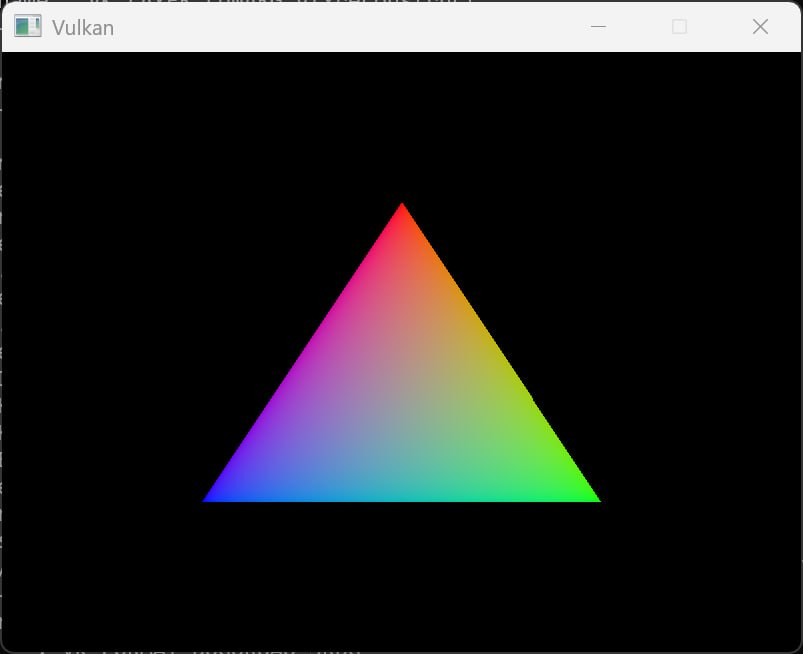
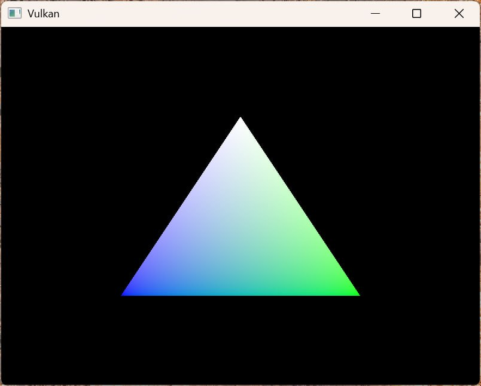

= 정점 버퍼 생성 (Vertex buffer creation)
include::../common/header.adoc[]
:imagesdir!:

== 개요 (Introduction)

{vk}에서 버퍼는 그래픽 카드가 읽을 수 있는 임의의 데이터를 저장하는 메모리 영역입니다. 이번 장에서는 버퍼를 정점(vertex) 데이터를 저장하는 용도로 사용하지만, 앞으로 다룰 장에서는 다른 다양한 목적으로도 활용할 수 있습니다. 지금까지 살펴본 다른 벌칸 객체들과 달리, 버퍼는 스스로 메모리를 자동으로 할당하지 않습니다. 이전 장들을 통해 확인했듯이 벌칸 API는 개발자가 거의 모든 것을 직접 제어하도록 설계되어 있으며, 메모리 관리 역시 개발자의 몫입니다.

== 버퍼 생성하기 (Buffer creation)

``createVertexBuffer``라는 새로운 함수를 만들고, ``initVulkan`` 함수 안의 ``createCommandBuffers`` 바로 직전 위치에서 이 함수를 호출하도록 구현합니다.

[source,cpp]
----
void initVulkan() {
    createInstance();
    setupDebugMessenger();
    createSurface();
    pickPhysicalDevice();
    createLogicalDevice();
    createSwapChain();
    createImageViews();
    createRenderPass();
    createGraphicsPipeline();
    createFramebuffers();
    createCommandPool();
    createVertexBuffer();
    createCommandBuffers();
    createSyncObjects();
}
...
void createVertexBuffer() {

}
----

버퍼를 생성하려면 먼저 link:https://www.khronos.org/registry/vulkan/specs/1.0/man/html/VkBufferCreateInfo.html[``VkBufferCreateInfo``] 구조체의 내용을 채워야 합니다.

[source,cpp]
----
VkBufferCreateInfo bufferInfo{
    .sType = VK_STRUCTURE_TYPE_BUFFER_CREATE_INFO,
    .flags = 0,
    .size = sizeof(vertices[0]) * vertices.size(),
};
----

이 구조체의 첫 번째 필드는 ``size``로, 버퍼의 크기를 바이트 단위로 지정합니다. 정점 데이터의 바이트 크기는 ``sizeof`` 연산자를 사용하면 쉽게 계산할 수 있습니다.

[source,cpp]
----
bufferInfo.usage = VK_BUFFER_USAGE_VERTEX_BUFFER_BIT;
----

두 번째 필드는 ``usage``로, 이 버퍼의 데이터를 어떤 용도로 사용할지 지정합니다. 비트 연산자 OR(|)를 사용하면 여러 가지 용도를 동시에 지정할 수도 있습니다. 여기서는 정점 버퍼로 사용할 것이며, 다른 용도의 버퍼들은 앞으로의 장에서 살펴보겠습니다.

[source,cpp]
----
bufferInfo.sharingMode = VK_SHAING_MODE_EXCLUSIVE;
----

스왑 체인 이미지와 마찬가지로, 버퍼 역시 특정 큐 패밀리(queue family) 전용으로 소유하거나 여러 큐 패밀리가 동시에 공유하도록 설정할 수 있습니다. 이 버퍼는 그래픽 큐에서만 접근하므로 단독 접근 모드(exclusive access)를 그대로 유지하면 됩니다.

``flags`` 매개변수는 스파스(sparse) 버퍼 메모리를 설정할 때 사용되지만, 지금은 필요하지 않은 기능입니다. 기본값인 ``0``으로 설정합니다.

이제 link:https://www.khronos.org/registry/vulkan/specs/1.0/man/html/vkCreateBuffer.html[``vkCreateBuffer``] 함수를 호출하여 버퍼를 생성할 수 있습니다. 버퍼 핸들을 관리할 클래스 멤버 변수를 정의하고 이름을 ``_vertexBuffer``로 지정합니다.

[source,cpp]
----
VkBuffer _vertexBuffer;
...
void createVertexBuffer() {
    VkBufferCreateInfo bufferInfo{
        .sType = VK_STRUCTURE_TYPE_BUFFER_CREATE_INFO,
        .flags = 0,
        .size = sizeof(vertices[0]) * vertices.size(),
        .usage = VK_BUFFER_USAGE_VERTEX_BUFFER_BIT,
        .sharingMode = VK_SHARING_MODE_EXCLUSIVE,
    };

    if (vkCreateBuffer(_device, &bufferInfo, nullptr, &_vertexBuffer) != VK_SUCCESS) {
        throw std::runtime_error("failed to create vertex buffer!");
    }
}
----

이 버퍼는 프로그램이 종료될 때까지 렌더링 명령에 계속 사용되어야 하며 스왑 체인의 변경에도 영향을 받지 않습니다. 따라서 기존의 ``cleanup`` 함수 안에서 리소스를 해제해 줍니다.

[source,cpp]
----
void cleanup() {
    cleanupSwapChain();

    vkDestroyBuffer(_device, _vertexBuffer, nullptr);
    ...
}
----

== 메모리 요구사항 (Memory requirements)

버퍼는 생성되었지만, 아직 실제로 할당된 메모리는 없습니다. 버퍼에 메모리를 할당하기 위한 첫 번째 단계는 이름 그대로인 link:https://www.khronos.org/registry/vulkan/specs/1.0/man/html/vkGetBufferMemoryRequirements.html[``vkGetBufferMemoryRequirements``] 함수를 사용하여 버퍼의 메모리 요구사항을 조회하는 것입니다.

[source,cpp]
----
VkMemoryRequirements memRequirements;

vkGetBufferMemoryRequirements(_device, _vertexBuffer, &memRequirements);
----

link:https://www.khronos.org/registry/vulkan/specs/1.0/man/html/VkMemoryRequirements.html[``VkMemoryRequirements``] 구조체는 다음 세 가지 필드로 구성됩니다:

[cols="3a,7",options=header]
|===
|필드
|설명

|``size``
|필요한 메모리의 바이트 단위 크기이며, 앞서 설정한 ``bufferInfo.size``와 다를 수 있습니다.

|``alignment``
|할당된 메모리 영역에서 버퍼가 시작되는 오프셋(바이트 단위)으로, ``bufferInfo.usage`` 및 ``bufferInfo.flags`` 설정에 따라 달라집니다.

|``memoryTypeBits``
|해당 버퍼에 적합한 메모리 유형들을 나타내는 비트 필드입니다.
|===

그래픽 카드는 할당 가능한 다양한 유형의 메모리를 제공합니다. 각 메모리 유형은 허용되는 작업과 성능 특성이 저마다 다릅니다. 따라서 버퍼의 요구사항과 우리가 만들 애플리케이션의 요구사항을 모두 고려하여 가장 적합한 메모리 유형을 찾아야 합니다. 이를 위해 ``findMemoryType``이라는 새로운 함수를 만들어 보겠습니다.

[source,cpp]
----
uint32_t findMemoryType(uint32_t typeFilter, VkMemoryPropertyFlags properties) {

}
----

먼저 link:https://www.khronos.org/registry/vulkan/specs/1.0/man/html/vkGetPhysicalDeviceMemoryProperties.html[``vkGetPhysicalDeviceMemoryProperties``] 함수를 사용하여 사용 가능한 메모리 유형에 대한 정보를 조회해야 합니다.

[source,cpp]
----
VkPhysicalDeviceMemoryProperties memProperties;

vkGetPhysicalDeviceMemoryProperties(_physicalDevice, &memProperties);
----

link:https://www.khronos.org/registry/vulkan/specs/1.0/man/html/VkPhysicalDeviceMemoryProperties.html[``VkPhysicalDeviceMemoryProperties``] 구조체는 memoryTypes와 memoryHeaps라는 두 개의 배열을 가지고 있습니다. 메모리 힙(heap)은 전용 VRAM이나 VRAM이 부족할 때 사용하는 시스템 RAM의 스왑 공간처럼 물리적으로 구분된 메모리 자원을 뜻합니다. 그리고 다양한 메모리 유형들이 이 힙 내에 존재합니다. 지금은 메모리가 어느 힙에서 나오는지가 아니라 메모리 유형 자체에만 집중하겠지만, 힙의 종류가 성능에 영향을 줄 수 있다는 점은 쉽게 예상할 수 있습니다.

먼저 버퍼 자체에 적합한 메모리 유형부터 찾아보겠습니다:

[source,cpp]
----
for (uint32_t i = 0; i < memProperties.memoryTypeCount; i++) {
    if (typeFilter & (1 << i)) {
        return i;
    }
}

throw std::runtime_error("failed to find suitable memory type!");
----

``typeFilter`` 매개변수는 적합한 메모리 유형의 비트 필드를 지정하는 데 사용됩니다. 즉, 사용 가능한 메모리 유형들을 하나씩 순회하면서 해당하는 비트가 ``1``로 설정되어 있는지 확인하는 것만으로도 적합한 메모리 유형의 인덱스를 찾을 수 있습니다.

하지만 우리가 원하는 것은 단순히 정점 버퍼에 호환되는 메모리 유형만이 아닙니다. 그 메모리에 정점 데이터를 직접 쓸 수 있어야 합니다. ``memoryTypes`` 배열은 각 메모리 유형의 힙 위치와 속성을 정의하는 link:https://www.khronos.org/registry/vulkan/specs/1.0/man/html/VkMemoryType.html[``VkMemoryType``] 구조체들로 이루어져 있습니다. 이 속성들은 CPU에서 접근하여 데이터를 쓸 수 있도록 메모리를 매핑(map)할 수 있는 기능 등의 특별한 특성을 정의합니다. 이 기능은 ``VK_MEMORY_PROPERTY_HOST_VISIBLE_BIT``로 나타내며, 여기에 더해 ``VK_MEMORY_PROPERTY_HOST_COHERENT_BIT`` 속성도 함께 사용해야 합니다. 왜 이 속성이 필요한지는 잠시 후 메모리를 매핑할 때 알아보겠습니다.

[NOTE]
.VkImageType
====
[source,cpp,linenums]
----
typedef enum VkMemoryPropertyFlagBits {
    VK_MEMORY_PROPERTY_DEVICE_LOCAL_BIT = 0x00000001,
    VK_MEMORY_PROPERTY_HOST_VISIBLE_BIT = 0x00000002,
    VK_MEMORY_PROPERTY_HOST_COHERENT_BIT = 0x00000004,
    VK_MEMORY_PROPERTY_HOST_CACHED_BIT = 0x00000008,
    VK_MEMORY_PROPERTY_LAZILY_ALLOCATED_BIT = 0x00000010,
    VK_MEMORY_PROPERTY_PROTECTED_BIT = 0x00000020, // Provided by VK_VERSION_1_1
} VkMemoryPropertyFlagBits;
----

[cols="4a,6a",options=header]
|===
|플래그
|설명

|``VK_MEMORY_PROPERTY_DEVICE_LOCAL_BIT``
|이 유형으로 할당된 메모리가 디바이스(GPU)의 접근에 가장 효율적임을 나타냅니다. 이 속성은 해당 메모리 유형이 ``VK_MEMORY_HEAP_DEVICE_LOCAL_BIT`` 플래그가 설정된 메모리 힙에 속해 있을 때만 지정됩니다.

|``VK_MEMORY_PROPERTY_HOST_VISIBLE_BIT``
|이 유형으로 할당된 메모리를 ``vkMapMemory`` 함수를 사용해 호스트(CPU)에서 접근할 수 있도록 매핑할 수 있음을 나타냅니다.

|``VK_MEMORY_PROPERTY_HOST_COHERENT_BIT``
|호스트에서의 메모리 가용성(availability)과 가시성(visibility)을 관리하기 위해, 호스트 캐시 제어 명령인 ``vkFlushMappedMemoryRanges`` 및 ``vkInvalidateMappedMemoryRanges``를 호출할 필요가 없음을 나타냅니다.

|``VK_MEMORY_PROPERTY_HOST_CACHED_BIT``
|이 유형으로 할당된 메모리가 호스트(CPU) 측에 캐싱됨을 나타냅니다. 캐싱되지 않은 메모리에 호스트가 접근하면 캐싱된 메모리보다 속도가 느리지만, 캐싱되지 않은 메모리는 항상 호스트 일관성(``host coherent``)이 보장됩니다.

|``VK_MEMORY_PROPERTY_LAZILY_ALLOCATED_BIT``
|해당 메모리 유형이 오직 디바이스(GPU)의 접근만 허용함을 나타냅니다. 따라서 메모리 유형에 ``VK_MEMORY_PROPERTY_LAZILY_ALLOCATED_BIT``와 ``VK_MEMORY_PROPERTY_HOST_VISIBLE_BIT``가 동시에 설정되어서는 안 됩니다. 또한, 이 객체의 실제 백업 메모리는 '지연 할당 메모리(Lazily Allocated Memory)' 명세에 따라 드라이버 구현체에 의해 실제 필요한 시점에 지연 할당될 수 있습니다.

|``VK_MEMORY_PROPERTY_PROTECTED_BIT``
|해당 메모리 유형이 오직 디바이스(GPU)의 접근만 허용하며, 보호된 큐(protected queue) 작업만 이 메모리에 접근할 수 있음을 나타냅니다. 이 플래그가 설정된 메모리 유형은 ``VK_MEMORY_PROPERTY_HOST_VISIBLE_BIT``, ``VK_MEMORY_PROPERTY_HOST_COHERENT_BIT``, ``VK_MEMORY_PROPERTY_HOST_CACHED_BIT`` 중 그 어떤 플래그도 함께 설정되어서는 안 됩니다.
|===
====

이제 루프를 수정하여 방금 말한 속성들까지 지원하는지 함께 확인하도록 하겠습니다:

[source,cpp]
----
for (uint32_t i = 0; i < memProperties.memoryTypeCount; i++) {
    if ((typeFilter & (1 << i)) && (memProperties.memoryTypes[i].propertyFlags & properties) == properties) {
        return i;
    }
}
----

원하는 속성이 둘 이상일 수 있으므로, 비트 연산 AND(&)의 결과가 단순히 0이 아닌 것만 확인해서는 안 되며, 우리가 원하는 속성의 비트 필드 값과 완전히 일치하는지 체크해야 합니다. 버퍼에도 적합하고 필요한 모든 속성까지 갖춘 메모리 유형을 찾았다면 해당 인덱스를 반환하고, 찾지 못했다면 예외(exception)를 던집니다.

== 메모리 할당 (Memory allocation)

이제 적합한 메모리 유형을 찾는 방법을 알아냈으므로, link:https://www.khronos.org/registry/vulkan/specs/1.0/man/html/VkMemoryAllocateInfo.html[``VkMemoryAllocateInfo``] 구조체의 내용을 채워 실제로 메모리를 할당할 수 있습니다.

[source,cpp]
----
VkMemoryAllocateInfo allocInfo{
    .sType = VK_STRUCTURE_TYPE_MEMORY_ALLOCATE_INFO,
    .allocationSize = memRequirements.size,
    .memoryTypeIndex = findMemoryType(memRequirements.memoryTypeBits, VK_MEMORY_PROPERTY_HOST_VISIBLE_BIT | VK_MEMORY_PROPERTY_HOST_COHERENT_BIT),
};
----

메모리 할당 과정은 정점 버퍼의 메모리 요구사항과 우리가 원하는 속성을 바탕으로 얻어낸 메모리 크기 및 유형을 지정하기만 하면 될 정도로 간단합니다. 할당된 메모리 핸들을 저장할 클래스 멤버 변수를 정의하고, link:https://www.khronos.org/registry/vulkan/specs/1.0/man/html/vkAllocateMemory.html[``vkAllocateMemory``] 함수를 호출하여 메모리를 할당합니다.

[source,cpp]
----
VkBuffer _vertexBuffer;
VkDeviceMemory _vertexBufferMemory;
...
if (vkAllocateMemory(_device, &allocInfo, nullptr, &_vertexBufferMemory) != VK_SUCCESS) {
    throw std::runtime_error("failed to allocate vertex buffer memory!");
}
----

메모리 할당에 성공했다면, 이제 link:https://www.khronos.org/registry/vulkan/specs/1.0/man/html/vkBindBufferMemory.html[``vkBindBufferMemory``] 함수를 사용하여 이 메모리를 버퍼와 연결(바인딩)할 수 있습니다.

[source,cpp]
----
vkBindBufferMemory(_device, _vertexBuffer, _vertexBufferMemory, 0);
----

처음 세 매개변수의 의미는 직관적이며, 네 번째 매개변수는 할당된 메모리 영역 내에서의 시작 오프셋(offset)을 뜻합니다. 이 메모리는 오직 이 정점 버퍼만을 위해 독립적으로 할당된 것이므로 오프셋은 그냥 ``0``을 지정하면 됩니다. 만약 오프셋을 0이 아닌 값으로 지정할 때는, 반드시 그 값이 ``memRequirements.alignment``로 나누어떨어지는 정렬된 값이어야 합니다.

C++에서의 동적 메모리 할당과 마찬가지로, 이 메모리 역시 사용이 끝나면 반드시 해제해 주어야 합니다. 버퍼 객체에 바인딩된 메모리는 버퍼를 더 이상 사용하지 않을 때 해제할 수 있으므로, 기존 cleanup 함수에서 버퍼를 파괴(destroy)한 바로 직후에 메모리를 해제하도록 구현합니다.

[source,cpp]
----
void cleanup() {
    cleanupSwapChain();

    vkDestroyBuffer(_device, _vertexBuffer, nullptr);
    vkFreeMemory(_device, _vertexBufferMemory, nullptr):
}
----

== 정점 버퍼 채우기 (Filling the vertex buffer)

이제 정점 데이터를 버퍼로 복사할 차례입니다. 이 작업은 link:https://www.khronos.org/registry/vulkan/specs/1.0/man/html/vkMapMemory.html[``vkMapMemory``] 함수를 사용하여 버퍼 메모리를 CPU가 접근할 수 있는 link:https://en.wikipedia.org/wiki/Memory-mapped_I/O[메모리 공간으로 매핑]함으로써 이루어집니다.

[source,cpp]
----
void* data;
vkMapMemory(_device, _vertexBufferMemory, 0, bufferInfo.size, 0, &data);
----

이 함수를 사용하면 오프셋(offset)과 크기(size)로 지정한 특정 메모리 자원의 영역에 접근할 수 있습니다. 여기서는 오프셋에 ``0``을, 크기에는 ``bufferInfo.size``를 각각 지정합니다. 메모리 전체를 매핑하고 싶다면 특별한 상숫값인 ``VK_WHOLE_SIZE``를 넘겨주는 것도 가능합니다. 끝에서 두 번째 매개변수는 플래그를 설정하는 데 사용되지만, 현재 {vk} API에는 사용할 수 있는 플래그가 없으므로 반드시 ``0``으로 설정해야 합니다. 마지막 매개변수는 매핑된 메모리의 시작 주소를 받아올 포인터 변수의 주소를 지정합니다.

[source,cpp]
----
void* data;
vKMapMemory(_device, _vertexBufferMemory, 0, bufferInfo.size, 0, &data);
memcpy(data, vertices.data(), (size_t)bufferInfo.size);
vkUnmapMemory(_device, _vertexBufferMemory);
----

메모리가 매핑되면 ``memcpy``를 이용해 정점 데이터를 매핑된 메모리로 간단히 복사한 뒤, link:https://www.khronos.org/registry/vulkan/specs/1.0/man/html/vkUnmapMemory.html[``vkUnmapMemory``] 함수를 호출하여 매핑을 해제하면 됩니다. 다만 주의할 점은, 캐싱 등의 이유로 인해 드라이버가 버퍼 메모리로 데이터를 즉시 복사하지 않을 수 있다는 것입니다. 반대로 버퍼에 쓴 내용이 매핑된 메모리에 아직 반영되지 않아 보이지 않을 수도 있습니다. 이 문제를 해결하는 방법에는 다음 두 가지가 있습니다:

* ``VK_MEMORY_PROPERTY_HOST_COHERENT_BIT`` 플래그가 지정된 '호스트 일관성(host coherent)' 메모리 힙을 사용합니다.
* 매핑된 메모리에 데이터를 쓴 후 link:https://www.khronos.org/registry/vulkan/specs/1.0/man/html/vkFlushMappedMemoryRanges.html[``vkFlushMappedMemoryRanges``]를 호출하고, 매핑된 메모리에서 데이터를 읽기 전에 link:https://www.khronos.org/registry/vulkan/specs/1.0/man/html/vkInvalidateMappedMemoryRanges.html[``vkInvalidateMappedMemoryRanges``]를 호출합니다.

우리는 첫 번째 방법을 선택했습니다. 이 방식을 사용하면 매핑된 메모리가 실제 할당된 메모리의 내용과 항상 일치하도록 보장됩니다. 명시적으로 플러시(flush)를 수행하는 두 번째 방법보다 성능이 아주 미세하게 떨어질 수 있지만, 왜 이 정도의 성능 차이가 문제가 되지 않는지는 다음 장에서 알아보겠습니다.

메모리 범위를 플러시하거나 일관성 메모리 힙을 사용하면 드라이버가 버퍼에 데이터가 기록되었다는 사실을 인지하게 됩니다. 하지만 그렇다고 해서 데이터가 GPU에 실제로 반영되어 즉시 보인다는 뜻은 아닙니다. GPU로의 데이터 전송은 백그라운드에서 별도로 일어나는 작업이며, 벌칸 명세에 따르면 이 전송 작업은 다음번 link:https://www.khronos.org/registry/vulkan/specs/1.0/man/html/vkQueueSubmit.html[``vkQueueSubmit``] 함수를 호출하는 시점에는 link:https://www.khronos.org/registry/vulkan/specs/1.3-extensions/html/chap7.html#synchronization-submission-host-writes[확실히 완료됨이 보장]됩니다.

== 정점 버퍼 바인딩하기 (Binding the vertex buffer)

이제 남은 작업은 렌더링 과정에서 정점 버퍼를 파이프라인에 바인딩(연결)하는 것뿐입니다. 이 작업을 수행하기 위해 ``recordCommandBuffer`` 함수를 확장해 보겠습니다.

[source,cpp]
----
...
vkCmdSetScissor(commandBuffer, 0, 1, &scissor);

VkBuffer vertexBuffers[] = {_vertexBuffer};
VkDeviceSize offsets[] = {0};
vkCmdBindVertexBuffers(commandBuffer, 0, 1, vertexBuffers, offsets);
vkCmdDraw(commandBuffer, static_cast<uint32_t>(vertices.size()), 1, 0, 0);
----

link:https://www.khronos.org/registry/vulkan/specs/1.0/man/html/vkCmdBindVertexBuffers.html[``vkCmdBindVertexBuffers``] 함수는 이전 장에서 설정했던 바인딩 포인트에 정점 버퍼를 연결할 때 사용합니다. 커맨드 버퍼를 제외한 처음 두 매개변수는 정점 버퍼를 지정할 바인딩의 시작 오프셋과 바인딩할 개수를 나타냅니다. 마지막 두 매개변수는 바인딩할 정점 버퍼들의 배열과, 정점 데이터를 읽기 시작할 바이트 단위의 시작 오프셋 배열을 지정합니다. 또한 하드코딩되어 있던 기존의 숫자 ``3`` 대신, 버퍼에 포함된 실제 정점의 개수를 전달하도록 link:https://www.khronos.org/registry/vulkan/specs/1.0/man/html/vkCmdDraw.html[``vkCmdDraw``] 함수의 호출 코드도 수정해야 합니다.

이제 프로그램을 실행하면 이전과 동일하게 친숙한 삼각형이 화면에 다시 나타나는 것을 확인할 수 있습니다.

이번에는 vertices 배열을 수정하여 맨 위 정점의 색상을 흰색으로 한번 바꾸어 보겠습니다.

[source,cpp]
----
const std::vector<Vertex> vertices = {
    {{0.0f, -0.5f}, {1.0f, 1.0f, 1.0f}},
    {{0.5f, 0.5f}, {0.0f, 1.0f, 0.0f}},
    {{-0.5f, 0.5f}, {0.0f, 0.0f, 1.0f}}
};
----

프로그램을 다시 실행하면 다음과 같은 결과를 볼 수 있습니다.

link:./StagingBuffer.html[다음 장]에서는 과정이 조금 더 복잡하긴 하지만, 정점 버퍼로 데이터를 복사할 때 훨씬 더 좋은 성능을 낼 수 있는 또 다른 방법을 알아보겠습니다.